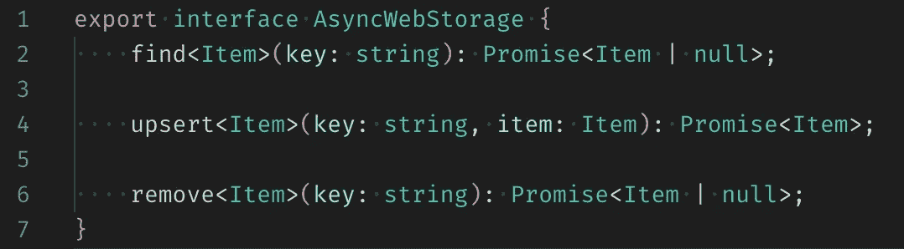
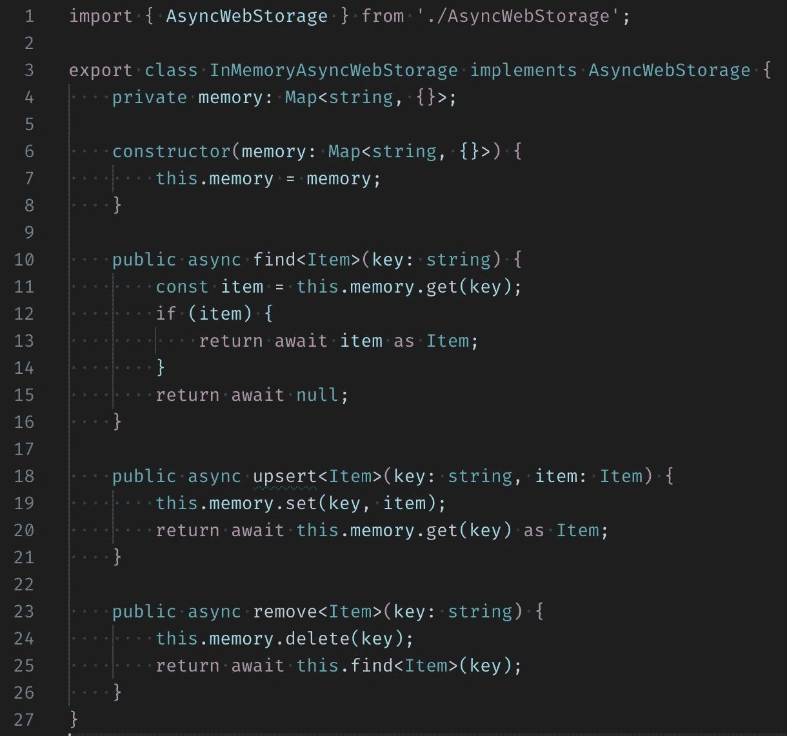
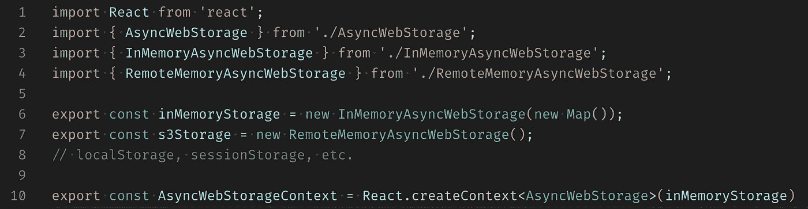
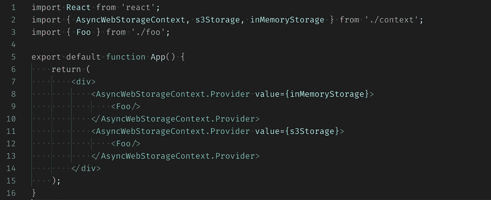

# React 中的依赖注入

> 原文：<https://itnext.io/dependency-injection-in-react-6fcdbd2005e6?source=collection_archive---------0----------------------->

使用依赖注入，你知道如何打开一扇门，但是你不知道谁在门后。

软件开发中最具挑战性的部分之一是保持代码的整洁、可维护和可扩展。 [Robert C. Martin](https://en.wikipedia.org/wiki/Robert_C._Martin) 介绍了五个软件设计原则，揭示了被称为 [SOLID](https://en.wikipedia.org/wiki/SOLID) 的面向对象设计的依赖管理方面。其中之一是依赖倒置原则，即“*依赖抽象，而不是具体”。实现这一原则的模式被称为依赖注入(DI)。这种模式使得分解程序组件、编写单元测试甚至在运行时提供模块变得更加容易。*

在 [React](https://reactjs.org/) 中，javascript 库 DI 是通过[上下文](https://reactjs.org/docs/context.html)完成的。让我们看一下异步 Web 存储项目，在这个项目中，我将应用 React 上下文来使用不同的机制存储数据。

# 异步 Web 存储

这种网络存储将支持三种操作:查找、向上插入和删除。

图一。抽象 AsyncWebStorage。

一个简单的具体实现是内存存储。但是这个想法可以扩展到 localStorage/sessionStorage、AWS S3 等等。

图二。简单的内存异步网络存储。

默认情况下，我将使用 React 上下文来提供内存中的实现。内存和 s3 存储都将暴露在外。

图 3。默认情况下，使用内存存储对上下文初始化做出反应。

让我们创建一个简单的 React 组件 Foo，它将从存储中读取数据。它将只依赖于通过 **AsyncWebStorageContext** 注入的抽象(图 4)。

图 4。抽象 Web 存储是通过 React 上下文注入的。

使用 **AsyncWebStorageContext 进行存储之间的切换。提供商**(图 5)。

图 5。第一个 Foo 组件从内存中读取，第二个组件从 s3 中读取。

因此，我们有可视化组件 Foo 和不同的异步 Web 存储实现，它们是独立的，可以并行开发，并且可以扩展。

今天，这种模式被广泛使用，甚至在一些现代语言(如 Scala)中构建，但通常它是由库或框架实现的。React 库通过上下文内置了对 DI 的支持。通过公开抽象，使用 DI 代码变得更容易跟踪和维护，并且整个应用程序更加灵活和易于扩展。