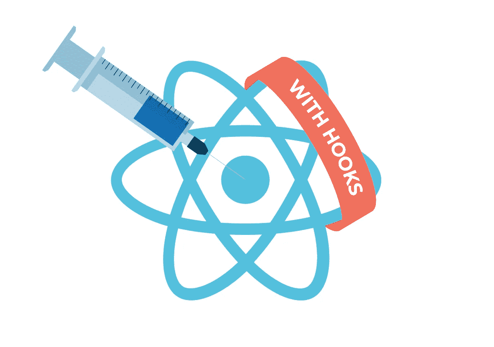

# React 中使用 InversifyJS 的依赖注入。现在用 React 钩子

> 原文：<https://itnext.io/dependency-injection-in-react-using-inversifyjs-now-with-react-hooks-64f7f077cde6?source=collection_archive---------1----------------------->

大约一年前[我写了一篇关于 React](/dependency-injection-in-react-using-inversifyjs-a38ff0c6601) 中依赖注入的文章。我展示了如何从 InversifyJS 容器向类组件注入依赖关系。从那以后，我们见证了最受期待的 React 特性之一——钩子的发布。如果你从未听说过它们，你绝对应该去 [docs](https://reactjs.org/docs/hooks-intro.html) 了解它们。关键是，我们现在可以用功能组件做更多的事情，而且它们非常用户友好。在本文中，我想通过一个非常简单的例子向您展示使用带有钩子的 InversifyJS 是多么容易。

# 示例项目

我们将要进行的项目与上一篇文章中的项目几乎相同。唯一的区别是，我将 Hello 组件重构为功能性的。一切都在 TypeScript 中完成，但你可以在纯 JavaScript 中以几乎相同的方式完成(装饰者的用法有一些不同，但这些在 [Inversify 的文档](https://github.com/inversify/InversifyJS/blob/master/wiki/basic_js_example.md)中有所涉及)。

清单 Inversify 和 React 之间没有连接的示例项目

要了解更多关于代码的信息，我推荐阅读[前一篇文章](/dependency-injection-in-react-using-inversifyjs-a38ff0c6601?gi=a349e1f65b62)的“示例项目”部分。

# 创建我们自己的注射供应商

为了完成这个任务，我们将主要使用两个 React 功能——上下文 API(从 v.16.3 开始)和 React 钩子(从 v.16.8 开始)。

上下文 API 是在不使用 props 的情况下通过整个组件树传递数据的方法。你可以在[文档](https://reactjs.org/docs/context.html)中阅读细节，因为我不想在这里深入讨论上下文。你可能已经间接使用过它了——很多流行的库都在使用它(react-redux，styled-components，等等)。).如果一个库告诉你用一个提供者组件来包装根层上的所有东西，那么它可能会使用上下文。

我们的注射供应商将由两部分组成:

*   一个提供者组件，它将在根级别包装所有东西，开发者将提供对 Inversify 容器的引用。
*   将依赖注入组件的钩子。

# 提供商组件

我们将使用上下文来创建一个提供者组件。首先，我们需要用 createContext 函数创建一个新的上下文。这将返回一个包含两个现成组件(提供者和消费者)的对象。Provider 是一个顶层组件，用于将内容发送到 React 的树中，而 Consumer 使用这些数据。这对我们意味着什么？我们可以直接用它来完成我们的任务。清单 2 给出了一个如何做到这一点的例子。

清单 2 注入提供者组件

很简单，不是吗？如果你记得上一篇文章中的 inversify-react 或 react-inversify，你一定会知道如何使用它。这是完全相同的组件，但这次是由我们制造的。清单 3 向我们展示了如何在应用程序根级别的代码中使用它。

清单 3 提供者组件的用法

# 注射钩

现在我们需要一种方法从 Inversify 的容器中获取对象。我们想把它作为一个函数，它将作为一个反应挂钩，它应该使用提供者组件中用户提供的容器。那么，我们如何实现这一目标呢？您可能还记得，在创建上下文之后，我们有了一个包含提供者和消费者的对象。通常，消费者被用作一个组件，通过它来访问上下文中的数据。然而，由于我们有 React 钩子，我们不需要使用消费者。React 内置的最重要的挂钩之一是 [useContext](https://reactjs.org/docs/hooks-reference.html#usecontext) 。它做了一件简单的事情——它返回当前的上下文值并订阅它的更改。在上下文中，我们有容器实例，所以我们可以使用它的任何我们需要的方法(在我们的例子中，方法将是 *get* ，但是您可能还想创建一个带有 *getAll* 的附加钩子来模拟 multiInject)。当然，开发人员应该将标识符作为参数提供给我们的钩子，以便 Inversify 能够识别我们需要什么。在清单 4 中可以看到一个非常简单的实现。

清单 4 注入提供者和钩子的完整实现

现在我们可以在 Hello.tsx 的示例应用程序中安全地使用它，如清单 5 所示。

清单 5 带有 useInjection 挂钩的 Hello.tsx

正如您所看到的，在几行代码中，我们能够用非常简单的用法为依赖注入创建完整的提供者。当然，它是可以扩展的——您可能想要添加一个用于多注入的钩子或者一个更高阶的组件，以便在类组件中使用。

你可以在我的 GitHub 上找到完整的例子:

 [## tswistak/react-hooks-with-inversify

### 将 InversifyJS 与 React 挂钩和上下文 API-tswistak/React-Hooks-with-inversify 一起使用的示例

github.com](https://github.com/tswistak/react-hooks-with-inversify) 

# 问与答(Question and Answer)

既然这么简单，肯定有很多疑问吧。我想了几个案例，想在同一篇文章里给你解答。

## 当您可以直接从组件访问容器时，为什么要使用这样的样板文件呢？

那就是保持单一的真实来源，而不是让组件依赖于特定的容器。在一个代码库中，我们可能有许多容器(例如，每个路径有一个不同的容器)，但是组件可以在它们之间共享。

## 所以我们不应该使用你在上一篇文章中提到的库？

当然不是！这只是为了展示实现相同目标的另一种方式。这很简单，你可能会考虑使用它，但我没有强迫你做任何事情。

## 我想为此使用图书馆，但有带挂钩的吗？

是的，有。当我写这篇文章时，我想检查是否有人已经实现了这个想法。我发现了一个非常好的库— [react-injection](https://www.npmjs.com/package/react-injection) 。它给了我们一个高阶组件和一个钩子来提供组件的注入。如果你想用一个库来连接 Inversify 和 React，这可能是一个不错的方法。

> 这篇文章也发表在 Synergy Codes 的[博客上，Synergy Codes](https://www.synergycodes.com/blog/dependency-injection-using-inversifyjs-with-hooks)是一家专注于流程可视化、映射和建模的软件公司。
> 你对创建数据可视化应用程序感兴趣吗？[点击这里了解 GoJS 库](https://synergycodes.com/gojs-ebook/)！