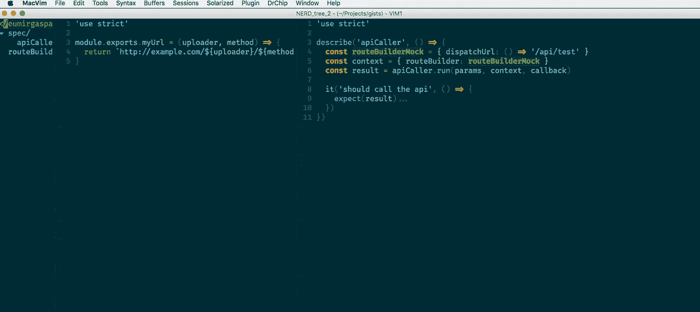

# Javascript 测试中的依赖注入与存根

> 原文：<https://itnext.io/dependency-injection-vs-stubbing-in-javascript-tests-769759900cb3?source=collection_archive---------8----------------------->

我们最近一直在尝试用 [AWS Lambdas](https://aws.amazon.com/lambda/features/) 作为一个项目的技术栈[无服务器](https://serverless.com/)。在那之前，我最近一次接触 Javascript 是在去年，当时我们做了一个 [React 应用](https://reactjs.org/)(当时我对 React 一无所知)。在那之前，我最后一次遇到是在 2015 年，当时我在做一个 [Backbone.js](http://backbonejs.org/) 项目。

在 react 项目中，我们使用了 [Jest 框架](https://facebook.github.io/jest/)，而主干框架使用了 [Jasmine](https://jasmine.github.io/) 。可以说，我已经接触了一些 javascript 测试，但仍然不够。

在我们当前的项目中，我需要做一些单元测试，因为我主要是一名 Ruby 开发人员，所以我主要只是将我在 Ruby 中的习惯翻译成 Javascript。如果你是双语者(像我一样)，你会知道有时有些单词、习语等没有直接的翻译。编程语言也是如此——尤其是那些具有不同范例的语言。

在 Ruby 中，我们通常的单元测试方法是简单地将服务、 [POROs](https://www.google.com.au/search?q=ruby+poro) 等存根化。使用模拟。这里有一个人为的例子。假设您有一个向 API 发送请求的类。该类使用 RouteBuilder 类，如下所示:

RouteBuilder 只是接受一些参数，并在您调用“run”时返回一个 URL。

为了在 Ruby 中测试这一点，我们通常只需要存根 RouteBuilder，这样我们就可以轻松地设置如下场景:

只是回顾一下，我们基本上只是说在测试中，每当调用`RouteBuilder.new`时，它都会返回一个根据上下文表现不同的假的(在这种情况下，它要么抛出一个错误，要么返回一个有效的 URL)。



胜利的依赖注入！(有时)

现在在 Javascript 领域，我一直在做(或者至少是试图做)同样的事情。如果我们遵循我们团队在 Ruby 中的 POROs 模式，我们总是实例化和对象化，并有一个名为`run`的方法，这就很好了。不同之处在于，在 Javascript 中，您可以像这样导出一个函数:

给定一个这样使用它的类:

```
const routeBuilder = require('../lib/routeBuilder')module.exports.run = (params, context, callback) => {
  const endpoint = routeBuilder.myUrl(params.uploader, 'update') ...
end
```

我试着做同样的事情，把它踩断:

```
routeBuilderMock = sinon.stub(routeBuilder, 'myUrl')
routeBuilderMock.withArgs('some-uploader').returns('/api/test')
```

这确实有效。但是对于一些函数，尤其是纯函数，很难做到这一点(至少对我来说)，因为 [sinon 不支持它。](https://github.com/sinonjs/sinon/issues/562)我想这是因为它是一种气味(从功能的角度来说),所以我四处打听了一下。[里科斯塔。克鲁兹](https://github.com/rstacruz/)建议[依赖注入](http://krasimirtsonev.com/blog/article/Dependency-injection-in-JavaScript)让我的生活更轻松。

现在，在 Ruby 中，依赖注入也是我们使用的一种模式。我们通常将它用于在每个环境中具有不同行为的对象(登台、生产等)。)在函数式范例中，这使我们的生活变得更容易，因为现在我们甚至不需要存根！只需传入假的对象/函数或其他东西，让它按照我们想要的方式运行。

现在让我们通过修改使用我们的路径构建器的函数来尝试一下:

```
const defaultRouteBuilder = require('../lib/routeBuilder')module.exports.run = (params, context, callback) => {
  const routeBuilder = context.routeBuilder || defaultRouteBuilder...
end
```

简单快速的改变！基本上，我们现在将它设置为缺省值，让调用者可以选择通过`context`参数传入路线构建器，而不是只需要路线构建器函数并使用它。当被调用时，它看起来像这样:

```
apiCaller.run('some-uploader', { routeBuilder: newRouteBuilder }, callback)
```

在我们的测试中，更改也很容易:

```
const routeBuilderMock = { dispatchUrl: () => '/api/test' }
const context = { routeBuilder: routeBuilderMock }const result = apiCaller.run(params, context, callback)
```

请记住，我们应该为我们的任务使用适当的工具。虽然我喜欢使用 sinon 或依赖注入来存根化路由生成器是如此容易，但是对于我们所有的函数来说，这样做可能是困难的(由于这样或那样的原因)。此外，有时我还想确保(在我的测试中)构建器得到正确的参数。如果我使用依赖注入，将会有更多的样板文件来测试它是否应该得到`some-uploader`作为它的参数。

此外，Jest 似乎也已经可以访问几乎所有这些，所以在接下来的几周内，我将尝试将其纳入我们的测试套件。

总之，存根和依赖注入对测试都很重要。选择哪种风格取决于您的用例和测试设置——如果您想要测试传递给函数的参数并控制它返回什么，请使用 [sinon 或 stubbing](http://sinonjs.org/releases/v4.3.0/stubs/) (尤其是检查参数的样式)，如果您只想模拟某些东西而不考虑参数，那么依赖注入将为您完成这项工作。