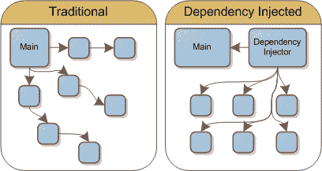
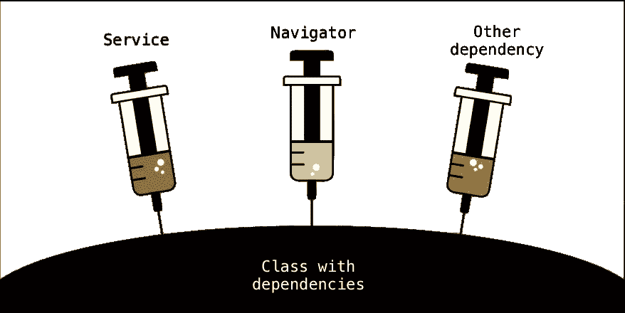

# 使用 Swinject 进行依赖注入

> 原文：<https://itnext.io/dependency-injection-with-swinject-73f3144b20f0?source=collection_archive---------1----------------------->

## 简单、快速且稳定。

在本文中，我们将介绍依赖注入的基础知识，以及如何使用名为 Swinject 的开源框架将其应用于 iOS 项目。

不会痛的——多亏了 Swinject。

## 什么是依赖注入？

依赖注入(DI)是一种技术，在这种技术中，您从实体自身的范围之外设置实体的依赖关系，将您的系统变成松散耦合的模块。想象一下，一个类保存着对应用程序其他组件的引用，例如，它可以避免 UIViewControllers 之间的通信模式。

DI 是一种公正的软件设计模式，它实现了控制反转(IoC)来解决依赖性。IMO 最大的成就之一就是根据选择的方案使用适当的实现。这使得对象完全可测试，模仿数据变得容易多了。

## 如何使用 Swinject？

对于 Swift 项目的 DI 来说，Swinject 是一个很好的框架，同样，它是开源的。它使用泛型以一种非常容易和简单的方式解耦你的代码，要使用它，第一步是通过 CocoaPods 把它添加到你的项目中

*   pod 'Swinject '

> 如果你的代码库是 Objective-C，你可能愿意检查一下 Typhoon DI 框架。

注册会消耗相当多的代码行，所以你可以把它分成一个扩展或者创建一个 loader 类。这听起来可能有点奇怪，但是，注册的顺序在这里并不重要，因为我们在应用程序执行的开始就注册了所有的东西，所以在任何东西被实例化之前。

在“Screen”类中，您将具有依赖关系:

> ***var****data presenter:****data presenter protocol****！*

它不必知道这将是这个协议的哪个实现，只要这个实现符合这个相同的协议，只有注册会告诉谁来，谁不来。

当使用 DI 时，如果您忘记注册某个依赖项，那么它的值可能为零。此外，当在屏幕间导航时，你不应该实例化屏幕，而是使用容器**来解析它。**这就是为什么为你的应用程序创建一个 **Navigator** 类是一个好主意，这样你就不必通过屏幕传递来自 AppDelegate 的容器，而是导航器。

> 但是我将在每个屏幕上有不同的“导航器”实例？

不，您可以在使用 ***时为注册定义一个单例。inObjectScope(。容器)*** 这样，每次你解析它的时候，你都会有相同的实例。有一些很好的导航模式可以和 DI 一起工作，但是这是另一篇文章的主题。

## 结论

当使用依赖注入时，你会得到更少的代码行和更有组织的项目。除此之外，您的对象的可测试性将会提高，并且您可以避免在视图控制器之间使用通信模式。

特别感谢我的导师 [Csabi Vidó](https://medium.com/u/6afeeee2834e?source=post_page-----73f3144b20f0--------------------------------) 帮我评论这篇文章。