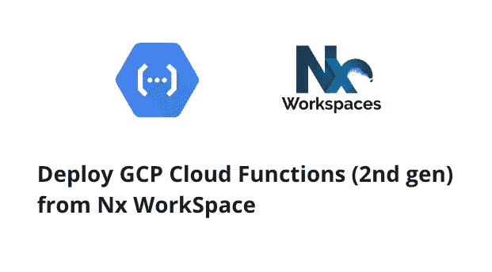
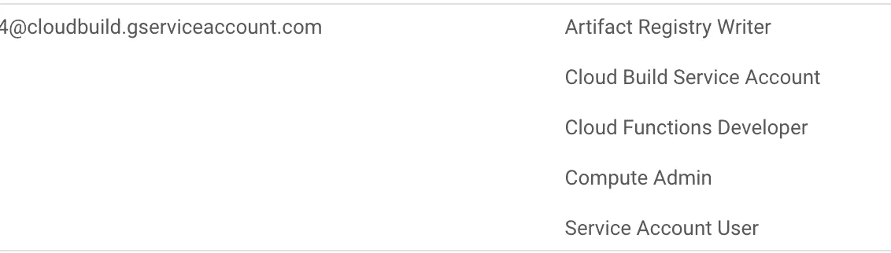
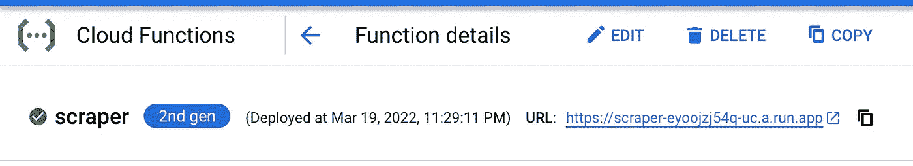
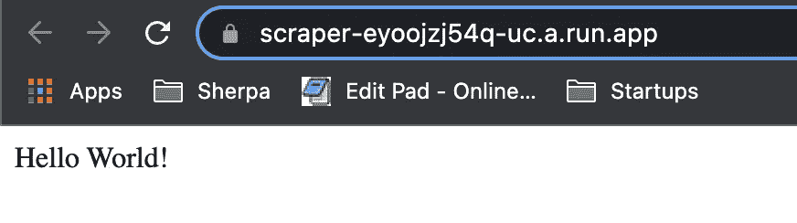

# 借助 Nx Workspace 部署第二代 GCP 云功能

> 原文：<https://itnext.io/deploy-2nd-gen-gcp-cloud-functions-with-nx-workspace-5d75fcf21566?source=collection_archive---------2----------------------->



Nx WorkSpace + GCP 云功能(第二代)

> 注意:谷歌云服务条款的[预发布条款](https://cloud.google.com/terms/service-terms#1)涵盖了第二代产品。请避免在产品中使用它，直到它完全发布。

[**快速游览:部署第二代 GCP 云函数与 Nx Workspace**](/deploy-2nd-gen-gcp-cloud-functions-with-nx-workspace-5d75fcf21566)[云函数本地测试&开发](https://dalenguyen.medium.com/2nd-gen-cloud-functions-local-testing-development-7c518f7bd0b1)
[创建 REST APIs 与 Express &第二代 GCP 云函数](https://dalenguyen.medium.com/create-rest-apis-with-express-2nd-gen-gcp-cloud-functions-d244dd9a4717)
[完美匹配:NestJs &云函数(第二代)&Nx Workspace](https://dalenguyen.medium.com/a-perfect-match-nestjs-cloud-functions-2nd-gen-nx-workspace-f13fb044e9a4)
[GCP 云函数(第二代)发布/订阅开发&测试](https://dalenguyen.medium.com/gcp-cloud-functions-gen-2nd-pub-sub-development-testing-2c498fa4464e)

[云功能(第二代)](https://cloud.google.com/functions/docs/2nd-gen/overview)是谷歌云的下一代功能即服务产品。这个新版本的云函数带有一个高级功能集，为您提供更强大的基础设施、对性能和可扩展性的高级控制、对函数运行时的更多控制，以及来自 90 多个事件源的触发。此外，该产品由谷歌云的尖端无服务器和事件基础设施、[云运行](https://cloud.google.com/run)和[事件弧](https://cloud.google.com/eventarc/docs)提供支持。

在 Nx WorkSpace 的帮助下，我们有望找到一个不错的结构，你可以在 monorepo 中利用 GCP 云函数。这是正在进行中的工作，如果你有任何建议，请让我知道。

## 创建一个示例应用程序

```
npx nx g [@nrwl/node](http://twitter.com/nrwl/node):application scraper
```

## 制作简单的 HTTP 请求函数

```
// main.tsimport { http } from '[@google](http://twitter.com/google)-cloud/functions-framework'
import 'tslib' // needed until importHelpers is set to falsehttp('helloGET', (req, res) => {
  res.send(`Hello ${req.query.name || req.body.name || 'World'}!`)
})
```

更新 Project.json 以支持 GCP 函数。它将在部署云函数之前生成 package.json 文件& index.js。

```
// project.json// generate package.json & index.js
"targets": {
    "build": {
      "executor": "[@nrwl/node](http://twitter.com/nrwl/node):build",
      "outputs": ["{options.outputPath}"],
      "options": {
        "outputPath": "dist/apps/scraper",
        "main": "apps/scraper/src/main.ts",
        "tsConfig": "apps/scraper/tsconfig.app.json",
        "assets": ["apps/scraper/src/assets"],
        "externalDependencies": "all",
 **"outputFileName": "index.js",
        "generatePackageJson": true**
      },// deploy script --> yarn deploy:scraper
"deploy": {
      "executor": "[@nrwl/workspace](http://twitter.com/nrwl/workspace):run-commands",
      "options": {
        "commands": [
 **"gcloud beta functions deploy scraper --region us-central1 --gen2 --runtime nodejs16 --trigger-http --entry-point helloGET --source ./dist/apps/scraper --allow-unauthenticated --project {args.gcpProject}"**
        ],
        "color": true,
        "parallel": false
      }
    }
```

此后，无论何时您想要部署云功能，您都可以运行这些脚本

```
// build functions
yarn build scraper --prod// deploy functions
yarn nx run scraper:deploy --gcpProject YOUR_PROJECT_ID
```

## 准备 GCP 服务

确保为您的云项目启用了计费。了解如何[检查项目](https://cloud.google.com/billing/docs/how-to/verify-billing-enabled)是否启用了计费。

[启用云功能、云构建、工件注册、Eventarc、云运行、日志和发布/订阅 API。](https://console.cloud.google.com/apis/enableflow?apiid=cloudbuild.googleapis.com,artifactregistry.googleapis.com,eventarc.googleapis.com,run.googleapis.com,logging.googleapis.com,pubsub.googleapis.com,cloudfunctions.googleapis.com&redirect=https:%2F%2Fcloud.google.com%2Ffunctions%2Fquickstart&_ga=2.102189761.1901670236.1647740179-970591310.1643643162&_gac=1.216638948.1645902088.CjwKCAiAvOeQBhBkEiwAxutUVEXz2xo4XUIddi0i4DE6vHJ-XFr8T6zMXCjxfNiwYUzPlIKbafGOihoCWzgQAvD_BwE)

安装和更新 GCP 组件和测试版命令

```
gcloud components update
gcloud components install betagcloud config set project YOUR_PROJECT_NAME
```

确保您的云构建具有这些角色



## 部署第二代功能

您需要做的就是运行部署命令

```
dalenguyen$ yarn nx run scraper:deploy --gcpProject YOUR_PROJECT_ID
yarn run v1.22.17
$ nx run scraper:deployPreparing function...
.done.
Deploying function...
[Build].............................................................
  [WARNING] *** Improve build performance by generating and committing package-lock.json.

  timeoutSeconds: 60
  uri: [https://scraper-eyoojzj54q-uc.a.run.app](https://scraper-eyoojzj54q-uc.a.run.app)
state: ACTIVE
updateTime: '2022-03-20T03:29:11.978231913Z'——————————————————————————————————————————————————————————————————————————————————————————————————————————————————————————————————————>  NX   Successfully ran target deploy for project scraper✨  Done in 45.99s.
```

