# 使用 Jenkins X & Kubernetes 部署基本的 Python 应用程序

> 原文：<https://itnext.io/deploy-a-basic-python-application-using-jenkins-x-kubernetes-4adace2fe345?source=collection_archive---------2----------------------->

Jenkins X 是 Kubernetes 的 CI / CD 平台。Jenkins X 为您提供了创建或导入应用程序、自动构建应用程序并将其部署到 Kubernetes 的可能性。每一次代码更改都会导致应用程序的一次新部署，由于钩子的存在，这一切都是自动进行的。当您对您的应用程序感到满意时，您可以使用 CLI 命令将应用程序提升到使用 GitOps 方法的不同环境中。


在本教程中，我将向您展示如何使用 Jenkins X 创建一个新的 Kubernetes 集群。不需要懂 Python。主要目标是展示 Jenkins X 可以用于各种类型的应用程序。我们将在我们的分段环境中的 pod 中部署我们的应用程序。我们将提交、扩展 pod 的数量，并将我们的应用程序推广到我们的生产环境中。

*本教程在* [*谷歌云上进行，谷歌云提供 300 美元免费信用*](https://cloud.google.com/free/) *来开始使用任何 GCP 产品。*

# 先决条件

*   [安装 gcloud SDK](https://cloud.google.com/sdk/downloads)
*   创建一个谷歌云帐户
*   在控制台中链接计费帐户

# 使用 Jenkins X 安装 Kubernetes 集群

首先，我们将检查我们的包管理器(在我的例子中是`brew`)是否是最新的。

```
$ brew update
```

在你的机器上安装`jx`二进制文件。它是与 Jenkins X 一起工作的命令行工具。[在这里](https://jenkins-x.io/getting-started/install/)你可以找到关于在 Linux 或不同平台上安装的细节。

```
$ brew tap jenkins-x/jx
$ brew install jx
$ jx --version
  1.3.106
```

现在创建一个我们将要工作的 GCP 项目。

```
$ gcloud projects create some-unique-id --name jenkins-x
$ gcloud projects list
PROJECT_ID          NAME       PROJECT_NUMBER
xxxx-jenkins-x    jenkins-x    xxxxxxxx
```

不要忘记将您的帐单帐户与此项目关联。这可以使用控制台来完成。还有一些 [alpha 命令](https://cloud.google.com/sdk/gcloud/reference/alpha/billing/accounts/projects/link)可用。

使用`jx`创建一个默认的 Kubernetes 集群。

```
$ jx create cluster gke --skip-login --default-admin-password=xxx -n jenkins-x-kubernetes
```

使用箭头键配置您的集群。

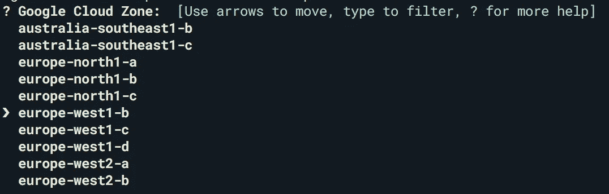

以下是我对本教程的个人配置。

*   谷歌云区:欧洲-西方 1-b
*   谷歌云机器类型:n1-标准-2
*   最小节点数 3
*   最大节点数 4

创建集群可能需要几分钟时间。它会要求我们的 [GitHub](https://www.github.com) 凭证。最后，我们还需要定义一个 GitHub API 令牌，我们可以在 GitHub 上创建它。进入“*设置- >开发者设置- >个人访问令牌*，生成新令牌。提供“*回购*”权限，点击生成:

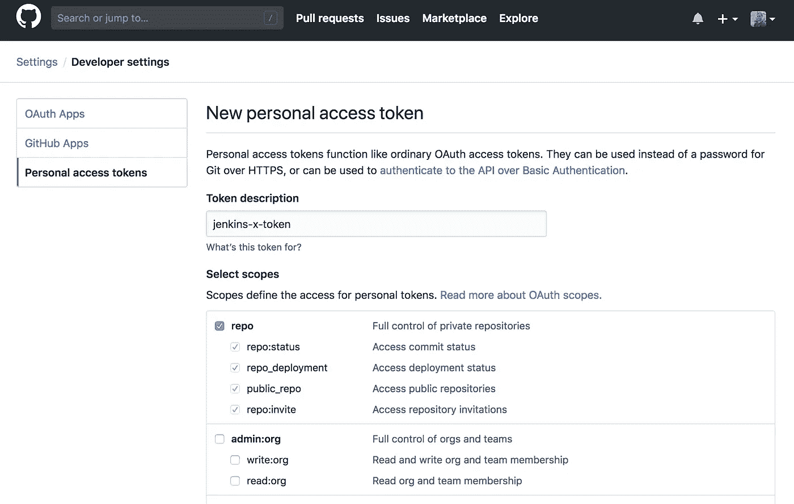

现在让我们继续安装。我们还选择在 kube-system 名称空间中安装一个入口控制器。别忘了确认域名。同样，我们需要等待几分钟，以便我们的 Kubernetes 和 Jenkins X 组件可以被提取/创建。

当一切都在运行时，你的浏览器会自动打开[http://Jenkins . JX . xx . xx . xx . xx . nip . io](http://jenkins.jx.35.205.153.90.nip.io)。耐心点。接下来是自动登录，您的 Jenkins 实例将自动配置。

最后，我们的完整 Jenkins X 环境安装在 Google 云平台上的 3 节点 Kubernetes 集群上。安装还会创建两个库，并将它们推送到你的 GitHub 账户。

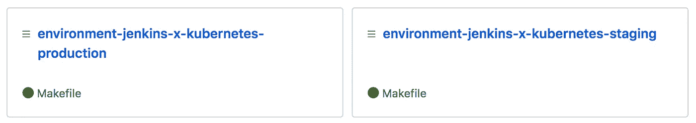

存储库的 README.md 告诉我们:“*创建新的基于 GitOps 的环境时使用的默认 git 存储库*”。[在这里](https://www.weave.works/blog/gitops-operations-by-pull-request)你可以找到更多关于 GitOps 的信息。简而言之，GitOps 是一种声明性的方法，您的整个环境状态都存储在 Git 存储库中(应用程序、版本、环境配置等等)。这些存储库包含一个 Jenkinsfile ( = Jenkins pipelines)，将在基于 GitOps 的部署中使用。

是时候从 CLI 打开我们的 Jenkins 控制台了。切换到部署 Jenkins 的名称空间，并打开控制台。用命令行界面和箭头键玩一会儿。

```
$ jx ns --> now you can choose your namespace using the arrow keys
$ jx ns jx --> now you choose your namespace immediately
Using namespace 'jx' from context named 'gke_xxx-jenkins-x_europe-west1-b_jenkins-x-kubernetes' on server '[https://xx.xx.xx.xx'](https://35.187.58.234').$ jx console
```

我们可以使用我们在`jx create cluster`命令中定义的密码作为用户“admin”登录。

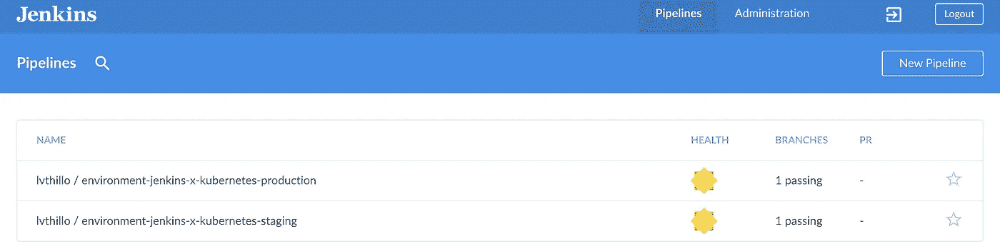

这些管道是从 Jenkinsfiles 创建的，这些文件存储在我们刚刚讨论过的两个 git 存储库中。这些管道是多分支管道，将在应用程序的升级和版本控制期间使用。多分支管道使您能够为同一项目的不同分支实现不同的 Jenkinsfiles。

在初始运行期间，会添加您的个人环境配置。

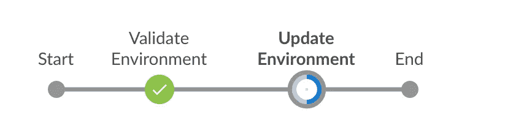

新的蓝海布局提供了一些关于管道中各阶段的清晰信息

当两条管道都正常时，您可以确信您的环境工作正常。现在，我们可以开始关注我们自己已经存在的 python 应用程序了。

# 运行基本 Python 应用程序

我已经创建了一些非常基本的 Dockerized Python 应用程序，你需要从这个 [GitHub 库](https://github.com/lvthillo/python-flask-docker.git)中派生出来。最后，它只是一个 Docker 容器，通过使用 Python 和 Flask(一个小型微服务框架)打印其名称和 IP。

分叉存储库很重要，因为 Jenkins X 将创建 PR(Pull Requests)并合并它们。当然，你没有权限在我的存储库上这样做，这就是为什么你需要分叉它。

我们将首先测试基本的应用程序。克隆您的分叉库构建 Docker 映像并启动它。说明在 [README.md](https://github.com/lvthillo/python-flask-docker/blob/master/README.md) 中。


该应用程序正在端口 8080 上运行(而不是 Flask 的默认端口 5000)。这里的原因是用 Jenkins X 导入应用程序(见后面)会自动公开容器端口 8080。在初始部署到端口 5000 后，可以对其进行编辑，但是我们希望执行最少的手动步骤。这就是我们在端口 8080 上运行应用程序的原因。

# 使用 Jenkins X 将我们的基本 Python 应用程序作为管道导入

现在我们将把我们的项目导入到 Jenkins 中。首先，我们需要在本地存储库中`cd`(从 fork 克隆的)。现在执行`jx import`。

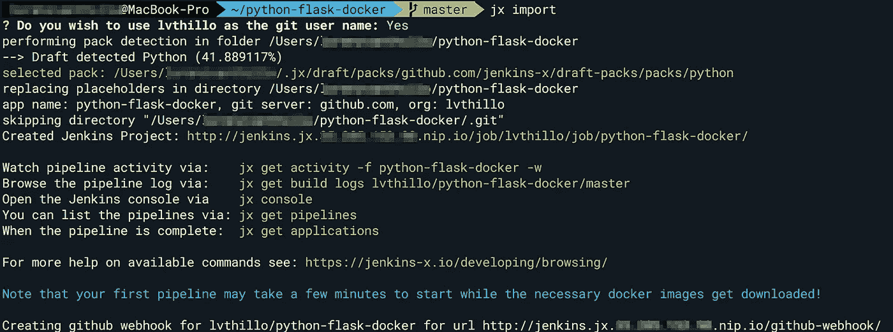

还可以使用 URL 导入 git 项目。

```
$ jx import --url [https://github.com/your-user-name/python-flask-docker.git](https://github.com/lvthillo/python-flask-docker.git)
```

执行上面输出中返回的命令。

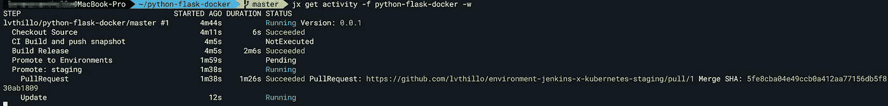

检查詹金斯控制台的管道。从克隆存储库、版本控制、创建 Git 标签、测试(如果有测试的话)和构建应用程序开始。

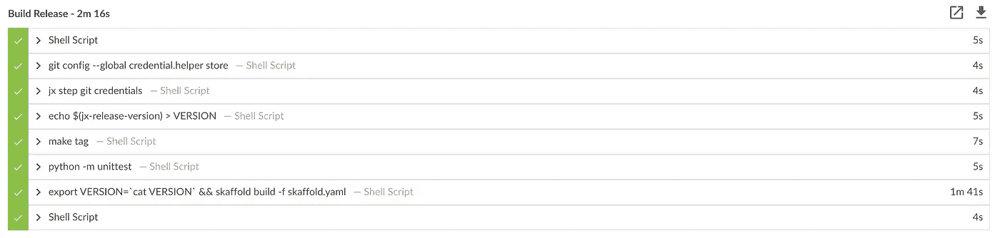

它正在构建 Docker 应用程序并将图像推送到 Docker 注册表。

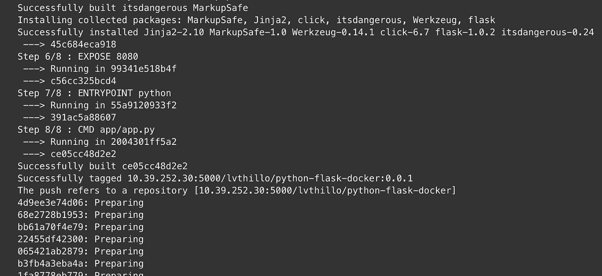

在升级阶段，会在 environment-Jenkins-x-kubernetes-staging 存储库中创建一个 PR (Pull Request)。

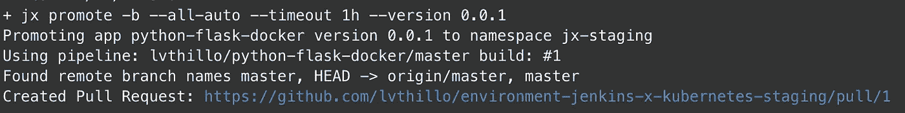

这个 PR 将把我们的应用程序及其版本添加到 Git 存储库中的 [env/requirements.yaml](https://github.com/lvthillo/environment-jenkins-x-kubernetes-staging/pull/1/commits/ae807a64518c6ece2f1baf8dbd42954f23047219#diff-6c071f3cbcacdcc322bba55dbfbfcaee) 文件中。

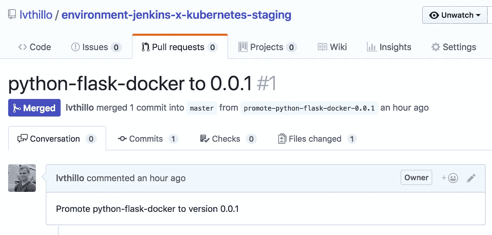

在 python-flask-docker 管道的日志中:

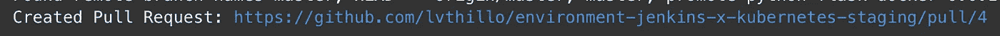

现在，您可以看到多分支环境——Jenkins-x-kubernettes——暂存管道为拉请求触发(分支 PR-1)。它将检查 PR 并执行`helm build`，在环境上执行测试以及代码审查和批准。当它成功时，它会将 PR 与 master 合并。

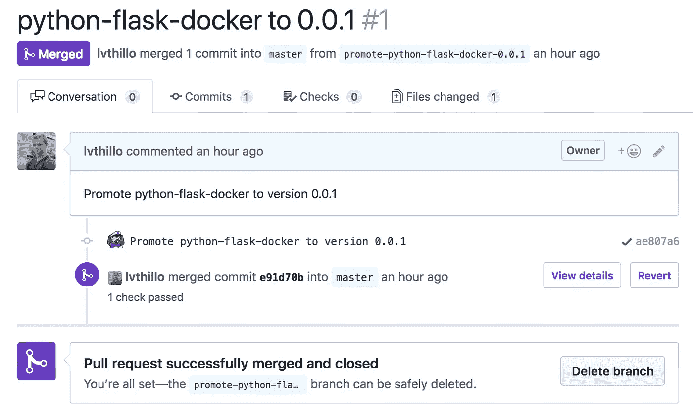

PR 与主分支的合并将再次触发管道，但这次是从主分支。该流水线将检验主分支，并再次执行`helm build`和`helm apply`。


从主分支开始的这个环境-Jenkins-x-kubernetetes-staging 管道将部署我们的 pod。当它成功时，两个管道(environment-Jenkins-x-kubernettes-staging 管道+我们的 python-flask-docker 管道管道)都成功退出。

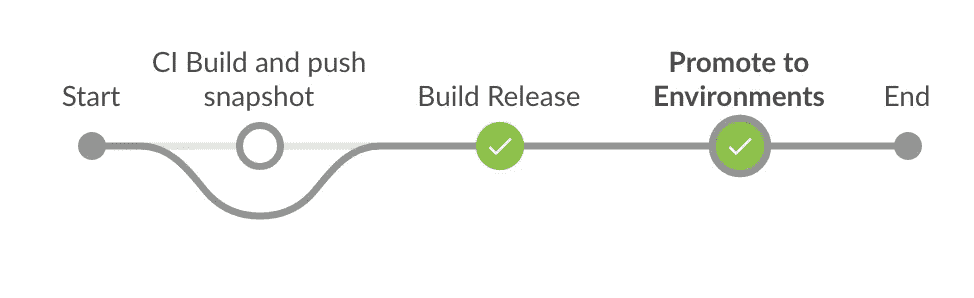

现在检查现有的应用程序。在这里，我们需要首先使用`jx` CLI 来访问我们的 jx-staging 名称空间。我们的 pod 正在这个名称空间中运行。
从该名称空间获取应用程序

```
$ jx ns jx-staging
$ jx get applications
# in short: jx get apps -n jx-staging
```

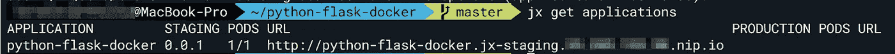

我们甚至可以使用`jx`来检查我们的日志。

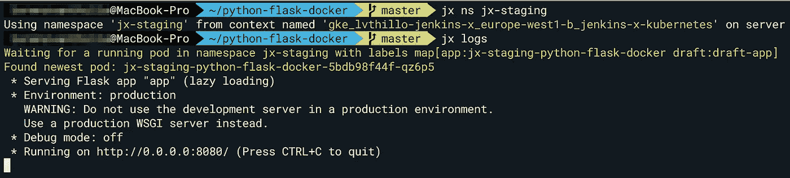

访问 URL 以检查应用程序。

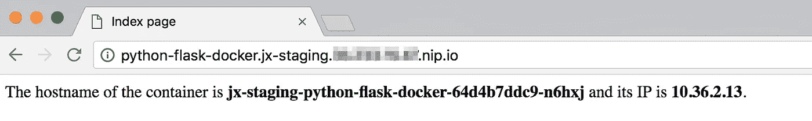

打印出 pod 及其主机名和 IP。

我们还可以在 Kubernetes 引擎控制台中查看我们的新应用程序(转到工作负载)。

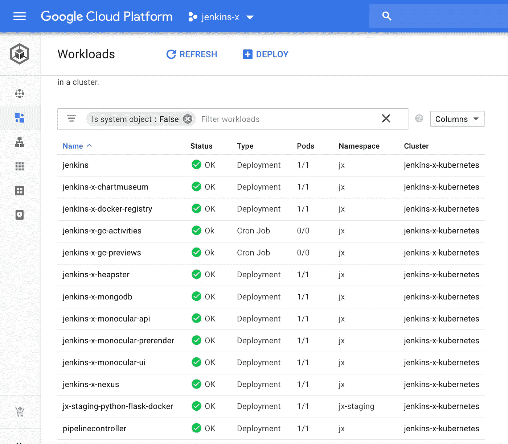

我们的应用程序部署在 jx-staging 名称空间中

在这里，您还可以看到 Jenkins X 部署的其他组件，如 Nexus、Heapster、Docker Registry 等。

我们甚至可以检查我们的图像是否存在于 Docker 注册表中。

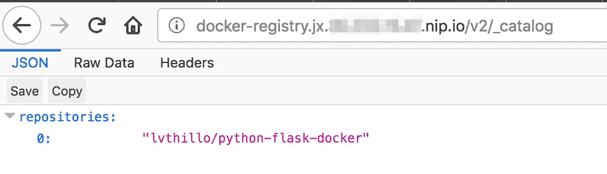

现在我们将更新我们的应用程序，看看会发生什么！

# 重新部署和提升应用程序

我们知道 Jenkins X 在导入我们的应用程序时创建了一个 GitHub web 钩子。这意味着我们只需提交一个更改，我们的应用程序就会自动更新。

我们向应用程序的模板页面添加一点文本，并提交+推送到远程 GitHub 存储库。

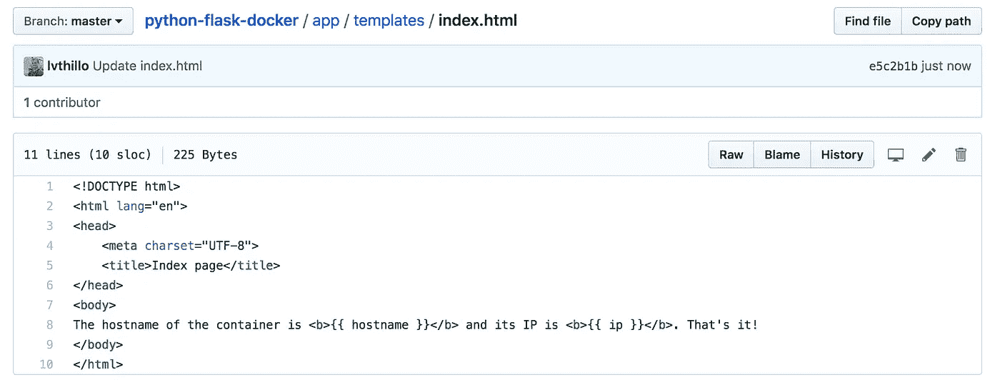

“就是这样！”已添加。

python-flask-docker 管道管道自动启动。它将创建一个新的版本(0.0.2 ),在环境-Jenkins-x-kubernettes-staging pipeline(见上文)的帮助下，版本 0.0.2 将升级到我们的 jx-staging 环境。

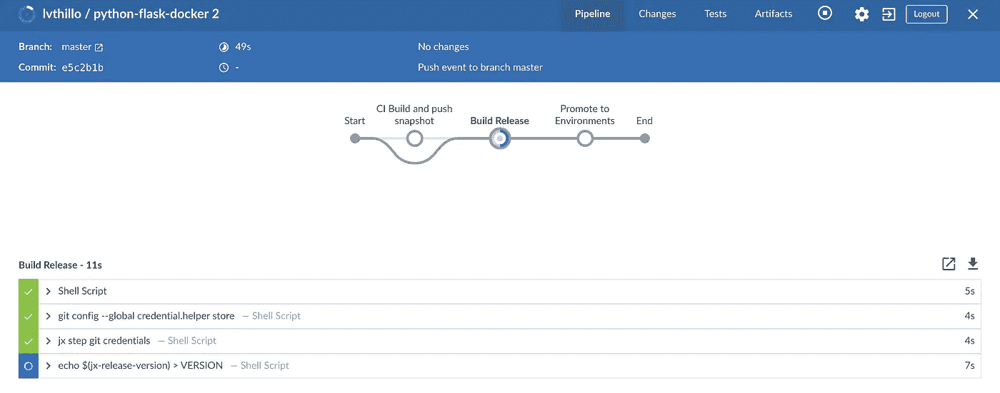

验证结果。一个新的 pod 与我们更新的应用程序一起部署。

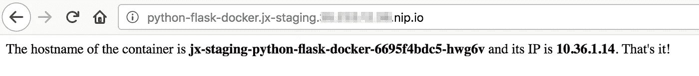

这样我们也可以更新头盔的`charts/python-flask-docker/values.yaml`来增加吊舱的数量。我们可以将复制计数设置为 4。我们的管道将再次被触发，我们将在我们的暂存环境中部署版本 0.0.3。

记住标签是被创建的，我们也可以在 GitHub 中发布这些标签。


部署之后，我们可以`curl`我们的应用程序。我们可以使用一些安装了`curl` 的 docker 镜像。

```
$ docker run --rm tutum/curl /bin/bash -c 'for i in $(seq 1 10); do curl -s [http://python-flask-docker.jx-staging.xx.xx.xx.xx.nip.io/](http://python-flask-docker.jx-staging.35.233.12.38.nip.io/) && echo " "  ; done'
```

短输出:

```
The hostname of the container is <b>jx-staging-python-flask-docker-6d64d66f96-nm678</b> and its IP is <b>10.36.1.19</b>. That's it!The hostname of the container is <b>jx-staging-python-flask-docker-6d64d66f96-844r4</b> and its IP is <b>10.36.1.20</b>. That's it!The hostname of the container is <b>jx-staging-python-flask-docker-6d64d66f96-zmzb5</b> and its IP is <b>10.36.0.16</b>. That's it!The hostname of the container is <b>jx-staging-python-flask-docker-6d64d66f96-7sj6v</b> and its IP is <b>10.36.1.17</b>. That's it!The hostname of the container is <b>jx-staging-python-flask-docker-6d64d66f96-nm678</b> and its IP is <b>10.36.1.19</b>. That's it!The hostname of the container is <b>jx-staging-python-flask-docker-6d64d66f96-844r4</b> and its IP is <b>10.36.1.20</b>. That's it!...
```

我们通过 4 个 pod 实现负载平衡，也可能通过不同的节点实现负载平衡。当我们满意时，我们可以将我们的应用程序推广到我们的生产环境中。

获取我们的应用程序名称:

```
$ jx get app -n jx-staging
APPLICATION         STAGING PODS URL
python-flask-docker 0.0.3   4/4  [http://python-flask-docker.jx-staging.xx.xx..xx.nip.io](http://python-flask-docker.jx-staging.35.233.12.38.nip.io)
```

将我们的应用程序推向生产。我们可以推广特定的版本。确保您仍然在 git 存储库中！

```
$ jx promote python-flask-docker --version 0.0.3 --env production
```

创建了一个新的 PR，但这次是在我们的生产存储库中。环境-Jenkins-x-kubernetes-生产管道被触发。PR 被测试和合并，现在相同的管道再次从由合并触发的主分支开始。它将执行`helm apply`(部署)。

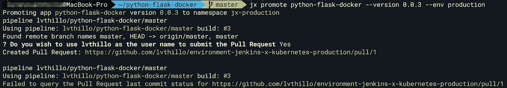

让我们在 jx-production 环境中检查应用程序并访问 URL(它不再包含“ *staging* ”)！).

```
jx get apps -n jx-production
APPLICATION         PRODUCTION PODS URL
python-flask-docker 0.0.3      4/4  [http://python-flask-docker.jx-production.xx.xx.xx.xx.nip.io](http://python-flask-docker.jx-production.35.233.12.38.nip.io)
```

我们现在正在生产中访问我们的应用程序。检查 pod 名称。由于我们的 GitOps 方法，还有 4 个 pod 在生产中运行。

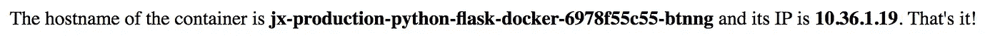

# 结论

在这篇博客中，我们学习了如何使用`jx`安装 Kubernetes 集群，以及如何导入任何类型的应用程序。我们看到了如何在几秒钟内创建完全自动化的部署管道。我们不必再关心钩子或者创建我们的应用程序环境。所有配置都存储在 Git 存储库中。由于基于 GitOps 的方法，在环境之间提升应用程序不再是瓶颈。

我希望你喜欢它，并了解 Jenkins X 的基本知识。当我有时间时，我会写第二篇关于 Jenkins X 的博客，更深入地关注它提供的所有其他不同的可能性。

[](https://www.buymeacoffee.com/dZb8fLN)

如果真的对你有帮助…:)