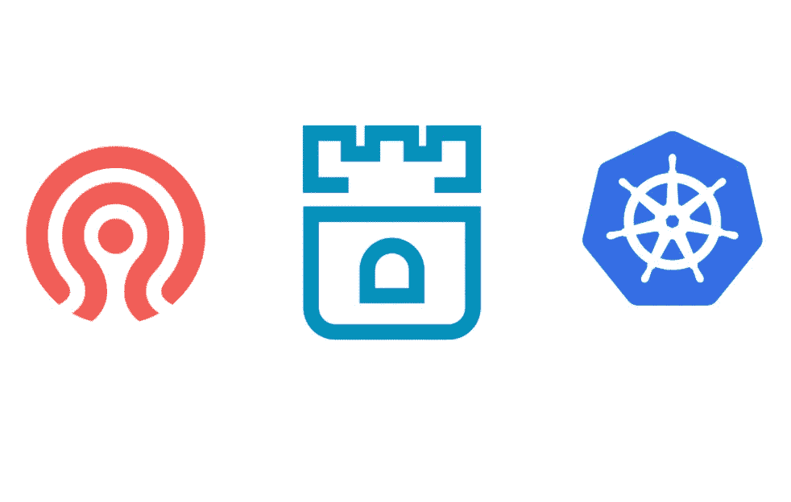
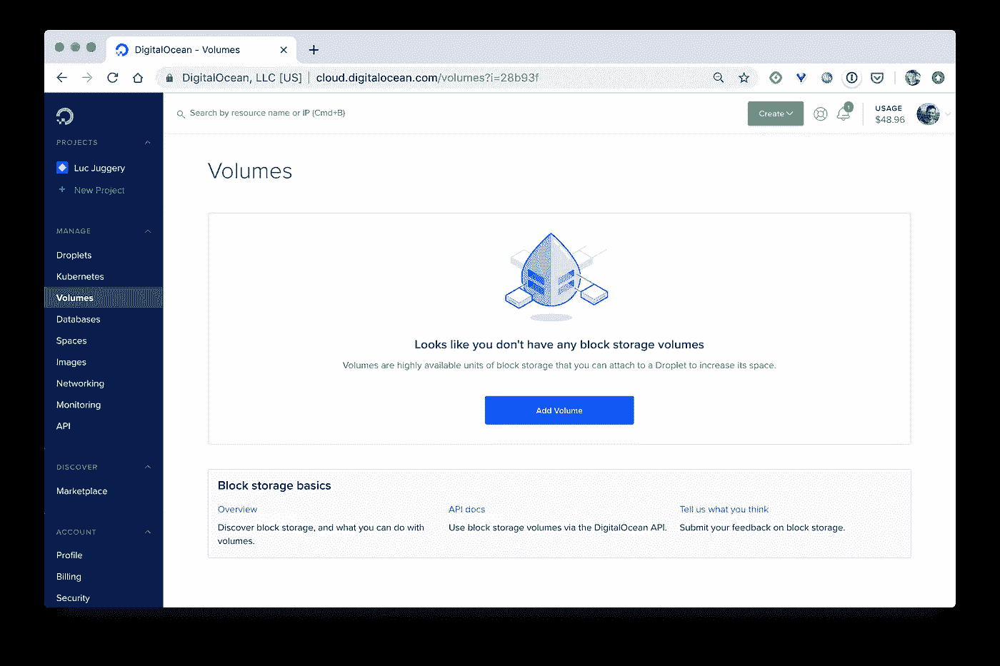
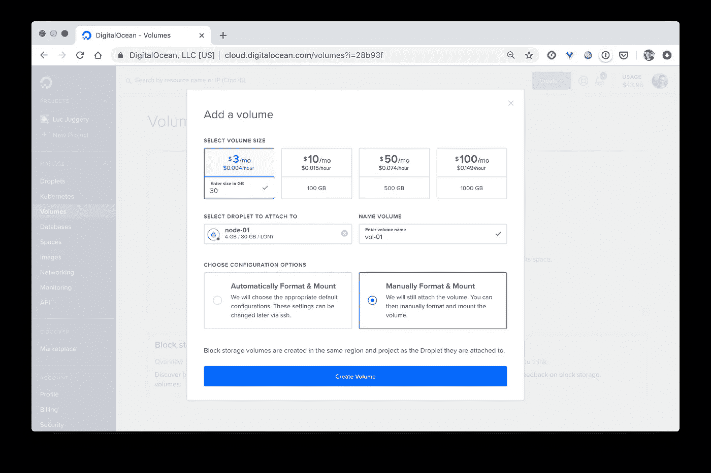
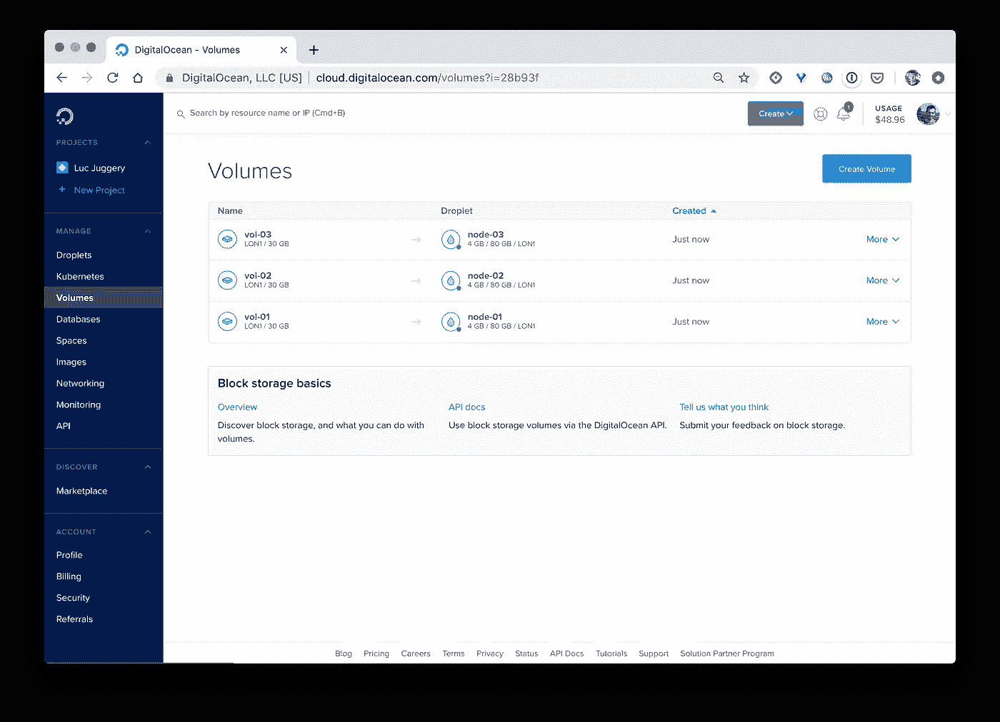
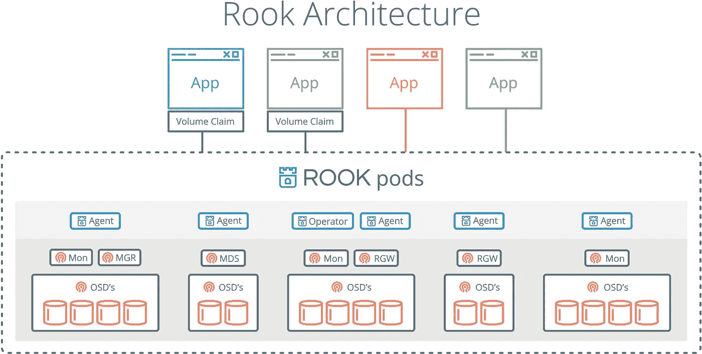
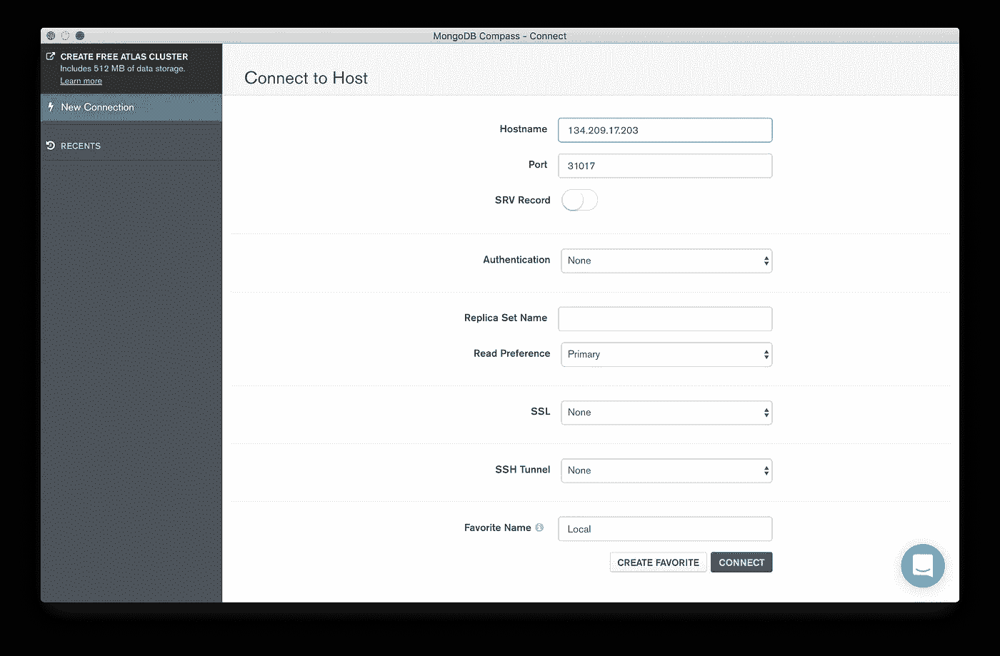
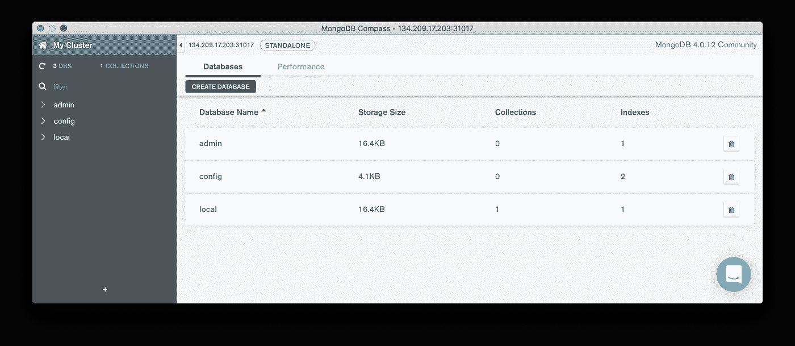

# 用 Rook 在 Kubernetes 上部署一个 Ceph 集群

> 原文：<https://itnext.io/deploy-a-ceph-cluster-on-kubernetes-with-rook-d75a20c3f5b1?source=collection_archive---------1----------------------->

## 让我们来看看这个伟大的 CNCF 项目的概况



# 介绍

在本指南中，您将使用 Rook 在 Kubernetes 集群中设置 Ceph 存储。然后，您将使用 Ceph 的块存储为 MongoDB 数据库持久化数据。

完成后，您将知道什么是 Rook，以及如何使用它来部署 Ceph。您还将了解如何使用 Rook 在 Kubernetes 中部署其他一些存储后端。

# 先决条件

在开始阅读本指南之前，您需要具备以下条件:

*   一个包含 4 个节点的 Kubernetes 集群:1 个主节点和 3 个工作节点。每个节点都是一个至少有 4GB 内存的 Ubuntu 18.04 服务器。在本教程中，我们使用在数字海洋上用官方 [kubeadm](https://kubernetes.io/docs/setup/production-environment/tools/kubeadm/install-kubeadm/) 工具创建的集群。主节点命名为 **master** ，工作节点命名为 **node-01** 、 **node-02** 和 **node-03** 。
*   被配置为与上述集群通信的 kubectl 实用程序

N 注意:拥有一个 HA 集群至少需要 2 个主节点和 3 个 etcd 实例，但是这里使用的设置对于本例来说已经足够了

# 步骤 1 -创建块卷存储

在此步骤中，我们将创建 3 个数据块卷，并将它们分别连接到一个工作节点。这些卷将在以后用于持久存储 Ceph 集群的数据。

对于每个卷，我们将执行以下步骤:

首先，我们进入数字海洋控制面板的音量菜单，点击**添加音量**按钮。



接下来，我们在表格中填入以下信息:

*   我们设置了 30GB 的自定义大小
*   我们为卷提供一个名称(第一个卷命名为 **vol-01** ，下一个卷命名为 **vol-02** ，…)
*   我们选择一个液滴来附加卷( **vol-01** 将附加到 **node-01** ， **vol-02** 到 **node-02** ，…)
*   我们选择**手动格式化&挂载**选项



最后，我们点击**创建卷**按钮创建每个卷。

N 注意:我们可以忽略创建每个卷后出现的配置说明

一旦创建了 3 个卷并将其连接到工作节点，我们就有了一个类似于下图的映射。



现在我们已经设置了存储基础设施，我们将在 Kubernetes 集群上部署 Rook。

# **第 2 步——为 Ceph 存储部署 Rook 操作员**

Rook 是【云原生计算基金会(CNCF)】([https://cncf . io](https://cncf.io))的孵化项目。它专门用于存储协调，并允许在 Kubernetes 集群中部署多个存储解决方案。在本文中，我们将重点关注 Ceph 存储，但也有其他存储解决方案。

N 注:Ceph 和 EdgeFS 目前是 Rook 支持的两家存储提供商，处于*稳定状态*。其他存储提供商，如 Cassandra、Minio、NFS、CockroachDB、YugabyteDB 都处于 *Alpha* 状态

首先，我们克隆 GitHub 存储库并使用 1.2 版(迄今为止的最后一个版本)

```
$ git clone [https://github.com/rook/rook.git](https://github.com/rook/rook.git)
$ cd rook
$ git checkout release-1.2
```

对于 Rook 支持的每个存储解决方案，都有一个 Kubernetes **操作员**。简而言之，操作符是一个在 Pod 中运行的进程，它包含管理复杂应用程序的所有逻辑。运算符通常用于管理有状态的应用程序。

首先，我们将进入包含 Ceph 所需的所有资源的文件夹。

```
$ cd cluster/examples/kubernetes/ceph
```

接下来，我们部署车的 Ceph 操作符所需的所有资源。

```
$ kubectl create -f common.yaml
```

那些资源主要是**CustomRessourceDefinitions**，也称为 CRDs。它们用于定义操作员将使用的新资源(读取 Kubernetes 中默认不存在的资源)。创建的其他资源主要与访问权限相关，因此操作员可以与集群的 **API 服务器**通信:

*   服务帐户
*   作用
*   角色绑定
*   集群角色
*   ClusterRoleBinding

接下来，我们部署 Ceph 操作员，他将负责 Ceph 集群的设置和编排。

```
$ kubectl create -f operator.yaml
```

操作员需要几秒钟才能启动并运行。它的状态可以用下面的命令来验证。

```
$ kubectl get pod -n rook-ceph
```

一旦操作员准备好了，它就触发一个 **DaemonSet** 的创建，负责在 Kubernetes 集群的每个 worker 节点上部署一个 **rook-discover** 代理。

最后，一旦一切都设置好了，上面命令的结果类似于下面的输出。

```
NAME READY STATUS RESTARTS AGE
rook-ceph-operator-75d95cb868-s7m5z 1/1 Running 0 78s
rook-discover-44dq9 1/1 Running 0 43s
rook-discover-7gxn7 1/1 Running 0 43s
rook-discover-xfqmk 1/1 Running 0 43s
```

注意:标识符在您的环境中会有所不同

现在已经准备好使用操作符部署 Ceph 集群了。

# 步骤 3 -创建 Ceph 集群

我们现在将在我们的 Kubernetes 集群中创建一个 Ceph 集群。

下图显示了将在集群中作为 pod 运行的所有 Ceph 相关流程。



Ceph 集群中的白嘴鸦豆荚

*   **mgr** 是一个**管理器**守护进程，负责跟踪运行时指标和 Ceph 集群的当前状态。对于高可用性集群，至少需要 2 个 Ceph 管理器
*   **mon** 是一个**监视器**，负责维护 Ceph 守护进程相互协调所需的集群状态图。对于高可用性集群，至少需要三台监视器
*   **osd** 是一个对象存储守护进程，负责存储数据，处理数据复制、恢复、再平衡。对于 HA Ceph 集群，至少需要 3 个 Ceph OSDs

首先，我们使用下面的规范定义一个 **CephCluster** 资源。

```
apiVersion: ceph.rook.io/v1
kind: CephCluster
metadata:
  name: rook-ceph
  namespace: rook-ceph
spec:
  cephVersion:
    image: ceph/ceph:v14.2
  allowUnsupported: false
  dataDirHostPath: /var/lib/rook
  skipUpgradeChecks: false
  mon:
    count: 3
    allowMultiplePerNode: false
  dashboard:
    enabled: true
    ssl: true
  monitoring:
    enabled: false
    rulesNamespace: rook-ceph
  network:
    hostNetwork: false
  rbdMirroring:
    workers: 0
  storage:
    useAllNodes: true
    useAllDevices: true
```

它基本上定义了如何配置集群。属性 **useAllNodes** 和 **useAllDevices** 被设置为 **true** ，这样 Kubernetes 集群的每个 worker 节点都将用于部署 Ceph 的进程，所有连接到这些节点的设备都将用于持久存储 Ceph 集群的数据。

然后，我们创建集群:

```
$ kubectl apply -f cluster.yaml
```

这个新的 **CephCluster** 资源的创建将通知 Ceph 操作员，并且 Ceph 操作员将向 **API 服务器**发送请求，以便创建所有与 Ceph 相关的 pod。

接下来，我们确保负责 Ceph 集群的所有 pod 都已启动并运行。

```
$ kubectl get pod -n rook-ceph
```

创建集群通常需要几分钟时间。完成后，我们应该会得到一个类似于以下输出的列表。

```
NAME READY STATUS RESTARTS AGE
csi-cephfsplugin-fnpm9                        3/3 Running 0 10m
csi-cephfsplugin-hxml9                        3/3 Running 0 10m
csi-cephfsplugin-provisioner-7c44c4ff49-k8z9t 4/4 Running 0 10m
csi-cephfsplugin-provisioner-7c44c4ff49-kmdp9 4/4 Running 1 10m
csi-cephfsplugin-qwm6m                        3/3 Running 0 10m
csi-rbdplugin-dgmv8                           3/3 Running 0 10m
csi-rbdplugin-provisioner-7458d98547-xg7x8    5/5 Running 1 10m
csi-rbdplugin-provisioner-7458d98547-xz2kg    5/5 Running 1 10m
csi-rbdplugin-qxx26                           3/3 Running 0 10m
csi-rbdplugin-s2mxj                           3/3 Running 0 10m
rook-ceph-mgr-a-5d8bf85bb7-nnnxc              1/1 Running 0 7m5s
rook-ceph-mon-a-7678858484–5txtz              1/1 Running 0 8m
rook-ceph-mon-b-6b6f697f94–577z8              1/1 Running 0 7m44s
rook-ceph-mon-c-89c78d866–4w5sb               1/1 Running 0 7m25s
rook-ceph-operator-75d95cb868-s7m5z           1/1 Running 0 13m
rook-ceph-osd-prepare-node-01-dj9tm           0/1 Completed 0 6m33s
rook-ceph-osd-prepare-node-02–49d5c           0/1 Completed 0 6m33s
rook-ceph-osd-prepare-node-03-md22x           0/1 Completed 0 6m33s
rook-discover-44dq9                           1/1 Running 0 12m
rook-discover-7gxn7                           1/1 Running 0 12m
rook-discover-xfqmk                           1/1 Running 0 12m
```

注意:在您的环境中，标识符会有所不同

Ceph 可以提供几种存储方式:

*   文件系统
*   目标
*   街区

在下文中，我们将创建使用数据块存储所需的资源。

# 步骤 4 -从 Ceph 获取块存储

文件*cluster/examples/Kubernetes/ceph/CSI/rbd/storage class . YAML*定义了一个 **ReplicaPool** 和一个 **StorageClass** 来自动创建由 Ceph 块存储备份的 Kubernetes**persistent volume**。

首先，我们创建这些资源:

```
$ kubectl apply -f ./csi/rbd/storageclass.yaml
```

接下来，我们定义一个 **PersistentVolumeClaim** ，一个用于请求存储的资源。由于它使用之前创建的*rook-ceph-block***storage class**，因此它将自动从 Ceph 集群中调配块存储。

```
apiVersion: v1
kind: PersistentVolumeClaim
metadata:
  name: mongo-pvc
spec:
  storageClassName: rook-ceph-block
  accessModes:
  - ReadWriteOnce
  resources:
    requests:
      storage: 5Gi
```

接下来，我们用下面的命令创建 **PersistentVolumeClaim** 。

```
$ kubectl apply -f pvc-rook-ceph-block.yaml
```

然后，我们验证**持续卷声明**已经触发了**持续卷**的创建。

```
$ kubectl get pvc,pv
```

我们应该得到一个列表，显示自动配置的**持久卷声明**和**持久卷**之间的绑定。

在幕后，**持久卷**存储在连接到工作节点的卷上。

在接下来的步骤中，我们将使用这个存储来持久化 MongoDB 数据库的数据。

# 步骤 5——创建 MongoDB 数据库

我们现在将部署一个数据库工作负载，并使用在上一步中调配的存储来保存 Pod 的数据。

首先，我们定义一个包含以下内容的规范:

*   一个基于 *mongo:4.0* Docker 映像的**部署**运行 1 个容器。这个容器使用上面创建的**PersistentVolumeClaim***mongo-PVC*。关联的**持久卷**安装在容器文件系统中的 */data/db* 上
*   NodePort 类型的**服务**公开了集群中每个节点的端口 *31017* 上的 *mongo* Pod

```
apiVersion: apps/v1
kind: Deployment
metadata:
  name: mongo
spec:
  selector:
    matchLabels:
      app: mongo
  template:
    metadata:
      labels:
        app: mongo
    spec:
      containers:
      - image: mongo:4.0
        name: mongo
        ports:
        - containerPort: 27017
          name: mongo
        volumeMounts:
        - name: mongo-persistent-storage
          mountPath: /data/db
      volumes:
      - name: mongo-persistent-storage
        persistentVolumeClaim:
          claimName: mongo-pvc
---
apiVersion: v1
kind: Service
metadata:
  name: mongo
  labels:
    app: mongo
spec:
  selector:
    app: mongo
  type: NodePort
  ports:
    - port: 27017
      nodePort: 31017
```

然后我们创造这些资源。

```
$ kubectl apply -f mongo.yaml
```

接下来，我们可以验证 **Pod** 和**服务**是否被正确创建。

```
$ kubectl get pods,svc
```

我们有一个数据库 **Pod** 将它的数据保存在底层的 Ceph 存储中。在接下来的步骤中，我们将使用一个 MongoDB 客户端并进行连接，确保一切正常。

# 步骤 6 -连接到数据库

我们现在将使用一个 MongoDB 客户机，并连接到上一步中部署的数据库。

注意:在这一步我们将使用 MongoDB Compass，但是任何其他客户端都可以

由于数据库是通过类型为 **NodePort** 的服务公开的，因此可以从集群的任何节点通过特定端口(在本例中为 31017)访问它。

首先，我们得到节点列表和它们的外部 IP

```
$ kubectl get nodes -o wide
```

接下来，我们选择一个工作节点 IP 地址，并使用它来连接我们的客户端。



然后我们可以访问数据库并添加一些数据。这些数据将保存在底层 Ceph 存储中，并跨数据块卷进行复制。

# 结论

在本文中，您使用了一个 Rook 操作符来部署在 Kubernetes 中运行 Ceph 集群所需的所有流程。现在，您可以使用 Ceph(对象、块、文件系统)提供的存储解决方案，以一种安全的方式持久存储工作负载的数据。

如果你想探索 Rook，了解更多可用的存储后端，那么[Rook GitHub repository]([https://github.com/rook/rook](https://github.com/rook/rook))是一个很好的起点。