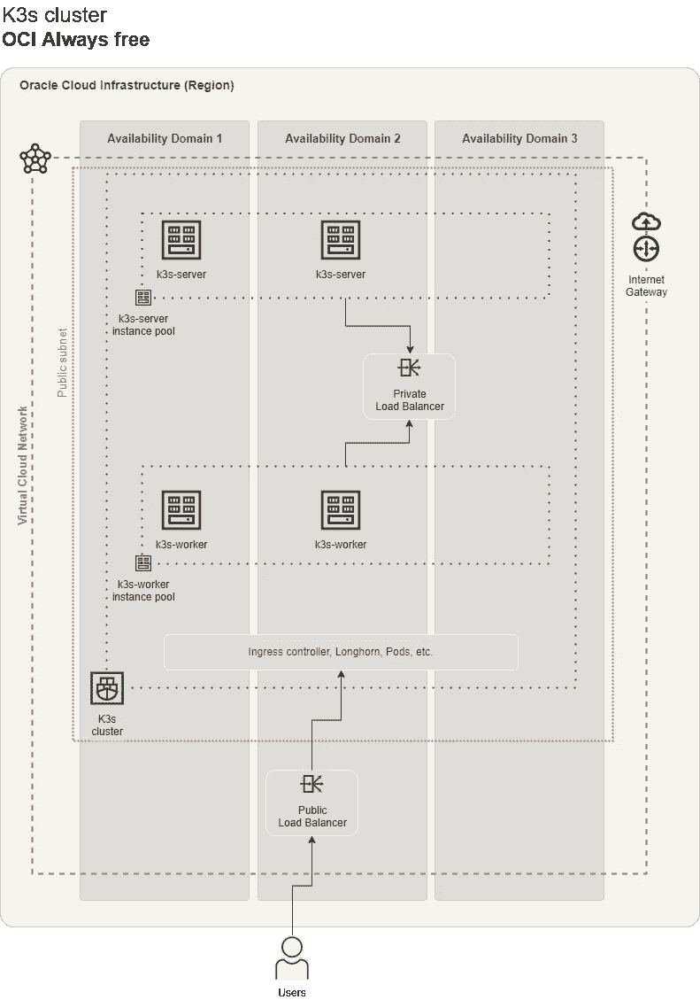

# 使用 k3s 和 Oracle Cloud always 免费资源，免费部署 Kubernetes 集群。

> 原文：<https://itnext.io/deploy-a-kubernetes-cluster-for-free-using-k3s-and-oracle-cloud-always-free-resources-ba8d1092b3da?source=collection_archive---------1----------------------->


使用 K3s 和 Oracle [always free](https://docs.oracle.com/en-us/iaas/Content/FreeTier/freetier_topic-Always_Free_Resources.htm) 资源，免费部署 Kubernetes 集群。

# 重要注意事项

*   本教程仅展示了如何将 terraform 与 Oracle 云基础设施结合使用，以及如何仅使用**始终免费的**资源。这些示例是针对生产环境的**而非**。
*   试用期(30 天)结束时。所有部署的付费资源将被停止/终止
*   在试用期(30 天)结束时，如果您有一个正在运行的计算实例，它将被停止/休眠

# 要求

要使用本教程，您需要:

*   Oracle 云帐户。你可以在这里注册

一旦您获得帐户，在开始和 *1 之前，请按照*操作。准备本文件中[的](https://docs.oracle.com/en-us/iaas/developer-tutorials/tutorials/tf-provider/01-summary.htm)*步骤。*

您还需要:

*   [Terraform](https://www.terraform.io/) — Terraform 是一款开源基础设施代码软件工具，提供一致的 CLI 工作流来管理数百项云服务。Terraform 将云 API 编码成声明性的配置文件。
*   [kubectl](https://kubernetes.io/docs/tasks/tools/)—Kubernetes 命令行工具(可选)
*   [oci cli](https://docs.oracle.com/en-us/iaas/Content/API/Concepts/cliconcepts.htm) — Oracle 命令行界面(可选)

## RSA 密钥生成示例

要将 terraform 与 Oracle 云基础架构配合使用，您需要生成一个 RSA 密钥。使用以下内容生成 rsa 密钥:

```
openssl genrsa -out ~/.oci/<your_name>-oracle-cloud.pem 4096
chmod 600 ~/.oci/<your_name>-oracle-cloud.pem
openssl rsa -pubout -in ~/.oci/<your_name>-oracle-cloud.pem -out ~/.oci/<your_name>-oracle-cloud_public.pem
```

将**替换为您的姓名或您喜欢的字符串。

**注** ~/。oci/-oracle-cloud_public.pem 该字符串将用在 Oracle provider 插件使用的*terraform.tfvars*上，所以请注意该字符串。

# 项目设置

您可以克隆这个存储库并在*示例/* 目录中工作。你必须编辑 *main.tf* 文件，还必须创建 *terraform.tfvars* 文件。有关更多详细信息，请参见 [Oracle 提供商设置](https://garutilorenzo.github.io/deploy-kubernetes-for-free-oracle-cloud/#oracle-provider-setup)和[飞行前清单](https://garutilorenzo.github.io/deploy-kubernetes-for-free-oracle-cloud/#pre-flight-checklist)。

或者，如果您愿意，可以在工作区中创建一个新的空目录，并创建以下三个文件:

*   terraform.tfvars —更多详细信息请参见 [Oracle provider setup](https://garutilorenzo.github.io/deploy-kubernetes-for-free-oracle-cloud/#oracle-provider-setup)
*   main.tf
*   provider.tf

main.tf 文件将如下所示:

```
variable "compartment_ocid" {}variable "tenancy_ocid" {}variable "user_ocid" {}variable "fingerprint" {}variable "private_key_path" {}variable "region" {
  default = "<change_me>"
}module "k3s_cluster" {
  region              = var.region
  availability_domain = "<change_me>"
  compartment_ocid    = var.compartment_ocid
  my_public_ip_cidr   = "<change_me>"
  cluster_name        = "<change_me>"
  environment         = "staging"
  k3s_token           = "<change_me>"
  source              = "github.com/garutilorenzo/k3s-oci-cluster"
}output "k3s_servers_ips" {
  value = module.k3s_cluster.k3s_servers_ips
}output "k3s_workers_ips" {
  value = module.k3s_cluster.k3s_workers_ips
}output "public_lb_ip" {
  value = module.k3s_cluster.public_lb_ip
}
```

所有可能的变量见[飞行前清单](https://garutilorenzo.github.io/deploy-kubernetes-for-free-oracle-cloud/#pre-flight-checklist)

provider.tf 将类似于:

```
provider "oci" {
  tenancy_ocid     = var.tenancy_ocid
  user_ocid        = var.user_ocid
  private_key_path = var.private_key_path
  fingerprint      = var.fingerprint
  region           = var.region
}
```

现在，我们可以用以下命令初始化 terraform:

```
terraform initterraform init
Initializing modules...
Downloading git::[https://github.com/garutilorenzo/k3s-oci-cluster.git](https://github.com/garutilorenzo/k3s-oci-cluster.git) for k3s_cluster...
- k3s_cluster in .terraform/modules/k3s_clusterInitializing the backend...Initializing provider plugins...
- Reusing previous version of hashicorp/oci from the dependency lock file
- Reusing previous version of hashicorp/template from the dependency lock file
- Using previously-installed hashicorp/template v2.2.0
- Using previously-installed hashicorp/oci v4.64.0Terraform has been successfully initialized!You may now begin working with Terraform. Try running "terraform plan" to see
any changes that are required for your infrastructure. All Terraform commands
should now work.If you ever set or change modules or backend configuration for Terraform,
rerun this command to reinitialize your working directory. If you forget, other
commands will detect it and remind you to do so if necessary.
```

**为公共 LB (L7)生成 sel 签名的 SSL 证书**

**注意**如果您已经拥有一个有效的证书，请跳过这一步，为变量 PATH_TO_PUBLIC_LB_CERT 和 PATH_TO_PUBLIC_LB_KEY 设置正确的值

我们需要为我们的公共负载平衡器(第 7 层)生成证书(sel 签名)。为此，我们需要 **openssl** ，打开一个终端并遵循以下步骤:

生成密钥:

```
openssl genrsa 2048 > privatekey.pem
Generating RSA private key, 2048 bit long modulus (2 primes)
.......+++++
...............+++++
e is 65537 (0x010001)
```

生成新的证书请求:

```
openssl req -new -key privatekey.pem -out csr.pem
You are about to be asked to enter information that will be incorporated
into your certificate request.
What you are about to enter is what is called a Distinguished Name or a DN.
There are quite a few fields but you can leave some blank
For some fields there will be a default value,
If you enter '.', the field will be left blank.
-----
Country Name (2 letter code) [AU]:IT
State or Province Name (full name) [Some-State]:Italy
Locality Name (eg, city) []:Brescia
Organization Name (eg, company) [Internet Widgits Pty Ltd]:GL Ltd
Organizational Unit Name (eg, section) []:IT
Common Name (e.g. server FQDN or YOUR name) []:testlb.domainexample.com
Email Address []:[email@you.com](mailto:email@you.com)Please enter the following 'extra' attributes
to be sent with your certificate request
A challenge password []:
An optional company name []:
```

生成公共 CRT:

```
openssl x509 -req -days 365 -in csr.pem -signkey privatekey.pem -out public.crtSignature oksubject=C = IT, ST = Italy, L = Brescia, O = GL Ltd, OU = IT, CN = testlb.domainexample.com, emailAddress = email@you.comGetting Private key
```

这是最后的结果:

```
lscsr.pem  privatekey.pem  public.crt
```

现在设置变量:

*   PATH _ TO _ PUBLIC _ LB _ CERT:~/full _ PATH/PUBLIC . CRT
*   PATH _ TO _ PUBLIC _ LB _ KEY:~/full _ PATH/private KEY . PEM

# Oracle provider 设置

这是一个 *terraform.tfvars* 文件的例子:

```
fingerprint      = "<rsa_key_fingerprint>"
private_key_path = "~/.oci/<your_name>-oracle-cloud_public.pem"
user_ocid        = "<user_ocid>"
tenancy_ocid     = "<tenency_ocid>"
compartment_ocid = "<compartment_ocid>"
```

要在 Ocacle 云控制台中找到您的 tenency_ocid，请转到:治理和管理> tenency 详细信息，然后复制 ocid。

要在 Ocacle Cloud 控制台中找到您的 user_ocid，请转到用户设置(单击右上角的图标，然后单击用户设置)，单击您的用户名，然后复制 ocid

compartment_ocid 与 tenency_ocid 相同。

指纹是你的 RSA 密钥的指纹，你可以在用户设置> API 密钥下找到这个值

# 飞行前清单

一旦创建了 terraform.tfvars 文件，编辑 main.tf 文件(总是在 *example/* 目录中)并设置变量后面的[。](https://garutilorenzo.github.io/deploy-kubernetes-for-free-oracle-cloud/#pre-flight-checklist)

## 生成随机令牌

使用以下内容生成随机 k3s 令牌:

```
cat /dev/urandom | tr -dc 'a-zA-Z0-9' | fold -w 55 | head -n 1
```

## 如何找到可用性域名

要查找可用性域的列表，请在 che Cloud Shell 上运行以下命令:

```
oci iam availability-domain list
{
  "data": [
    {
      "compartment-id": "<compartment_ocid>",
      "id": "ocid1.availabilitydomain.oc1..xxxxxxxxxxxxxxxxxxxxxxxxxxxxxxxxxxxxxx",
      "name": "iAdc:EU-ZURICH-1-AD-1"
    }
  ]
}
```

## 如何列出所有操作系统映像

要按形状和操作系统过滤操作系统映像，请在 che Cloud Shell 上运行以下命令:

```
To filter the OS images by shape and OS run this command on che Cloud Shell:oci compute image list --compartment-id <compartment_ocid> --operating-system "Canonical Ubuntu" --shape "VM.Standard.A1.Flex"
{
  "data": [
    {
      "agent-features": null,
      "base-image-id": null,
      "billable-size-in-gbs": 2,
      "compartment-id": null,
      "create-image-allowed": true,
      "defined-tags": {},
      "display-name": "Canonical-Ubuntu-20.04-aarch64-2022.01.18-0",
      "freeform-tags": {},
      "id": "ocid1.image.oc1.eu-zurich-1.aaaaaaaag2uyozo7266bmg26j5ixvi42jhaujso2pddpsigtib6vfnqy5f6q",
      "launch-mode": "NATIVE",
      "launch-options": {
        "boot-volume-type": "PARAVIRTUALIZED",
        "firmware": "UEFI_64",
        "is-consistent-volume-naming-enabled": true,
        "is-pv-encryption-in-transit-enabled": true,
        "network-type": "PARAVIRTUALIZED",
        "remote-data-volume-type": "PARAVIRTUALIZED"
      },
      "lifecycle-state": "AVAILABLE",
      "listing-type": null,
      "operating-system": "Canonical Ubuntu",
      "operating-system-version": "20.04",
      "size-in-mbs": 47694,
      "time-created": "2022-01-27T22:53:34.270000+00:00"
    },
```

**注意:**这个设置只在 Ubuntu 20.04 上测试过

# 关于 OCI 总是免费资源的笔记

为了获得 oracle 始终可用层中的最大可用资源，k3s 服务器和 k3s 工作线程的最大数量必须为 2。所以 *k3s_server_pool_size* 和 *k3s_worker_pool_size* **的最大值是** 2。

在此设置中，我们使用两个 LB，一个内部 LB 和一个公共 LB(第 7 层)。为了使用两个 lb 使用总是空闲的资源，一个 LB 必须是[网络负载平衡器](https://docs.oracle.com/en-us/iaas/Content/NetworkLoadBalancer/introducton.htm#Overview)，另一个必须是[负载平衡器](https://docs.oracle.com/en-us/iaas/Content/Balance/Concepts/balanceoverview.htm)。公共 LB **必须**使用*柔性*形状( *public_lb_shape* 变量)。

# 关于 K3s 的注意事项

在此环境中，K3s 群集的高可用性是使用嵌入式数据库提供的。更多详情[此处](https://rancher.com/docs/k3s/latest/en/installation/ha-embedded/)

K3s 的默认安装安装 [Traefik](https://traefik.io/) 作为入口控制器。在这种环境下，Traefik 由 [Nginx 入口控制器](https://kubernetes.github.io/ingress-nginx/)代替。要安装 Traefik 作为入口控制器，将变量 *install_nginx_ingress* 设置为 *false* 。有关 Nginx 入口控制器的更多信息，请参见 [Nginx 入口控制器](https://garutilorenzo.github.io/deploy-kubernetes-for-free-oracle-cloud/#nginxingress-controller)章节。

# 基础设施概述

最终的基础设施将由以下人员建造:

*   名为“k3s-servers”的服务器节点的一个实例池
*   名为“k3s-workers”的工作节点的一个实例池
*   一个内部负载平衡器，将流量路由到 K3s 服务器
*   一个外部负载平衡器，将流量路由到 K3s 工作线程

terraform 创建的其他资源包括:

*   实例池使用的两个实例配置(一个用于服务器，一个用于工作线程)
*   一个 vcn
*   两个公共子网
*   两个安全列表
*   一个充满活力的团体
*   一个身份策略



# 已部署群集资源

该设置将自动安装[长角牛](https://longhorn.io/)。Longhorn 是 Kubernetes 的*云本地分布式块存储。要禁用 longhorn 部署，请将 *install_longhorn* 变量设置为 *false**

# Nginx 入口控制器

在这种环境下[使用 Nginx 入口控制器](https://kubernetes.github.io/ingress-nginx/)代替标准 [Traefik](https://traefik.io/) 入口控制器。

该安装是[裸机](https://kubernetes.github.io/ingress-nginx/deploy/#bare-metal-clusters)安装，然后入口控制器通过负载平衡器服务公开。

```
---
apiVersion: v1
kind: Service
metadata:
  name: ingress-nginx-controller-loadbalancer
  namespace: ingress-nginx
spec:
  selector:
    app.kubernetes.io/component: controller
    app.kubernetes.io/instance: ingress-nginx
    app.kubernetes.io/name: ingress-nginx
  ports:
    - name: http
      port: 80
      protocol: TCP
      targetPort: 80
    - name: https
      port: 443
      protocol: TCP
      targetPort: 80
  type: LoadBalancer
```

为了正确配置所有转发的 HTTP 报头(L7 报头),此参数被添加到 che ConfigMap:

```
---
apiVersion: v1
data:
  allow-snippet-annotations: "true"
  use-forwarded-headers: "true"
  compute-full-forwarded-for: "true"
  enable-real-ip: "true"
  forwarded-for-header: "X-Forwarded-For"
  proxy-real-ip-cidr: "0.0.0.0/0"
kind: ConfigMap
metadata:
  labels:
    app.kubernetes.io/component: controller
    app.kubernetes.io/instance: ingress-nginx
    app.kubernetes.io/managed-by: Helm
    app.kubernetes.io/name: ingress-nginx
    app.kubernetes.io/part-of: ingress-nginx
    app.kubernetes.io/version: 1.1.1
    helm.sh/chart: ingress-nginx-4.0.16
  name: ingress-nginx-controller
  namespace: ingress-nginx
```

# 部署

我们现在已经准备好部署我们的基础设施。首先，我们要求 terraform 计划执行:

```
terraform plan...
...
      + id                             = (known after apply)
      + ip_addresses                   = (known after apply)
      + is_preserve_source_destination = false
      + is_private                     = true
      + lifecycle_details              = (known after apply)
      + nlb_ip_version                 = (known after apply)
      + state                          = (known after apply)
      + subnet_id                      = (known after apply)
      + system_tags                    = (known after apply)
      + time_created                   = (known after apply)
      + time_updated                   = (known after apply)+ reserved_ips {
          + id = (known after apply)
        }
    }Plan: 27 to add, 0 to change, 0 to destroy.Changes to Outputs:
  + k3s_servers_ips = [
      + (known after apply),
      + (known after apply),
    ]
  + k3s_workers_ips = [
      + (known after apply),
      + (known after apply),
    ]
  + public_lb_ip    = (known after apply)──────────────────────────────────────────────────────────────────────────────────────────────────────────────────────────────────────────────────────────────────────────────Note: You didn't use the -out option to save this plan, so Terraform can't guarantee to take exactly these actions if you run "terraform apply" now
```

现在，我们可以通过以下方式部署我们的资源:

```
terraform apply...
...
      + is_preserve_source_destination = false
      + is_private                     = true
      + lifecycle_details              = (known after apply)
      + nlb_ip_version                 = (known after apply)
      + state                          = (known after apply)
      + subnet_id                      = (known after apply)
      + system_tags                    = (known after apply)
      + time_created                   = (known after apply)
      + time_updated                   = (known after apply)+ reserved_ips {
          + id = (known after apply)
        }
    }Plan: 27 to add, 0 to change, 0 to destroy.Changes to Outputs:
  + k3s_servers_ips = [
      + (known after apply),
      + (known after apply),
    ]
  + k3s_workers_ips = [
      + (known after apply),
      + (known after apply),
    ]
  + public_lb_ip    = (known after apply)Do you want to perform these actions?
  Terraform will perform the actions described above.
  Only 'yes' will be accepted to approve.
  Enter a value: yes...
...module.k3s_cluster.oci_network_load_balancer_backend.k3s_kube_api_backend[0]: Still creating... [50s elapsed]
module.k3s_cluster.oci_network_load_balancer_backend.k3s_kube_api_backend[0]: Still creating... [1m0s elapsed]
module.k3s_cluster.oci_network_load_balancer_backend.k3s_kube_api_backend[0]: Creation complete after 1m1s [...]Apply complete! Resources: 27 added, 0 changed, 0 destroyed.Outputs:k3s_servers_ips = [
  "X.X.X.X",
  "X.X.X.X",
]
k3s_workers_ips = [
  "X.X.X.X",
  "X.X.X.X",
]
public_lb_ip = tolist([
  "X.X.X.X",
])
```

现在，在一个主节点上，您可以使用以下命令检查集群的状态:

```
ssh X.X.X.X -lubuntuubuntu@inst-iwlqz-k3s-servers:~$ sudo su -
root@inst-iwlqz-k3s-servers:~# kubectl get nodesNAME                     STATUS   ROLES                       AGE     VERSION
inst-axdzf-k3s-workers   Ready    <none>                      4m34s   v1.22.6+k3s1
inst-hmgnl-k3s-servers   Ready    control-plane,etcd,master   4m14s   v1.22.6+k3s1
inst-iwlqz-k3s-servers   Ready    control-plane,etcd,master   6m4s    v1.22.6+k3s1
inst-lkvem-k3s-workers   Ready    <none>                      5m35s   v1.22.6+k3s1
```

## 公共 LB 支票

我们现在可以测试公共负载平衡器、nginx 入口控制器和安全列表入口规则。在本地 PC 上运行:

```
curl -v http://<PUBLIC_LB_IP>*   Trying PUBLIC_LB_IP:80...
* TCP_NODELAY set
* Connected to PUBLIC_LB_IP (PUBLIC_LB_IP) port 80 (#0)
> GET / HTTP/1.1
> Host: PUBLIC_LB_IP
> User-Agent: curl/7.68.0
> Accept: */*
> 
* Mark bundle as not supporting multiuse
< HTTP/1.1 404 Not Found
< Date: Fri, 25 Feb 2022 14:03:09 GMT
< Content-Type: text/html
< Content-Length: 146
< Connection: keep-alive
< 
<html>
<head><title>404 Not Found</title></head>
<body>
<center><h1>404 Not Found</h1></center>
<hr><center>nginx</center>
</body>
</html>
* Connection #0 to host PUBLIC_LB_IP left intact
```

*404* 是正确的响应，因为集群是空的。我们还可以测试 https 侦听器/后端:

```
curl -k -v https://<PUBLIC_LB_IP>* Trying PUBLIC_LB_IP:443...
* TCP_NODELAY set
* Connected to PUBLIC_LB_IP (PUBLIC_LB_IP) port 443 (#0)
* ALPN, offering h2
* ALPN, offering http/1.1
* successfully set certificate verify locations:
*   CAfile: /etc/ssl/certs/ca-certificates.crt
  CApath: /etc/ssl/certs
* TLSv1.3 (OUT), TLS handshake, Client hello (1):
* TLSv1.3 (IN), TLS handshake, Server hello (2):
* TLSv1.2 (IN), TLS handshake, Certificate (11):
* TLSv1.2 (IN), TLS handshake, Server key exchange (12):
* TLSv1.2 (IN), TLS handshake, Server finished (14):
* TLSv1.2 (OUT), TLS handshake, Client key exchange (16):
* TLSv1.2 (OUT), TLS change cipher, Change cipher spec (1):
* TLSv1.2 (OUT), TLS handshake, Finished (20):
* TLSv1.2 (IN), TLS handshake, Finished (20):
* SSL connection using TLSv1.2 / ECDHE-RSA-AES256-GCM-SHA384
* ALPN, server accepted to use http/1.1
* Server certificate:
*  subject: C=IT; ST=Italy; L=Brescia; O=GL Ltd; OU=IT; CN=testlb.domainexample.com; [emailAddress=email@you.com](mailto:emailAddress=email@you.com)
*  start date: Feb 25 10:28:29 2022 GMT
*  expire date: Feb 25 10:28:29 2023 GMT
*  issuer: C=IT; ST=Italy; L=Brescia; O=GL Ltd; OU=IT; CN=testlb.domainexample.com; [emailAddress=email@you.com](mailto:emailAddress=email@you.com)
*  SSL certificate verify result: self signed certificate (18), continuing anyway.
> GET / HTTP/1.1
> Host: PUBLIC_LB_IP
> User-Agent: curl/7.68.0
> Accept: */*
> 
* Mark bundle as not supporting multiuse
< HTTP/1.1 404 Not Found
< Date: Fri, 25 Feb 2022 13:48:19 GMT
< Content-Type: text/html
< Content-Length: 146
< Connection: keep-alive
< 
<html>
<head><title>404 Not Found</title></head>
<body>
<center><h1>404 Not Found</h1></center>
<hr><center>nginx</center>
</body>
</html>
* Connection #0 to host PUBLIC_LB_IP left intact
```

## 长角牛格子

要检查 longhorn 是否已成功安装，请在一个主节点上运行:

```
kubectl get ns
NAME              STATUS   AGE
default           Active   9m40s
kube-node-lease   Active   9m39s
kube-public       Active   9m39s
kube-system       Active   9m40s
longhorn-system   Active   8m52s   <- longhorn namespaceroot@inst-hmgnl-k3s-servers:~# kubectl get pods -n longhorn-system
NAME                                        READY   STATUS    RESTARTS        AGE
csi-attacher-5f46994f7-8w9sg                1/1     Running   0               7m52s
csi-attacher-5f46994f7-qz7d4                1/1     Running   0               7m52s
csi-attacher-5f46994f7-rjqlx                1/1     Running   0               7m52s
csi-provisioner-6ccbfbf86f-fw7q4            1/1     Running   0               7m52s
csi-provisioner-6ccbfbf86f-gwmrg            1/1     Running   0               7m52s
csi-provisioner-6ccbfbf86f-nsf84            1/1     Running   0               7m52s
csi-resizer-6dd8bd4c97-7l67f                1/1     Running   0               7m51s
csi-resizer-6dd8bd4c97-g66wj                1/1     Running   0               7m51s
csi-resizer-6dd8bd4c97-nksmd                1/1     Running   0               7m51s
csi-snapshotter-86f65d8bc-2gcwt             1/1     Running   0               7m50s
csi-snapshotter-86f65d8bc-kczrw             1/1     Running   0               7m50s
csi-snapshotter-86f65d8bc-sjmnv             1/1     Running   0               7m50s
engine-image-ei-fa2dfbf0-6rpz2              1/1     Running   0               8m30s
engine-image-ei-fa2dfbf0-7l5k8              1/1     Running   0               8m30s
engine-image-ei-fa2dfbf0-7nph9              1/1     Running   0               8m30s
engine-image-ei-fa2dfbf0-ndkck              1/1     Running   0               8m30s
instance-manager-e-31a0b3f5                 1/1     Running   0               8m26s
instance-manager-e-37aa4663                 1/1     Running   0               8m27s
instance-manager-e-9cc7cc9d                 1/1     Running   0               8m20s
instance-manager-e-f39d9f2c                 1/1     Running   0               8m29s
instance-manager-r-1364d994                 1/1     Running   0               8m26s
instance-manager-r-c1670269                 1/1     Running   0               8m20s
instance-manager-r-c20ebeb3                 1/1     Running   0               8m28s
instance-manager-r-c54bf9a5                 1/1     Running   0               8m27s
longhorn-csi-plugin-2qj94                   2/2     Running   0               7m50s
longhorn-csi-plugin-4t8jm                   2/2     Running   0               7m50s
longhorn-csi-plugin-ws82l                   2/2     Running   0               7m50s
longhorn-csi-plugin-zmc9q                   2/2     Running   0               7m50s
longhorn-driver-deployer-784546d78d-s6cd2   1/1     Running   0               8m58s
longhorn-manager-l8sd8                      1/1     Running   0               9m1s
longhorn-manager-r2q5c                      1/1     Running   1 (8m30s ago)   9m1s
longhorn-manager-s6wql                      1/1     Running   0               9m1s
longhorn-manager-zrrf2                      1/1     Running   0               9m
longhorn-ui-9fdb94f9-6shsr                  1/1     Running   0               8m59s
```

# 部署示例堆栈

最后，为了测试集群的所有组件，我们可以部署一个示例堆栈。堆栈由以下组件组成:

*   MariaDB
*   Nginx
*   wordpress 软件

每个组件由以下部分组成:一个部署和一个服务。Wordpress 和 nginx 共享同一个持久卷(具有 longhorn 存储类的 ReadWriteMany)。nginx 配置存储在四个配置图中，nginx 服务由 nginx 入口控制器公开。

通过以下方式部署资源:

```
kubectl apply -f [https://raw.githubusercontent.com/garutilorenzo/k3s-oci-cluster/master/deployments/mariadb/all-resources.yml](https://raw.githubusercontent.com/garutilorenzo/k3s-oci-cluster/master/deployments/mariadb/all-resources.yml)
kubectl apply -f [https://raw.githubusercontent.com/garutilorenzo/k3s-oci-cluster/master/deployments/nginx/all-resources.yml](https://raw.githubusercontent.com/garutilorenzo/k3s-oci-cluster/master/deployments/nginx/all-resources.yml)
kubectl apply -f [https://raw.githubusercontent.com/garutilorenzo/k3s-oci-cluster/master/deployments/wordpress/all-resources.yml](https://raw.githubusercontent.com/garutilorenzo/k3s-oci-cluster/master/deployments/wordpress/all-resources.yml)
```

并检查状态:

```
kubectl get deployments
NAME        READY   UP-TO-DATE   AVAILABLE   AGE
mariadb       1/1     1            1           92m
nginx         1/1     1            1           79m
wordpress     1/1     1            1           91mkubectl get svc
NAME            TYPE        CLUSTER-IP      EXTERNAL-IP   PORT(S)    AGE
kubernetes        ClusterIP   10.43.0.1       <none>        443/TCP    5h8m
mariadb-svc       ClusterIP   10.43.184.188   <none>        3306/TCP   92m
nginx-svc         ClusterIP   10.43.9.202     <none>        80/TCP     80m
wordpress-svc     ClusterIP   10.43.242.26    <none>        9000/TCP   91m
```

现在你已经准备好设置 WP，打开 LB 公共 ip 并按照向导进行操作。**注意** nginx 和 Kubernetes 入口规则是在没有虚拟主机/服务器名称的情况下配置的。


要清理部署的资源:

```
kubectl delete -f https://raw.githubusercontent.com/garutilorenzo/k3s-oci-cluster/master/deployments/mariadb/all-resources.yml
kubectl delete -f https://raw.githubusercontent.com/garutilorenzo/k3s-oci-cluster/master/deployments/nginx/all-resources.yml
kubectl delete -f https://raw.githubusercontent.com/garutilorenzo/k3s-oci-cluster/master/deployments/wordpress/all-resources.yml
```

# 打扫

```
terraform destroy
```