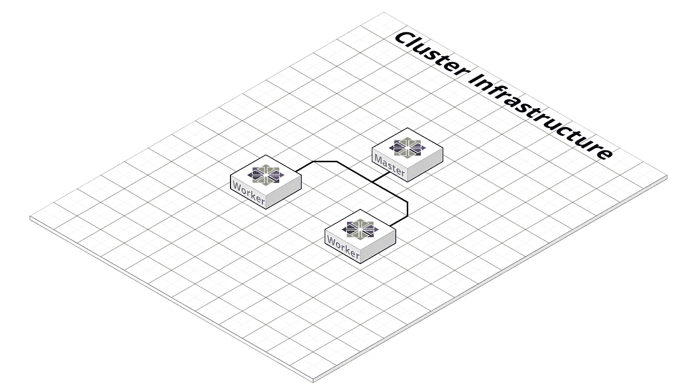
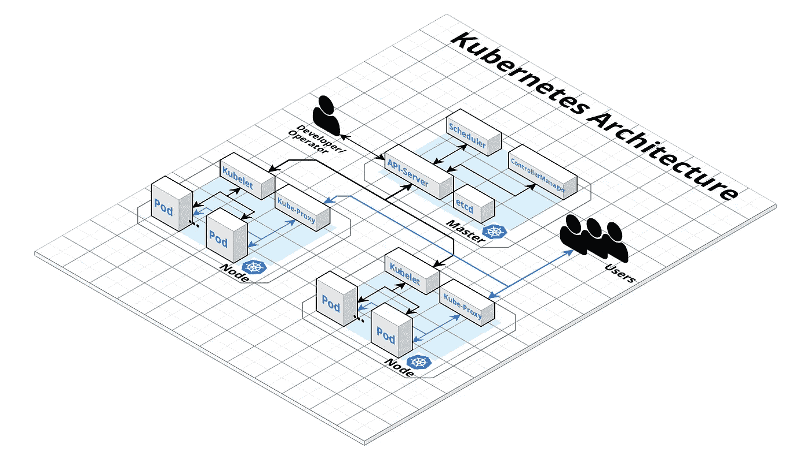
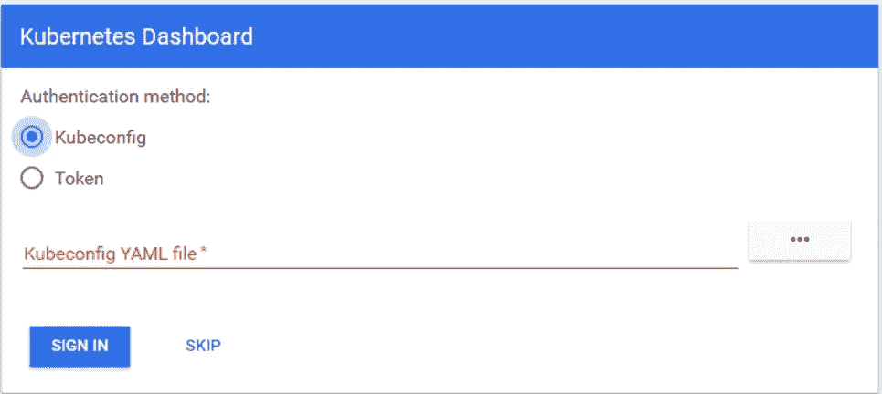

# 使用 Kubespray 在 OpenStack 上部署 Kubernetes 集群

> 原文：<https://itnext.io/deploy-a-kubernetes-cluster-on-openstack-using-kubespray-39b230b13d62?source=collection_archive---------2----------------------->


照片由[阿尔宾柏林](https://www.pexels.com/@albinberlin?utm_content=attributionCopyText&utm_medium=referral&utm_source=pexels)从[派克斯](https://www.pexels.com/photo/black-sail-ship-on-body-of-water-906982/?utm_content=attributionCopyText&utm_medium=referral&utm_source=pexels)拍摄

Kubernetes 已经迅速成为部署、扩展和管理容器应用程序的开源标准解决方案。它提供了高度的灵活性和多功能性。但是什么导致了一个大而强大的文档，这可能是压倒一个或另一个，当试图找到他的安装的相关部分。这就是为什么 Kubernetes 有一个陡峭的学习曲线。在群集规划之后，接着是安装，这也有其缺陷。出于这个原因，有一些部署工具，比如 [Kubespray](https://github.com/kubernetes-sigs/kubespray) ，可以让这项工作变得更加容易。这个故事是关于在 OpenStack 云(Open Telekom Cloud)上使用 Kubespray 自动部署 Kubernetes 集群的。

Kubespray 用于 Kubernetes 的自动部署，它是一个供应、配置和应用程序部署工具 Ansible。Kubespray 还提供了一个库，用于在不同的云平台上提供资源。为此，使用基础设施作为代码工具 Terraform。Kubespray 项目目前为云提供商 AWS、OpenStack 和 Packet 提供 [Terraform 支持](https://github.com/kubernetes-sigs/kubespray/tree/master/contrib/terraform)。这个工具与 [OpenStack 库](https://github.com/kubernetes-sigs/kubespray/tree/master/contrib/terraform/openstack)一起用于提供这个故事中的基础设施。

# 要求

首先，我们看一下部署的先决条件。这些分为 Kubespray 和 provider 库的需求。

Kubespray 需要以下组件:

*   *Python 2.7(或更新版本)*
*   *Ansible 2.7(或更新版本)*
*   *Jinja 2.9(或更新版本)*

OpenStack 提供程序库要求:

*   *Terraform 0.11(或更新版本)*

要安装 Terraform，需要从[哈希公司网站](https://www.terraform.io/downloads.html)下载合适的软件包。打开包装。然后，解包二进制文件的路径必须存储在 path 变量中。使用命令“terraform”，您可以测试安装是否成功。更多信息可在以下[链接](https://learn.hashicorp.com/terraform/getting-started/install.html)下找到。

根据操作系统的不同，只需几个命令就可以安装 Ansible。请参考以下 Ansible [文档](https://docs.ansible.com/ansible/latest/installation_guide/intro_installation.html)。在这个故事中，我使用了 Ubuntu，Ansible 的安装如下。

```
sudo apt update
sudo apt install ansible
```

之后，必须安装库贝斯雷的依赖项。这是通过以下命令完成的。首先需要克隆存储库。

```
git clone [https://github.com/kubernetes-sigs/kubespray](https://github.com/kubernetes-sigs/kubespray)
sudo pip install -r requirements.txt
```

要使用开放电信云，有必要使用主目录中的`.ostackrc`设置您的访问数据，并加载环境变量。

# 集群规划

由于其高度灵活性，Kubernetes 提供了多种可能性来使集群适应您自己的需求。对众多可能性的考虑并不是这个故事的一部分。但可在 Kubernetes 文档中的— [从头创建自定义集群](https://kubernetes.io/docs/setup/scratch/)下阅读。对于示例性部署，我们将创建一个由一个主节点和两个工作节点组成的集群，etcd 也运行在主节点上。同样，群集将没有浮动 IP，因此无法从 Internet 访问。

另一个选择是 CNI(集装箱网络接口)。有几种可供选择(纤毛、印花布、法兰绒、编织网等)。对于我们的例子，我们使用法兰绒，这是现成的。Calico 也是一种可能，只需要配置 [OpenStack 中子端口](https://github.com/kubernetes-sigs/kubespray/blob/master/docs/openstack.md)即可实现服务和吊舱子网。

为了在部署后使用 Kubernetes 仪表板控制集群，我们还将安装它。

# 设置群集配置

以下命令必须在存储库目录中执行，因此用一个有意义的名称填充变量$CLUSTER 是很重要的。

```
cp -LRp contrib/terraform/openstack/sample-inventory \
inventory/$CLUSTER
cd inventory/$CLUSTER
ln -s ../../contrib/terraform/openstack/hosts
ln -s ../../contrib
```

运行命令后，有必要编辑`inventory/$CLUSTER/cluster.tfvars`文件。

[罗伯特·纽曼](https://medium.com/@Robert.N)要点

变量的描述可以在下面的[链接](https://github.com/kubernetes-sigs/kubespray/tree/master/contrib/terraform/openstack)中找到。对于这个例子，我们将创建一个包含一个 Kubernetes 主节点和两个 worker 节点的集群。他们将基于最新的 CentOS 7 和“s2.exlarge.4”风格。etcd 也将安装在主设备上。

# 基础设施部署

现在，我们已经准备好使用 Terraform 部署我们的集群基础设施。为了更好地了解情况，下图显示了部署后的情况。这个会在故事过程中延伸。



罗伯特·诺依曼[拍摄的图片](https://medium.com/@Robert.N)

要启动 Terraform 部署，请转到`inventory/$CLUSTER/`目录并运行以下命令。首先，我们需要安装所需的插件。这将通过`init`参数和插件的路径来完成。

```
terraform init ../../contrib/terraform/openstack
```

这可真够快的。在这个阶段，Terraform 已经准备好部署基础设施。这可以通过`apply`论证来实现。

```
terraform apply -var-file=cluster.tfvars ../../contrib/terraform/openstack
```

几秒钟后，Terraform 应该显示如下结果，并且实例是可访问的。

```
Apply complete! Resources: 3 added, 0 changed, 0 destroyed.
```

要检查服务器是否可以访问，可以执行下面的 Ansible 命令。在此之前，我们必须切换到存储库的根文件夹。

```
$ ansible -i inventory/$CLUSTER/hosts -m ping all
example-k8s_node-1 | SUCCESS => {
    "changed": false,
    "ping": "pong"
}
example-etcd-1 | SUCCESS => {
    "changed": false,
    "ping": "pong"
}
example-k8s-master-1 | SUCCESS => {
    "changed": false,
    "ping": "pong"
}
```

# Kubernetes 集群部署

基础设施已经部署，下一步是安装 Kubernetes 集群。首先，我们需要配置集群变量。其中一个文件是`inventory/$CLUSTER/group_vars/all/all.yml`。该文件中的重要内容是将`cloud_provider`设置为“openstack ”,并将`bin_dir`设置为二进制文件将要安装的路径。对于示例集群，我们使用以下配置。

罗伯特·诺依曼的要旨

接下来，我们需要配置`inventory/$CLUSTER/group_vars/k8s-cluster/k8s-cluster.yml`文件。将`kube_network_plugin`变量编辑为法兰绒或印花布(需要配置 [OpenStack 中子端口](https://github.com/kubernetes-sigs/kubespray/blob/master/docs/openstack.md))。在我们的例子中，我们使用现成的法兰绒。我们还配置了变量`resolvconf_mode`，我们将使用“docker_dns”。通过这个值，Kubespray 将设置 [docker 守护进程标志](https://github.com/kubernetes-sigs/kubespray/blob/master/docs/dns-stack.md#resolvconf_mode)。我们的集群的配置示例如下所示。

要旨由[罗伯特·诺依曼](https://medium.com/@Robert.N)

最后，我们需要编辑`inventory/$CLUSTER/group_vars/k8s-cluster/addons.yml`，通过将变量`dashboard_enabled`设置为“true”来启用仪表板安装。您可以使用下面的配置示例。

罗伯特·诺依曼的要旨

在配置编辑之后，我们需要通过下面的命令使用配置的参数运行 Ansible-Playbook。

```
ansible-playbook --become -i inventory/$CLUSTER/hosts cluster.yml
```

Ansible 经过几个步骤，如果所有步骤都成功，您的集群看起来如下图所示。



图片由[罗伯特·诺依曼](https://medium.com/@Robert.N)

# 测试

为了测试您的集群，您必须登录到 Kubernetes 主服务器，切换到根用户并使用 kubectl 工具通过`kubectl cluster-info` 命令获取集群信息。它将显示集群中主服务器和服务的端点信息。如果您的集群看起来不错，您需要通过以下命令创建一个 Kubernetes 仪表板用户。

```
# Create service account
kubectl create serviceaccount cluster-admin-dashboard-sa

# Bind ClusterAdmin role to the service account
kubectl create clusterrolebinding cluster-admin-dashboard-sa \
  --clusterrole=cluster-admin \
  --serviceaccount=default:cluster-admin-dashboard-sa

# Parse the token
kubectl describe secret $(kubectl -n kube-system get secret | awk '/^cluster-admin-dashboard-sa-token-/{print $1}') | awk '$1=="token:"{print $2}'
```

使用令牌，现在可以登录到控制面板。但是首先您需要创建一个到 Kubernetes 主服务器的隧道，因为仪表板仍然在端口 8001 对本地主机开放。之后，您可以在 URL `localhost:8001`下访问仪表板。现在，您可以使用您的令牌登录，方法是选择“令牌”并输入它。



罗伯特·诺依曼拍摄的图片

现在我们已经准备好使用 Kubernetes 集群了。本教程展示了在 OpenStack 云上部署 Kubernetes 集群是多么容易，以及如何维护它。