# 使用 Rancher 在 Amazon EC2 中部署带有集群监控的 Kubernetes 集群

> 原文：<https://itnext.io/deploy-a-kubernetes-cluster-with-cluster-monitoring-in-amazon-ec2-using-rancher-6f6c475dba7f?source=collection_archive---------2----------------------->

## 初学者指南

## 在不到 10 分钟的时间内启动并运行启用了集群监控的 Kubernetes 集群

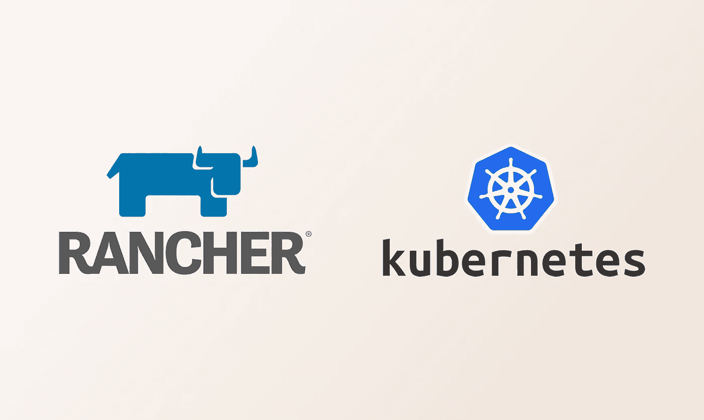

# 介绍

部署 Kubernetes 集群有多种方式，例如，kops、kubeadm、RKE、EKS 和 minikube。但是所有这些部署工具通常都涉及配置文件，并且只能通过命令行界面进行部署。

事实上，有一种更简单的方法来部署 Kubernetes 集群，即使用一个更友好的 GUI 工具 Rancher。Rancher 是一个开源的多集群 Kubernetes 管理软件，它在部署和管理 Kubernetes 集群时提供了一个 web 界面。

# 部署牧场主

在开始创建 Kubernetes 集群之前，我们首先需要部署 Rancher。出于演示目的，我们只需要创建一个 Rancher 节点。然而，在生产中，建议部署至少 3 个 Rancher 节点来实现高可用性(是的，Rancher 确实支持它)。

登录 Amazon EC2，创建一个 T3 中型 Ubuntu 18.04 虚拟机。确保您让端口 80 和 443 保持打开，以便我们稍后可以访问它的 web 界面。安装 docker，并运行以下命令来安装 Rancher。

```
docker run -d --restart=unless-stopped \
    -v /opt/rancher:/var/lib/rancher   
    -p 80:80 -p 443:443 \   
    rancher/rancher:latest \   
    --acme-domain <REPLACE YOUR DOMAIN NAME>
```

Rancher 内置了对 Let's Encrypt 的支持。我们可以将我们的域指向 Rancher VM，让 Rancher 为我们请求一个加密 HTTPS 证书。

如果您喜欢使用自己的证书，只需删除上面命令的最后一行。(更多安装配置见[牧场主文档](https://rancher.com/docs/rancher/v2.x/en/installation/single-node/)

# 牧场主 Web 用户界面

一个 Rancher 准备好了，我们就可以通过访问我们的域来访问 Rancher 的 web UI。设置管理员密码后，我们可以开始部署 Kubernetes 集群。

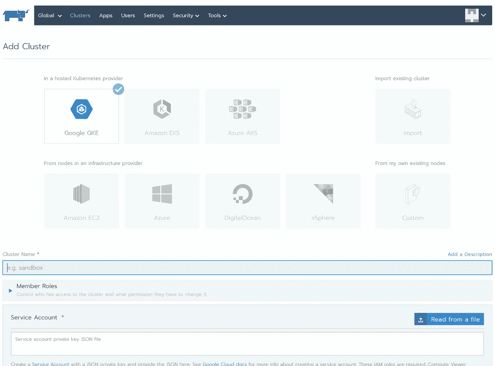

Racher Web UI —部署集群视图

Rancher 支持不同的提供商，包括谷歌 GKE、亚马逊 EKS、Azure AKS、亚马逊 EC2 和 DigitalOcean。在这个演示中，我们将使用 Amazon EC2。

# 了解 Rancher 如何使用 EC2 部署集群

## 节点模板

节点模板是用于配置群集的节点的配置。这些模板使用 Docker 机器配置选项来定义节点的操作系统映像和设置/参数。例如，节点将部署到的可用性区域、VPC 和子网、其安全组、实例类型、磁盘大小和 IAM 配置文件。

## 节点池

节点池是基于节点模板的节点集合。Rancher、Etcd、控制平面和 Worker 中有三个节点角色。

对于 Etcd 节点角色，为了维护 Etcd 仲裁，所需的节点数量为 1、3 或 5。至于控制平面和工作节点角色，只需要 1 个或更多节点。

每个节点池可以分配一个或多个节点角色，这意味着我们实际上可以创建一个用于沙盒目的的单节点 Kubernetes 集群。(显然，在生产中不推荐)

## AWS 云提供商

云提供商提供 Kubernetes 和 AWS 服务 API 之间的接口。

因为我们希望我们的 Kubernetes 集群将 Amazon 注册为云提供商(这样我们就可以使用 ELB、附加 EBS 等)，所以我们需要指定一个 IAM 实例配置文件。如果您没有，这里有一个示例策略:

# 部署 Kubernetes 集群

## 1.创建节点模板

命名我们的集群并设置节点池。创建一个节点模板来定义实例的类型及其网络配置。一旦您提供了 AWS 凭证，Rancher 将自动获取区域 VPC 和子网。

有一点要注意的是，没有自动 VPC 创建，我们将需要手动创建和维护亚马逊控制台中的 VPC。

接下来，在安全组中，我们可以让 Rancher 为我们创建一个。如果您喜欢创建自己的安全组，请查阅关于 ports 需求的牧场主文档。

然后，在实例设置中，调整实例类型和实例存储。如果您正在将节点部署到私有子网，记得启用*“仅使用私有 IP 地址”*选项。

我们不建议使用 spot 实例，因为 Rancher 不会自动清空和重新部署开箱即用的节点。似乎有一个头盔包来解决这个问题，但我们没有尝试过。

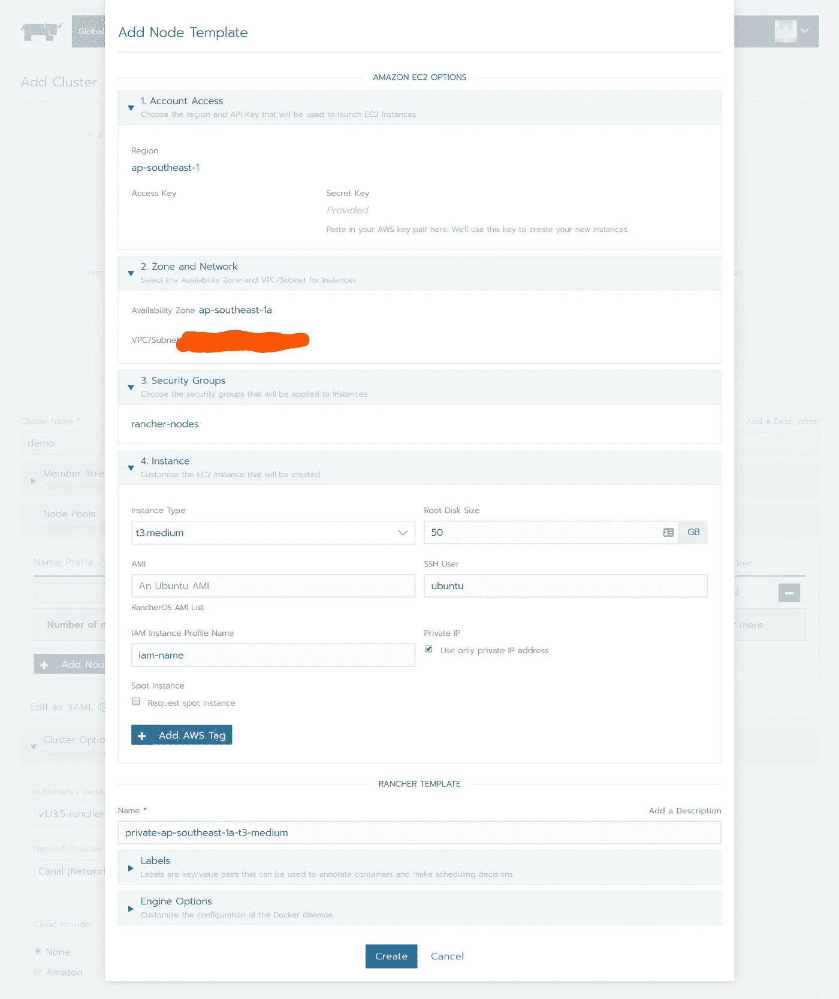

您可以为不同的集群组创建多个节点模板，例如 T3 中型用于 Etc，M5 大型用于 Worker

## 2.指定节点池及其角色

在本演示中，我们将创建以下两个节点池:

*   Rancher-master:用于 Etcd 和控制平面角色(使用单个 m5 大型实例)
*   牧场主-工人:用于工人角色(使用 3 个 T3-中型实例)

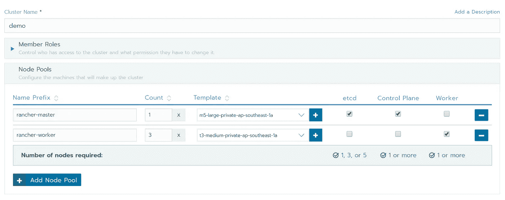

将角色和节点模板分配给节点池

## 3.编辑群集选项

确保我们运行的是 Kubernetes 的最新稳定版本(在撰写本文时，它是 v . 1.13–5 rancher 1–2)。使用 Canal 作为网络提供商，选择 Amazon 作为云提供商。

点击位于右侧的*“显示高级选项*”链接，并检查高级集群选项。默认情况下，Rancher 帮助我们部署使用节点端口服务 Nginx 入口。如果您计划部署 elb，请禁用它。

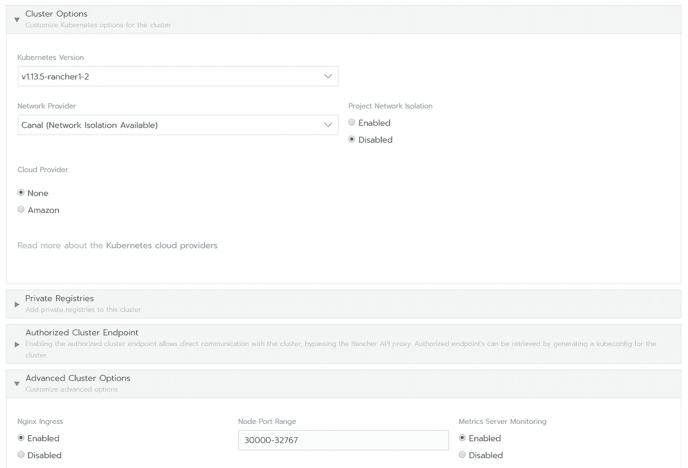

## 4.创建并等待

检查一切是否正确，然后单击 create。Rancher 将在不到 10 分钟的时间内开始供应实例并引导我们的集群。

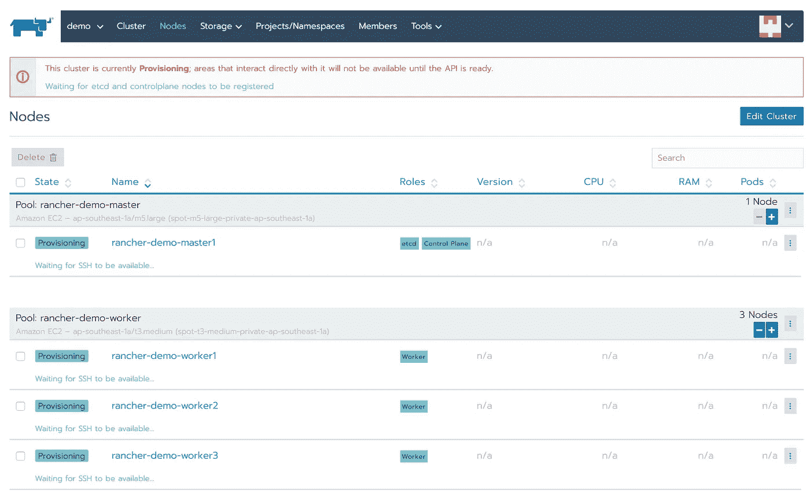

牧场主提供新节点

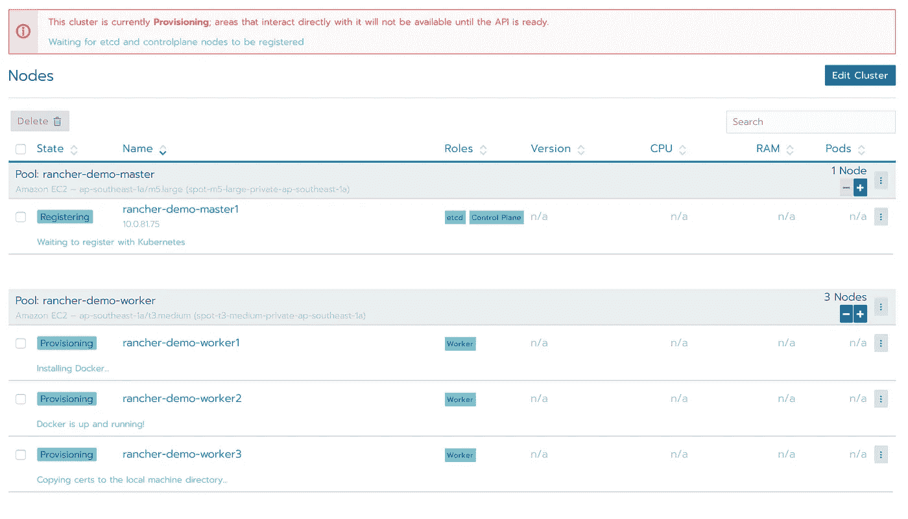

一些节点已经准备好，等待向 Kubernetes 注册


我们的 Kubernetes 主人准备好了

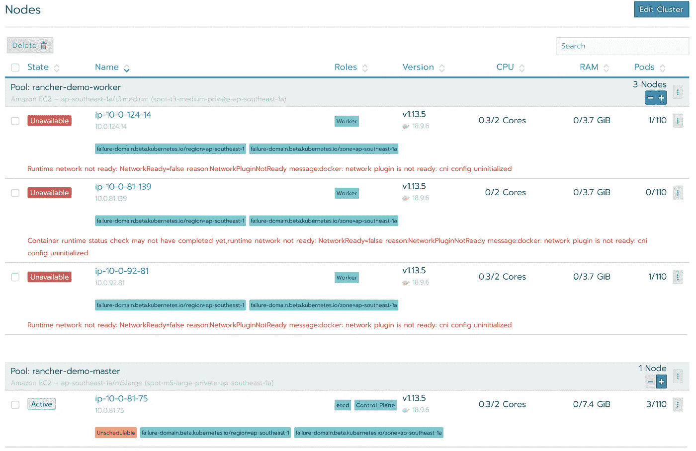

我们的工人节点在 Kubernetes 注册，现在是 bootstrapping nodes 网络

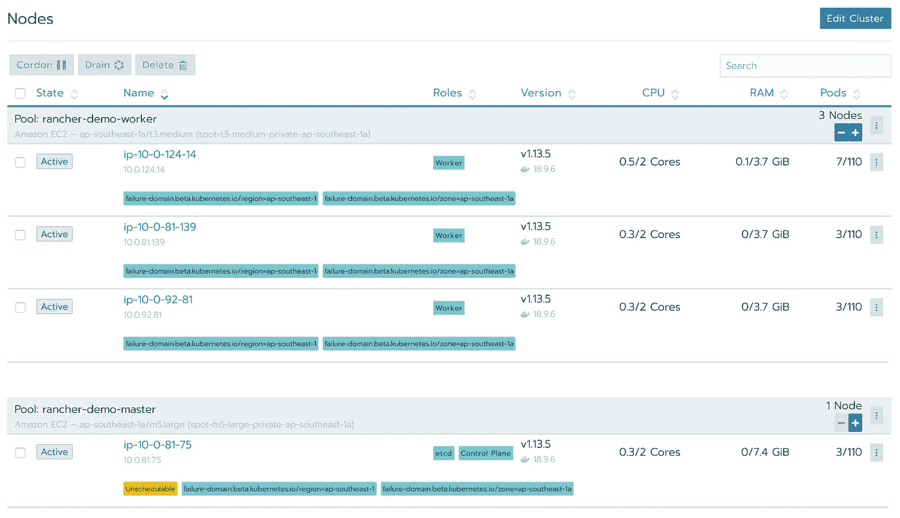

我们的集群准备好了！

# 使用 Kubectl 连接到我们的集群

现在我们的 Kubernetes 集群已经准备好了，我们可以使用 Kubectl 连接到它。单击 kubeconfig 文件按钮，为我们的集群下载 kubeconfig。

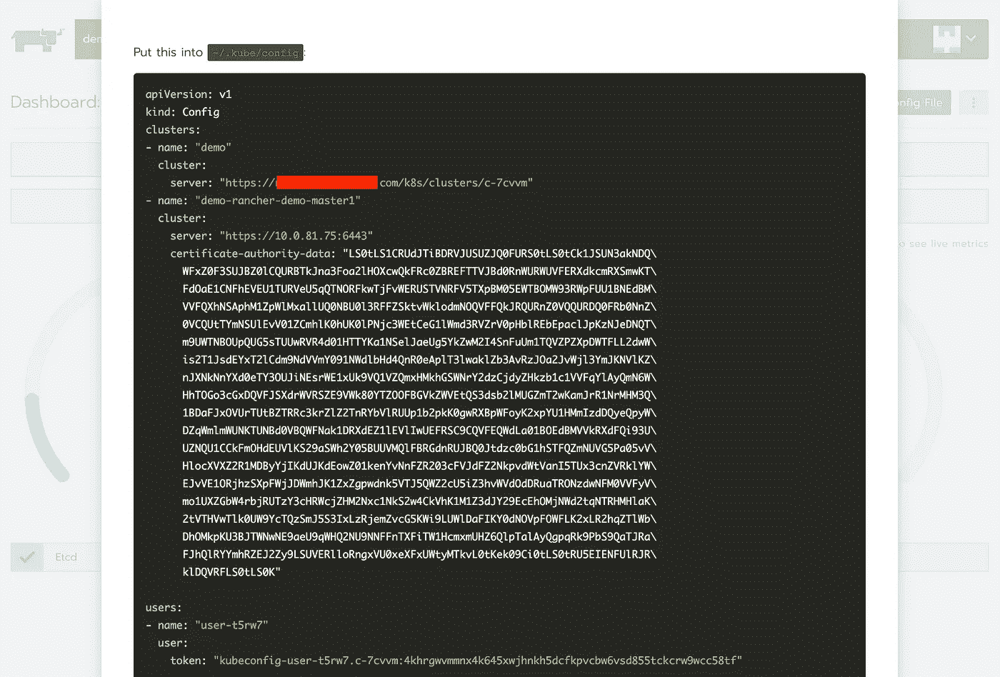

我们还可以通过 Rancher Web UI 访问 Kubectl。

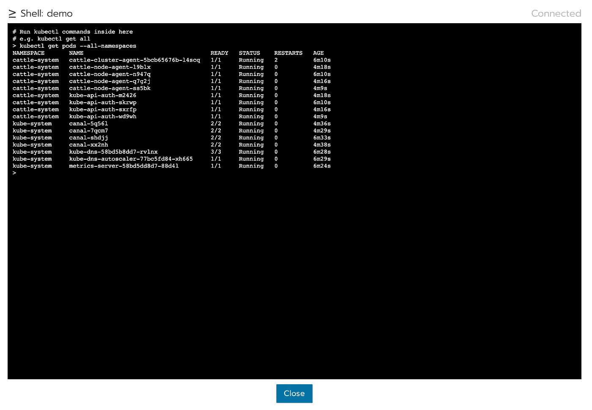

# 启用集群监控

Rancher 内置了集群监控功能。我们可以在 Rancher Cluster 仪表板中启用它。单击“启用监控以查看实时指标”并启用监控。


牧场主仪表盘

我们可以调整许多选项，例如 Prometheus 的数据保留，Prometheus 和 Grafana 是否使用永久存储，以及它们的内存和 CPU 请求和限制。

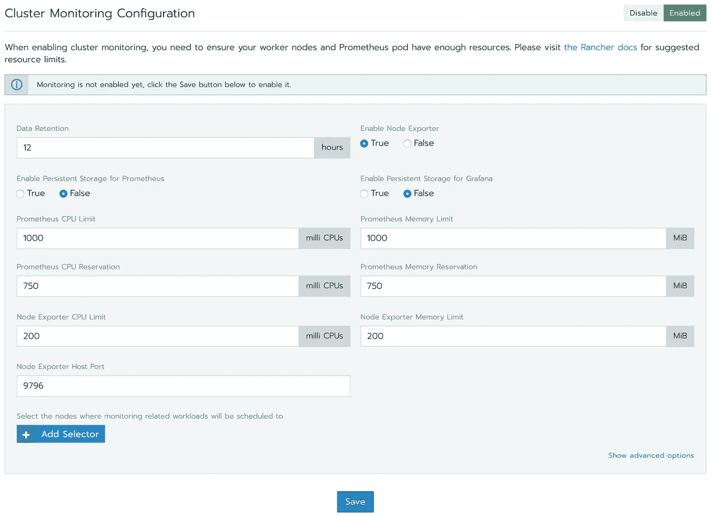

启用集群监控需要几分钟时间，我们可以使用 Kubectl 或在 Rancher Workloads Dashboard 中监控部署过程。

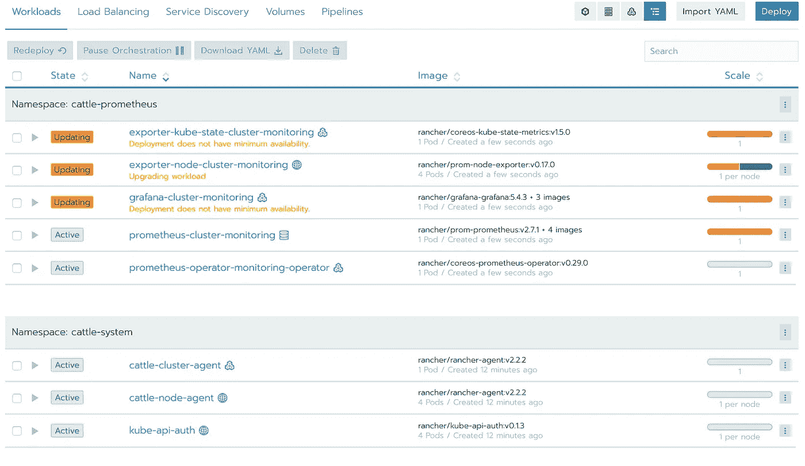

部署普罗米修斯和格拉夫纳

部署完成后，我们可以看到集群、节点、部署和单元的实时指标。如果您看不到所有节点的节点指标，请确保您的节点安全组允许访问端口 9796。


牧场主集群仪表板中的实时指标

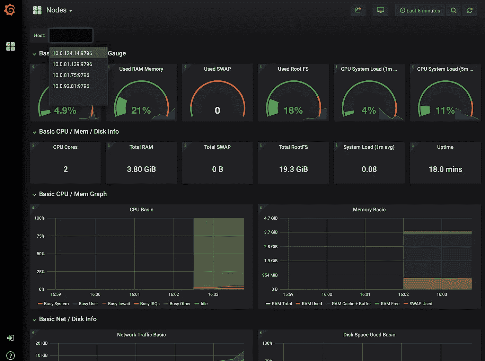

Grafana 中的节点度量

# 结论

Rancher 很容易部署带有集群监控的 Kuernetes 集群。不限于亚马逊 EC2，它还允许我们将集群部署到 DigitalOcean、Google 云平台、Azure、Linode、Packet、Openstack 和 vShpere。

它不仅是一个 Kubernetes 部署工具，还是一个监控和管理 Kubernetes 工作负载的强大工具。它可以取代 Kubernetes 仪表板，并内置了对基于角色的访问控制的支持。

我们希望在 Rancher 中看到的一件事是支持集群自动伸缩和 spot 实例自动排出。对于那些感兴趣的人，有一个关于这个的 Github 问题。

总之，在过去的几个月里，我们已经和 Rancher 一起运行了一个生产 Kubernetes 集群。总的来说，我们认为就 Kubernetes 部署和工作负载管理而言，这是目前为止对[我们的团队](https://www.hyperair.com/en-US)来说最好的工具。