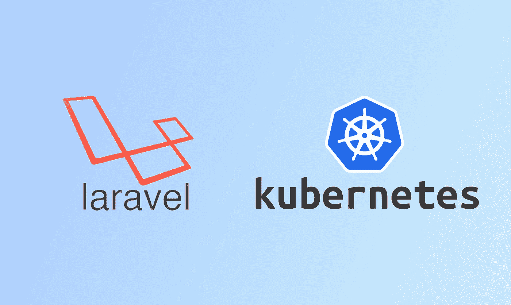
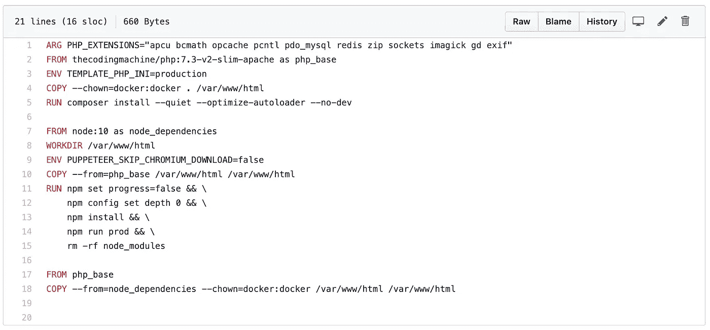
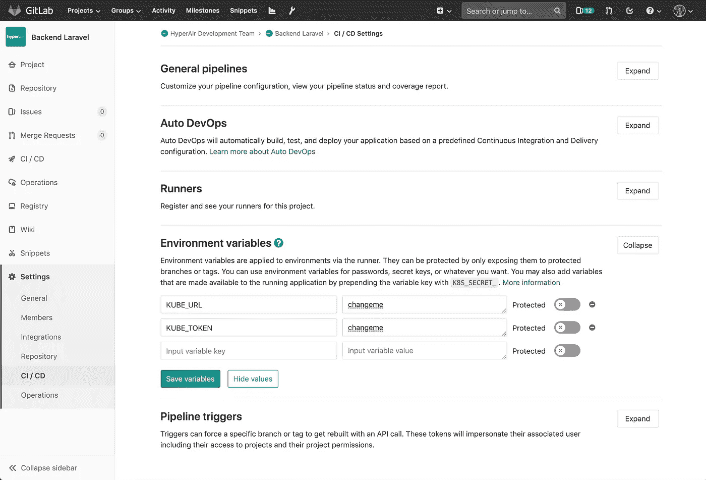
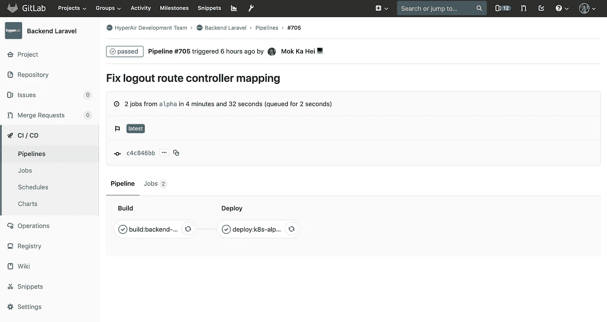

# 使用 Gitlab CI 将 Laravel 应用程序部署到 Kubernetes

> 原文：<https://itnext.io/deploy-a-laravel-application-to-kubernetes-using-gitlab-ci-2538a6bbd373?source=collection_archive---------2----------------------->

## 初学者指南

## CI/CD 的快乐。推送您的代码，等待 4 分钟，它会自动部署，无需停机。



# 先决条件

本文假设您对 Docker 和 Kubernetes、Gitlab CI 有基本的了解，并且已经建立了一个 Kubernetes 集群。

# 启动一个 Laravel 项目

你首先需要一个 Laravel 应用程序，使用 composer 启动一个新项目。

```
composer create-project --prefer-dist laravel/laravel blog
```

# 将你的 Laravel 项目归档

有很多方法可以将你的 Laravel 项目归档。你可以使用 dockerhub 的官方 Nginx 和 PHP 图片，但是我发现设置它们有点麻烦。

因此，我没有使用各种不同的 docker 图像，而是使用了一组现成的 docker 图像，即[the coding machine](https://github.com/thecodingmachine)/[docker-images-PHP](https://github.com/thecodingmachine/docker-images-php)。

为了构建一个生产就绪的映像，我们将使用`thecodingmachine/php:7.3-v2-slim-apache`作为我们的基础映像。docker 文件如下所示:



稍后我们将配置 Gitlab CI 来自动构建 docker 映像。

# 创建 Kubernetes 部署文件

这里是部署 Laravel 应用程序所需的所有 yaml 文件。

## 部署

我们的 deployment.yaml 实际上包含两个部署。一个用于我们的主 Laravel 应用程序，另一个用于 Laravel Horizon。如果您不打算使用 Horizon，只需将其删除即可。

有一个 init 容器来优化配置和路由加载。为了在 init 容器和 app 容器之间共享应用程序代码，它使用了一个 emptyDir。

还有一个 affinity 设置，告诉 Kubernetes 尽最大努力在不同节点之间调度 pod，以避免停机。

## 克朗乔布

我们使用 cronjob.yaml，它利用 Kubernete 的 cronjob 每分钟运行一次`php artisan schedule:run`。我们觉得这是一种更健壮的调度 cron 的方式，通过微调`activeDeadlineSeconds`、`backoffLimit`和`startingDeadlingSeconds`来确保我们的 cron 得到调度。

## 配置映射，入口和服务

我们的 ingress.yaml 和 service.yaml 相当标准，我们使用 CloudFlare DNS 验证从 Let's Encrypt 获取 HTTPS 证书(有评论)。

至于 configmap，建议使用 secret 来存储数据库密码等敏感信息。

这里有一个 GitHub 回购，如果你想克隆它。合并请求也是赞赏的！

[](https://github.com/mkhmylife/laravel-k8s) [## mkhmylife/laravel-k8s

### 在 GitHub 上创建一个帐户，为 mkhmylife/laravel-k8s 的开发做出贡献。

github.com](https://github.com/mkhmylife/laravel-k8s) 

# 设置 Gitlab 配置项

现在我们已经准备好了我们的应用程序和 kubernetes 配置，我们可以继续设置 Gitlab CI 来自动化我们的部署。(我们假设您正在使用 Kubernetes 令牌认证)

## 设置 CI/CD 环境变量

在 Repo > Settings > CI / CD 中，我们需要将 Kubernetes 集群凭证存储到 Gitlab CI 的环境变量中。



将`Dockerfile`移动到项目的根目录，然后创建一个名为`k8`的文件夹，并将所有的 kubernetes yaml 文件存储在其中。创建一个名为`.gitlab-ci.yml`的文件，包含以下内容:

CI/CD 脚本包含两个步骤。首先是构建我们的 Laravel 应用程序并推送到 Amazon ECR(您可以根据自己的喜好将其配置到另一个 Docker 图像报告)。然后，它继续将我们的 Laravel 应用程序映像部署到我们的 Kubernetes 集群。

在第 36 和 37 行中，`$KUBE_URL`和`$KUBE_TOKEN`是我们上面设置的两个环境变量。

在第 40 行，我们要求 kubectl 应用我们的 k8s 配置文件。

在第 41 行，这是一个黑客触发吊舱重新部署。由于我们已经将`imagePullPolicy`设置为`always`，Kubernetes 会自动将我们的 docker 图像重新拉到最新版本。结合我们部署的滚动更新策略，部署更新中应该没有停机时间。

在生产中，我们实际上使用 [Kustomize](https://github.com/kubernetes-sigs/kustomize) 来维护多个 Git 分支和环境的部署。但是我们正在寻找切换到头盔，因为它似乎是一个更容易和更受欢迎的部署方法。



CI/CD 的快乐。推送您的代码，等待 4 分钟，它会自动部署，无需停机。

就是这样！CI/CD 的快乐。只需推送您的代码，等待 4 分钟，它就会自动部署到[https://www.hyperair.com/en-US](https://www.hyperair.com/en-US)，无需停机。