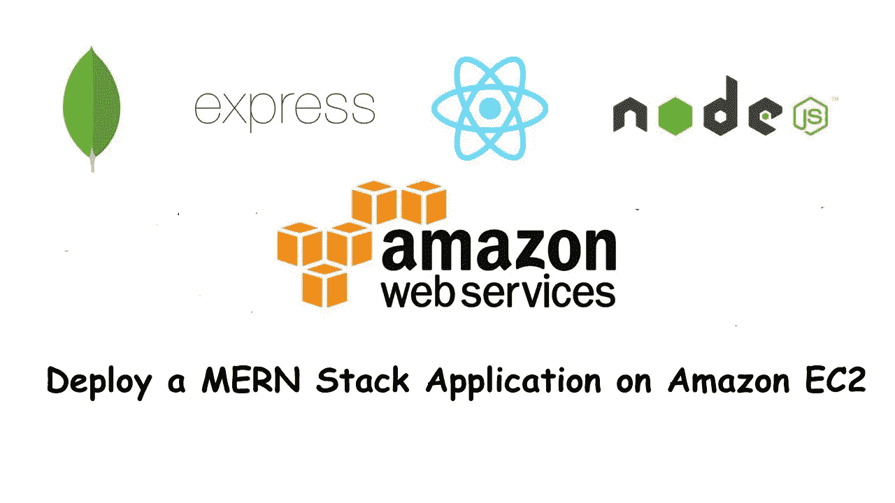
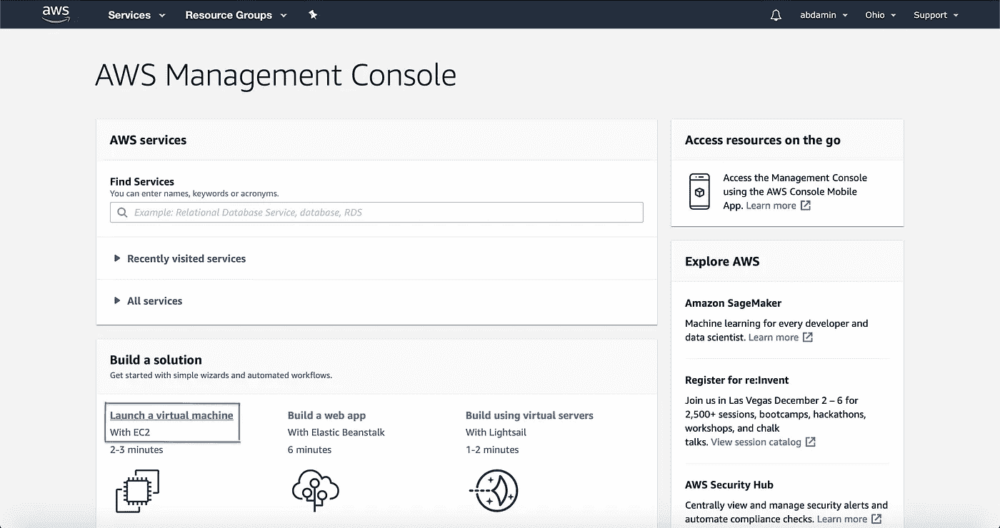
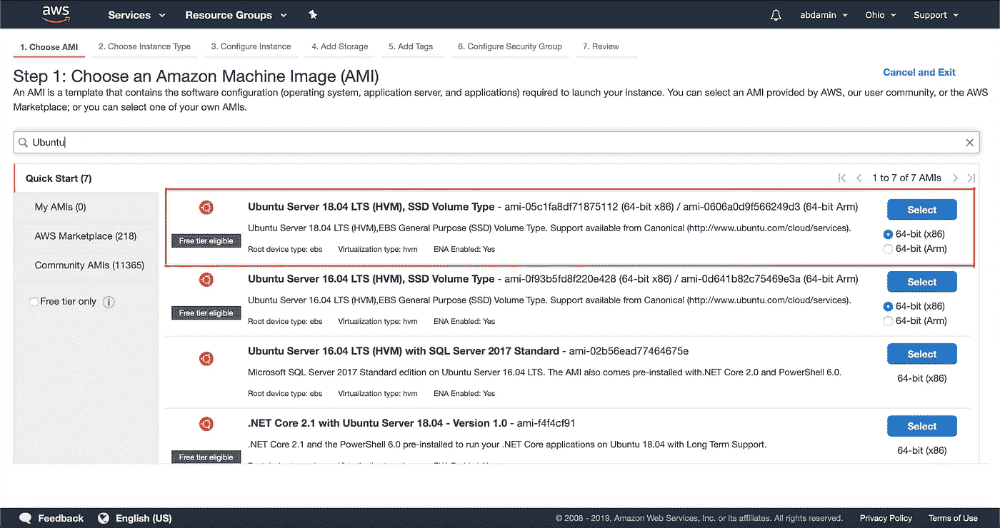
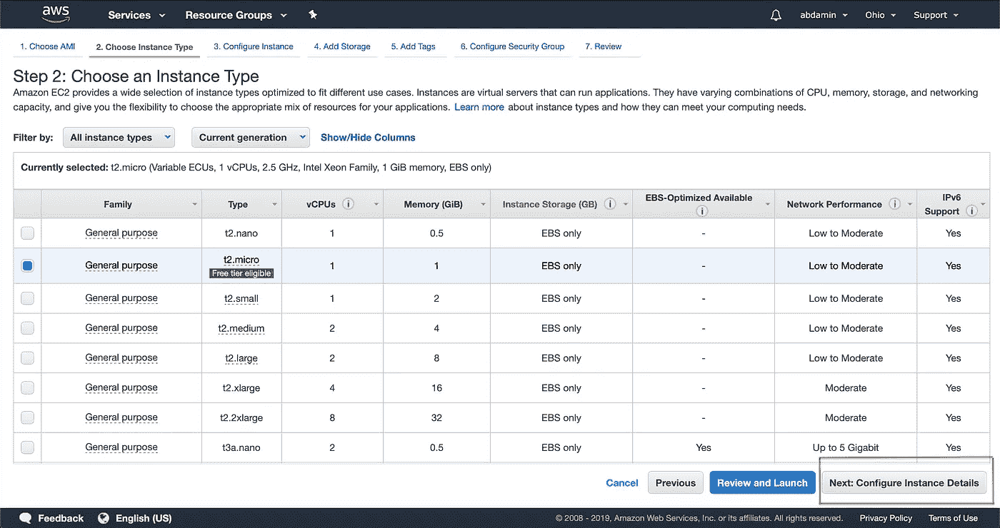
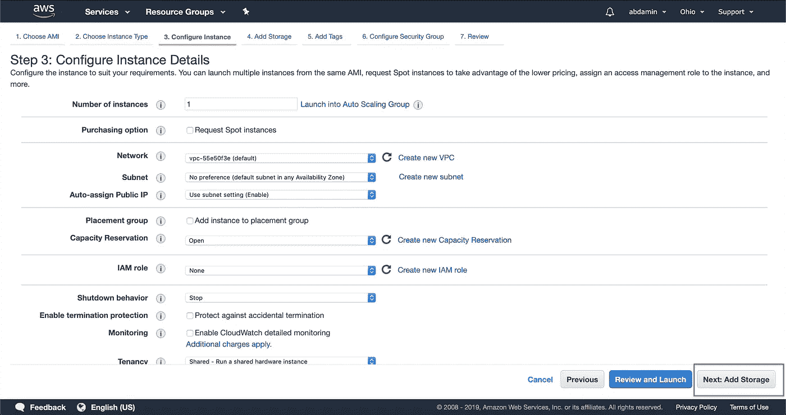
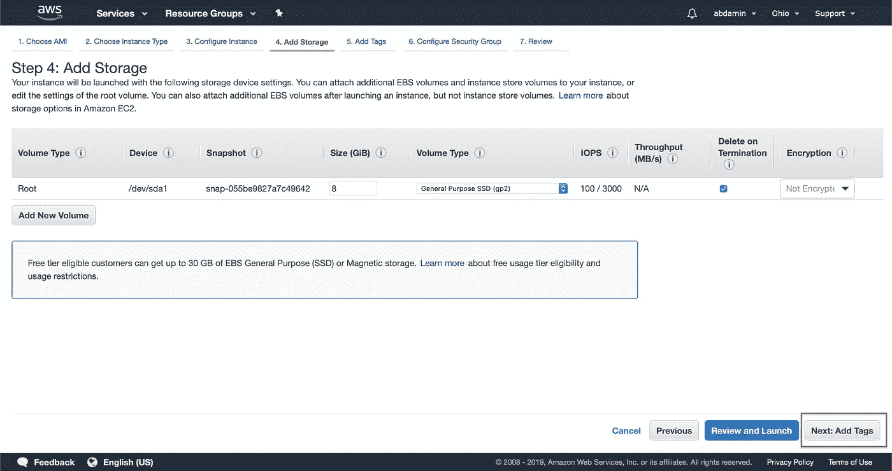
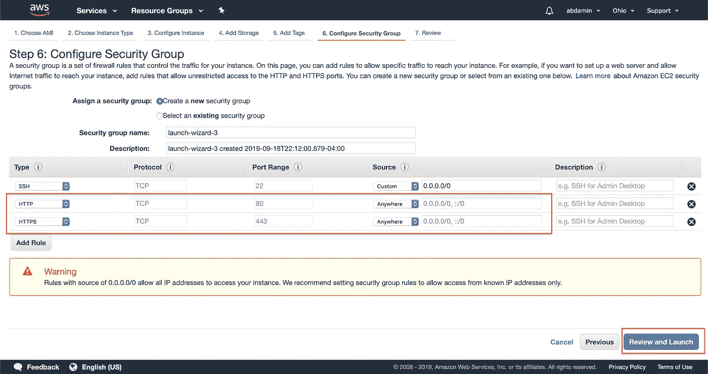
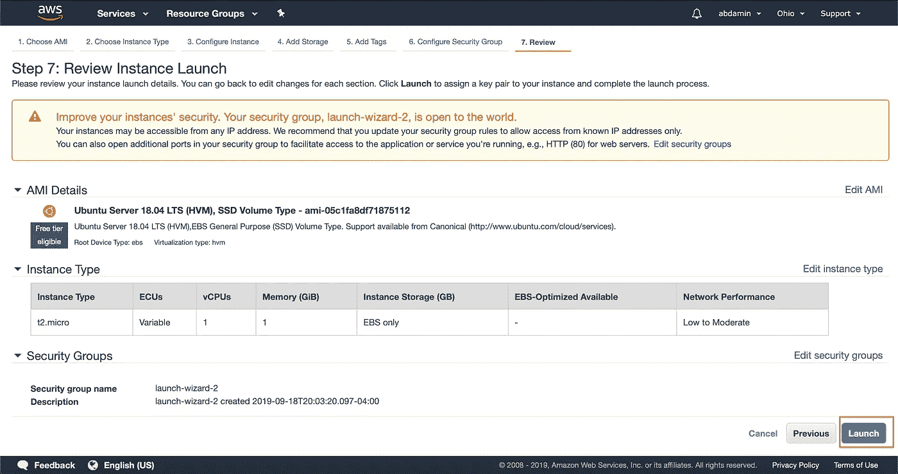
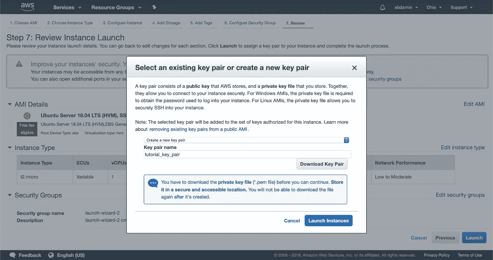

# 在 AWS EC2 上部署一个 MongoDB、ExpressJS、ReactJS、NodeJS (MERN 堆栈)Web 应用程序

> 原文：<https://itnext.io/deploy-a-mongodb-expressjs-reactjs-nodejs-mern-stack-web-application-on-aws-ec2-2a0d8199a682?source=collection_archive---------1----------------------->



对于许多开发人员来说，在 AWS 上部署全栈 Web 应用程序一直是个问题。我的许多大学同学分享了他们在尝试将他们的 Web 应用程序部署到 Amazon Web Services (AWS)时的永无止境的可怕经历。与 Heroku 不同，在 Heroku 中，舞台已经为您搭建好了，您只需将您的本地 Git Repo 推送到 Heroku，AWS 是一种基础设施即服务。换句话说，AWS 要求您手动配置和维护虚拟化服务器。您还必须添加数据库实例；选择并设置操作系统；并设置一个负载平衡器，将负载分散到多个应用服务器上。除此之外，您还必须选择满足应用需求的 CPU、RAM 和存储容量。这听起来确实很复杂，但是我们将详细介绍每一个步骤。我们开始吧！

# 在部署之前设置您的项目

## 从 React 代码中删除 Redux 开发工具

由于我们使用 React 作为我们的前端，您可能一直在使用 Redux Dev Tools Chrome 扩展。不幸的是，只有开发工具浏览器扩展的人才能使用你的应用程序。因此，您可能需要考虑删除或注释掉前端代码中集成 Redux Dev Tools 扩展的部分，以便人们能够使用您的应用程序。

## 执行 React 应用程序的生产构建

当在项目目录中时，在终端中键入以下内容，以执行 React 应用程序的生产构建，

(注意**客户端**在这里是 React 项目目录的名称。如果你的 React 项目文件夹不是以**客户端**命名的，确保你的 **cd** 进入那个目录，而不是**客户端**目录)

```
cd clientnpm run build
```

## 设置您的节点后端来服务您的静态资产

确保在所有其他路由配置如下之后，您正在为您的 **server.js** 中的 client/build 文件夹中的 React**index.html**文件提供服务，

```
**Some imports .... ***const* path = require(“path”);................ 
Other Routes and Code...
...............(Add below code after all other routes)//Serve Static Assets in production //set static folderapp.use(express.static(“client/build”));app.get(“*”, (*req*, *res*) *=>* {res.sendFile(path.resolve(__dirname, “client”, “build”, “index.html”));});..........
More Code.....
..........
```

# **创建您的 AWS EC2 实例**

**步骤 1** —转到您的[亚马逊 Web 服务管理控制台](https://us-east-2.console.aws.amazon.com/console/home?region=us-east-2#)并选择**使用 EC2** 启动虚拟机



步骤 2 —配置您的实例并启动您的实例

在这一步，你要做的就是

*   选择 AMI(**Ubuntu Server 18.04 LTS(HVM)**)



*   选择一个实例类型(在我们的例子中是 **t2.micro** )
*   **暂不审核推出！**
*   选择**下一步:配置实例详细信息**



*   选择**下一步:添加存储**



*   选择**下一步:添加标签**



*   选择**下一步:配置安全组**

在这里，您必须添加另外两个规则。

您会看到已经为您配置了 **SSH** 规则。

选择**添加规则**，输入类型为 **HTTP，**端口范围为 **80** ，源为 **Anywhere。**

重复此过程，类型为 **HTTPS，**端口范围为 **443** ，来源为**任何地方**。

选择**查看并启动**，然后选择**启动**。



系统将询问您有关密钥对的信息。选择**新建一对**并命名您的密钥对。请确保下载。pem 密钥对文件，选择**启动。**您已经成功启动了您的 AWS EC2 实例！



# 连接到您的 EC2 实例

选择**查看实例**。选择您新启动的实例并选择**连接。**按照屏幕上出现的说明，从您的终端使用**嘘**连接到您的 EC2 实例。


使用您的终端将**光盘**导入到包含**的目录中。pem** 密钥对文件。

您需要修改您的**权限。pem** 文件。在您的终端中键入以下命令，

```
chmod 400 ./YOUR_KEY_PAIR_NAME.pem
```

然后您可以使用以下命令将 **SSH** 引入 EC2 实例的 Ubuntu 服务器，

```
ssh -i “YOUR_KEY_PAIR_NAME.pem” ubuntu@YOUR_PUBLIC_DNS_IPv4
```


您现在已经成功地将**SSH**安装到您的 Ubuntu 服务器中了！

# 设置您的服务器

在你的 Ubuntu 服务器的终端中键入以下内容来更新你的服务器，

```
sudo apt-get updatesudo apt-get install -y build-essential openssl libssl-dev pkg-config
```

## 设置节点 JS、Nginx 和 Git

在您的 Ubuntu Server 终端中键入以下命令来设置 NodeJS、Nginx 和 Git，

```
sudo apt-get install -y nodejssudo apt-get install npm -ysudo npm cache clean -fsudo npm install -g nsudo n stablesudo apt-get install nginx -y
```

## 设置 Git

在你的 Ubuntu 服务器的终端中键入以下命令来设置 Git，

```
sudo apt-get install git -y
```

## 从 GitHub 克隆您的项目

本教程假设您已经有了一个本地 git repo 和一个 GitHub 远程存储库。如果您不确定如何将您的项目推向 GitHub，请查看本[指南](https://help.github.com/en/articles/adding-an-existing-project-to-github-using-the-command-line)。

在您的 Ubuntu Server 终端中键入以下命令，从 GitHub 克隆您的项目，

```
cd /var/wwwsudo git clone {{your project file path on github/git}}
```

**用 Nginx** 链接您的项目

在你的 Ubuntu 服务器的终端中键入以下命令，

```
cd /etc/nginx/sites-availablesudo vim {{your cloned repository’s name}}
```

该文件尚不存在的节点。 **Vim** 会打开一个空文件，一旦您写入并保存它，它就会在那里。相信我。

如果您以前从未使用过 **Vim** ，请查看关于基本 Vim 命令的[指南](https://linuxhandbook.com/basic-vim-commands/)。

将下面的代码添加到文件**(偏离路线编辑占位符文本)**中，并通过按下 **esc** 键然后键入**来保存文件:wq** 然后按下 **return** 键来保存并关闭 vim 编辑器。

```
server {
 listen 80;
 location / {
 proxy_pass [http://{{PRIVATE](/{{PRIVATE)-IP-OF-YOUR-EC2-INSTANCE}}:{{YOUR-NODE-PROJECT-SERVER-PORT-IN-YOUR-CODE}};
 proxy_http_version 1.1;
 proxy_set_header Upgrade $http_upgrade;
 proxy_set_header Connection ‘upgrade’;
 proxy_set_header Host $host;
 proxy_cache_bypass $http_upgrade;
 }
}
```

通过在你的 Ubuntu 服务器终端中键入以下命令，将**站点启用的**与**站点可用的**链接起来，

```
sudo ln -s /etc/nginx/sites-available/{{your cloned repository’s name}} /etc/nginx/sites-enabled/{{your cloned repository’s name}}
```

现在输入下面的命令，从**Nginx****sites-enabled**和 **sites-available** 目录中删除默认文件，

```
sudo rm defaultsudo rm /etc/nginx/sites-enabled/default
```

## 设置 MongoDB(注意:只有当你没有使用像 Mongo Atlas 等外部 MongoDB 服务时才这样做。)

在你的 Ubuntu 服务器的终端中输入以下内容，

```
sudo apt-key adv — keyserver hkp://keyserver.ubuntu.com:80 — recv 9DA31620334BD75D9DCB49F368818C72E52529D4
echo “deb [ arch=amd64,arm64 ] [https://repo.mongodb.org/apt/ubuntu](https://repo.mongodb.org/apt/ubuntu) xenial/mongodb-org/4.0 multiverse” | sudo tee /etc/apt/sources.list.d/mongodb-org-4.0.listsudo apt install udosudo apt-get updatesudo apt-get install -y mongodb-org --allow-unauthenticated
```

通过在 Ubuntu 服务器的终端键入以下命令，创建一个存储数据库文件的目录，

```
sudo mkdir /datasudo mkdir /data/db
```

现在，通过在 Ubuntu 服务器的终端中键入以下命令来启动 MongoDB，

```
sudo service mongod start
```

要在服务器启动时配置 MongoDB 的自动启动，请在 Ubuntu 服务器的终端中键入以下内容，

```
sudo systemctl enable mongod && sudo systemctl start mongod
```

## 安装 pm2

在你的 Ubuntu 服务器的终端中输入以下命令来全局安装 pm2，

```
sudo npm install pm2 -g
```

## 安装克隆项目的节点 npm 依赖项

在你的 Ubuntu 服务器的终端中输入以下内容，

```
cd /var/www/sudo chown -R ubuntu {{your cloned repository’s name}}cd {{your cloned repository’s name}}sudo npm install
```

## 安装克隆项目的 React(客户端服务器)npm 依赖项，并执行生产构建

在你的 Ubuntu 服务器的终端中输入以下内容，

(注意**客户端**在这里是 React 项目目录的名称。如果你的 React 项目文件夹不是以 **client** 命名的，确保你将 **cd** 到那个目录，而不是 **client** 目录)

```
cd clientsudo npm installsudo npm run build
```

## 启动 pm2

在你的 Ubuntu 服务器的终端中输入以下内容，

```
cd /var/www/{{your cloned repository’s name}}pm2 start server.js
```

## 重启 Nginx

在你的 Ubuntu 服务器的终端输入以下命令来重启 Nginx，

```
sudo service nginx stop && sudo service nginx start
```

## 结论

您的 MERN 堆栈项目现已成功部署在 AWS EC2 上！现在，如果您在浏览器上键入 IPv4 公共 IP，就可以实时查看您的项目。

如果您有任何问题，请随时发表评论。此外，如果这帮助了你，请喜欢并与他人分享。我定期发表与 web 开发相关的文章。考虑 [**在此处输入您的电子邮件**](http://abdullahsumsum.com/subscribe) 以了解与 web 开发相关的最新文章和教程。你也可以找到更多关于我在 abdullahsumsum.com 做的事情