# 使用 NGINX 和免费 SSL 在数字海洋上部署 NodeJS 和 ExpressJS 应用程序

> 原文：<https://itnext.io/deploy-a-nodejs-and-expressjs-app-on-digital-ocean-with-nginx-and-free-ssl-edd88a5580fa?source=collection_archive---------1----------------------->

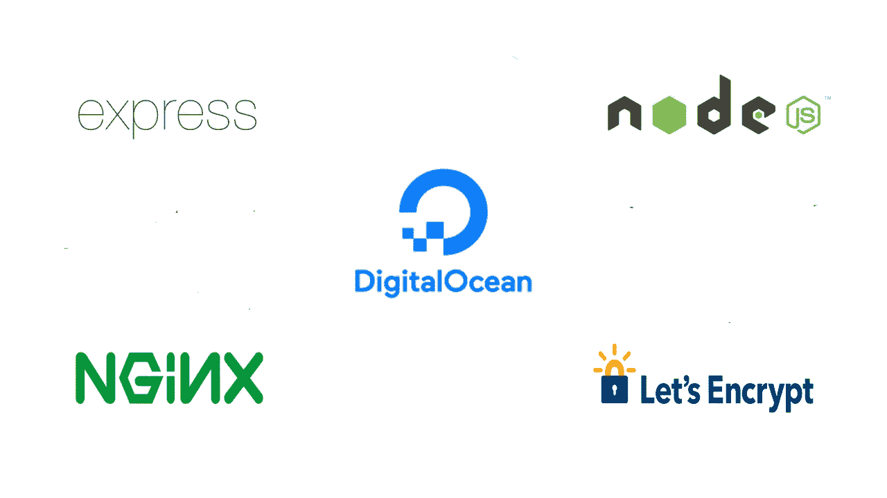

与 Heroku 不同，在 Heroku 中，舞台已经为您搭建好了，您只需推送您的本地 Git 存储库，数字海洋是一个基础设施即服务。换句话说，数字海洋要求您手动配置和维护虚拟化服务器。然而，这带来了很大的灵活性和自由度。DigitalOcean 以其高性能服务器而闻名。他们所有的云服务器都是基于固态硬盘的，启动时间只有 55 秒！

今天，我们将看看如何使用 **NGINX** 作为反向代理，在**数字海洋水滴**上部署 **NodeJS** 和 **ExpressJS** 应用程序。我们还将在我们的应用程序上设置一个免费的加密 SSL 证书。这听起来确实令人不知所措，但是我们将详细介绍每一个步骤。我们开始工作吧！

# NodeJS 和 ExpressJS 应用程序概述

在本文中，我们将部署一个简单的 NodeJS 和 ExpressJS 应用程序，该应用程序只有一个用简单的 HTML 文件响应 GET 请求的路由。您可以在这里 克隆包含项目文件 [**的 Github 资源库。或者随意使用您自己的项目来遵循这个逐步指南。这就是我们的 **server.js** 文件的样子，**](https://github.com/abdamin/NodeJS_Deploy_To_DigitalOcean_Tutorial)

```
*const* express = require("express");*const* app = express();*const* path = require("path");app.get("/", (*req*, *res*) *=>* {return res.sendFile(path.join(__dirname + "/index.html"));});*const* PORT = process.env.PORT || 5000; app.listen(PORT, () *=>* *console*.log(`Server Running on Port ${PORT}`));
```

# 设置您的数字海洋水滴

## 在数字海洋上注册

如果您没有数字海洋帐户，您可以使用此 [**链接**](https://m.do.co/c/cf15c44eab86) 进行注册，以获得**50 美元的免费信用。**

## Droplet 设置

第一步——进入你的[数字海洋仪表盘](https://cloud.digitalocean.com/projects/d0aedabc-1796-4ebe-8dbf-3fef3f6659c9/resources?i=798ce5)并选择**水滴。**

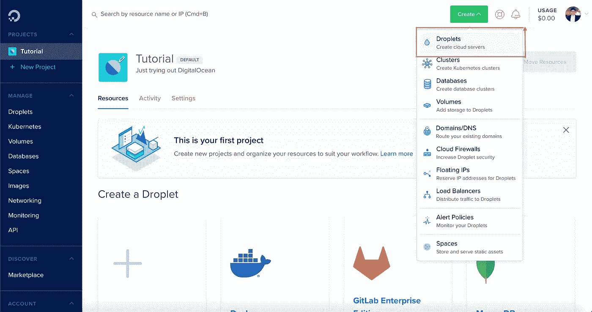

第二步——选择一幅图像和一个计划。

出于本文的考虑，我们将选择 **Ubuntu 18.04.3 (LTS) x64** 作为我们的发行版，并为 **$5/mo** 选择一个**标准**计划。

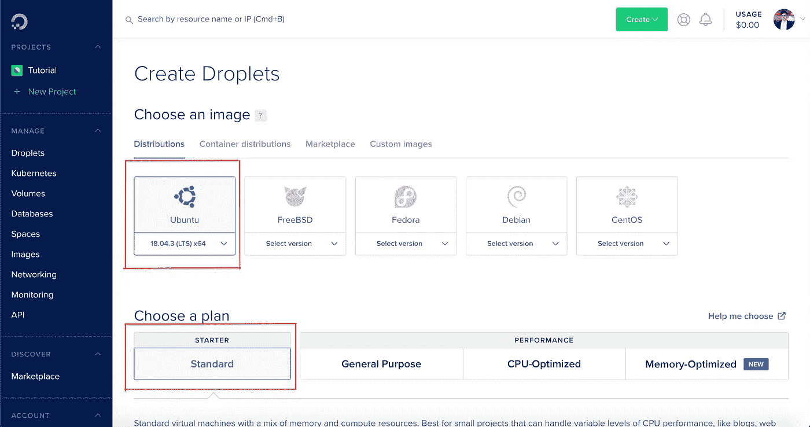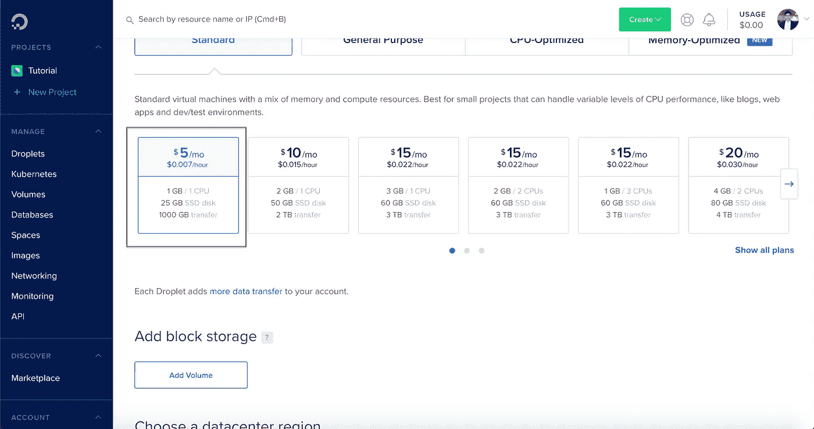

步骤 3-选择数据中心区域。

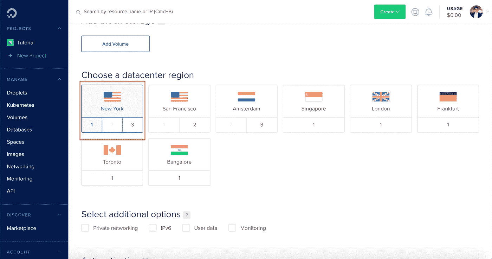

步骤 4 —选择身份验证方法并生成 SSH 密钥

我们将使用 **SSH 密钥**来认证并连接到我们的 Droplet。如果您没有配置 SSH 密钥，请选择**新 SSH 密钥**选项。

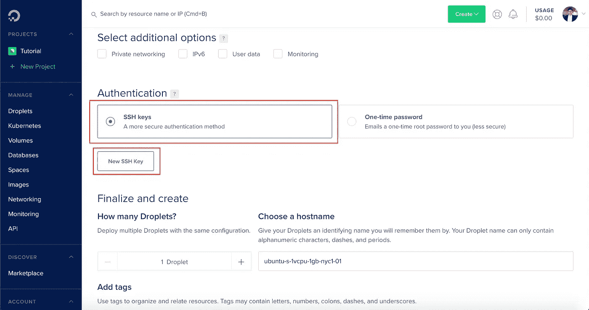

您可以在终端上使用以下命令生成 SSH 密钥，

```
ssh-keygen
```

然后将提示您保存并命名该项，如下所示，

```
Generating public/private rsa key pair. Enter file in which to save the key (/Users/USER/.ssh/id_rsa):
```

点击**回车或返回**键。

接下来，将要求您创建并确认密钥的密码，如下所示。

```
Enter passphrase (empty for no passphrase): 
Enter same passphrase again:
```

这将生成两个文件，默认情况下名为`id_rsa`和`id_rsa.pub`。

获取您的。pub 文件在您的终端中运行以下命令，

```
cat ~/.ssh/id_rsa.pub
```

复制并粘贴您的。在 droplet 的 SSH 设置中，命名您的公共 SSH 密钥并选择**添加 SSH 密钥**。

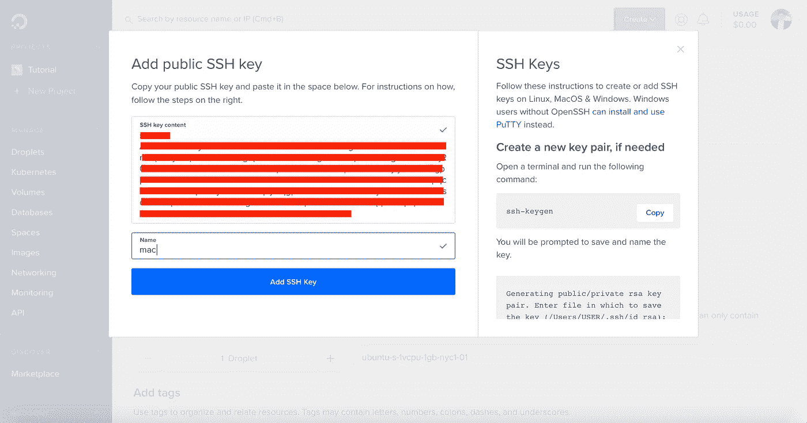

步骤 5-为您的 Droplet 选择一个主机名

在我们的例子中，我们将其命名为**节点-部署-教程**。随便选个名字。

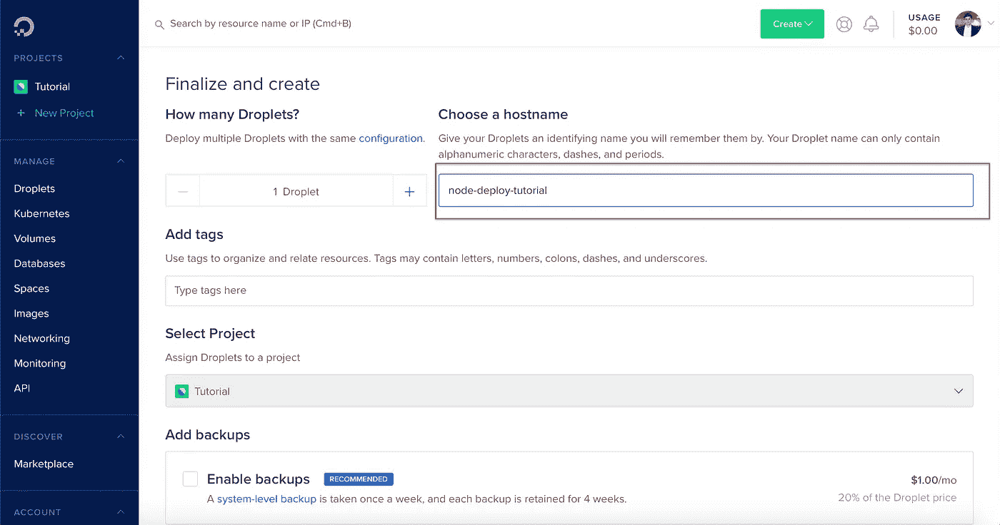

我们将让其余的配置保持默认设置。现在向下滚动并选择**创建水滴。**

您的服务器现在已经启动并运行在 web 上了！

# 连接到您的 Droplet

如前所述，我们将使用 **SSH 密钥**连接到我们的 Droplet。出于本文的考虑，我们使用根用户**来连接。*(但是，建议您创建一个新用户。)***

在项目的“资源”部分拷贝 droplet 的公共 IP。

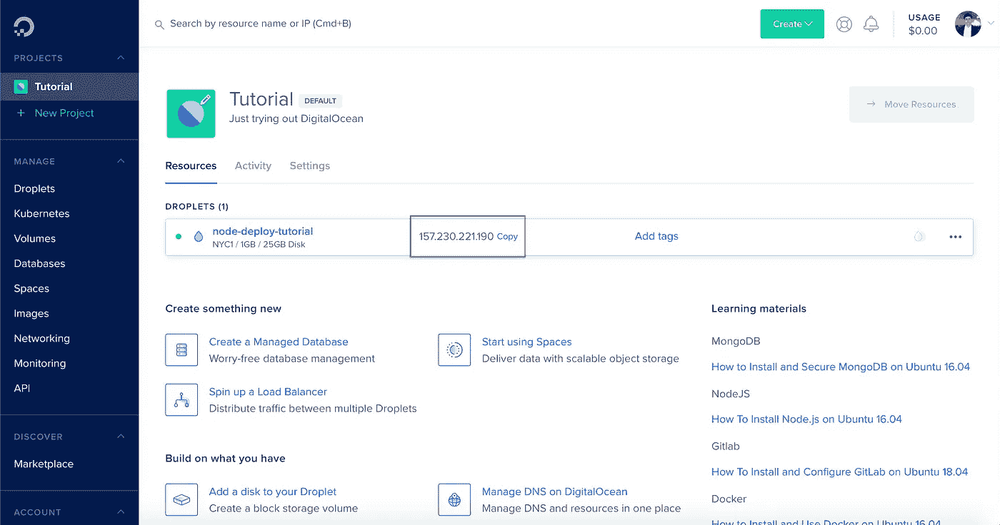

现在在您的终端中运行以下命令来连接到您的 Droplet，

```
ssh root@yourpublicipaddress
```

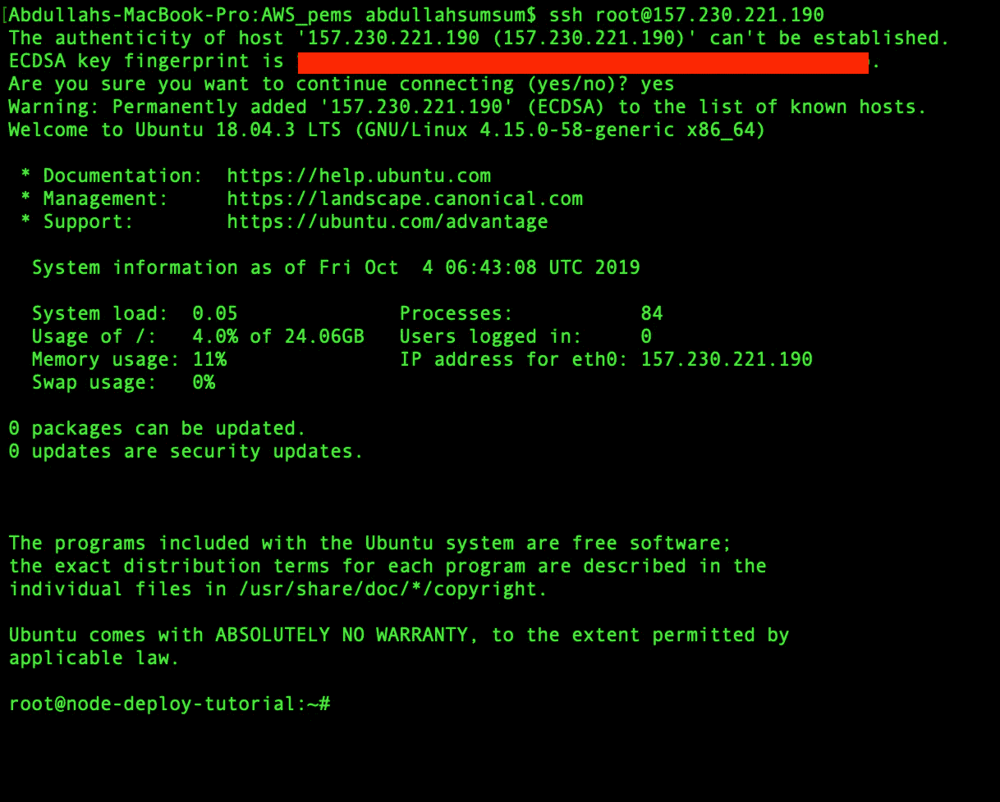

你现在已经成功地 **SSH 到了你的 Ubuntu 服务器/Droplet！**

# 设置您的服务器

## 设置节点

在服务器的终端中运行以下命令来设置 NodeJS，

```
curl -sL https://deb.nodesource.com/setup_12.x | sudo -E bash -

sudo apt install nodejs

node --version
```

## 设置您的项目

在服务器的终端中运行以下命令，

```
sudo mkdir appcd appsudo git clone https://github.com/abdamin/NodeJS_Deploy_To_DigitalOcean_Tutorial.git
```

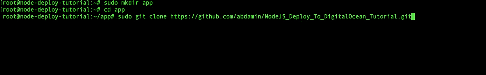

注意，这是我们的示例 NodeJS 和 ExpressJS 应用程序的 Github 存储库 URL。如果您正在部署自己的应用程序，那么在使用 clone 命令时，您将使用自己的存储库 URL。

现在，我们将使用以下命令安装项目依赖项，

```
cd {{your cloned repository’s name}}npm install
```

## 设置 PM2

注意，我们不会使用 ***npm start*** 命令来运行我们的应用程序。相反，我们使用 PM2，这将允许我们的应用程序在后台运行。

在您的服务器终端上运行以下命令以全局安装 PM2，

```
npm install pm2 -g
```

要使用 PM2 运行您的应用程序，请在项目目录中运行以下命令，

```
pm2 start server.js
```

注意, **server.js** 是我们应用程序端点的名称。如果您的项目有一个不同的端点，请确保用您的端点名称替换上面命令中的 **server.js** 。

要确保 PM2 在我们的 Droplet 重启时重启，请在您的服务器终端运行以下命令，

```
pm2 startup ubuntu
```

## 防火墙设置

运行以下命令来启用防火墙，

```
sudo ufw enable
```

然而，你需要配置防火墙来允许 **HTTP，HTTPS** 和 **SSH** 访问。在服务器的终端中运行以下命令，

```
sudo ufw allow httpsudo ufw allow httpssudo ufw allow ssh
```

## 设置 NGINX

现在我们需要安装 NGINX 来为我们的应用程序配置一个反向代理。

在服务器的终端上运行以下命令，

```
sudo apt install nginx
```

## 用 NGINX 链接您的项目

在服务器的终端上运行以下命令，使用 Vim 打开默认文件，

```
sudo vim /etc/nginx/sites-available/default
```

如果您以前没有使用过 **Vim** ，请查看关于基本 Vim 命令的[指南](https://linuxhandbook.com/basic-vim-commands/)。

在嵌套在**服务器**块中的**位置**块中，删除以下代码行:

```
try_files $uri $uri/ = 404;
```

此外，在位置块**中添加以下代码行(使用您的应用程序端口号编辑占位符文本)**，

```
 proxy_pass [http://localhost:](http://localhost:5000;){{YOUR-APP-PORT-IN-YOUR-CODE}}[;](http://localhost:5000;) 
proxy_http_version 1.1;
proxy_set_header Upgrade $http_upgrade;
proxy_set_header Connection 'upgrade';
proxy_set_header Host $host;
proxy_cache_bypass $http_upgrade; 
```

此外，如果您想要成功地为您的应用程序配置一个 SSL 证书(我们将在稍后完成)并添加一个自定义域，不要忘记在服务器块内部和位置块之前添加以下代码行。为了本文，我们将使用自定义域[](http://abdullahsumsum.com)****。****

```
**server_name abdullahsumsum.com www.abdullahsumsum.com;**
```

****确保通过按下 **esc** 键保存文件，然后键入 **:wq** ，然后按下 **return** 键保存并关闭 vim 编辑器。****

****下面是我们的默认文件中的**服务器块在做了上述更改后的样子，******

****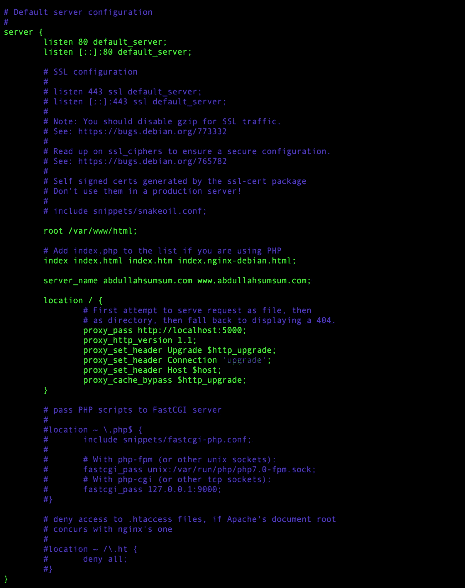****

## ****运行 NGINX****

****在服务器的终端中运行以下命令，****

```
**sudo nginx -tsudo service nginx restart**
```

****您现在应该能够通过在浏览器上键入您的公共 IP 来访问您的应用程序了！****

# ****自定义域设置****

## ****将自定域添加到您的 Droplet****

****步骤 1 —转到**联网**部分。****

****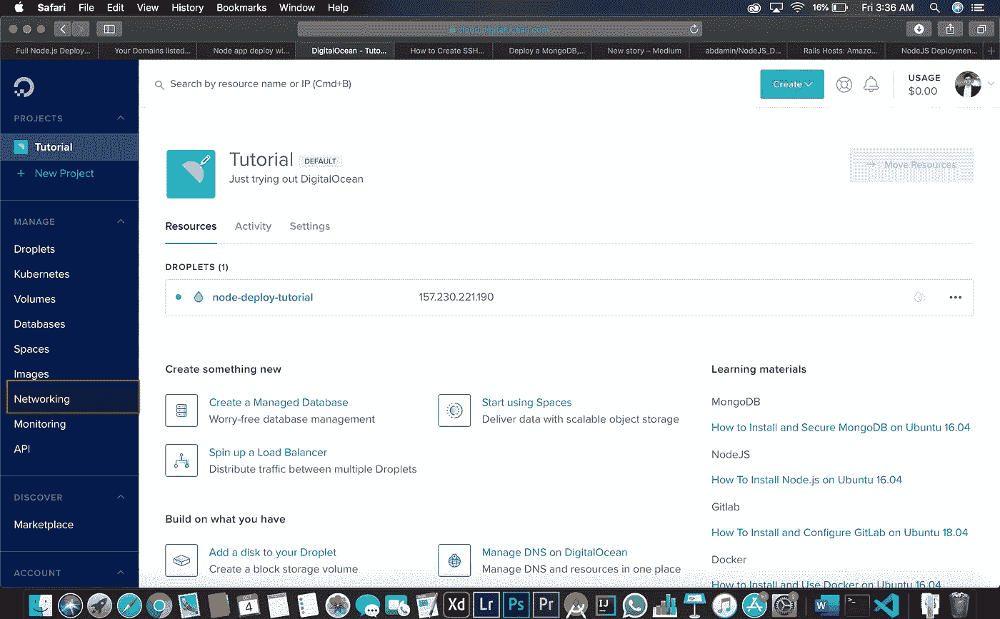****

****步骤 2 —输入域名****

****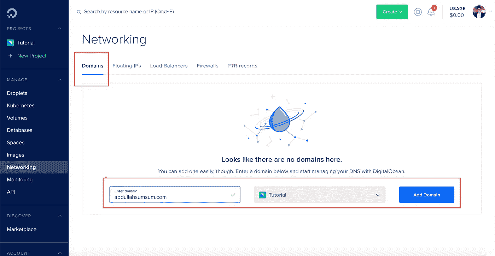****

****步骤 3 —为您的自定义域添加记录****

****添加两条主机名为 **@** 和 **www** 的 A 记录****

************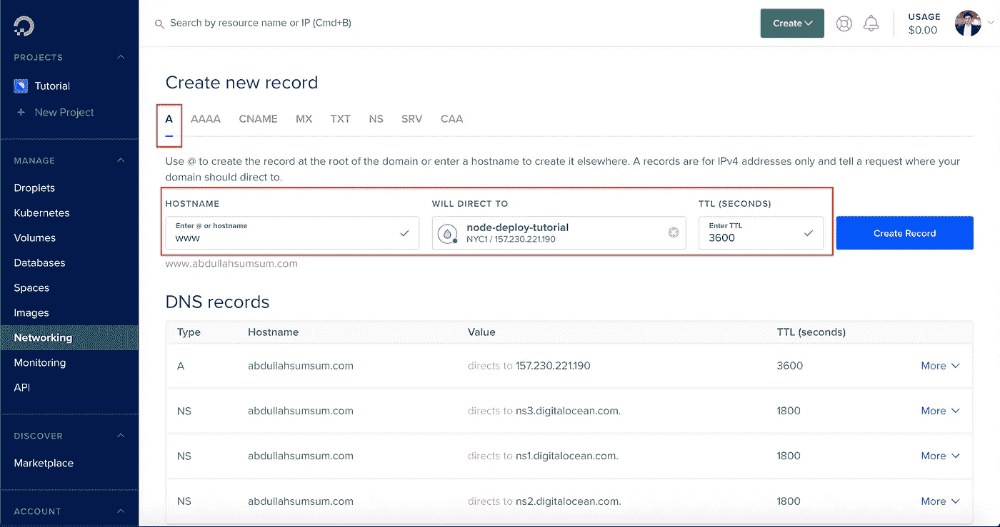****

## ****域注册表配置****

****我个人更喜欢用 [**NameCheap**](https://www.shareasale.com/r.cfm?u=2198460&m=46483&b=518798) 作为我的域名注册商。如果您正在使用 Namecheap，您可以使用此 [**链接**](https://www.shareasale.com/u.cfm?d=491929&m=46483&u=2198460) 访问他们的最新促销优惠。但是，您可以使用任何注册服务商来遵循本指南。基本上，你所要做的就是配置你的域名指向数字海洋域名服务器。****

****您需要在 DNS 管理器中添加以下 3 个名称服务器，****

*   ******ns1.digitalocean.com******
*   ******ns2.digitalocean.com******
*   ****【ns3.digitalocean.com ****

****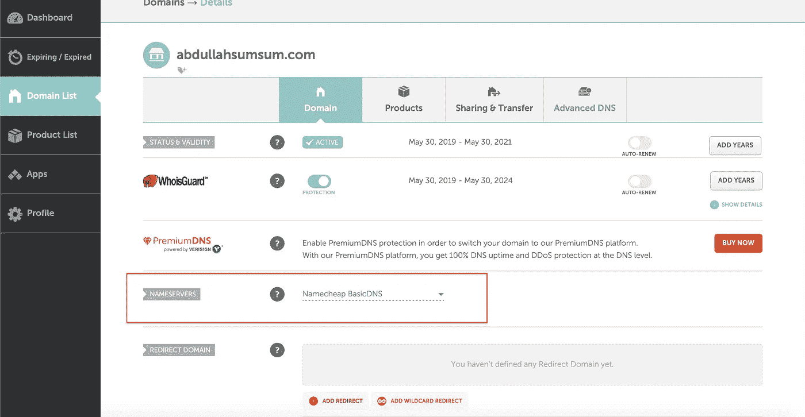********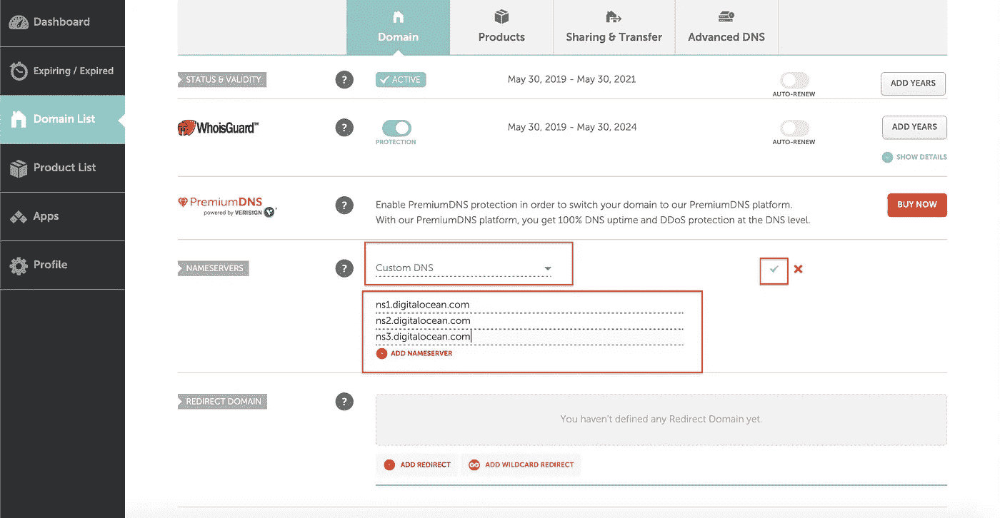****

****请注意，传播更改可能需要 48 小时。然而，这通常需要 5-10 分钟。****

****现在，您应该能够使用自定义域名访问您的应用程序了！****

# ****SSL 证书设置****

****我们将使用 **Cerbot** 为我们的应用程序建立一个**免费的加密** **SSL 证书**。我们还将配置它，以确保它在 90 天到期后自动续订。****

## ****设置 Cerbot****

****在服务器终端运行以下命令来设置 **cerbot、******

```
**sudo add-apt-repository ppa:certbot/certbotsudo apt-get updatesudo apt-get install python-certbot-nginx**
```

## ****为您的自定义域颁发证书****

****在服务器终端中使用您的自定义域名运行以下命令，****

```
**sudo certbot --nginx -d customdomain.com -d www.customdomain.com**
```

****然后会提示您选择是否要将所有请求重定向到安全 HTTPS。在终端中键入 **2** 将所有请求重定向到 HTTPS。否则键入 **1。******

******设置自动续订******

****由于我们的证书每 90 天过期一次，我们将不得不生成一个脚本来自动更新我们的证书。在服务器的终端中运行以下命令，****

```
**certbot renew --dry-run**
```

# ****结论****

****您的 NodeJS 项目现在已经成功部署了！您应该能够通过安全的 SSL 连接访问您的 Web 应用程序！****

****如果您有任何问题，请随时发表评论。此外，如果这帮助了你，请喜欢并与他人分享。我定期发表与 web 开发相关的文章。考虑 [**在此输入您的电子邮件地址**](http://abdullahsumsum.com/subscribe) 以便及时了解与 web 开发相关的文章和教程。你也可以找到更多关于我在 abdullahsumsum.com[](http://abdullahsumsum.com/)**所做的事情******