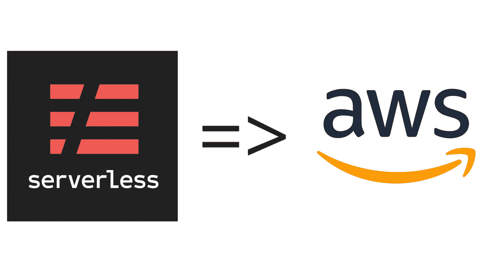
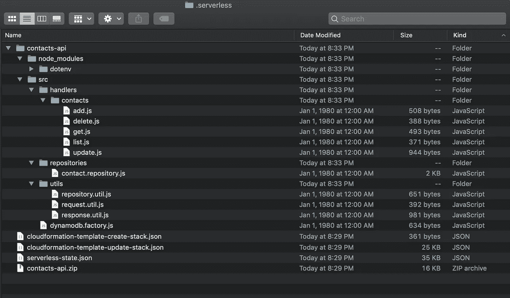

# 将无服务器 API 部署到 Amazon Web Services (AWS)

> 原文：<https://itnext.io/deploy-a-serverless-api-to-amazon-web-services-aws-106c996cded9?source=collection_archive---------3----------------------->



[无服务器公司](https://dashboard.serverless.com/legal/terms)，[亚马逊网络服务](https://aws.amazon.com/trademark-guidelines/)

在之前的[文章](/build-a-restful-api-using-aws-lambda-api-gateway-dynamodb-and-the-serverless-framework-30fc68e08a42)中，我写了关于构建无服务器联系人 API 的文章。我介绍了如何为本地开发进行设置，并没有谈到 API 完成后如何部署到 AWS。

在本文中，我将通过展示如何将相同的 API 部署到您的 AWS 帐户来结束这个循环。

## AWS 凭据

让我们首先登录 AWS 并创建一个用于部署的[无服务器代理](https://serverless.com/framework/docs/providers/aws/guide/credentials/#creating-aws-access-keys)帐户。根据上面无服务器链接中引用的[要点](https://gist.github.com/ServerlessBot/7618156b8671840a539f405dea2704c8)给予代理用户推荐的权限。

一旦您创建了用户并下载了包含访问和秘密密钥的`csv`文件，在您的用户目录级别创建一个名为`.aws`的文件夹来存储密钥。

```
**$ nano ~/.aws/credentials****# default for local development**
[default]
aws_access_key_id=fake-aws-key
aws_secret_access_key=fake-aws-secret**# serverless-agent**
[serverless]
aws_access_key_id=key-from-downloaded-csv-file
aws_secret_access_key=secret-from-downloaded-csv-file
```

## 项目更新

```
**# These are the files that will need to be updated or added.*** package.json
* serverless.yml
* dynamodb.factory.js 
* repository.util.js (new)* .env (local only)* Handlers: list.js, get.js, add.js, update.js and delete.js* contact.seeder.js
* runner.js
```

除了存储 AWS 的凭证之外，我们还需要更新 API 项目中的一些文件，以便它可以在部署后正常运行。

让我们从`package.json`文件开始。在最初的文章中，我在`devDependencies`中列出了`dotenv`，它应该在`dependencies`中列出，因为它被函数使用。

我们还需要将`package`和`deploy`脚本添加到我们的`package.json`文件中，这样我们就可以使用它们将我们的 API 部署到 AWS。

```
**# package.json**{
  ...
  "scripts": {
    "deploy": "serverless deploy --aws-profile serverless",
    "package": "serverless package"
  },
  ...
  "dependencies": {
    "dotenv": "^6.2.0"
  },
  ...
}
```

接下来，使用设置更新`serverless.yml`文件，以允许函数访问 DynamoDB 并排除不需要运行的项目文件。

更新了 serverless.yml 文件。

现在，用环境变量和参数更新`ContactRepository`和`dynamodb.factory.js`文件，以支持 DynamoDB 表的动态命名。

dynamodb.factory.js

联系人.储存库. js

最后，创建一个名为`repository.util.js` 的新实用程序来抽象出`ContactRepository`的创建，并更新处理程序以使用该实用程序来创建存储库的实例。

repository.util.js

处理程序中的`ContactRepository`需要在构造期间设置一个表名才能正常工作。因为我们刚刚创建了一个存储库实用程序来完成这项工作，所以让我们更新处理程序代码来利用它。

请记住，第 24 行和第 26 行是需要应用于所有处理程序的新行。

## 本地测试

在我们继续将这个 API 部署到 AWS 之前，让我们进行测试，以确保我们的更改仍然可以在本地工作。

更新`.env`文件，为`CONTACTS_TABLE`环境变量添加一个条目。

```
**# .env**AWS_ENDPOINT='[http://localhost:8000'](http://localhost:8000')
AWS_REGION='us-west-2'**# these keys are no longer needed**
# AWS_ACCESS_KEY_ID='fake-access-key'
# AWS_SECRET_ACCESS_KEY='fake-secret-key'**# the name of the contact table**
CONTACTS_TABLE='contacts-api-dev-contacts'
```

确保 [DynamoDB 正在本地运行](/containerizing-serverless-apis-d69fa3e6b9c2)。然后运行`npm start`以离线模式在本地运行 API。

```
**$ npm start**

> contacts-api@1.0.0 start ./contacts_api
> sls offline start

Serverless: Starting Offline: dev/us-west-2.

Serverless: Routes for list:
Serverless: GET /contacts

...
...Serverless: Offline listening on [http://0.0.0.0:3000](http://0.0.0.0:3000)**# from a different terminal window, run****$ curl -i localhost:3000/contacts**HTTP/1.1 200 OK
content-type: application/json; charset=utf-8
cache-control: no-cache
content-length: 411
accept-ranges: bytes
Date: Sun, 16 Dec 2018 04:08:48 GMT
Connection: keep-alive

[{"firstName":"Luke","lastName":"Skywalker", ..., ... }]
```

注意:如果您需要重新播种表格，您可能需要更新`/seed`文件夹中的`contact.seeder.js`和`runner.js`文件。

```
**# seed/contact.seeder.js****# Update the constructor to accept a 'tableName' parameter
# and assign it to 'this._tableName' to replace the hardcoded
# 'contacts' string.**...
constructor(dynamodb, docClient, tableName) {
  ...
  ...
  //this._tableName = 'contacts';
  this._tableName = tableName;
}
...**# seed/runner.js****# Extract the 'CONTACTS_TABLE' environment from process.env and
# use it in the instantiation of the 'ContactSeeder'.
# Optionally, update the 'log' statements with 'CONTACTS_TABLE'
# instead of using the hard coded 'contacts' string.**const { CONTACTS_TABLE } = process.env;
...
...
const contactSeeder = 
  new ContactSeeder(dynamo, doclient, CONTACTS_TABLE);**# running 'npm run seed' should now work properly.**
```

## **包装**

在实际部署到 AWS 之前，我们应该通过打包 API 进行最后的验证。

Serverless 包含一个`package`命令，该命令将在本地 temp `.serverless`文件夹中创建部署包，供我们检查。

运行我们之前添加到`package.json`文件的`npm run package`脚本，然后打开`.serverless`文件夹。

```
**$ npm run package**> contacts-api@1.0.0 package ./contacts_api
> serverless package

Serverless: Packaging service...
Serverless: Excluding development dependencies...
```

打开`.serverless`文件夹，提取`contacts-api.zip`文件。展开文件夹，确保只有`node_modules`和`src`包含在 zip 中。

`contacts-api`文件夹应该是这样的:



。无服务器文件夹

## 部署到 AWS

既然我们已经确认了所有的更改都可以在本地工作，那么让我们部署到 AWS，看看它是否可以在那里工作。

注意，`npm run deploy`脚本调用了`serverless deploy --aws-profile serverless`。这与我们在本文开始时设置的 AWS 凭证相匹配。

```
**$ npm run deploy**

> contacts-api@1.0.0 deploy /contacts_api
> ***serverless deploy --aws-profile serverless***

Serverless: Packaging service...
Serverless: Excluding development dependencies...
Serverless: Uploading CloudFormation file to S3...
Serverless: Uploading artifacts...
Serverless: Uploading service .zip file to S3 (15.45 KB)...
Serverless: Validating template...
Serverless: Updating Stack...
Serverless: Checking Stack update progress...
.............................................................
Serverless: Stack update finished...
Service Information
service: contacts-api
stage: dev
region: us-west-2
stack: contacts-api-dev
api keys:
  None
endpoints:
  GET - https://<auto-gen>.amazonaws.com/dev/contacts
  GET - https://<auto-gen>.amazonaws.com/dev/contact/{id}
  POST - https://<auto-gen>.amazonaws.com/dev/contact
  PUT - https://<auto-gen>.amazonaws.com/dev/contact/{id}
  DELETE - https://<auto-gen>.amazonaws.com/dev/contact/{id}
functions:
  list: contacts-api-dev-list
  get: contacts-api-dev-get
  add: contacts-api-dev-add
  update: contacts-api-dev-update
  delete: contacts-api-dev-delete
layers:
  None
```

我们现在可以调用每个端点来测试它们是否工作，从 list 开始。

```
**$ curl -i https://<auto-gen>.amazonaws.com/dev/contacts**HTTP/2 200 
content-type: application/json
content-length: 2
...
...**# An empty array because we haven't posted or seeded data.**
[]
```

过帐数据(添加)。

```
**$ curl -i \
   -H 'Content-type: application/json' \
   -X POST \
   -d '{"id": "1", "firstName": "Jin", "lastName": "Erso"}' \
   https://<auto-gen>.amazonaws.com/dev/contact**HTTP/2 201 
content-type: application/json
content-length: 0
...
...
```

再次提取联系人列表以验证(列表)。

```
**$ curl -i https://<auto-gen>.amazonaws.com/dev/contacts**HTTP/2 200 
content-type: application/json
content-length: 48
...
...**# There's the data we posted to the POST endpoint!**
[{"id":"1","firstName":"Jin","lastName":"Erso"}]
```

按 id 提取(get)。

```
**$ curl -i https://<auto-gen>.us-west-2.amazonaws.com/dev/contact/1**HTTP/2 200 
content-type: application/json
content-length: 46
**...
...****# Notice that it's the contact and not an array of contacts like 
# when we called the GET /contacts endpoint.**
{"id":"1","firstName":"Jin","lastName":"Erso"}
```

更新联系人(更新)。

```
**$ curl -i \
    -H 'Content-type: application/json' \
    -X PUT \ 
    -d '{"id": "1", "firstName": "Jin-updated", "lastName": "Erso-updated"}' \ 
    https://<auto-gen>.amazonaws.com/dev/contact/1**HTTP/2 200 
content-type: application/json
content-length: 62
...
...**# The updated contact is returned.**
{"id":"1","firstName":"Jin-updated","lastName":"Erso-updated"}
```

最后，删除。

```
**$ curl -i \
    -X DELETE \
    https://<auto-gen>.amazonaws.com/dev/contact/1**HTTP/2 204 
...
...**# Nothing is returned.**
```

可以在以下位置找到源分支:

[](https://github.com/vanister/contacts_api/tree/serverless-deploy-aws) [## vanister/contacts _ API/server less-deploy-AWS

### 带有 AWS Lambda、API 网关和 DynamoDB - vanister/contacts_api 的无服务器 RESTful API

github.com](https://github.com/vanister/contacts_api/tree/serverless-deploy-aws) 

原文可以在这里找到:

[](/build-a-restful-api-using-aws-lambda-api-gateway-dynamodb-and-the-serverless-framework-30fc68e08a42) [## 使用 AWS Lambda、API Gateway、DynamoDB 和无服务器框架构建 RESTful API

### 更新日期:2018 年 10 月 17 日。

itnext.io](/build-a-restful-api-using-aws-lambda-api-gateway-dynamodb-and-the-serverless-framework-30fc68e08a42) 

我提到过在 Docker 容器中运行 AWS/DynamoDB，可以在下面找到:

[](/containerizing-serverless-apis-d69fa3e6b9c2) [## 容器化无服务器 API

### 使用 Docker、LocalStack 和无服务器框架进行本地开发

itnext.io](/containerizing-serverless-apis-d69fa3e6b9c2) 

以下是关于 AWS 配置和部署的无服务器详细指南:

[](https://serverless.com/framework/docs/providers/aws/guide/intro/) [## 无服务器框架- AWS Lambda 指南-简介

### 无服务器框架帮助你开发和部署你的 AWS Lambda 函数，以及 AWS…

serverless.com](https://serverless.com/framework/docs/providers/aws/guide/intro/)