# 使用 Azure 管道将单个页面应用程序部署到 Azure 存储

> 原文：<https://itnext.io/deploy-a-single-page-application-to-azure-storage-using-azure-pipelines-22b201ae47cb?source=collection_archive---------1----------------------->

图片由 Pixabay 的 Peter H 提供

在这篇文章中，我将解释如何将单页面应用程序部署到 azure，并使用 Azure 存储帐户的“静态网站”功能，我还将向您展示如何在部署期间更改 JSON 文件中的一些变量值。

对于本文，我假设您已经:

*   Azure(门户)帐户(并创建了订阅和资源组)
*   Azure DevOps 帐户(以及已配置的项目)

# 创建简单的静态 web 应用程序

首先，我们将从一个非常简单的 web 应用程序开始，一个`index.html`文件，它在页面上显示环境和版本。

> ***注意****web 应用非常简单。您可以使用更复杂构建的结果(例如来自 React、Angular 或 VueJs 应用程序)。这不是本文的目的。*

下面是`index.html`文件:

然后是`script.js`文件:

和`config.json`文件:

如您所见，web 应用程序非常简单，我们只想显示 config.json 文件中的两个变量，并且该文件的值可能会在部署过程中发生变化(指定环境或更改版本……)。

# 创建存储帐户

我们希望将我们的静态 web 应用程序存储在 Azure 存储帐户中，因此我们需要创建一个存储帐户并激活“静态 webapp”功能。

让我们开始吧…

*   登录到您的 azure 帐户
*   如果没有，请创建订阅和资源组
*   然后创建一个存储帐户

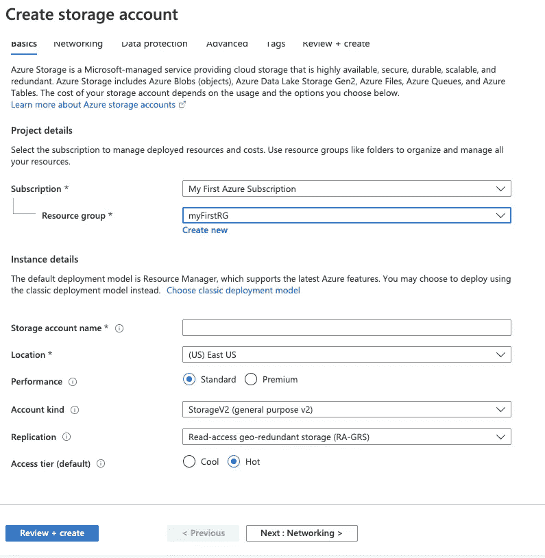

创建存储帐户

*   创建后，转到“设置>静态网站”，然后启用它并定义索引文档名称(和错误文档路径) :

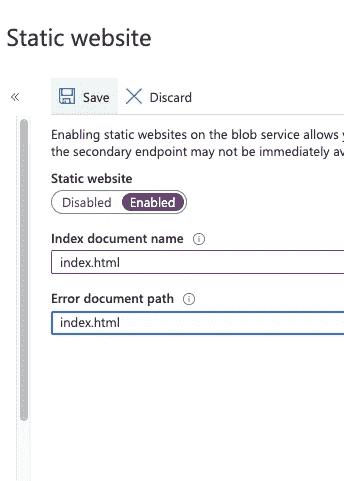

启用静态网站

*   然后保存，您将拥有一个访问您的应用程序的 URL:*https://{ STORAGE _ ACCOUNT _ NAME } . z6 . web . core . windows . net/*

如果您返回到您的存储帐户的容器列表，您应该有一个名为 **$web** 的新容器，这是我们将部署 web 应用程序源代码的位置。

# 创建“构建”管道

现在我们将创建一个 azure 管道。

在您的源代码库中，添加一个文件:`azure-pipelines.yml`，内容如下:

管道会将 **src** 目录中的所有文件复制到一个“ArtifactStagingDirectory”中，然后发布名为 site 的工件。

然后进入**Azure devo PS>Pipelines>Pipelines**点击 **New Pipeline** 按钮，选择你的代码在哪里(我的例子是 Azure Repos)，然后按照向导进行操作。在**配置**步骤，选择*“现有 Azure 管道 YAML 文件”*，然后将`azure-pipelines.yml`写成 Path:

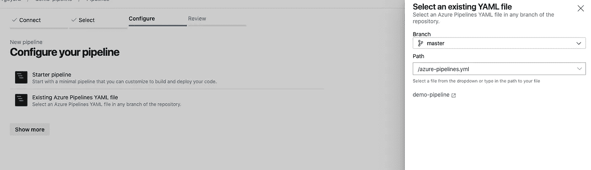

配置您的管道

然后运行您的管道。

如果一切正常，您应该看到您的管道发布了 **1 Artefact**

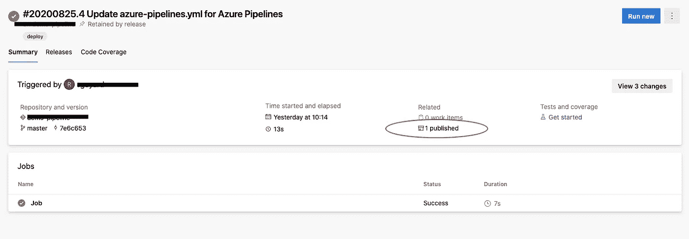

现在我们制造了一个藏物，我们可以部署它了！！

# 创建发布管道

## 创建服务连接

为了允许 Azure DevOps 在存储帐户中添加文件，您必须定义一个**服务连接**。为此，在 Azure DevOps 中，进入**项目设置>服务连接**。如果你没有，创建一个… [这是文档](https://docs.microsoft.com/en-us/azure/devops/pipelines/library/service-endpoints?view=azure-devops&tabs=yaml)

一旦有了服务连接，单击它。

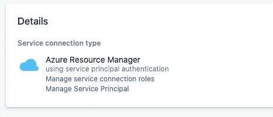

然后点击链接:*“管理服务主体”*，然后**复制***显示名称*(看起来应该是:{LOGIN}-{PROJECT}-{UNIQ_ID})，回到服务连接细节，点击链接*“管理服务连接角色”*

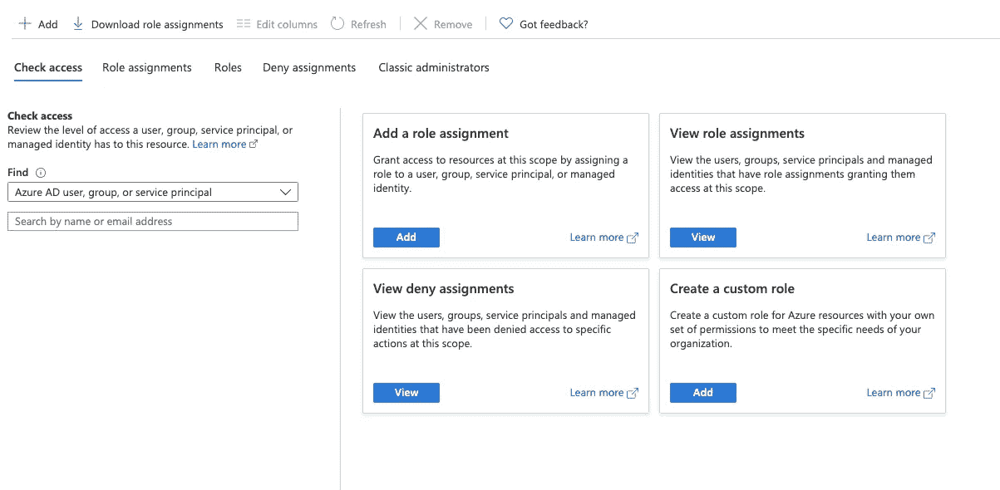

然后点击**添加**，在*“添加角色分配”*中，然后在**添加角色分配**面板中，作为**“角色”**，需要选择:*“存储 Blob 数据贡献者”*或*“存储 Blob 数据所有者”*，作为**“选择框”**，粘贴之前复制的显示名称，并选择显示的用户，然后

**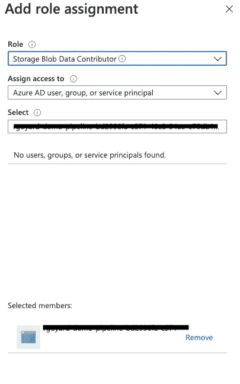**

## **创建发布管道**

**现在我们可以创建主管道，返回 Azure DevOps，然后转到**管道>发布**，然后单击按钮**新建管道**，将显示*“选择模板”*面板，单击**空作业**。**

**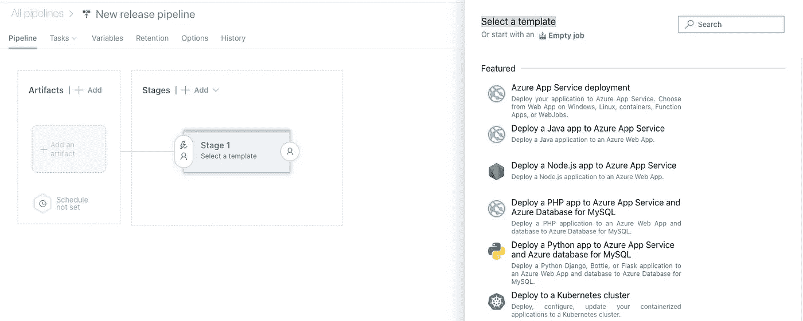**

**然后给你的阶段起个名字，记得也给你的管道起个名字…**

**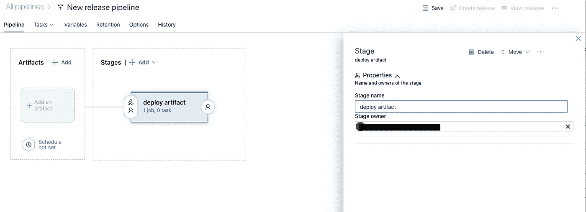**

**添加一个工件到你的管道点击 **+添加一个工件**，然后选择“构建”，然后项目，源代码库，管道和我定义的*“源代码别名”*到**站点**。**

**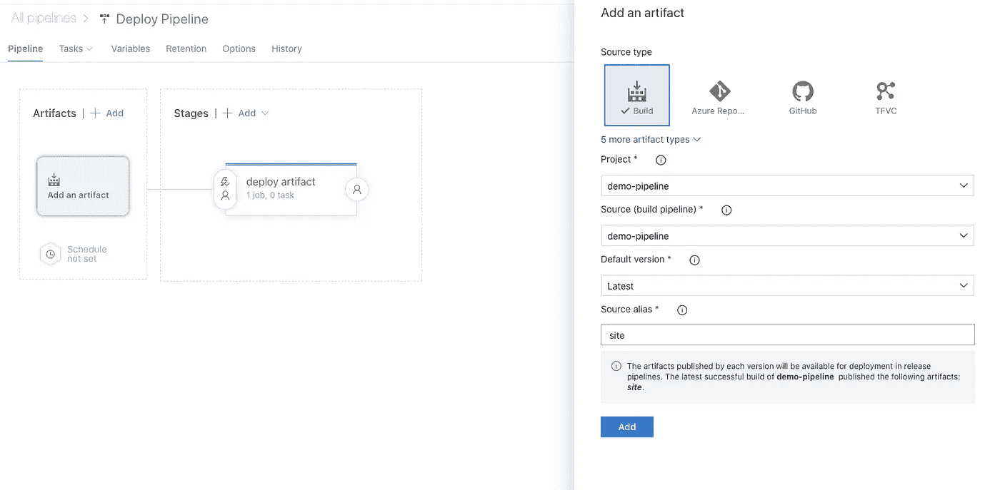**

**现在点击链接:*“1 个作业，0 个任务”*创建您的任务…**

**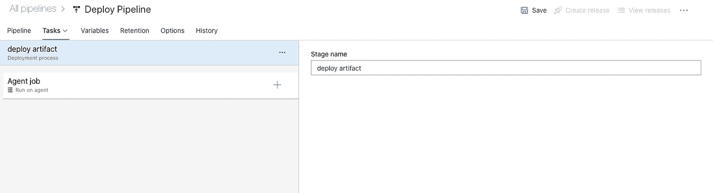**

**点击*“代理作业”*上的 **+** 按钮，使用任务面板添加**“Azure 文件复制”**任务。**

**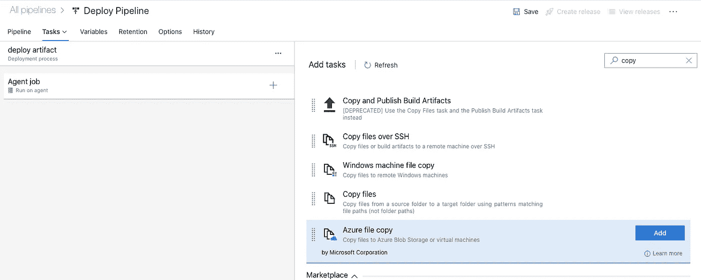**

**然后配置任务**

**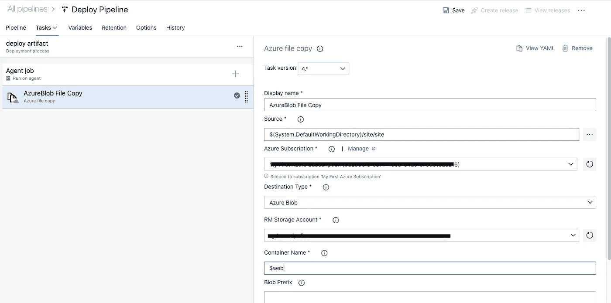**

**然后单击 Save，给出一个 Git Commit 消息，并单击 ok。**

**点击左侧菜单中的**管道>发布**项，然后选择您的管道，点击**按钮【创建发布】**，选择要触发的阶段( ***部署工件*** )，点击**创建**。**

**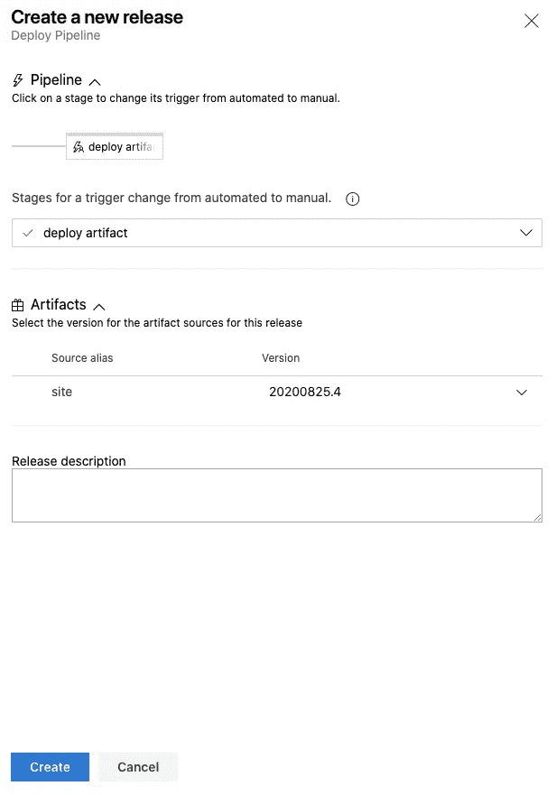**

**如果一切正常，你可以去看看**你的网站，它应该是活的！！！****

## **重写 config.json**

**好了，现在我们的 web 应用程序是活动的，但是我们希望`config.json`文件的一些值根据应用程序部署的环境进行更改，**

**为此，我们将在发布管道中添加一项任务:**

**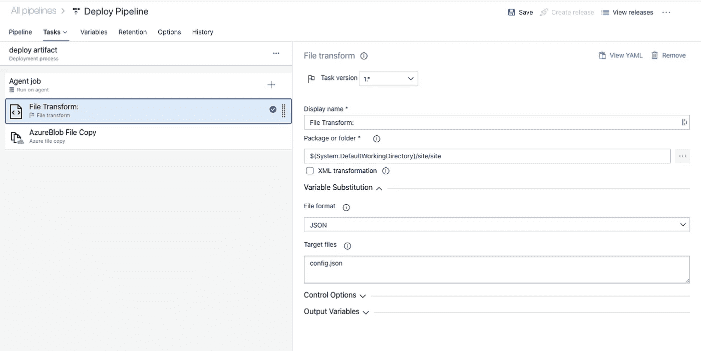**

**保存。**

**现在我们可以添加一些变量**

**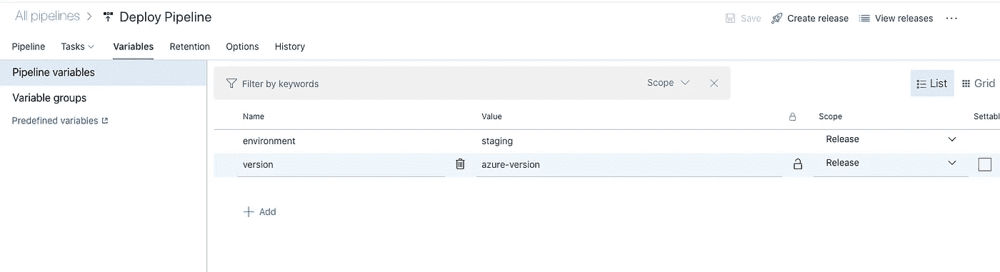**

**保存您的管道，创建一个新的发布，并查看结果！！**

**这些值已被管道修改。**

**希望这篇文章对你有帮助，欢迎评论和鼓掌。**