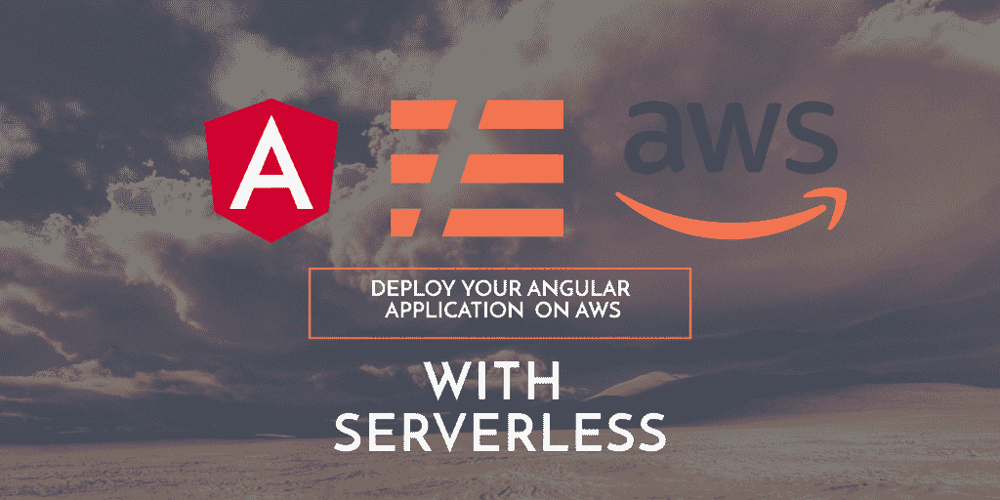
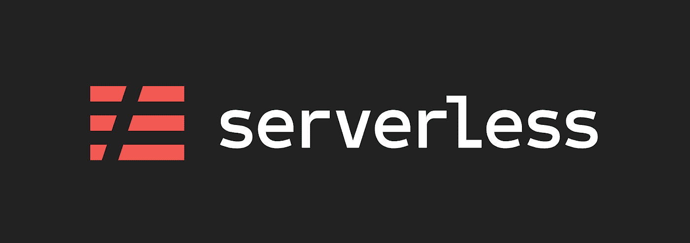

# 使用无服务器在 AWS 上部署 Angular 应用程序

> 原文：<https://itnext.io/deploy-an-angular-application-on-aws-using-serverless-5e099a851e92?source=collection_archive---------0----------------------->

## Amazon Web Services 上生产就绪的无服务器 Angular 应用程序的快速入门



# 什么是无服务器

无服务器是一个基于云的架构，允许用户编写和部署代码，而不用担心底层的基础设施。

像 AWS、Azure 或 Google Cloud 这样的云提供商通过**动态分配资源**来负责执行代码，这种范式使您能够将更多的运营责任转移给提供商，让您专注于业务逻辑。

无服务器方法通常用于后端应用程序，但是我们也可以利用这种架构来快速部署前端应用程序。

# 无服务器框架

[无服务器框架](https://serverless.com/)帮助您开发和**部署您的云资源，以及它们所需的基础设施资源**。这是一个 CLI，它提供了现成的结构、自动化和最佳实践。



无服务器与几家云提供商合作，但在本教程中，我们将重点关注**亚马逊网络服务**。

# 参考知识库

我们将使用的 angular base 项目的一个工作示例可在:[https://github.com/mzuccaroli/angular-serverless-starter](https://github.com/mzuccaroli/angular-serverless-starter):，这是一个简单的 angular 项目，使用 angular CLI 命令“ng new”生成。欲了解更多信息，请参阅 angular2 项目快速入门。您可以将此项目作为项目的快速启动工具。

你可以在我的公司博客上看到这篇文章的意大利语翻译:“[public care un ' applicazione Angular su AWS usando server less](https://www.axelerant.it/blog/pubblicare-unapplicazione-angular-su-aws-usando-serverless/)”也是我写的。

# 最初的例子

本教程基于“ [aws 节点单页应用程序 via cloudfront](https://github.com/serverless/examples/tree/master/aws-node-single-page-app-via-cloudfront) ”无服务器示例，我们将无服务器基础示例改编为 angular 应用程序。您可以克隆它用于代码参考和定制改编。

# 先决条件

您需要在系统中全局安装无服务器:

```
$ npm install -g serverless
```

更多信息请见:[https://serverless.com/framework/docs/getting-started/](https://serverless.com/framework/docs/getting-started/)

您还需要一个 AWS 帐户，如果您没有，请查看以下链接: [**如何创建一个 AWS 帐户**](https://aws.amazon.com/premiumsupport/knowledge-center/create-and-activate-aws-account/) 。亚马逊提供**一年免费等级**，你可以使用并充分利用。

如果你已经有了一个 AWS 账户，一定要有 cloudfront、cloudformation 和 s3 的权限。

# 构建您的应用程序

## 入门指南

通过键入以下命令，使用 angular CLI 创建一个基础 angular 项目(如果您还没有):

```
$ ng new
```

按照步骤使用 angular libs 的最新版本搭建您的项目。

一旦 Angular 项目设置好了，您就可以定制它来处理无服务器部署。

## 添加单页应用程序插件

转到[基本范例库](https://github.com/serverless/examples/tree/master/aws-node-single-page-app-via-cloudfront)并开始复制一些有用的文件:

我们将需要完整的[无服务器单页应用插件](https://github.com/serverless/examples/tree/master/aws-node-single-page-app-via-cloudfront/serverless-single-page-app-plugin)文件夹，将其复制到您的项目根目录，这个插件将允许您简化部署体验。部署单页面应用程序不需要理解插件。

通过将这个插件添加到 requirements 部分的 package.json 中，使它在您的项目中可用:

## 安装无服务器 dotenv 插件

这将帮助您处理项目中的各种环境和阶段

```
$ npm install serverless-dotenv-plugin
```

请注意，dotenv 插件需要在应用程序根文件夹中有一个 git 忽略的. env 文件。欲了解更多信息，请查看[官方文档](https://www.serverless.com/plugins/serverless-dotenv-plugin/)。

## 添加 serverless.yml 文件

该文件是无服务器部署核心，您可以从[主示例](https://github.com/serverless/examples/blob/master/aws-node-single-page-app-via-cloudfront/serverless.yml)中复制并编辑它，或者使用参考库中的[自定义文件](https://github.com/mzuccaroli/angular-serverless-starter/blob/develop/serverless.yml)

主要定制位于插件定制和提供者部分:

您将需要使用自定义的唯一名称自定义 s3Bucket 值，然后使用 angular dist 文件夹作为无服务器 dist 文件夹，最后使用 serverless-dotenv-plugin，以便能够在多个阶段上部署。

## 自定义您的 gitignore

请务必添加。无服务器文件夹到您的。git 通过添加以下内容忽略文件:

# 构建和部署

## 建设

确保您的环境已设置好，然后执行常规的角度构建过程:

```
$ ng build
```

构建工件将被存储在 *dist/* 目录中。对生产版本使用 prod 标志。

## 首次部署

警告:每当您对 serverless.yml 中的 CloudFront 资源进行更改时，部署可能需要一段时间，例如 20 分钟。

为了部署应用程序，您需要首先通过运行

```
$ serverless deploy
```

预期的结果应该类似于:

在这一步之后，您的 S3 bucket 和 CloudFront 发行版就设置好了。现在你需要上传你的静态文件，也就是你的 dist 文件夹，到 S3。你可以通过跑步做到这一点

```
$ serverless syncToS3
```

预期的结果应该类似于

现在您只需要找出部署的 URL。您可以使用 AWS 控制台 UI 或运行

```
$ sls domainInfo
```

预期的结果应该类似于

```
Serverless: Web App Domain: dyj5gf0txxyyzz.cloudfront.net
```

访问打印域域查看您的应用。

它会自动把你带到 HTTPS。

## 重新部署

如果您对您的单页面应用程序进行更改，您不需要重新部署整个堆栈，您只需要将新文件上传到 s3，并使 CloudFront 的缓存无效，以确保新文件得到服务。

运行:

```
$ serverless syncToS3
```

同步您的文件，然后:

```
$ serverless invalidateCloudFrontCache
```