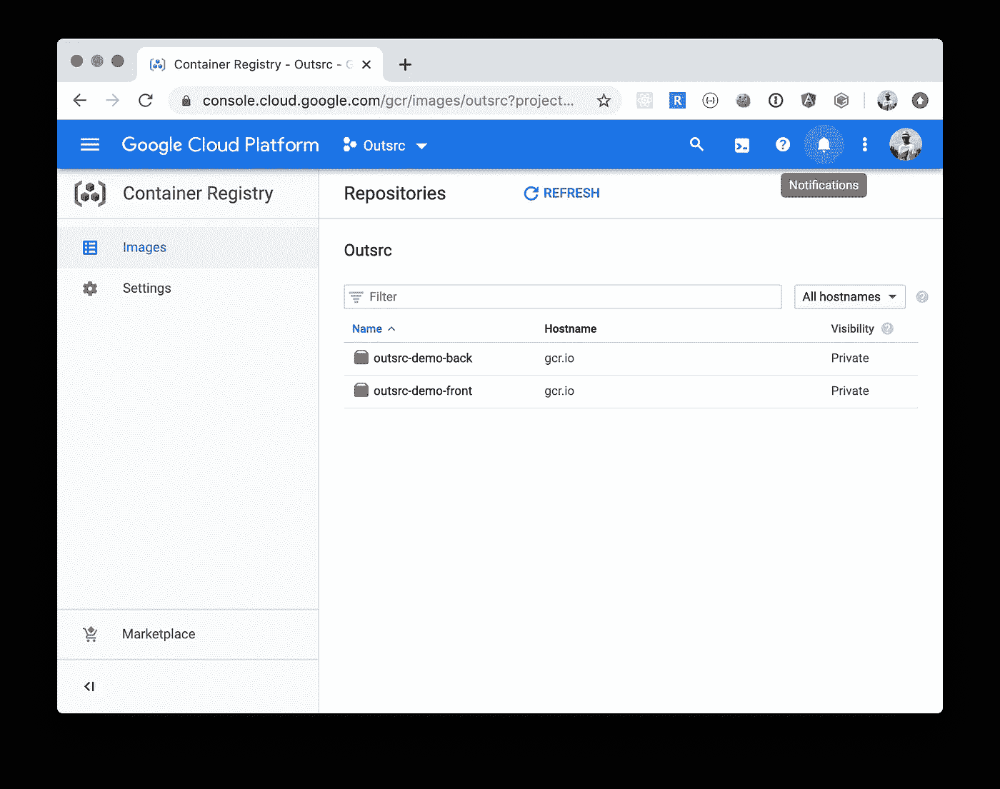
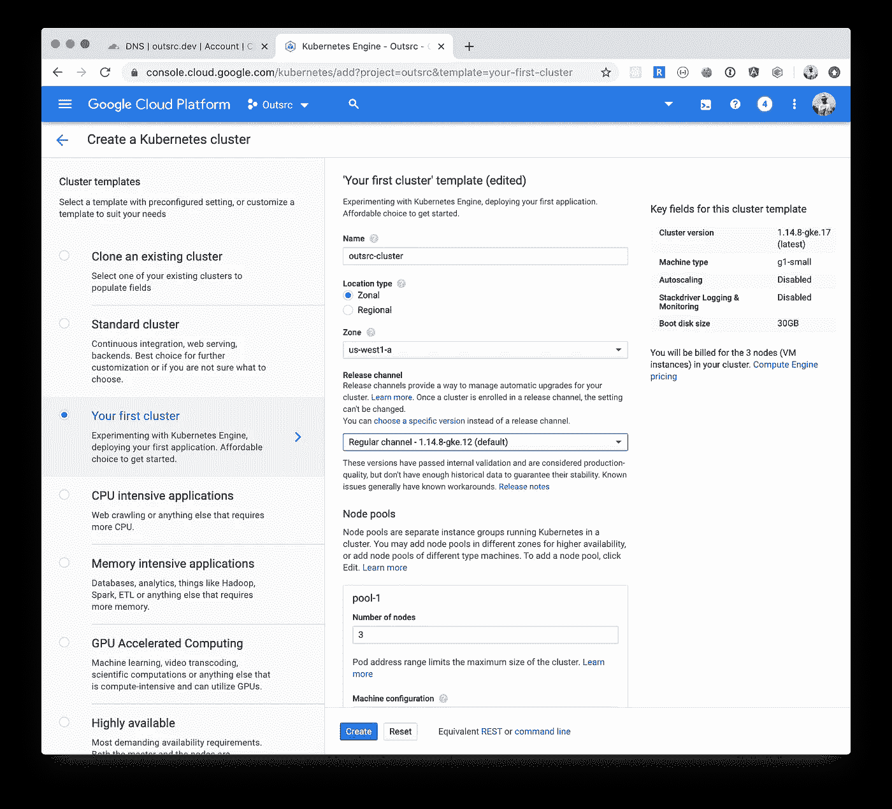
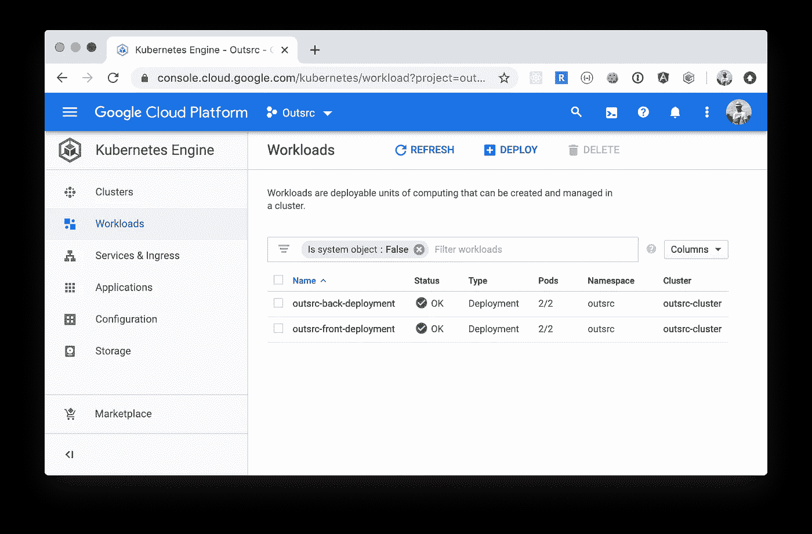
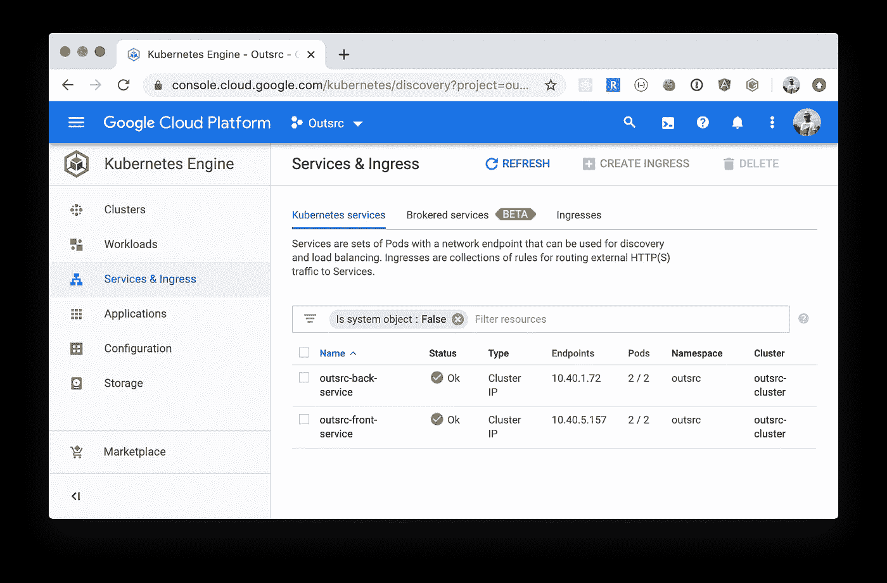
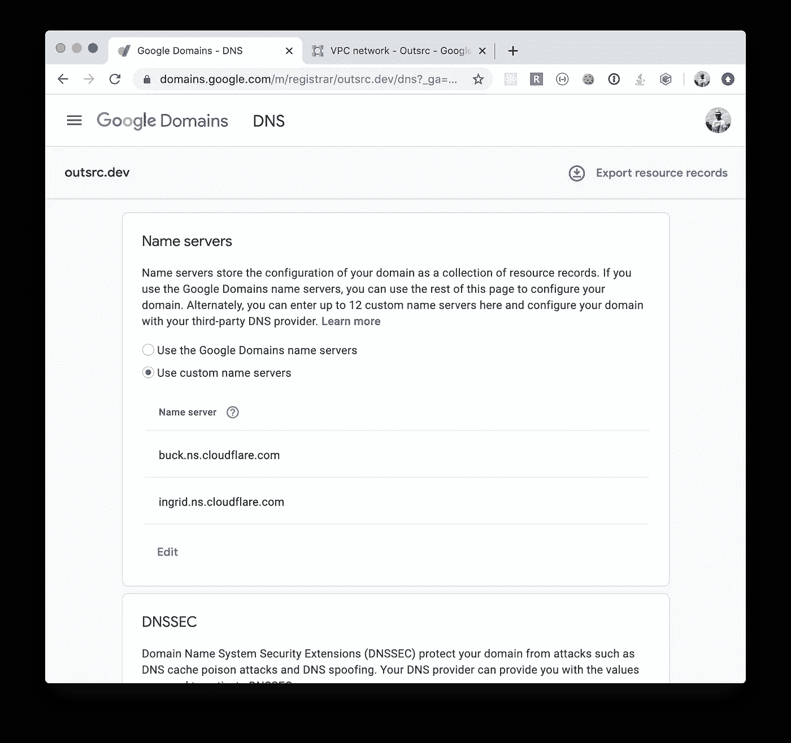
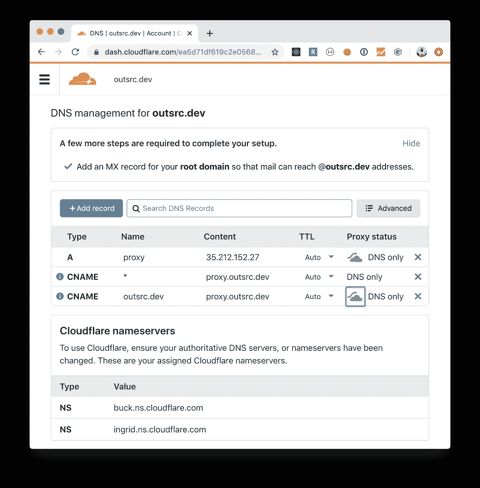
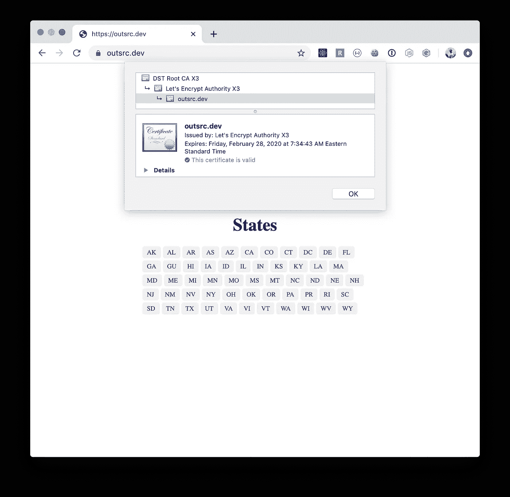
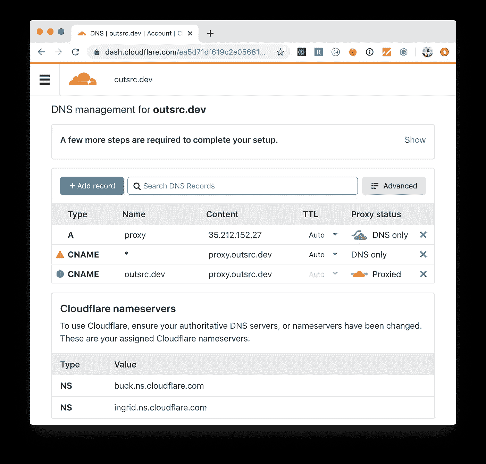
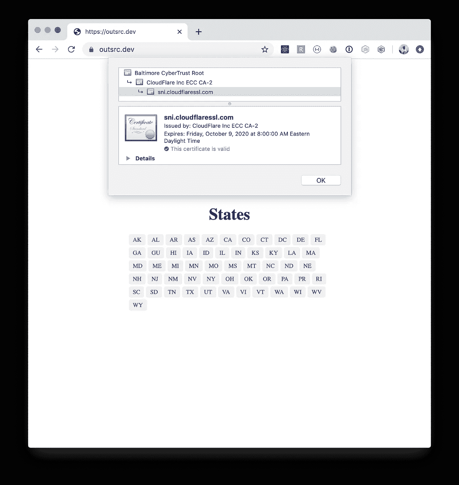

# 使用 Kong Ingress、LetsEncrypt 和 Cloudflare 在 Kubernetes (GKE)上部署一个应用程序。

> 原文：<https://itnext.io/deploy-an-app-on-kubernetes-gke-with-kong-ingress-letsencrypt-and-cloudflare-94913e127c2b?source=collection_archive---------1----------------------->


如果你有一个小应用程序(希望有几个微服务，前端和后端)，我不建议你使用 Kubernetes 来部署它们。有更好的全面管理的替代品。但是…

如果你认为你真的需要它，或者你想为别人提供这种服务，那么这个指南将作为蓝本。

## 输入、输出和步骤。

我们的最终结果将是:在我们的域上提供一个启用了 TLS 的 web 应用程序，它足够健壮，可以抵御 DDoS 攻击。

为此，Kong Ingress 将帮助我们在根路径上提供前端服务，在/api 路径上提供后端服务。LetsEncrypt 将提供 TLS 证书，Cloudflare 将提供额外的安全性和 DNS 服务。都托管在 GKE 的 Kubernetes 集群上。

(注意:Kong Ingress 不是绝对必要的，因为我们只有几个服务，但是，考虑到一旦您走微服务路线，通常会有新服务的内部爆炸，我们可能需要做好准备)

为此，我们需要:

*   前端应用程序:为了简单起见，我们将使用 next js([https://nextjs.org/](https://nextjs.org/))
*   后端应用程序:将只解决静态请求。(连接到数据库或任何其他资源超出了本指南的范围)
*   域名:你可以在谷歌域名([https://domains.google/](https://domains.google/))、云闪([https://www.cloudflare.com/](https://www.cloudflare.com/))或 go daddy([https://www.godaddy.com/](https://www.godaddy.com/))上购买一个。我为这个指南选择的是 **outsrc.dev** (在谷歌域名上。谷歌浏览器上的开发域被强制使用 TLS)
*   一个谷歌云账户。([https://cloud.google.com/](https://cloud.google.com/))

## 后端服务

我们的后端服务非常简单，它不依赖于任何外部依赖。我们只想有几个可以使用的 API。

`/states`返回美国各州的列表，只有 2 个字母的代码。

`/states/<code>`返回一个带有州代码和州名的对象

代码托管在这里:[https://github.com/ernestofreyreg/outsrc-demo-back](https://github.com/ernestofreyreg/outsrc-demo-back)

是一点点 Javascript 和最重要的一个`Dockerfile`

## 前端应用程序

我们的前端应用程序非常简单。只有 2 页，第一页将从 API 加载状态列表，第二页将显示状态的详细信息(也来自 API)。状态将从后端服务中获取。

`/`首页，显示美国各州的链接列表

`/state?state=<code>`显示州代码和名称以及一个后退链接。

代码是用 Typescript 写的，你可以在这里找到源代码:[https://github.com/ernestofreyreg/outsrc-demo-front](https://github.com/ernestofreyreg/outsrc-demo-front)

此外，包含一个`Dockerfile`,我们希望将这个应用程序作为一个容器。

# 步骤 0:创建一个 GCP 项目。

前往谷歌云控制台([https://console.cloud.google.com/](https://console.cloud.google.com/))创建一个新项目。(我将我的矿命名为`Outsrc`，项目 ID 为`outsrc`)

# 步骤 1:为前端和后端构建、标记和推送 Docker 映像。

让我们克隆并构建前端和后端这两个服务。

第一前端:

```
$ git clone [git@github.com](mailto:git@github.com):ernestofreyreg/outsrc-demo-front.git
$ cd outsrc-demo-front
$ docker build -t outsrc-demo-front .
$ docker tag outsrc-demo-front:latest gcr.io/outsrc/outsrc-demo-front:1.0.0
$ docker push gcr.io/outsrc/outsrc-demo-front:1.0.0
```

后端:

```
$ git clone [git@github.com](mailto:git@github.com):ernestofreyreg/outsrc-demo-back.git
$ cd outsrc-demo-back
$ docker build -t outsrc-demo-back .
$ docker tag outsrc-demo-back:latest gcr.io/outsrc/outsrc-demo-back:1.0.0
$ docker push gcr.io/outsrc/outsrc-demo-back:1.0.0
```

一旦我们完成，我们将有这个在我们的 GCP 控制台上的容器注册服务。



推送我们的 2 个服务映像后的容器注册表

# 步骤 2:在 GCP 上创建一个 Kubernetes 集群

为此，我们将使用 GCP 的托管 Kubernetes 服务或 GKE(谷歌 Kubernetes 引擎)

GCP 控制台-> Kubernetes 引擎->集群->创建集群



创建我们的 Kubernetes 集群

我使用了第一个集群模板(小节点池，适合实验，只是将池大小从 1 改为 3)

创建集群需要一些时间。

创建完成后，我们可以将本地 dev box 连接到集群，这样我们就可以使用`kubectl`命令来控制集群。

```
$ gcloud container clusters get-credentials outsrc-cluster --zone us-west1-a --project outsrc
```

检查集群节点(应该显示集群中的 3 个节点)

```
$ kubectl get nodes
NAME                                      STATUS   ROLES    AGE   VERSION
gke-outsrc-cluster-pool-1-f00215b6-7d0t   Ready    <none>   11h   v1.14.8-gke.12
gke-outsrc-cluster-pool-1-f00215b6-dvvl   Ready    <none>   11h   v1.14.8-gke.12
gke-outsrc-cluster-pool-1-f00215b6-tct2   Ready    <none>   11h   v1.14.8-gke.12
```

# 步骤 3:在 Kubernetes 上部署我们的应用程序

要在 Kubernetes 上部署我们的应用程序，我们需要几样东西:

## 步骤 3.1 命名空间

我们的应用将在 Kubernetes 中共享相同的名称空间。

outsrc-namespace.yml

我们将使用`kubectl apply`命令来创建我们所有的 Kubernetes 工件。

```
$ kubectl apply -f outsrc-namespace.yml
namespace/outsrc created$ kubectl get namespaces
NAME              STATUS   AGE
default           Active   12m
kube-node-lease   Active   12m
kube-public       Active   12m
kube-system       Active   12m
outsrc            Active   19s
```

我们需要在所有命令中包含参数`--namespace=outsrc`,或者……我们可以:

```
$ kubectl config set-context --current --namespace=outsrc
Context "gke_outsrc_us-west1-a_outsrc-cluster" modified.
```

所有后续的`kubectl`命令将已经映射到`outsrc`名称空间(您可以通过设置`--namespace=...`参数来覆盖。

## 步骤 3.2:部署

我们的 2 个服务前端和后端需要部署资源文件。

后端:

outsrc-back-deployment.yml

```
$ kubectl apply -f outsrc-back-deployment.yml
deployment.apps/outsrc-back-deployment created
```

前端:

前端服务需要一个运行时参数:指向后端服务的`API_URL`。由于该服务将从`outsrc.dev`域访问，那么我们需要指定一个 URL +路径，我们将在那里为这个应用程序的后端服务。在这种情况下会有`https://outsrc.dev/api`

outsrc-front-deployment.yml

```
$ kubectl apply -f outsrc-front-deployment.yml
deployment.apps/outsrc-front-deployment created
```

此时，我们创建了两个在集群上运行的服务，每个服务有两个副本。

```
$ kubectl get deployments
NAME                      READY   UP-TO-DATE   AVAILABLE   AGE
outsrc-back-deployment    2/2     2            2           11m
outsrc-front-deployment   2/2     2            2           2m48s$ kubectl get pods
NAME                                       READY   STATUS    RESTARTS   AGE
outsrc-back-deployment-5cbf946975-6tshn    1/1     Running   0          18s
outsrc-back-deployment-5cbf946975-prtqk    1/1     Running   0          11m
outsrc-front-deployment-7995b6bdc4-g9krr   1/1     Running   0          35s
outsrc-front-deployment-7995b6bdc4-mlvk2   1/1     Running   0          2m54s
```

要检查前端服务日志:

```
$ kubectl logs -l service=front
> Ready on [http://localhost:3000](http://localhost:3000)
> Ready on http://localhost:3000
```

## 步骤 3.3:服务

服务是一种网络资源，Kubernetes 使用它来管理对正在运行的 pod 的访问。为前端和后端服务创建几个服务资源定义。

前端:

outsrc-front-service.yml

后端:

outsrc-back-service.yml

```
$ kubectl apply -f outsrc-front-service.yml
service/outsrc-front-service created$ kubectl apply -f outsrc-back-service.yml
service/outsrc-back-service created
```

我们的星团目前看起来怎么样？从 GCP 控制台我们可以看到:



部署我们的前端和后端服务



后端和前端服务映射到端口 3000

# 第四步。安装孔入口

一个**入口**是一个允许从 Kubernetes 集群外部访问您的 Kubernetes 服务的对象。我们将使用 Kong 的入口控制器。([https://konghq.com/solutions/kubernetes-ingress](https://konghq.com/solutions/kubernetes-ingress/))即使我们在这个练习中不一定需要它，我还是把它包括进来了，因为它的多功能性和对扩展/插件的支持。

据其 Github 回购([https://github.com/Kong/kubernetes-ingress-controller](https://github.com/Kong/kubernetes-ingress-controller)):

```
$ kubectl apply -f [https://bit.ly/k4k8s](https://bit.ly/k4k8s)
namespace/kong created
customresourcedefinition.apiextensions.k8s.io/kongconsumers.configuration.konghq.com created
customresourcedefinition.apiextensions.k8s.io/kongcredentials.configuration.konghq.com created
customresourcedefinition.apiextensions.k8s.io/kongingresses.configuration.konghq.com created
customresourcedefinition.apiextensions.k8s.io/kongplugins.configuration.konghq.com created
serviceaccount/kong-serviceaccount created
clusterrole.rbac.authorization.k8s.io/kong-ingress-clusterrole created
clusterrolebinding.rbac.authorization.k8s.io/kong-ingress-clusterrole-nisa-binding created
configmap/kong-server-blocks created
service/kong-proxy created
service/kong-validation-webhook created
deployment.apps/ingress-kong created
```

(如果您在安装 Kong Ingress 控制器时遇到问题，请查看[https://github . com/Kong/kubernetes-Ingress-Controller/blob/master/docs/deployment/gke . MD](https://github.com/Kong/kubernetes-ingress-controller/blob/master/docs/deployment/gke.md))

一旦安装了 Kong Ingress，将使用公共 IP 地址创建一个负载平衡器。我们需要这个 IP 地址进行下一步，DNS。

```
$ kubectl get service --namespace=kong
NAME                      TYPE           CLUSTER-IP    EXTERNAL-IP     PORT(S)                      AGE
kong-proxy                LoadBalancer   10.40.12.83   35.212.152.27   80:30435/TCP,443:32312/TCP   72m
kong-validation-webhook   ClusterIP      10.40.9.92    <none>          443/TCP                      72m
```

可以看到`kong-proxy`服务上的外部 IP 地址是:`35.212.152.27`

# 步骤 5:设置域。

我在 Google Domains 上买了`outsrc.dev`域名。您也可以使用您首选的提供商。拥有您的域后，请继续在 Cloudflare 上注册并添加您的域。您需要使用 Cloudflare 的 DNS 设置您的域(您可以在下一张图中看到)



在 Google 域上使用 Cloudflare 的名称服务器

完成此步骤后，在 Cloudflare DNS 服务上创建以下注册表:

第一:`proxy.outsrc.dev`，A 型，指向公有 IP: `35.212.152.27`。这是唯一需要指向公共 IP 地址的注册表。所有其他注册管理机构将使用指向`proxy.outsrc.dev`的 CNAME 注册管理机构

第二:将部署应用程序的主域:

`outsrc.dev`，键入 CNAME，指向`proxy.outsrc.dev`



outsrc.dev 的 DNS 区域

还要注意，我们没有在主`outsrc.dev`域上激活代理模式。现在我们将只使用 Cloudflare 的 DNS 服务。

# 步骤 6:证书管理器+ LetsEncrypt

CertManager 是一个原生的 [Kubernetes](https://kubernetes.io/) 证书管理控制器。它可以帮助从各种来源发布证书，例如 [Let's Encrypt](https://letsencrypt.org/) 、 [HashiCorp Vault](https://www.vaultproject.io/) 、 [Venafi](https://www.venafi.com/) 、简单签名密钥对或自签名。

让我们将它安装在 Kubernetes 集群上:([https://cert-manager.io/docs/installation/kubernetes/](https://cert-manager.io/docs/installation/kubernetes/))

```
$ kubectl create namespace cert-manager
namespace/cert-manager created$ kubectl apply --validate=false -f [https://github.com/jetstack/cert-manager/releases/download/v0.12.0/cert-manager.yaml](https://github.com/jetstack/cert-manager/releases/download/v0.12.0/cert-manager.yaml)
customresourcedefinition.apiextensions.k8s.io/certificaterequests.cert-manager.io created
customresourcedefinition.apiextensions.k8s.io/certificates.cert-manager.io created
customresourcedefinition.apiextensions.k8s.io/challenges.acme.cert-manager.io created
customresourcedefinition.apiextensions.k8s.io/clusterissuers.cert-manager.io created
customresourcedefinition.apiextensions.k8s.io/issuers.cert-manager.io created
customresourcedefinition.apiextensions.k8s.io/orders.acme.cert-manager.io created
Warning: kubectl apply should be used on resource created by either kubectl create --save-config or kubectl apply
namespace/cert-manager configured
serviceaccount/cert-manager-cainjector created
serviceaccount/cert-manager created
serviceaccount/cert-manager-webhook created
clusterrole.rbac.authorization.k8s.io/cert-manager-cainjector created
clusterrolebinding.rbac.authorization.k8s.io/cert-manager-cainjector created
role.rbac.authorization.k8s.io/cert-manager-cainjector:leaderelection created
rolebinding.rbac.authorization.k8s.io/cert-manager-cainjector:leaderelection created
clusterrolebinding.rbac.authorization.k8s.io/cert-manager-webhook:auth-delegator created
rolebinding.rbac.authorization.k8s.io/cert-manager-webhook:webhook-authentication-reader created
clusterrole.rbac.authorization.k8s.io/cert-manager-webhook:webhook-requester created
role.rbac.authorization.k8s.io/cert-manager:leaderelection created
rolebinding.rbac.authorization.k8s.io/cert-manager:leaderelection created
clusterrole.rbac.authorization.k8s.io/cert-manager-controller-issuers created
clusterrole.rbac.authorization.k8s.io/cert-manager-controller-clusterissuers created
clusterrole.rbac.authorization.k8s.io/cert-manager-controller-certificates created
clusterrole.rbac.authorization.k8s.io/cert-manager-controller-orders created
clusterrole.rbac.authorization.k8s.io/cert-manager-controller-challenges created
clusterrole.rbac.authorization.k8s.io/cert-manager-controller-ingress-shim created
clusterrolebinding.rbac.authorization.k8s.io/cert-manager-controller-issuers created
clusterrolebinding.rbac.authorization.k8s.io/cert-manager-controller-clusterissuers created
clusterrolebinding.rbac.authorization.k8s.io/cert-manager-controller-certificates created
clusterrolebinding.rbac.authorization.k8s.io/cert-manager-controller-orders created
clusterrolebinding.rbac.authorization.k8s.io/cert-manager-controller-challenges created
clusterrolebinding.rbac.authorization.k8s.io/cert-manager-controller-ingress-shim created
clusterrole.rbac.authorization.k8s.io/cert-manager-view created
clusterrole.rbac.authorization.k8s.io/cert-manager-edit created
service/cert-manager created
service/cert-manager-webhook created
deployment.apps/cert-manager-cainjector created
deployment.apps/cert-manager created
deployment.apps/cert-manager-webhook created
mutatingwebhookconfiguration.admissionregistration.k8s.io/cert-manager-webhook created
validatingwebhookconfiguration.admissionregistration.k8s.io/cert-manager-webhook created
```

要使用 CertManager 创建 ClusterIssuer，这是一个将创建我们需要的证书的对象。在这种情况下使用 LetsEncrypt 发行者。

letsencrypt-staging.yml

letsencrypt-production.yml

```
$ kubectl apply -f letsencrypt-staging.yml
clusterissuer.cert-manager.io/letsencrypt-staging created$ kubectl apply -f letsencrypt-production.yml
clusterissuer.cert-manager.io/letsencrypt-production created
```

LetsEncrypt 是一个免费的公共服务，必须保护自己不被不公平的使用，所以，如果你正在测试，不确定你的 DNS 区域配置正确，等等。我建议你使用`letsencrypt-staging`发行商。

# 第七步:进入

`outsrc.dev`应用程序的入口资源定义有几个对我们已经拥有的元素的引用:后端和前端服务，Kong 入口，LetsEncrypt 产品发布者。

```
$ kubectl apply -f outsrc-dev-ingress.yml
ingress.extensions/outsrc-dev-ingress created
```

创建后，服务将在`http://outsrc.dev`立即可用，但 TLS 可能还没有配置。为域颁发证书需要很短的时间。之后我们得到的是:



有用！！带 TLS(感谢 LetsEncrypt)

如您所见，我们的应用程序由托管在 GKE 的 Kubernetes 集群提供服务，使用 Kong Ingress 控制器和 LetsEncrypt for TLS。最后一步是激活 Cloudflare 的代理模式。



我们的主域 outsrc.dev 代理模式

一旦我们在主`outsrc.dev`域上设置了代理模式。Cloudflare 将提供一个证书，并将所有请求代理给我们的应用程序。实现额外的安全性和 DDoS 保护。



代理模式打开时的 Cloudflare 证书。

前端服务立即可见，后端不太明显(尽管前端的所有数据都来自后端)，但是也可以测试后端服务:

```
$ curl [https://outsrc.dev/api/states/CA](https://outsrc.dev/api/states/CA)
{"state":"CA","name":"California"}
```

# 最后一步:结论

可以看到，在 Kubernetes 上部署一个相当简单的应用程序(通过 GKE)非常简单。但这并不意味着简单，特别是保护它，这在本指南中没有涉及(只是部分)和维护它(我们将在其他指南中看到如何滚动升级和回滚)

黑客快乐…