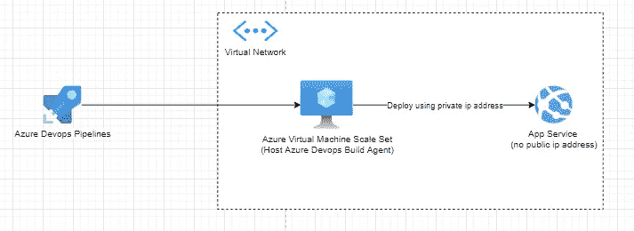
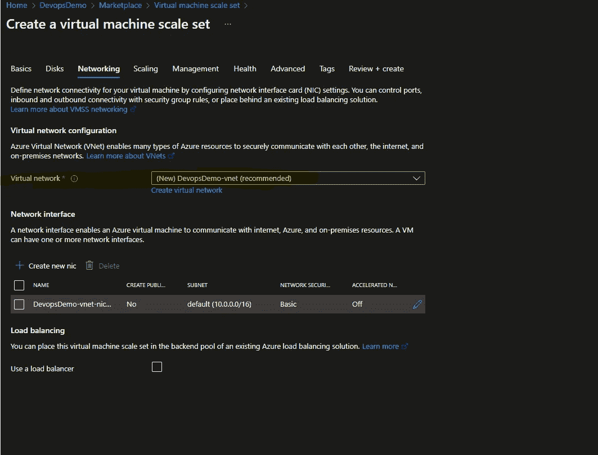
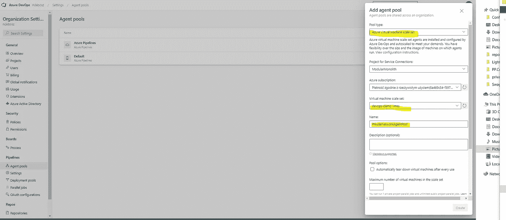
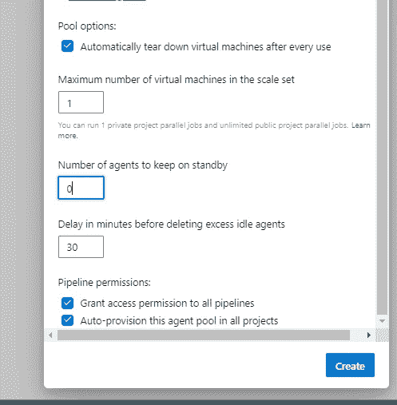
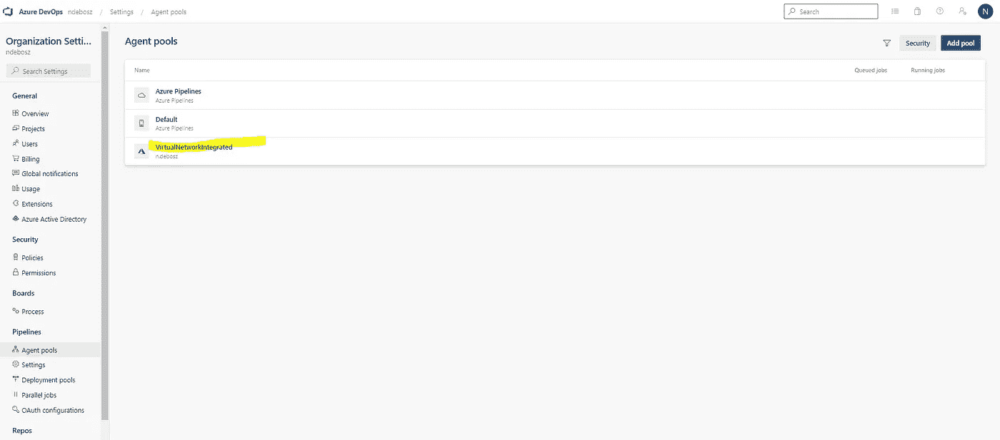
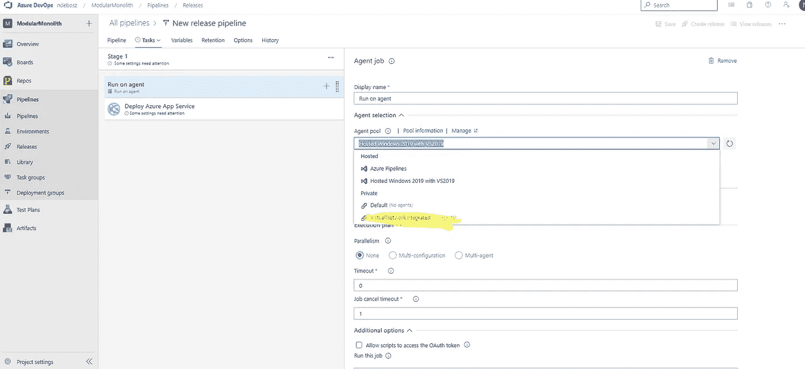
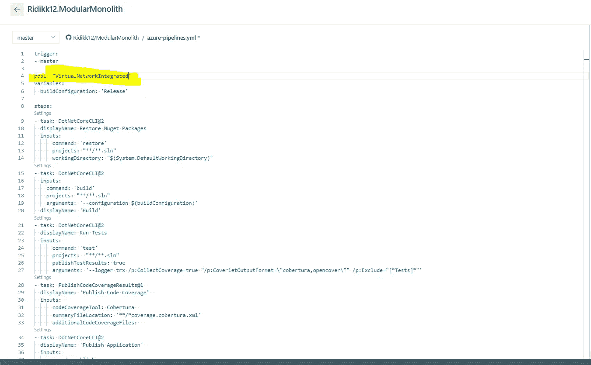

# 从 Azure DevOps 管道将应用程序部署到 Azure App Service 私有端点。

> 原文：<https://itnext.io/deploy-an-application-to-azure-app-service-private-endpoint-from-the-azure-devops-pipeline-f71c7d128dae?source=collection_archive---------1----------------------->

最近，我不得不使用 Azure DevOps 管道来部署 Azure App 服务。
听起来容易吗？我也是这么想的。

有一个陷阱！

应用程序服务已经设置为切断所有公共访问，这意味着应用程序只能从虚拟网络内部通过私有 IP 地址访问。

# 为什么？

一些公司仍然在内部存储大量数据/组件。并非所有这些本地资源都可以迁移到云中。有多种原因，从成本、安全性、时间等等开始。这就是为什么有时我们需要在本地和混合云环境中工作。在这种情况下，公司网络通常不对公共互联网开放，内部和 azure 之间的通信基于 VPN 连接和虚拟网络。这就是为什么一些资源将被限制部署到私有端点，它们不能被公开使用。

知道了为什么我们需要关心这样的事情，我们来看看解决方案。

在这种情况下？部署到此类应用服务的最简单同时又是最好的解决方案是什么？

## 简短回答:

*   Azure 虚拟网络
*   Azure 虚拟机规模集
*   Azure DevOps

使用上面的三个组件，我们将建立一个部署管道来部署我们的。Net 应用程序到私有的 Azure 应用程序服务。

# 理论:

在我们的例子中，VMSS 将是一个自托管 Azure DevOps 代理的容器。从 Azure DevOps 触发的管道将在 VMSS 执行。VMSS 位于专用虚拟网络中，因此它可以解析专用虚拟网络的专用 IP 地址。

# 假设:

*   您已经创建了一个虚拟网络
*   您已经创建了应用服务和应用服务计划

# 实用部分:

在 Azure 门户上，让我们创建一个 Azure 虚拟网络规模集。
这里有很多设置，但出于演示目的，我们将大部分设置保留为默认设置。

我们应该关注“网络选项卡”，在这里，我们需要从虚拟网络列表中选择我们的应用服务所使用的虚拟网络。

**搞定**——真快:)

## Azure DevOps:

在这里，我们需要导航到组织设置->代理池:

在右上角，单击“添加池”，您应该会看到类似这样的内容:

这里的选项非常自我描述。

一些额外选项(取决于您需要使用管道的频率和您的预算):

单击“创建”按钮后，您应该会在列表中看到您的新池:

现在—将用于部署应用服务的池更改为管道中新创建的池。

## 释放管道:

## 构建管道(Yaml 管道)

## 仅此而已！

当您运行管道时，Azure 虚拟机规模集上托管的代理会执行它。由于虚拟机可以访问虚拟网络，它将能够对应用服务进行适当的推送。

# 参考资料:

 [## Azure 虚拟机规模集代理- Azure 管道

### Azure 虚拟机比例集代理，以下简称比例集代理，是一种自托管代理的形式…

learn.microsoft.com](https://learn.microsoft.com/en-us/azure/devops/pipelines/agents/scale-set-agents?view=azure-devops)