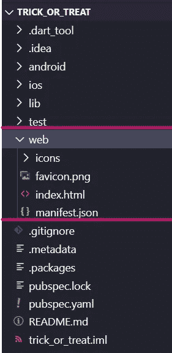
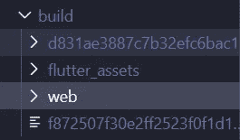
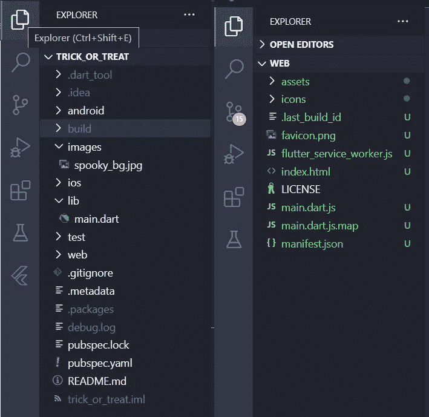
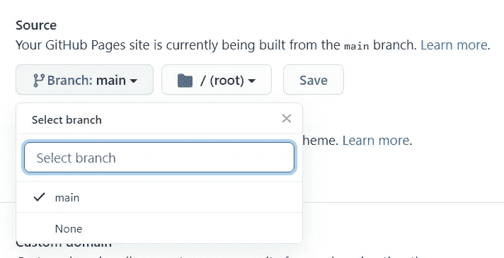
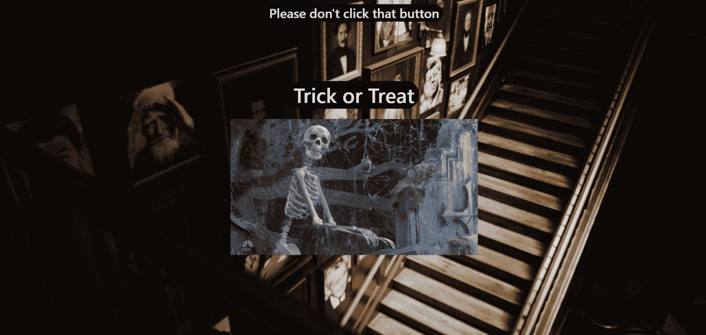

# 专门在 GitHub 页面中部署和维护您的 Flutter Web 构建。

> 原文：<https://itnext.io/deploy-and-maintain-your-flutter-web-build-in-github-pages-exclusively-6dfc3c3ec9cc?source=collection_archive---------1----------------------->

嘿，你有没有想过在没有太多工作和困惑的情况下托管你的 flutter web build？我这里有一个小小的[技巧](http://coderwithabushido.me/trick_or_treat_web/#/)给你。您甚至可以使用现有的存储库来托管新的 flutter web 构建。我们将马上开始工作。

> ***注意*** :在这个例子中，我们将只托管 flutter web 的发布版本并更新它，而不是 GitHub 上的整个 flutter 项目本身(这很简单)。如果您想使用现有的存储库来获得构建文件，这种方法非常有用。

> 请使用 [**花生**](https://medium.com/@kevmoo/show-off-your-flutter-dart-web-app-with-peanut-c0307f2b733c) **不要浪费你的时间读这个，如果你对你的生活有一些爱！这里说的方法是多余的，现在效率也不高。谢了。**

我们将使用 flutter 制作一款**不给糖就捣蛋**网络应用，并在 GitHub 页面上发布。

# 步骤 1:创建一个 flutter web 项目。

要创建一个 flutter web 项目，你必须处于以下 flutter 通道之一:beta、dev 或 master。如果您处于稳定状态，请更换频道并升级，然后继续下一步。

在终端/命令提示符下启用对 flutter-web 的支持:

`$ flutter config --enable-web`

现在，像往常一样创建你的 flutter 项目，它将有 web 支持。如果您想要将 web 支持添加到现有项目中，可以在目录中使用以下命令:

`$ flutter create .`

创建你的 flutter 项目后，你可以检查你是否有`web`目录。这表明你的项目支持 flutter-web。

例子的来源在这页的末尾。

现在，你也可以在 GitHub 上发布。

# 第二步:制作你的颤振网。

您可以使用以下命令为 flutter-web 创建一个发布版本:

`$ flutter build web --release`

现在，你将有一个名为`build`的新目录，你会在其中找到你的`web`版本，就像这样。

现在，如果您查看那个`web`文件夹，您将会找到构建文件。随着 dart 代码 trans 用 HTML 和 CSS 编译成 javascript 代码，构建的起点自然是`index.html`。

# **步骤 3:将构建发布到 GitHub。**

现在，您可以启动一个新的存储库，或者在新的文件夹/位置中克隆一个已有的存储库。

这就是克隆的存储库的样子(我的只是空的)。

然后在真正构建 web 构建之前，将其重命名为`web`并粘贴到`flutter-project/build/`目录中。

现在，你已经做了所有的事情，你可以随时从`flutter-project`编辑你的 flutter 代码并编译它。然后可以从`flutter-project/build/web`提交和推送更改。这减少了我们处理构建文件来托管和维护两个不同存储库的担心，一个用于 flutter 项目，另一个专门用于托管。

> **提示**:您可以将`build`目录添加到您的 flutter 项目文件夹中的`.gitignore`文件中，以避免混淆和重复。

# 第四步:在 GitHub 页面上托管它。

在您成功地推送了从 flutter 项目中获得的构建文件之后，转到存储库页面。然后，导航到**设置**，你会发现一个标题 **GitHub 页面**。选择您的源作为`main`分支并保存。

就这样，你已经成功地用 GitHub 页面托管了你的 flutter web 构建。现在，你可以去你的网站查看你漂亮的网页应用程序(不像我的😜)，方法是单击同一部分下显示的链接。

> **提示:**您也可以使用自定义域，而不仅仅是 username.github.io，方法是在 custom domain 部分指定一个域，并遵循此处的步骤。

你可以在这里查看工作示例[。](http://coderwithabushido.me/trick_or_treat_web/)

颤振项目来源:[颤振项目](https://github.com/coder-with-a-bushido/trick_or_treat)。

各个 web 版本的源代码: [Web 版本](https://github.com/coder-with-a-bushido/trick_or_treat_web)。

欢迎你来挑毛病，来评论，我会修正它们，编辑文章，让它更牛逼。别忘了用掌声展示一下 love❤️！！！

**快乐编码！**

# 我真诚地希望你发现这份材料是有用的，如果你发现了，一定要鼓掌👏并与 Flutter 开发人员分享这篇文章。

如果您在阅读本文时遇到了任何问题，或者您有什么建议，请在下面留下您的评论，我会尽力回复您。

如果你想支持我，你可以请我喝杯咖啡

谢谢你的时间🙌