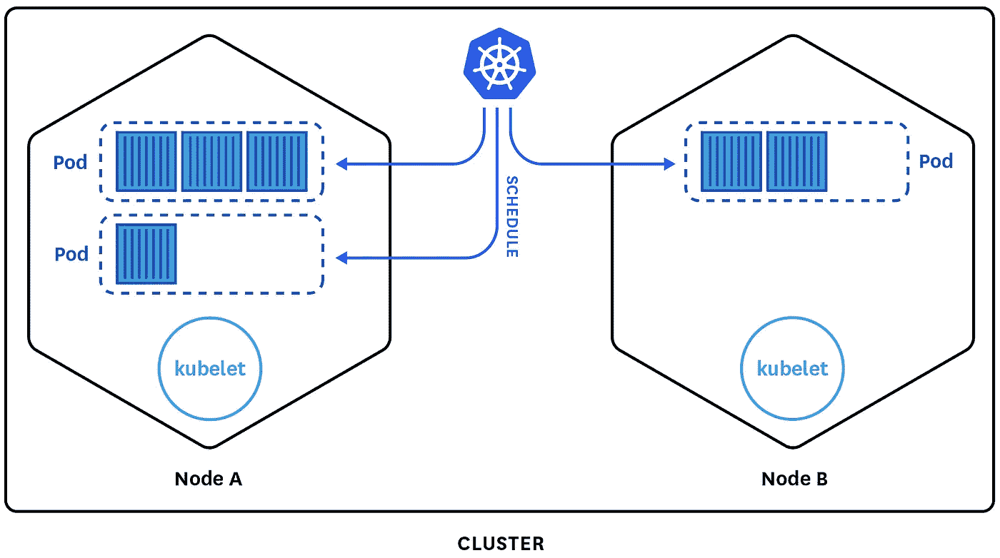
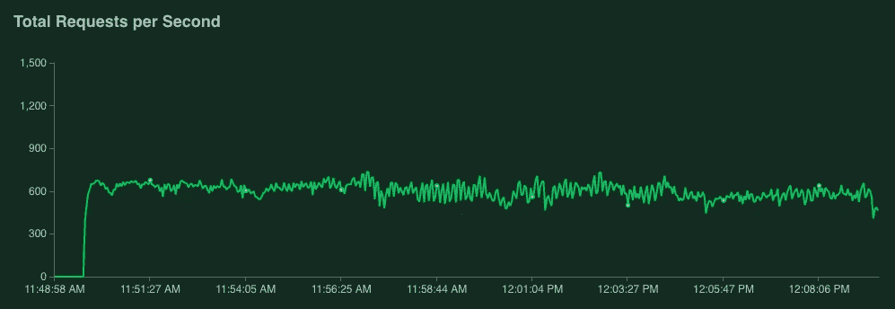
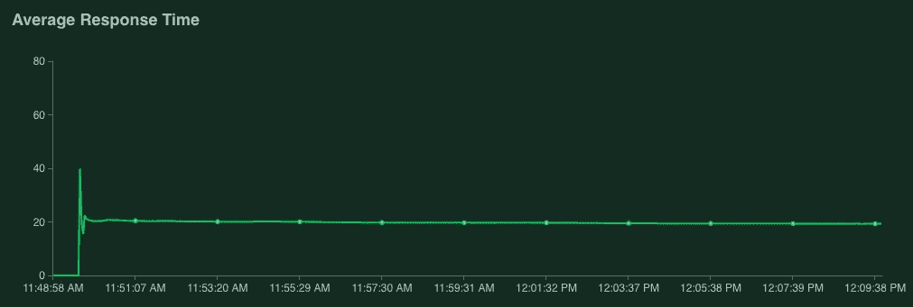
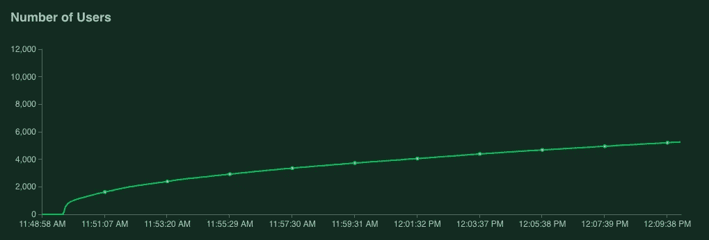
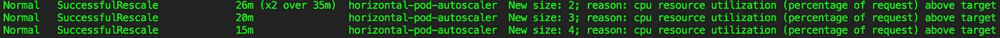
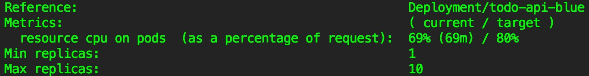

# 在 Kubernetes 上部署和扩展多环境服务

> 原文：<https://itnext.io/deploy-and-scale-a-multi-env-service-on-kubernetes-d2bc52c7575c?source=collection_archive---------3----------------------->



图片来自 Datadog [文章](https://www.datadoghq.com/blog/monitoring-kubernetes-era/)。

在之前的[帖子](http://pstylianides.com/a-go-microservice-using-grpc-and-mongodb/)中，我们使用 [gRPC](https://grpc.io/docs/quickstart/) 框架创建了一个`Go`微服务，并将其打包成一个 [Docker](https://docs.docker.com/get-started/) 容器映像。现在，我们将尝试发布我们的容器，并使其在云中的某个公开位置高度可用。假设我们计划在不久的将来添加一些互连的容器化应用程序，并且需要一种编排平台来轻松管理它们。

Kubernetes 是一个开源系统，最初由 Google 设计，也是最受欢迎的选择之一。目前可用的一些替代(在某些方面)容器编排引擎有: [Apache Mesos](http://mesos.apache.org/) 、 [Docker Swarm](https://docs.docker.com/engine/swarm/) 、 [HashiCorp Nomad](https://www.nomadproject.io/) 和其他一些。

在这篇文章中，我们将使用`Kubernetes`——因为这是我个人最喜欢的，但在未来的文章中，我们将与`Mesos`实现类似的目标——也许比较两者并确定它们的优势。

完整的项目源代码可以从这个 [GitHub repo](https://github.com/stphivos/todo-api-go-grpc) 下载。

# 先决条件

假设您已经对使用 [Docker](https://docs.docker.com/get-started/) 的容器和基本的`Kubernetes`概念有所了解，因为我们不会在本文中详细讨论它们。

此外，确保您已经安装了所需的工具，并且在您的`PATH`中:

*   码头工人 cli
*   Kubernetes cli

最后，您需要有一个 Kubernetes 集群设置。根据您打算使用的提供程序，这里有几个如何做到这一点的选项:

*   对于 GCP，安装 [Google Cloud SDK](https://cloud.google.com/sdk/downloads) 并遵循这个[指南](https://cloud.google.com/kubernetes-engine/docs/how-to/creating-a-container-cluster)。
*   对于 AWS，安装 [Kops](https://github.com/kubernetes/kops/blob/master/docs/install.md) 并遵循此[指南](https://github.com/kubernetes/kops/blob/master/docs/aws.md)。
*   对于 AKS，安装 [Azure CLI](https://docs.microsoft.com/en-us/cli/azure/install-azure-cli?view=azure-cli-latest) 并遵循本[指南](https://docs.microsoft.com/en-us/azure/aks/kubernetes-walkthrough#create-aks-cluster)
*   对于本地，安装 [Minikube](https://github.com/kubernetes/minikube#installation) 并遵循本[指南](https://github.com/kubernetes/minikube#quickstart)。

**注意**:为了能够模拟大量并发用户，请选择一种节点配置，其中核心总数至少达到 8 个 vCPUs。我使用了 2 个集群节点，每个节点有 4 个 vCPUs。

# 目标

*   为部署编写基本的 Kubernetes 清单
*   使用 [GoDotEnv](https://github.com/joho/godotenv) 从. Env 文件管理项目全局变量
*   将 [bg-kube](https://github.com/stphivos/bg-kube) 用于多环境部署工作流
*   使用 [Locust](https://locust.io/) 来定义负载测试和 grpc 客户端
*   创建一个[水平 Pod 自动缩放器](https://kubernetes.io/docs/tasks/run-application/horizontal-pod-autoscale/)，启动负载测试并观察指标

# Kubernetes 载货清单

现在已经有了一个 Kubernetes 集群，我们继续编写第一个清单。

一个`Deployment`清单描述了[容器](https://kubernetes.io/docs/concepts/workloads/pods/pod/)和[复制集](https://kubernetes.io/docs/concepts/workloads/controllers/replicaset/)的期望状态。Pod 是 Kubernetes 中最小的可部署单元，并且知道如何运行容器。ReplicaSet 将确保在任何给定时间，指定数量的 pod 在可用的集群工作节点上运行。因此简单地说，部署允许我们定义所需的 Pod 副本数量，每个副本运行我们的容器的一个实例。

我们可能希望指定多个副本的一个原因是为了实现水平扩展，以便在求助于更多或更高容量的虚拟机之前更好地利用分配的节点，这一过程称为垂直扩展。如需了解更多信息，请查看 Kubernetes 中的[水平 Pod 自动缩放器(HPA)](https://kubernetes.io/docs/tasks/run-application/horizontal-pod-autoscale/) ，它会自动执行此操作。我们得到的一些其他好处是负载平衡和高度可用的服务。

支持我们的 [Go 服务](http://pstylianides.com/a-go-microservice-using-grpc-and-mongodb/)的部署清单如下所示:

关于上面的`yaml`配置文件的几个亮点是:

*   我们使用动态变量，即`$IMAGE_NAME`，在部署过程中注入来自`.env`文件的实际值。
*   我们使用[标签和选择器](https://kubernetes.io/docs/concepts/overview/working-with-objects/labels/)对与我们相关的对象进行分组，以便根据环境/角色等来区分相似的对象。

接下来，我们继续看`Service`清单，它描述了 Kubernetes 神器作为我们的吊舱的负载平衡器。它随时都知道有多少个和哪些单元在运行服务，并且只向这些单元转发流量。与可以被新服务终止和替换的 pod 不同，服务意味着是公开其功能的可靠抽象。

这种服务清单的示例如下所示:

正如你可能已经注意到的，一个`Service`使用[标签选择器](https://kubernetes.io/docs/concepts/overview/working-with-objects/labels/)来确定哪些 pod 属于它的集合。

此外，它可能使用不同于我们的容器实例所使用的端口来公开自己。

# 。环境文件

[之前的](http://pstylianides.com/a-go-microservice-using-grpc-and-mongodb/#entry-point)，在`main.go`的函数`getConfig`中，我们使用 [configor](https://github.com/jinzhu/configor) 库从`config.yaml`文件中加载应用变量。

该库还支持由我们的 [Config](https://github.com/stphivos/todo-api-go-grpc/blob/master/models/models.go#L8) struct 中定义的环境变量覆盖它们的值。现在，我们将根据我们打算部署的环境来设置它们。我们将为每个环境创建一个`.env`文件，即`.env.dev`、`.env.prod`甚至`.env.staging`。

假设生产环境将托管在 [Google Kubernetes 引擎](https://cloud.google.com/kubernetes-engine/)上，这里有一个 **.env.prod** 文件:

更新`CLUSTER_NAME`和`CLUSTER_ZONE`以匹配您的 Kubernetes 集群。同样更新`IMAGE_NAME`以反映如下形式的容器注册:

```
<hostname>/<project-id>/todo-api-go-grpc
```

如果您使用 [Docker Machine](https://docs.docker.com/machine/) 在 Mac 或 Windows 上运行 Docker，请将`DOCKER_MACHINE_NAME`更新为您的虚拟机名称。

最后，使用 [GoDotEnv](https://github.com/joho/godotenv) 库更新`main.go`以添加对`.env`文件的支持:

# 部署工作流程

我们将使用[Helm](https://helm.sh/)——Kubernetes 的一个包管理器，第一次设置我们的[应用程序](https://github.com/stphivos/todo-api-go-grpc)使用的 MongoDB。按照[文档](https://docs.helm.sh/using_helm/#installing-helm)将其安装到您的机器上。

下一步是通过安装`Tiller`将`Helm`初始化到我们的 Kubernetes 集群中。负责管理图表发布(通过 Helm 安装软件包):

```
helm init
```

然后，我们将在默认的`Helm`存储库`stable`下安装`mongodb`图表，并将发布版本命名为`todo-api`:

```
helm install stable/mongodb --name todo-api
```

验证部署箱是否准备就绪:

```
$ kubectl get deployment todo-api-mongodb
NAME               DESIRED   CURRENT   UP-TO-DATE   AVAILABLE   AGE
todo-api-mongodb   1         1         1            1           1m
```

[bg-kube](https://github.com/stphivos/bg-kube) 是我写的一个开源工具，它简化了 Kubernetes 上的多环境蓝绿部署。它可以轻松地将数据库迁移和冒烟测试集成到自动化发布工作流中。使用 Python [PIP](https://pip.pypa.io/en/stable/installing/) 安装:

```
pip install bg-kube
```

使用`bg-kube`，我们只需要从项目根目录运行这个命令:

```
bg-kube publish --env-file .env.prod
```

`publish`命令将执行以下步骤:

1.  使用项目的`Dockerfile`构建一个容器映像，并在提供的`.env`文件中用指定的`IMAGE_NAME`变量标记它。
2.  将映像推送到指定的容器注册表。
3.  创建/更新在`deployment.yaml`中定义的`Deployment`资源，并根据目标(当前不活动)环境将其标记为`blue`或`green`。
4.  如果服务是第一次部署，它还将创建一个`Job`资源，如`db-seed.yaml`中所定义的，该资源将用种子数据填充数据库。
5.  运行提供的冒烟测试命令，验证最新的`Deployment`功能是否符合预期。(我们跳过了这一步)
6.  创建/更新在`service.yaml`中定义的`Service`资源，并指向将处理即将到来的流量的最新`Deployment's`pod。

如果您希望在不安装`bg-kube`的情况下继续操作，您仍然可以使用 [envsubst](https://www.gnu.org/software/gettext/manual/html_node/envsubst-Invocation.html) 来替换 Kubernetes 清单中的环境变量，并通过管道将其传输到`kubectl`，如下所示:

当然，您可以直接在清单中硬编码这些值，但是这意味着您将需要每个环境的不同副本。

验证部署箱是否准备就绪:

```
$ kubectl get deployment todo-api-blue
NAME            DESIRED   CURRENT   UP-TO-DATE   AVAILABLE   AGE
todo-api-blue   1         1         1            1           57s
```

# 定义负载测试

[Locust](https://locust.io/) 是一个负载测试库，它让我们可以很容易地使用 Python 声明性语法模拟大量并发用户。

我们需要做的第一件事是编写一个 [locustfile](https://docs.locust.io/en/latest/writing-a-locustfile.html) 来定义我们的测试以及这些测试如何访问公开的服务。由于没有内置的 gRPC 客户端，我们将编写自己的程序，但是不要担心`Locust`会让我们很容易。

我们首先添加一个公共的`GrpcClient`类，它负责建立与 gRPC 服务器的“通道”,并拦截对 gRPC 服务的调用，以便能够发出`Locust`成功/失败事件。

然后我们添加另一个类`GrpcLocust`，代表访问服务并使用之前的客户端调用其方法的蝗虫群(用户)——在我们的例子中，在 [todos.proto](https://github.com/stphivos/todo-api-go-grpc/blob/master/server/grpc/todos.proto) 中定义的唯一 RPC 方法是`GetTodos`。

你可能已经注意到了，我们正在导入 Python 模块`todos_pb2`和`todos_pb2_grpc`，它们是使用 [gRPC Python 工具包](https://github.com/grpc/grpc/tree/master/tools/distrib/python/grpcio_tools)中的协议缓冲编译器生成的。如果您希望重新生成 Python 接口和存根运行:

```
# Install the grpcio-tools package
$ python -m pip install grpcio-tools# Run the protobuf compiler
$ python -m grpc_tools.protoc \
   -I ./server/grpc \
   --python_out=./loadtest/locust-tasks \
   --grpc_python_out=./loadtest/locust-tasks \
   ./server/grpc/todos.proto
```

`./loadtest`目录也已经包含了以下文件:

*   **deployment.yaml** :描述`locust-master`和`locust-slaves`节点。
*   **service.yaml** :通过[负载均衡器](https://kubernetes.io/docs/concepts/services-networking/service/#type-loadbalancer)服务公开以上内容。
*   **Dockerfile** :为`locust-master`和`locust-slaves`构建一个单独的图像。
*   **. env . dev/. env . prod**:`.env`文件，带有用于`dev`和`prod`环境的变量。
*   **run.sh** :在主/从模式下运行容器映像的 Shell 脚本。

这里的目的是[运行 Locust distributed](https://docs.locust.io/en/latest/running-locust-distributed.html) ，这样我们就可以产生大量的客户端请求。那么为什么不依靠 Kubernetes `ReplicaSet`资源来处理呢？使用`bg-kube`，让我们通过运行与之前相同的命令将蝗虫主服务器&从服务器部署到 Kubernetes，但是从`./loadtest`目录:

```
bg-kube publish --env-file .env.prod
```

验证部署箱是否准备就绪:

```
$ kubectl get deployment -l role=load-tests
NAME            DESIRED   CURRENT   UP-TO-DATE   AVAILABLE   AGE
locust-master   1         1         1            1           2m
locust-worker   14        14        14           14          2m
```

# 启动负载测试

首先，为展开设置一个[水平吊舱自动缩放器](https://kubernetes.io/docs/tasks/run-application/horizontal-pod-autoscale/):

```
kubectl autoscale deployment todo-api-blue \
   --min=1 --max=10 --cpu-percent=80
```

然后启动`Locust` web 界面:

```
open "http://`kubectl get service locust-master \
   -o jsonpath='{$.status.loadBalancer.ingress[0].ip}'`:8089"
```

选择模拟`10,000 users`，产卵率为`1000 users p/s`，点击`Start swarming`。

现在，让我们观察自动缩放如何对我们的负载测试做出反应，使用如下:

```
watch kubectl describe hpa todo-api-blue
```

在我的例子中，我让`Locust`运行了大约 20 分钟。



副本的数量从`1`稳步上升到`4`，并且稳定在那里，因为 CPU 利用率保持在`69%`左右，同时平均每秒处理大约 700 个请求。



正如您从下面的汇总统计数据中看到的，在测试期间，我们总共服务了`791,711`个`0 failures`请求，平均响应时间为`19ms`:


# 总结

如果你有任何问题，请在下面留下评论或使用本报告的 [Github 问题跟踪器](https://github.com/stphivos/todo-api-go-grpc/issues)。

感谢阅读，希望这篇帖子对你有所帮助！

*原载于【pstylianides.com】[](http://pstylianides.com/deploy-and-scale-a-multi-env-service-on-kubernetes/)**。***