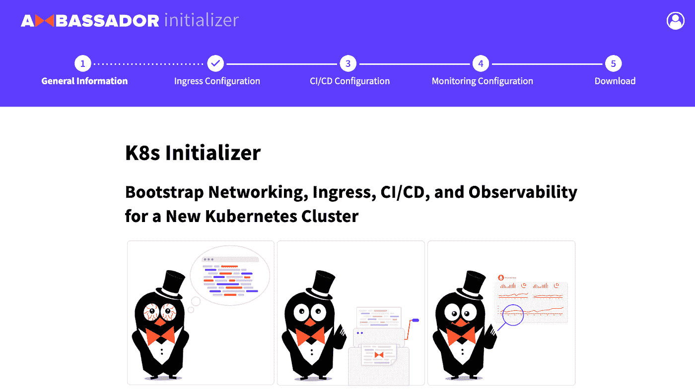

# 分三步部署带有入口和 TLS 的 Argo CD:不需要 YAML 牦牛毛

> 原文：<https://itnext.io/deploy-argo-cd-with-ingress-and-tls-in-three-steps-no-yaml-yak-shaving-required-bc536d401491?source=collection_archive---------1----------------------->


在您的 Kubernetes 集群中安装 Argo CD 很容易，但是将它作为服务提供给团队的其他成员却很有挑战性。虽然 Argo CD 文档[提供了配置入口、TLS 和服务端口的指令](https://argoproj.github.io/argo-cd/operator-manual/ingress/)，但并不是每个工程师都觉得这很容易做到，或者他们不想参与操作细节。

本教程使用 K8s 初始化器来自动生成所有必要的安装 YAML，然后引导您完成配置 Argo CD 的过程，以连续部署一个应用程序，该应用程序在互联网上向最终用户公开。

# 先决条件

在本教程中，我们将从零开始，在 GKE 上运行一个空的 Kubernetes 集群。我们选择了 GKE，这样我们就可以分享 Argo CD 如何安全地公开给一组开发人员，而不是将演示局限于低调的本地和私人环境。当然，如果您希望只使用您的工作站，您可以在一分钟内创建一个`[Kind](https://kind.sigs.k8s.io/)`集群。

本教程还假设您已经下载并安装了`[kubectl](https://kubernetes.io/docs/tasks/tools/install-kubectl/)`和`[argocd](https://argoproj.github.io/argo-cd/cli_installation/)` CLI。

# 您环境中的引导网络和入口

从零开始，我们将使用位于 [app.getambassador.io](https://app.getambassador.io) 的 K8s 初始化器，通过几次点击，用所有需要的工具搭建我们的 Kubernetes 环境。



K8s 初始化器将询问关于您的目标 Kubernetes 集群、您的负载平衡器以及您希望在哪里终止 TLS 的问题。它将为您提供配置 CI/CD 的选项，Argo 是显而易见的选择，以及监控。回答完问卷后，K8s 初始化器将生成一个 zip 文件，其中包含一组 YAML 文件，准备安装到您的远程集群上。

现在就试试:[https://app . getambassador . io](https://app.getambassador.io/)。

按照类似向导的 K8s 初始化问卷，我们选择了我们的目标 Kubernetes 集群:“Google Kubernetes 引擎”和“Google 外部负载平衡器(L4)”负载平衡器。由于所有主要的云提供商都支持 Kubernetes，因此它们的实现和支持往往存在细微的差异，这使得很难配置入口控制器来公开公共流量。K8s 初始化器会给我们提供一个最优的配置。

我们为我们的安装选择了主机名。我们选择了一个我们可以控制 DNS 的主机名，以便在我们的 DNS 区域中建立一个公共入口。

下一步是选择我们的 CI/CD 配置。显而易见的选择是将 Argo CD 与 Ambassador Edge Stack 放在一起。在这个演示中，我们允许匿名用户访问，并设置了一个虚拟的临时管理员密码。

# 根据说明安装 Ambassador Edge 堆栈

K8s 初始化器为我们提供了一套现成的 YAML 文件和指令。我们差不多完成了，现在可以下载一个 zip 文件，其中包含一组 YAML 文件，准备安装在我们的远程集群上。按照说明中的指示，按照`kubectl apply`命令安装所有组件非常简单。

## 设置 DNS

现在我们已经部署了 Ambassador Edge Stack，我们需要用我们的云提供商分配给`ambassador`服务的外部地址来更新您的主机名的 DNS 条目。

```
kubectl get service -n ambassador ambassador \
  -o jsonpath='{.status.loadBalancer.ingress[0]}'
```

导航到我们的 DNS 提供商管理界面，我们用上面的输出值为我们选择的$HOSTNAME 创建或更新 DNS 条目。

完成 Ambassador Edge Stack 安装说明后，我们可以创建其他用户定义的资源配置(如果有)。

```
kubectl apply -f 3-user.yml
```

DNS 传播和 TLS 证书生成可能需要几分钟时间，具体取决于您的云提供商。

# 安装 Argo CD

按照 K8s 初始化器提供的说明，Argo CD 的安装非常简单，因为所有需要的资源都预先配置在下载的 YAML 文件中。说明书上说我们应该运行:

```
kubectl apply -n argocd -f 4-argocd.yml
```

## 访问和使用 Argo 光盘

给 Argo CD 几秒钟的启动时间，然后我们将能够使用`argocd` CLI、默认的`admin`用户名和我们之前选择的临时密码登录到安装。

```
argocd login $HOSTNAME --grpc-web-root-path /argo-cd
```

现在当然是更改临时密码的好时机！

通过导航到[https://$HOSTNAME/Argo-CD](https://$HOSTNAME/argo-cd)，Argo UI 也可以在相同的$ HOSTNAME 下使用。请注意，当访问 Argo CD 时，我们没有收到任何可怕的浏览器警告，因为 Ambassador Edge 堆栈正在使用可信证书处理安全连接。

# 创建 Argo 留言簿应用程序

然后让我们使用 Argo CD 部署一个示例应用程序。我们从 Argo 应用程序的所有可用示例中挑选了[留言簿。](https://github.com/argoproj/argocd-example-apps)

首先，让我们花点时间确保我们的目标 Kubernetes 集群已经用 Argo `ServiceAccount`和`ClusterRole`设置好了:

```
argocd cluster add $(kubectl config current-context)
```

使用 CLI 创建 Argo 应用程序资源非常简单。使用 Argo UI 也可以很好地完成这一步。

```
argocd app create guestbook \
 --repo [https://github.com/argoproj/argocd-example-apps.gi](https://github.com/argoproj/argocd-example-apps.git)t \
 --path guestbook \
 --dest-server [https://kubernetes.default.sv](https://kubernetes.default.svc)c \
 --dest-namespace default
```

为了完成安装，我们需要同步应用程序并监控其可用性。

```
argocd app sync guestbook
argocd app list
```

我们现在知道已经部署了留言簿应用程序，但不幸的是，我们无法访问它…

# 为我们的留言簿创建一个入口路径

使用 Ambassador Edge Stack 公开任何服务都非常容易。给定安装了 getambassador.io CRDs 的 K8s 初始化器，我们可以利用映射资源来告诉入口控制器如何处理和路由来自互联网的流量到我们的私有应用。

运行以下命令创建映射:

```
echo ‘---
apiVersion: getambassador.io/v2
kind: Mapping
metadata:
 name: guestbook-ui
 namespace: default
spec:
 prefix: /guestbook/
 rewrite: /
 service: guestbook-ui:80
‘ | kubectl apply -f -
```

## 访问留言簿

与 Argo UI 非常相似，我们的留言簿示例应用程序现在也可以在相同的＄HOSTNAME 下获得，方法是导航到[https://＄HOSTNAME/guest book/](https://$HOSTNAME/guestbook/)。Ambassador Edge 堆栈将再次提供公共信任的 TLS 证书，并将流量适当地路由到我们的私人留言簿服务。

# 了解更多信息

在本教程中，我们展示了如何使用 ArgoCD 和 Ambassador Edge 堆栈配置您的 Kubernetes 集群，以便持续部署 Kubernetes 应用程序并将其公开到互联网。在 K8s 初始化器的帮助下，只需点击几下鼠标就可以生成所有需要的 YAML。

要了解有关这些工具的更多信息，请查看以下资源:

*   [逃离](https://argoproj.github.io/argo/)
*   [大使缘栈](https://www.getambassador.io)
*   [蓉城萧条](https://argoproj.github.io/community/join-slack)
*   [大使懈频道](http://d6e.co/slack)