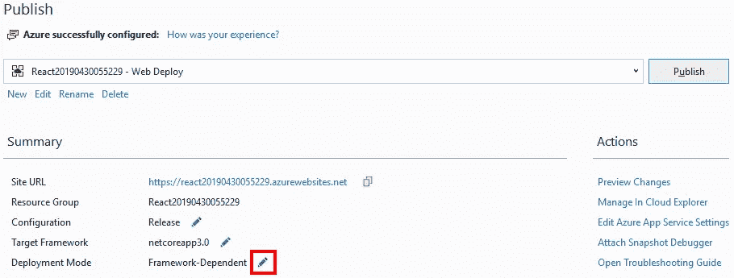
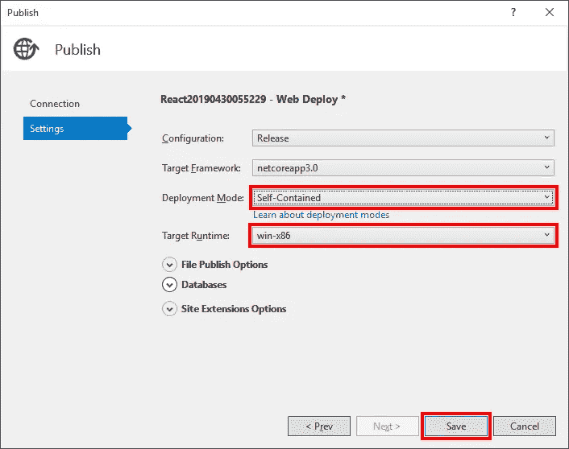

# 将 ASP.NET 核心 3 预览版部署到 Azure 应用服务

> 原文：<https://itnext.io/deploy-asp-net-core-3-previews-to-azure-app-service-e6d57618a151?source=collection_archive---------9----------------------->

我花了一些时间来体验 ASP.NET Core 3 的一些特性，我需要一个地方来托管我正在体验的一些应用程序。Azure App Services 一直是这类事情的好去处，但正如你将在下面的细节中看到的，它目前默认不支持 ASP.NET 核心 3。

这篇文章将介绍如何创建一个新的 ASP.NET Core 3 React 应用程序，并使用默认设置将其发布到一个新的应用程序服务中，然后向您展示如何更改以运行该应用程序。

## 示例应用程序

我用了下面的。NET CLI 命令使用 React 为其前端创建一个新的 ASP.NET 核心应用程序。

```
dotnet new react
```

创建过程完成后，在 Visual Studio 中打开该项目。我强烈推荐使用 [Visual Studio 2019 预览版](https://visualstudio.microsoft.com/vs/preview/)与任何。NET Core 3 应用程序。

## 发布到应用服务

在 Visual Studio 的解决方案浏览器中，右键单击项目文件并选择**发布**。


选择**应用服务**作为发布目标。在这里，我们正在创建一个新的应用服务。接下来，点击**发布**。


下一个对话框显示将要创建的新应用服务的信息。我在很大程度上接受了默认值。我确实为这个应用程序创建了一个新的资源组，以便将来更容易清理这些资源。我也改变了主机计划到免费层。点击**创建**继续。


## 错误和警告

作为发布过程的一部分，浏览器将打开应用程序的地址。发生这种情况时，您会看到一个关于 ANCM 进程内处理程序加载失败的错误(如果您使用的是 IIS 进程内宿主)。


如果回头看看 Visual Studio，您会看到下面的警告，提示您的应用程序需要。NET Core runtime 3.0 和 App Service 最高只支持 2.2。


## 修复

关闭上面的对话框后，您将看到我们在上面创建的发布配置文件的摘要。点击**部署模式**的**框架相关**值旁边的**插针**。



在弹出的对话框中，将**部署模式**设置为**自包含**，并为您的 App 服务选择一个合适的**目标运行时**。在这个部署到 Windows 应用服务的示例中，我们使用的是 **win-x86** 。



返回发布配置文件摘要屏幕，单击**发布**按钮，使用新设置将应用程序重新部署到 App Service。当这个过程结束时，您应该看到浏览器加载了您的应用程序，运行正常。

## 包扎

这是能够进行自包含部署的强大力量的一个很好的例子。如果这个选项不存在，那么我们将没有选择运行。应用服务上的 NET Core 3 应用。

*原载于*[](https://elanderson.net/2019/06/deploy-asp-net-core-3-previews-to-azure-app-service/)**。**