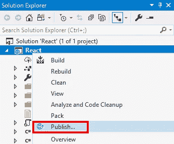
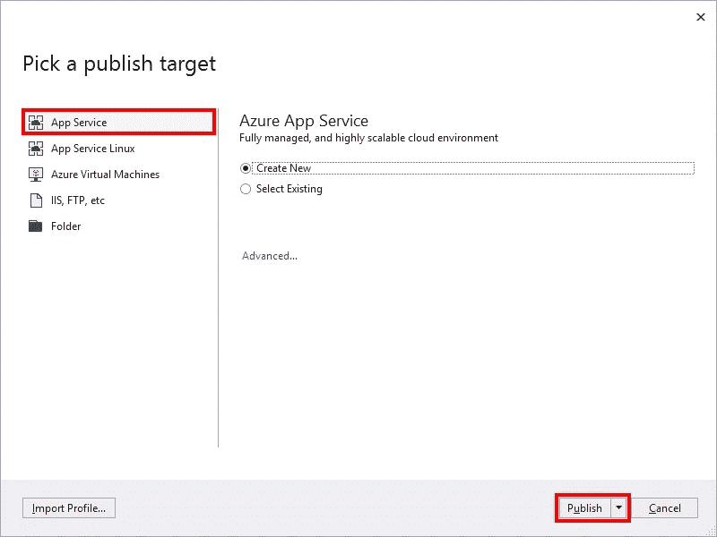
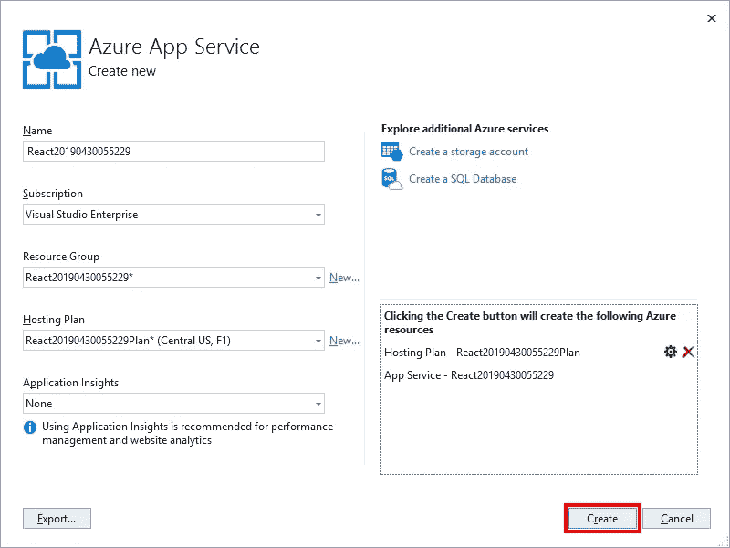
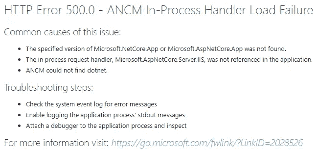
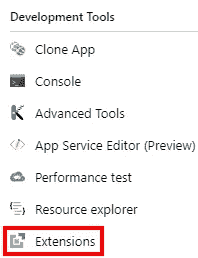
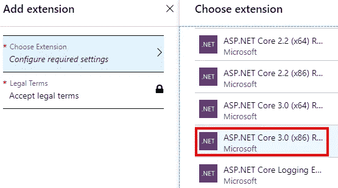
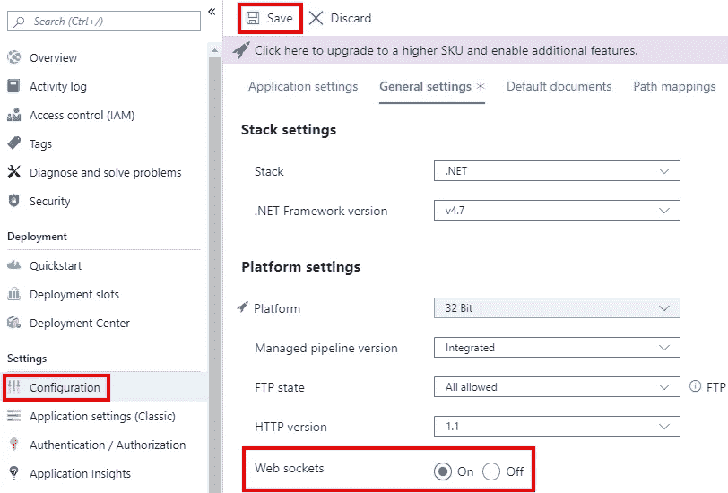

# 使用扩展将 ASP.NET 核心 3 预览版部署到 Azure 应用

> 原文：<https://itnext.io/deploy-asp-net-core-3-previews-to-azure-app-using-extensions-339117ccc25f?source=collection_archive---------3----------------------->

几周前，当帖子[将 ASP.NET Core 3 预览版部署到 Azure 应用服务](https://elanderson.net/2019/06/deploy-asp-net-core-3-previews-to-azure-app-service/)时，我收到了一封来自 [Jerrie Pelser](https://www.jerriepelser.com/) 的电子邮件，他指出应用服务有可用的扩展，允许使用 ASP.NET Core 3 的公共预览版，而不必进行自包含部署。

除了 Jerrie 的建议 [pajaybasu](https://www.reddit.com/user/prajaybasu/) 在[这篇 Reddit 帖子](https://www.reddit.com/r/dotnet/comments/bwgd3k/deploy_aspnet_core_3_previews_to_azure_app_service/epycyyl?utm_source=share&utm_medium=web2x)中指出，使用 Docker 是另一种选择。Pajaybasu 还指出了我在原始帖子中的一句话，即自包含部署是唯一的选择，这当然是不正确的。

这篇文章的前半部分将和最初的文章一样，涵盖了 Azure 应用服务的创建和首次发布。后半部分将介绍如何使用一个扩展来启用 ASP.NET 核心的预览版。

## 示例应用程序

我用了下面的。NET CLI 命令使用 React 为其前端创建一个新的 ASP.NET 核心应用程序。

```
dotnet new react
```

创建过程完成后，在 Visual Studio 中打开该项目。我强烈推荐使用 [Visual Studio 2019 预览版](https://visualstudio.microsoft.com/vs/preview/)与任何。NET Core 3 应用程序。

## 发布到应用服务

在 Visual Studio 的解决方案资源管理器中，右键单击项目文件并选择**发布**。



选择**应用服务**作为发布目标。在这里，我们正在创建一个新的应用服务。接下来，点击**发布**。



下一个对话框显示将要创建的新应用服务的信息。我在很大程度上接受了默认值。我确实为这个应用程序创建了一个新的资源组，以便将来更容易清理这些资源。我也改变了主机计划到免费层。点击**创建**继续。



## 错误和警告

作为发布过程的一部分，浏览器将打开应用程序的地址。发生这种情况时，您会看到一个关于 ANCM 进程内处理程序加载失败的错误(如果您使用的是 IIS 进程内宿主)。



如果回头看看 Visual Studio，您会看到下面的警告，提示您的应用程序需要。NET Core runtime 3.0 和 App Service 最高只支持 2.2。由于我们将在应用服务中修复此问题，我建议选择**不要在未来执行检查(仅此个人资料)**。


## 另一个修复

对于此版本的修复，请前往您在 [Azure 门户](https://portal.azure.com)中的应用服务。在**开发工具**下的菜单中，选择**扩展**选项。



在下一页，点击顶部的**添加**按钮。点击**选择扩展**并选择**ASP.NET 核心 3.0 (x86)运行时**选项。



接下来，点击**法律条款**，阅读条款，如果您同意条款，然后点击**确定**按钮。然后，您必须点击添加扩展刀片上的**确定**，这将开始扩展安装。

如果您在此时加载您的站点，您仍然会得到 500 错误。在**设置**下点击**配置**并点击**通用设置**打开上的**网络插座并点击**保存**。**



此时，您的站点应该可以工作了。您也可以返回并关闭 web sockets，网站将继续工作。我不知道切换 web sockets 做了什么让一切开始工作，但感谢[这个](https://github.com/aspnet/AspNetCore/issues/10509#issuecomment-496749510)对 GitHub 问题的评论是让这一切工作的关键。

## 包扎

希望在这篇文章和上一篇使用自包含部署的文章之间，您在尝试。带 App 服务的 NET Core 3。

*最初发表于* [*埃里克·安德森*](https://elanderson.net/2019/07/deploy-asp-net-core-3-previews-to-azure-app-using-extensions/) *。*