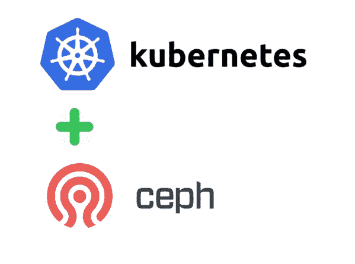

# 部署 Ceph，与 Kubernetes 集成

> 原文：<https://itnext.io/deploy-ceph-integrate-with-kubernetes-9f88097e605?source=collection_archive---------0----------------------->



为每个 pod 手动创建卷是一项困难的工作，因此 Kubernetes 上的存储类为我们提供了自动声明持久卷的能力。

为此，我们应该部署 Ceph、GlusterFS 和其他工具。我在这里部署我们的 Ceph 集群，然后将它作为一个存储类逐步集成到我们的 Kubernetes 集群中。

在我的 [**GITHUB**](https://github.com/hosein-yousefii/Ceph-Kuberentes.git) 上找到这篇文章的资源库。

# 介绍

**什么是 Ceph？**
Ceph 是一款开源软件定义存储解决方案，旨在满足现代企业的数据块、文件和对象存储需求。其高度可扩展的架构使其成为高增长块存储、对象存储和数据湖的新标准。Ceph 提供可靠且可扩展的存储，同时将资本支出和 OPEX 成本控制在基本商品硬件价格范围内。

什么是 Ceph RBD？
RADOS Block Device(RBD)是一款软件，用于在开源 Ceph 分布式存储系统中存储基于块的数据。

RBD 软件将基于块的应用程序数据分解成小块。数据块随后作为对象存储在可靠的自治分布式对象存储(RADOS)中。RBD 在整个 Ceph 存储集群中协调虚拟块设备中的对象存储。这些块设备在虚拟上相当于物理磁盘驱动器。

**什么是 StorageClass？**
存储类别为管理员提供了一种描述他们提供的存储“类别”的方式。

**什么是 PVC？**
PVC 是为永久存储提供特定类型和配置的请求。要指定您想要的持久存储风格，您可以使用 Kubernetes 存储类。

# 开始部署的时间:

**要求:**

3 个 Ubuntu 20–04 节点。
每个节点上 1 个原始磁盘。

我的情况:
192 . 168 . 100 . 201 ceph 1
192 . 168 . 100 . 202 ceph 2
192 . 168 . 100 . 203 ceph 3

**完美地遵循这些步骤:**

2)将这 3 个节点添加到每个/etc/hosts 文件中:

```
echo “””
127.0.0.1 localhost
# Ceph nodes
192.168.100.201 ceph1
192.168.100.202 ceph2
192.168.100.203 ceph3
“”” > /etc/hosts
```

3)设置每个节点的主机名:

```
hostnamectl set-hostname ceph1
exec bash
```

4)安装一些依赖项(在 ceph1 上):

```
apt -y install software-properties-common git curl vim bash-completion ansible
```

5)安装 Cephadm(在 ceph1 上):

```
curl — silent — remote-name — location [https://github.com/ceph/ceph/raw/octopus/src/cephadm/cephadm](https://github.com/ceph/ceph/raw/octopus/src/cephadm/cephadm)
chmod +x cephadm
mv cephadm /usr/local/bin/
```

6)生成密钥并复制到您的节点(在 ceph1 上):

```
ssh-keygen
ssh-copy-id root@ceph1
ssh-copy-id root@ceph2
ssh-copy-id root@ceph3
```

7)克隆此存储库(在 ceph1 上):

```
mkdir ceph
cd ceph
git clone [https://github.com/hosein-yousefii/Ceph-Kuberentes.git](https://github.com/hosein-yousefii/Ceph-Kuberentes.git)
cd Ceph-Kuberentes
```

8)更改 ssh 配置(在 ceph1 上):

```
tee -a ~/.ssh/config<<EOF
Host *
 UserKnownHostsFile /dev/null
 StrictHostKeyChecking no
 IdentitiesOnly yes
 ConnectTimeout 0
 ServerAliveInterval 300
EOF
```

9)创建可行库存(在 ceph1 上):

```
echo “””
[ceph_nodes]
ceph1
ceph2
ceph3
“”” > hosts-inventory.yaml
```

10)运行行动手册以安装软件包(在 ceph1 上):

```
ansible-playbook -i hosts-inventory.yaml prepare-ceph-nodes.yml — user root
```

11)重新启动所有节点。

12)在 ceph1 上，通过添加节点和监视器来配置 ceph 集群:

```
cephadm bootstrap — mon-ip 192.168.100.201 — initial-dashboard-user admin — initial-dashboard-password qazwsxceph orch host add ceph2 192.168.100.202
ceph orch host add ceph3 192.168.100.203
```

为监视器添加标签(在 ceph1 上):

```
ceph orch host label add ceph1 mon
ceph orch host label add ceph2 mon
ceph orch host label add ceph3 mon
```

应用配置(在 ceph1 上):

```
ceph orch apply mon ceph2
ceph orch apply mon ceph3
```

列出主机(在 ceph1 上):

```
ceph orch host ls
```

为 osd 添加标签(在 ceph1 上):

```
ceph orch host label add ceph1 osd
ceph orch host label add ceph2 osd
ceph orch host label add ceph3 osd
```

几分钟后，您应该可以通过执行以下命令(在 ceph1 上)看到原始磁盘:

```
ceph orch device ls
```

向 osd 添加磁盘的时间(在 ceph1 上):

```
ceph orch daemon add osd ceph1:/dev/sdb
ceph orch daemon add osd ceph2:/dev/sdb
ceph orch daemon add osd ceph3:/dev/sdb
```

13)等待直到所有 docker 容器在所有节点上启动并运行:

```
docker ps
```

14)然后您将能够在 Ceph dashboard 上找到您的磁盘。 [https://ceph1:8443](https://ceph1:8443)

15)为 kubernetes 创建一个池(在 ceph1 上):

```
ceph osd pool create k8s
rbd pool init k8s
```

16)创建一个用户从 kubernetes(在 ceph1 上)访问 Ceph 集群:

```
ceph auth get-or-create client.kube mon ‘profile rbd’ osd ‘profile rbd pool=k8s’ mgr ‘profile rbd pool=k8s’
```

17)查找您的显示器 IP 地址(在 ceph1 上):

```
ceph mon dump
```

18)找到您的 Ceph 集群 ID(在 ceph1 上):

```
ceph -s
```

19)登录到您的 kubernetes 集群或您可以访问 kubectl 的地方，然后复制或克隆*。yaml 文件到它。

20)根据您的 Ceph 集群监视器和 ID 更改 csi-config-map.yaml。

21)根据稍后在 ceph1 上为 kubernetes 集群创建的用户和密钥，更改 csi-rbd-secret.yaml

22)根据您的 ceph 集群 ID 和池名称(k8s)更改 csi-rbd-sc.yaml

23)部署清单:

```
kubectl apply -f csi-config-map.yaml
kubectl apply -f csi-kms-config-map.yaml
kubectl apply -f ceph-config-map.yaml
kubectl apply -f csi-rbd-secret.yaml
kubectl apply -f [https://raw.githubusercontent.com/ceph/ceph-csi/master/deploy/rbd/kubernetes/csi-provisioner-rbac.yaml](https://raw.githubusercontent.com/ceph/ceph-csi/master/deploy/rbd/kubernetes/csi-provisioner-rbac.yaml)
kubectl apply -f [https://raw.githubusercontent.com/ceph/ceph-csi/master/deploy/rbd/kubernetes/csi-nodeplugin-rbac.yaml](https://raw.githubusercontent.com/ceph/ceph-csi/master/deploy/rbd/kubernetes/csi-nodeplugin-rbac.yaml)
kubectl apply -f csi-rbdplugin-provisioner.yaml
kubectl apply -f csi-rbdplugin.yaml
kubectl apply -f csi-rbd-sc.yaml
```

24)检查 csi pods 是否正在运行:

```
kubectl get po
```

25)创建一个 PVC 以检查存储类是否正常运行:

```
kubectl apply -f raw-block-pvc.yaml
kubectl apply -f fs-pvc.yaml
```

**这就是你要做的一切。尽情享受吧！**

如有任何问题，请与我联系。