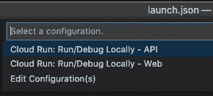
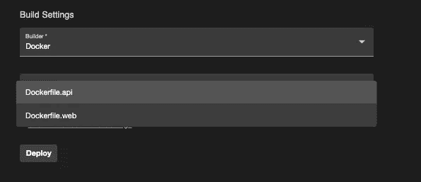

# 在 Nx 工作区中部署 Nodejs 项目的云运行

> 原文：<https://itnext.io/deploy-cloud-run-for-nodejs-projects-in-nx-workspace-ac1611f17f4e?source=collection_archive---------3----------------------->


[https://unsplash.com/photos/4RCvKbu_kcY](https://unsplash.com/photos/4RCvKbu_kcY)

> **Nx** 是一套强大的可扩展开发工具，可帮助您设计、测试和构建任何规模的软件——与现代技术和库无缝集成，同时提供强大的 CLI、缓存、依赖管理等功能。

我正计划开发多个[云运行](https://cloud.google.com/run)项目，也想利用 monorepo 共享库&服务。

这种集成的文档很难找到，即使您尝试 Google 一下。因此，我在这里，试图让它发生。这是第一步，还有改进流程的空间。

**在 Nx 中创建一个 Express 节点项目**

建立一个 Nx 工作空间

```
npx create-nx-workspace myworkspace --preset=empty
```

**创建快递节点项目**

```
yarn add -D @nrwl/expressnx generate @nrwl/express:application <express-app>
```

**设置本地云运行**

我使用的[云代码](https://cloud.google.com/code/docs/vscode/quickstart-cloud-run#installing_cloud_code)是一个插件，支持云运行& Kubernetes 的本地开发&部署。

**准备 Dockerfile & Vscode 设置**

对于 Nx Workspace 中的不同项目，我使用以下命名约定。

```
# Dockerfile.api - for api project# Use the official lightweight Node.js 14 image.
FROM node:14-slim# Create and change to the app directory.
WORKDIR /usr/src/app# Copy application dependency manifests to the container image.
COPY package*.json ./
COPY yarn.lock ./
COPY decorate-angular-cli.js ./# Install dependencies.
RUN yarn# Copy local code to the container image.
COPY . ./# Build the app
RUN yarn build:api --production# Run the web service on container startup.
CMD ["node", "./dist/apps/api/main.js"]
```

而对于**。vscode/launch.json**

```
{
  "configurations": [
    {
      "name": "Cloud Run: Run/Debug Locally - API",
      "type": "cloudcode.cloudrun",
      "request": "launch",
      "build": {
        "docker": {
          "path": "Dockerfile.api"
        }
      },
      "image": "workspace-name",
      "service": {
        "name": "workspace-name",
        "containerPort": 8080,
        "resources": {
          "limits": {
            "memory": "256Mi"
          }
        }
      },
      "target": {
        "minikube": {}
      },
      "watch": true
    },
    {
      "name": "Cloud Run: Run/Debug Locally - Web",
      ......
    }
  ]
}
```

有了这个设置，每次在本地运行或部署时，您都会看到使用哪个 docker 文件的选项。



本地选项



部署选项

之后，您已经为 Nx Workspace 中的本地云运行开发做好了一切准备。


云运行正在 localhost:8080 上运行

这是我的实验，如果你有更好的选择，请帮助改进它🙏