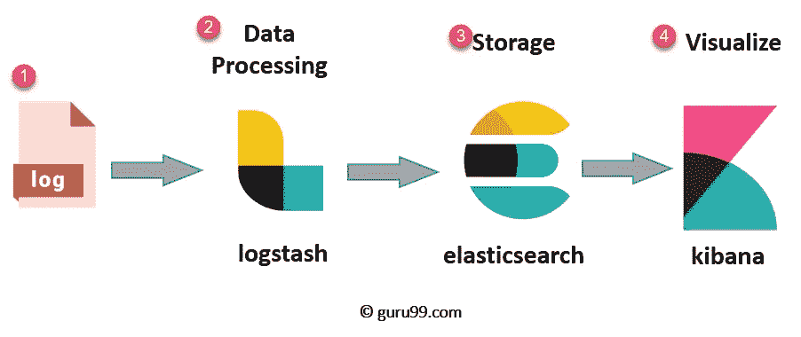
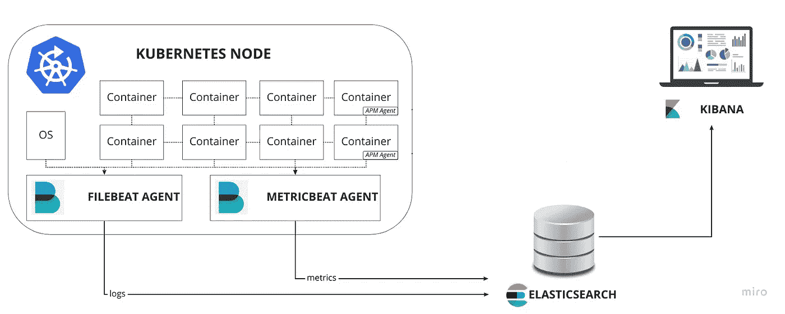
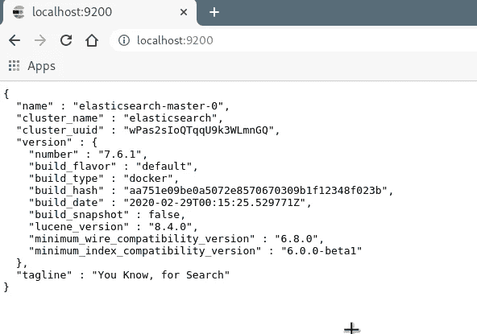
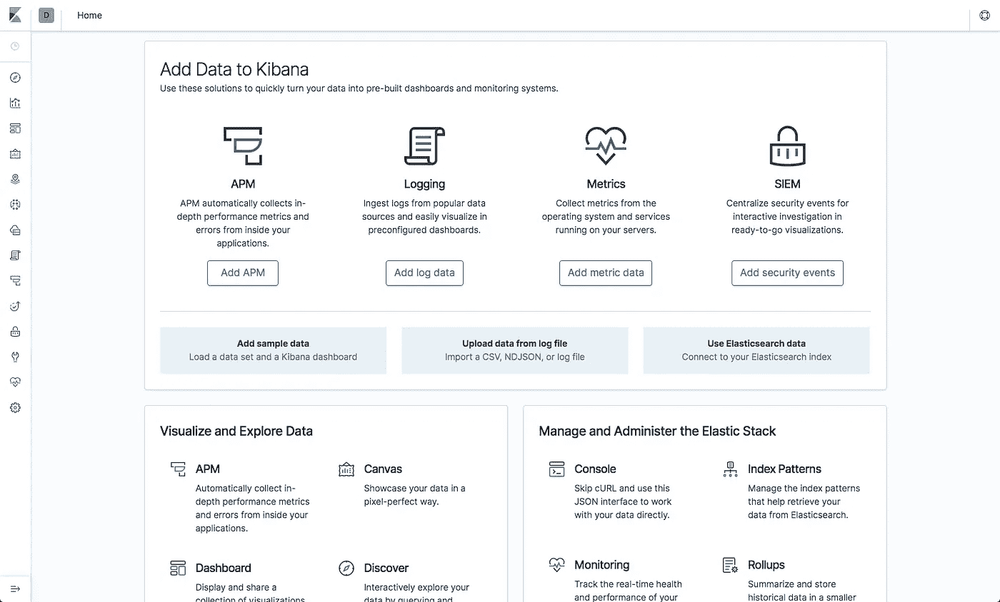
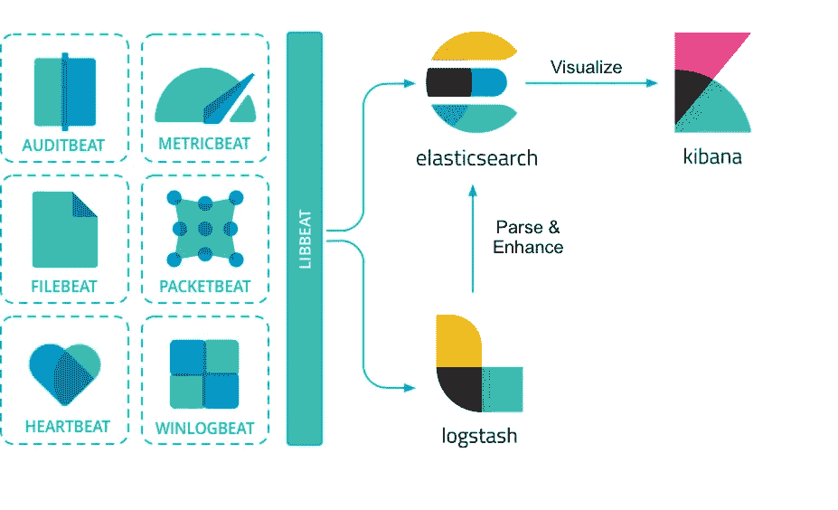
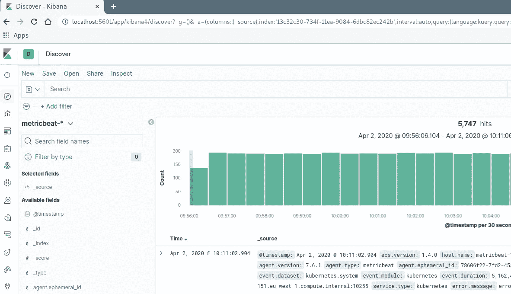
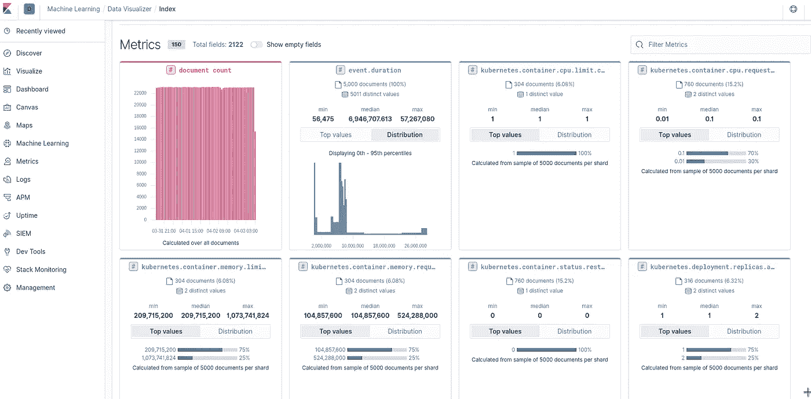
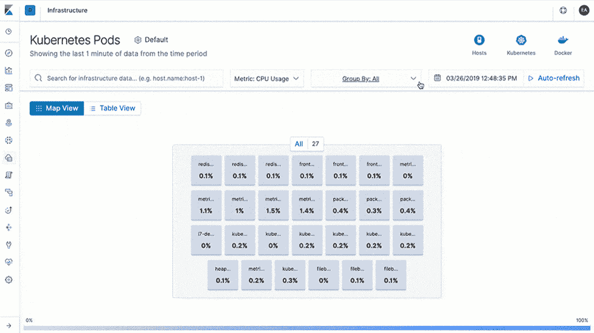

# 使用 Helm v3 的 Kubernetes 1.15 上的弹性堆栈

> 原文：<https://itnext.io/deploy-elastic-stack-on-kubernetes-1-15-using-helm-v3-9105653c7c8?source=collection_archive---------0----------------------->


随着 Kubernetes 越来越受欢迎，并已成为编排容器工作负载的事实上的标准，难怪 Kubernetes 和 Helm 现在成为描述公司监控堆栈的标准组合。

Elastic Stack(也称为 ELK)与 Kubernetes 进行了本机集成，是一种流行的开源解决方案，用于收集、存储和分析 Kubernetes 遥测数据。虽然使用 Kubernetes 部署 ELK 堆栈似乎是一项复杂的任务，但围绕这一场景的最佳实践以及 Kubernetes 本地解决方案越来越多。其中一个解决方案是使用[舵](https://helm.sh/)图。

## 标准 ELK 测井解决方案概述



*   **日志**:识别待分析的服务器日志
*   **Logstash** :数据汇总和处理
*   **弹性搜索**:索引和存储
*   基巴纳:分析和可视化

在深入实际设置之前，让我们快速探索一下在 Kubernetes 上运行 ELK 堆栈的可能替代方案。

## Elasticserach 设置— SaaS 还是自我管理？

许多云提供商将 Elasticsearch 作为一项服务提供，对于一家公司来说，尽可能减少构建解决方案的工作量似乎很有吸引力。然而，维护的便利性来自以下考虑因素:

**弹性搜索即服务**

*   **安全性:**基于云的 Elasticsearch 解决方案通常缺乏像 RBAC 这样的基本 ELK 安全功能，最明显的是 AWS Elasticsearch 产品不支持 [X-Pack](https://www.elastic.co/what-is/open-x-pack) 插件。因此，实现担保权的灵活性是不存在的，从长远来看，肯定需要付出额外的努力。
*   **功能:**最流行的 Elasticsearch 云解决方案缺乏分片重新平衡功能，而这在大型生产环境中是一个关键点，因此需要一些手动工作来将索引移动到新节点，以防节点故障。
    SaaS 选项也不支持其他插件，如分析器插件和摄取插件。
*   **控制:**托管解决方案很少提供对弹性搜索设置的完全控制。通常对配置更改和性能优化的支持非常有限。
*   **维护:**备份频率选项通常限于一天一次。与 Elastic 的官方发布日期相比，新版本的发布要晚得多。升级通常是一个痛苦的过程，因为它们通常需要为新版本建立一个全新的集群。
*   **可见性:**监控和集群指标也非常有限。投诉、警告、垃圾收集缓慢等日志不可用
*   **成本**:托管云服务附带预定义的实例类型和数量选项，与自行设置的解决方案相比，这会导致成本增加。

**Kubernetes 上的弹性搜索**

根据为 ELK stack 供电的 Elastic 公司的说法，这只是这种设置带来的一些好处:

*   **多个弹性搜索集群的简单部署和管理**，包括 Kibana
*   **无缝升级**到新版本的弹性堆栈
*   **简单的扩展**允许您随着使用案例的增加而增长
*   **每个集群上的默认安全性**

Elastic 提供在 Kubernetes 上运行 Elasticsearch & Kibana 的选项，运行在[弹性云管理解决方案](https://www.elastic.co/elasticsearch/service/pricing)上，如果 SaaS 是您的首选，您可以查看他们的产品。

如果您愿意使用 Helm 3 探索 Kubernetes 上的弹性设置，现在我们已经了解了 Kubernetes 上的弹性搜索设置的潜在好处，您可以继续本文的步骤。

下面是这个设置的大概情况。



## 步骤 1:创建 Kubernetes 集群

出于测试目的，您可以使用 minikube-版本 1.15.6，该版本可以按照 [Kubernetes Minicube 文档中所示进行安装。](https://kubernetes.io/docs/tasks/tools/install-minikube/)

或者，可以将集群部署在提供此服务的主要云提供商之一(EKS 或 GKE)上。我们的设置将在 EKS 版本 1.15 上运行。您可以参考官方云提供商文档来轻松设置。

## 第二步:[舵 3](https://v3.helm.sh/) 安装

就像遵循官方[安装指南](https://helm.sh/docs/intro/install/)一样简单

## 步骤 3:部署 Elasticsearch 集群

为此，我们将使用 Github 上的官方[弹性舵图表](https://github.com/elastic/helm-charts)。

```
$ helm repo add elastic https://helm.elastic.co
```

您可以参考存储库中提供的大量安装和设置示例。

对于我们的设置，我们将创建一个类似于下图的目录结构，并在每个组件的相关目录中创建`values.yaml`文件:

├──**elastic search**
│└──[values . YAML](https://raw.githubusercontent.com/elastic/helm-charts/master/elasticsearch/values.yaml)
├──**基巴纳**
│└──[values . YAML](https://raw.githubusercontent.com/elastic/helm-charts/master/kibana/values.yaml)
└──**metric beat**
└───[values . YAML](https://raw.githubusercontent.com/elastic/helm-charts/master/metricbeat/values.yaml)

特别注意 CPU 和内存使用的**资源**配置，并确保一旦完成测试后`values.yaml`被正确更新用于生产级部署。

默认情况下，对于 elasticsearch，我们将为集群中的每个 pod 创建容量为 1Gi 的`[PersistentVolumeClaim](https://kubernetes.io/docs/concepts/storage/persistent-volumes/)`,以防止在意外删除 pod 的情况下丢失数据。对于生产工作负载，应该使用所需的存储容量和(可选)Kubernetes [存储类](https://kubernetes.io/docs/concepts/storage/storage-classes/)来定义卷声明模板，以便与持久卷相关联。批量索赔的名称必须始终为`elasticsearch-data`。

Elasticsearch values.yaml

对于实际安装，我们将使用以下脚本。将它放入项目的根目录，这样它就可以访问 3 个子目录。

请随意增强脚本或更改提供的缺省值以满足您的需求，因为为了简单起见，我们已尽量将其保持在最低限度:

ELK 安装脚本

```
This script must be run with 2 parametersUsage:
./elk-setup.sh [install|update] [elasticsearch|kibana|metricbeat|filebeat]Example:
./elk-setup.sh install kibana
```

使用`install elasticsearch`选项运行上面的脚本应该会产生以下输出:

```
NAME:   elasticsearch
LAST DEPLOYED: Thu Apr 1 17:28:20 2020
NAMESPACE: default
STATUS: DEPLOYED
NOTES:
1\. Watch all cluster members come up.
  $ kubectl get pods --namespace=default -l app=elasticsearch-master -w
2\. Test cluster health using Helm test.
  $ Helm test elasticsearch
```

如上面的提示所示，您可以使用以下命令来观察集群的状态:

```
$ kubectl get pods --namespace=default -l app=elasticsearch-master -w$ helm test elasticsearch
```

部署完成后，将会看到 elasticsearch 窗格出现:

```
NAME                     READY     STATUS     RESTARTS   AGE
elasticsearch-master-0   1/1       Running   0         1m
elasticsearch-master-2   1/1       Running   0         1m
elasticsearch-master-1   1/1       Running   0         1m
```

通过本地测试来完成设置。您可以通过执行到本地机器的端口转发来访问集群。

```
$ kubectl port-forward svc/elasticsearch-master 9200
```

输出是:



## 步骤 4:部署 Kibana

对于 Kibana 部署，我们将采用完全相同的方法，只更新 Kibana 的相关图表和`values.yaml`:

..并使用 Kibana 选项运行安装脚本:

```
$ ./elk-setup install elasticsearch
```

以下输出:

```
NAME:   kibana
LAST DEPLOYED: Thu Apr 1 09:52:21 2020
NAMESPACE: default
STATUS: DEPLOYED
```

..还有一份跑步舱的清单

```
kubectl get pods
NAME                             READY     STATUS    RESTARTS   AGE
elasticsearch-master-0           1/1       Running   0          15m
elasticsearch-master-1           1/1       Running   0          15m
elasticsearch-master-2           1/1       Running   0          15m
kibana-kibana-6d7466b9b9-fbmsz   1/1       Running   0          2m
```

端口转发:

```
$ kubectl port-forward deployment/kibana-kibana 5601
```

现在，您可以在浏览器中访问 Kibana，网址为: [http://localhost:5601](http://localhost:5601/)



## 步骤 5:部署 metricbeat

下一步将是部署 T4 号。

它是 Elastic 提供的常用 beats 之一，负责发送度量数据。它可以将数据直接发送到 Elasticsearch 或通过 [Logstash](https://www.elastic.co/products/logstash) 发送，在那里您可以进一步处理和增强数据，然后在 [Kibana](https://www.elastic.co/products/logstash) 中可视化数据。

以下是所有节拍的完整列表，由 Elastic 提供。他们中的每一个人都负责收集特定类型的数据并将其发送到 elasticsearch 集群。花点时间熟悉一下 [Beats 文档](https://www.elastic.co/beats/)，因为在本文中我们不会对它们中的每一个做太多的详细介绍。



[Beats 平台参考](https://www.elastic.co/guide/en/beats/libbeat/current/beats-reference.html)

```
$ ./elk-setup install metricbeat
```

metricbeat-values.yaml

如果我们仔细检查 [metricbeat-values.yaml](https://gist.github.com/radostina-dimova/298ca1af0926dd633c2c8c6128e3c579) 文件，我们会注意到它配置了各种度量收集*模块* (kubernetes、system 等)。Metricbeat *模块*定义从服务中收集哪些特定的指标，定义收集它们的频率，以及如何连接到服务。模块由一个或多个*指标集*组成——字面意思是一组要收集和发布的相关指标。

模块细分:

*   `metricbeat.yml`为 Metricbeat 提供一般配置的文件(包含从每个节点上的 kubelet 收集的系统和 kubernetes 模块)
*   `kube-state-metrics-metricbeat.yml`—[kube-state-metric](https://github.com/kubernetes/kube-state-metrics)s 是一个简单的服务，它监听 Kubernetes API 服务器，并生成关于 Kubernetes 内部各种对象(如部署、节点和单元)的状态和健康状况的指标。

我们将在 k8s 集群的每个节点上部署 Metricbeat 作为一个`DaemonSet`。通过将 metricbeat 部署为 [DaemonSet](https://kubernetes.io/docs/concepts/workloads/controllers/daemonset/) ，我们确保在集群的每个节点上都有一个正在运行的 metricbeat 守护进程。

请注意，在配置中，所有带有`state_`前缀的*度量集*需要`hosts`字段指向集群内的`kube-state-metrics`服务，而其余的应该指向`kubelet`服务。

让我们测试一下设置:

```
$ curl localhost:9200/_cat/indices

Handling connection for 9200
green open .kibana_task_manager_1    1 1     2 2     55.5kb  27.6kb
green open .apm-agent-configuration  1 1     0 0       566b    283b
green open ilm-history-1-000001      1 1    18 0     50.9kb  25.4kb
green open .kibana_1                 1 1    77 6      2.2mb   1.1mb
green open metricbeat-7.6.1          1 1    1512060 0 1.7gb 910.5mb
```

默认情况下，Metricbeat 的 [Prometheus 模块公开了`/metrics`端点，这意味着现有的 Prometheus 设置也可以收集这些指标。](https://www.elastic.co/blog/elasticsearch-observability-embracing-prometheus-and-openmetrics-standards-for-metrics)

## 步骤 6:部署 Filebeat

```
$ ./elk-setup install filebeatRelease "filebeat-1586246704" has been upgraded. Happy Helming!
NAME: filebeat-1586246704
LAST DEPLOYED: Wed Apr  8 12:48:24 2020
NAMESPACE: log
STATUS: deployed
REVISION: 4
TEST SUITE: None
NOTES:
1\. Watch all containers come up.
  $ kubectl get pods --namespace=log -l app=filebeat-1586246704-filebeat -w
Updated filebeat
```

## 第七步:把所有东西放在一起

如果我们检查创建的设置，我们可以检查舵释放状态(为简单起见，一些字段已被删除):

```
$ helm lsNAME          NAMESPACE REVISION    STATUS    CHART   APP VERSION                            
elasticsearch log      1   deployed elasticsearch-7.6.1 7.6.1      
kibana        log      1   deployed kibana-7.6.1        7.6.1      
metricbeat    log      1   deployed metricbeat-7.6.1    7.6.1
filebeat      log      1   deployed filebeat-7.6.1      7.6.1
```

要查看关于已创建的 Kubernetes 资源的详细信息，可以运行以下命令:

```
$ helm get manifest <RELEASE-NAME> | kubectl get -f -
```

样本输出:

```
$ helm get manifest kibana-1585817443 | kubectl get -f -
NAME                               TYPE        CLUSTER-IP    EXTERNAL-IP   PORT(S)    AGE
service/kibana-1585817443-kibana   ClusterIP   10.20.5.20   <none>        5601/TCP   25hNAME                                       READY   UP-TO-DATE   AVAILABLE   AGE
deployment.apps/kibana-1585817443-kibana   1/1     1            1           25h
```

## 步骤 9:在 Kibana 中分析数据

现在我们已经部署了所有组件，在 Kibana 中，我们可以转到**管理→ Kibana →索引模式**页面，并单击**创建索引模式**。Kibana 将自动识别和显示 Metricbeat 指数。

输入' *metricbeat-** '并在下一步选择 *@timestamp* 字段，以完成在 Kibana 中创建索引模式。

跳到探索页面。您将看到从 Kubernetes 集群中收集的所有指标(按 Metricbeat 显示):



如果您浏览 Kibana UI，您可以探索它提供的各种字段、仪表板和统计数据。

跳转到机器学习选项卡并选择`metricbeat-*`索引来可视化我们之前配置的大量 Kubernetes ans 系统指标。



[http://localhost:5601/app/infra #/infra/inventory](http://localhost:5601/app/infra#/infrastructure/inventory)

检查基础架构清单并选择感兴趣的资源，以探索其指标并查看其日志文件。



Kubernetes 服务发现

*关于基巴纳仪表盘的一句话:*

Kubernetes 的 Kibana 仪表板非常有用，因为它们让我们可以很好地概述我们的 Kubernetes 集群及其组件。在 [Elastic 演示页面](https://demo.elastic.co/app/kibana#/dashboard/19e7fae0-92a6-11e8-8fa2-3d5f811fbd0f?_g=()&_a=(description:'Beats%20modules%20gallery,%20a%20jumping%20point%20to%20modules%20dashboards%20available%20here.',filters:!(),fullScreenMode:!f,options:(darkTheme:!f,hidePanelTitles:!f,useMargins:!t),panels:!((embeddableConfig:(title:APACHE),gridData:(h:14,i:'1',w:7,x:21,y:12),id:'13330b20-5496-11e8-962d-c3a08979c250',panelIndex:'1',title:APACHE,type:visualization,version:'7.5.1'),(embeddableConfig:(title:MONGODB),gridData:(h:14,i:'3',w:7,x:7,y:26),id:'18557a10-5497-11e8-962d-c3a08979c250',panelIndex:'3',title:MONGODB,type:visualization,version:'7.5.1'),(embeddableConfig:(title:KUBERNETES),gridData:(h:14,i:'4',w:7,x:7,y:12),id:e44e9430-5497-11e8-962d-c3a08979c250,panelIndex:'4',title:KUBERNETES,type:visualization,version:'7.5.1'),(embeddableConfig:(title:DOCKER),gridData:(h:14,i:'5',w:7,x:14,y:12),id:c43e1d00-5497-11e8-962d-c3a08979c250,panelIndex:'5',title:DOCKER,type:visualization,version:'7.5.1'),(embeddableConfig:(title:NGINX),gridData:(h:14,i:'6',w:7,x:28,y:12),id:a2fa9cb0-549a-11e8-962d-c3a08979c250,panelIndex:'6',title:NGINX,type:visualization,version:'7.5.1'),(embeddableConfig:(title:MYSQL),gridData:(h:14,i:'9',w:7,x:35,y:26),id:'5617e230-549b-11e8-962d-c3a08979c250',panelIndex:'9',title:MYSQL,type:visualization,version:'7.5.1'),(embeddableConfig:(title:POSTGRESQL),gridData:(h:14,i:'11',w:7,x:21,y:26),id:cb62a340-59d7-11e8-962d-c3a08979c250,panelIndex:'11',title:POSTGRESQL,type:visualization,version:'7.5.1'),(embeddableConfig:(title:KAFKA),gridData:(h:14,i:'13',w:7,x:14,y:26),id:d3451e30-5496-11e8-962d-c3a08979c250,panelIndex:'13',title:KAFKA,type:visualization,version:'7.5.1'),(embeddableConfig:(title:REDIS),gridData:(h:14,i:'15',w:7,x:0,y:26),id:'0e0eb8b0-549b-11e8-962d-c3a08979c250',panelIndex:'15',title:REDIS,type:visualization,version:'7.5.1'),(embeddableConfig:(title:'NETWORK%20DATA'),gridData:(h:14,i:'16',w:7,x:35,y:12),id:'1cbc8b50-6259-11e8-892f-19d69b635064',panelIndex:'16',title:'NETWORK%20DATA',type:visualization,version:'7.5.1'),(embeddableConfig:(title:GOLANG),gridData:(h:14,i:'17',w:7,x:28,y:26),id:ce485b60-6259-11e8-892f-19d69b635064,panelIndex:'17',title:GOLANG,type:visualization,version:'7.5.1'),(embeddableConfig:(title:'SYSTEM%20METRICS'),gridData:(h:14,i:'18',w:6,x:42,y:26),id:a14f2f20-625a-11e8-892f-19d69b635064,panelIndex:'18',title:'SYSTEM%20METRICS',type:visualization,version:'7.5.1'),(embeddableConfig:(),gridData:(h:12,i:'26',w:24,x:24,y:40),id:'55c90dc0-9287-11e8-8fa2-3d5f811fbd0f',panelIndex:'26',type:visualization,version:'7.5.1'),(embeddableConfig:(),gridData:(h:12,i:'27',w:24,x:0,y:40),id:'10553fb0-9288-11e8-8fa2-3d5f811fbd0f',panelIndex:'27',type:visualization,version:'7.5.1'),(embeddableConfig:(title:Welcome),gridData:(h:12,i:'28',w:24,x:0,y:0),id:ee02b2d0-92aa-11e8-8fa2-3d5f811fbd0f,panelIndex:'28',title:Welcome,type:visualization,version:'7.5.1'),(embeddableConfig:(),gridData:(h:12,i:'29',w:24,x:24,y:0),id:df63c620-9407-11e8-8fa2-3d5f811fbd0f,panelIndex:'29',type:visualization,version:'7.5.1'),(embeddableConfig:(title:AZURE),gridData:(h:14,i:'33',w:7,x:0,y:12),id:'04704970-241d-11e9-9985-f1ba5bcab6e5',panelIndex:'33',title:AZURE,type:visualization,version:'7.5.1'),(embeddableConfig:(title:Prometheus),gridData:(h:14,i:'34',w:6,x:42,y:12),id:'5f886b70-dfa3-11e9-b69e-8b75a9a3572b',panelIndex:'34',title:Prometheus,type:visualization,version:'7.5.1')),query:(language:lucene,query:''),timeRestore:!f,title:'Welcome%20-%20Beats%20Modules',viewMode:view))上有一个非常好的仪表板浏览器。

此时，默认情况下，的弹性舵图表不启用 Filebeat 和 Metricbeat 控制面板。如何实现这一点，可以在官方文档中找到，并且需要对 default values.yaml 文件进行一些添加:
[Metricbeat 仪表板设置](https://www.elastic.co/guide/en/beats/metricbeat/current/configuration-dashboards.html) [Filebeat 仪表板设置](https://www.elastic.co/guide/en/beats/filebeat/current/configuration-dashboards.html)

# 最后的话

您已经看到了使用官方的 Elastic Helm 图表在 Kubernetes 上部署 Elastic Stack (Elasticsearch、Kibana、Metricbeat、Filebeat)的简单设置。

既然我们已经在集群上安装并运行了所有这些组件，就有无限的可能进行潜在的增强:高可用性和高性能集群配置、定制的保留策略、安全性增强、用户可访问性改进等等。您可以自由探索无限的选项，并以同样的方式进行试验，就好像这是在本地托管的虚拟机或云中的某个地方进行的传统部署一样。

**资源**

[](https://github.com/elastic/helm-charts) [## 弹性/舵图

### 此功能处于测试阶段，可能会有变化。设计和代码没有官方的 GA 特性成熟…

github.com](https://github.com/elastic/helm-charts) [](https://www.elastic.co/guide/index.html) [## 弹性堆栈和产品文档

### 弹性公共模式(ECS)参考[1.5] -其他版本

www.elastic.co](https://www.elastic.co/guide/index.html) [](https://www.guru99.com/elk-stack-tutorial.html) [## ELK Stack 教程:学习 Elasticsearch、Logstash 和 Kibana

### ELK Stack 是三个开源产品的集合——elastic search、Logstash 和 Kibana。他们都是…

www.guru99.com](https://www.guru99.com/elk-stack-tutorial.html)