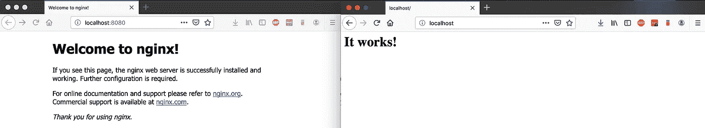
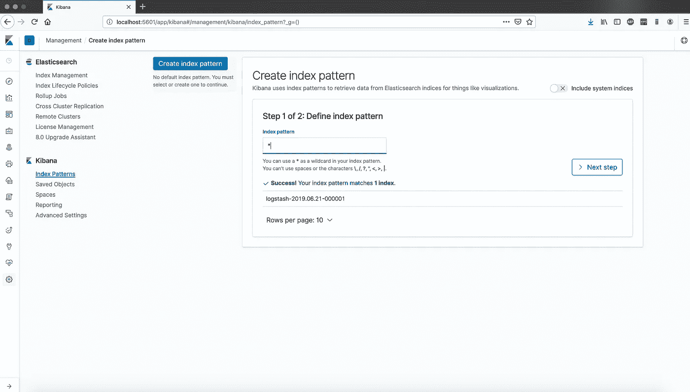
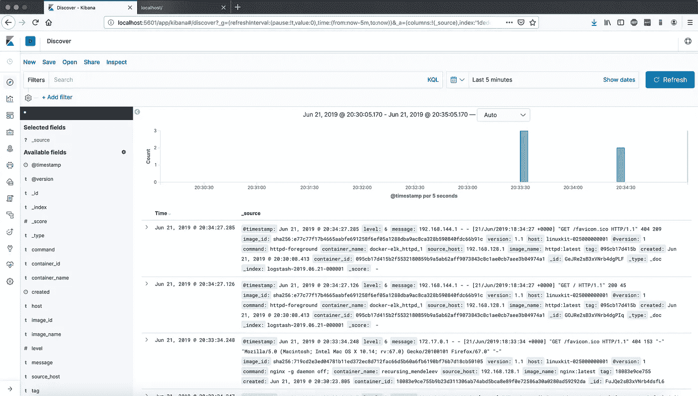
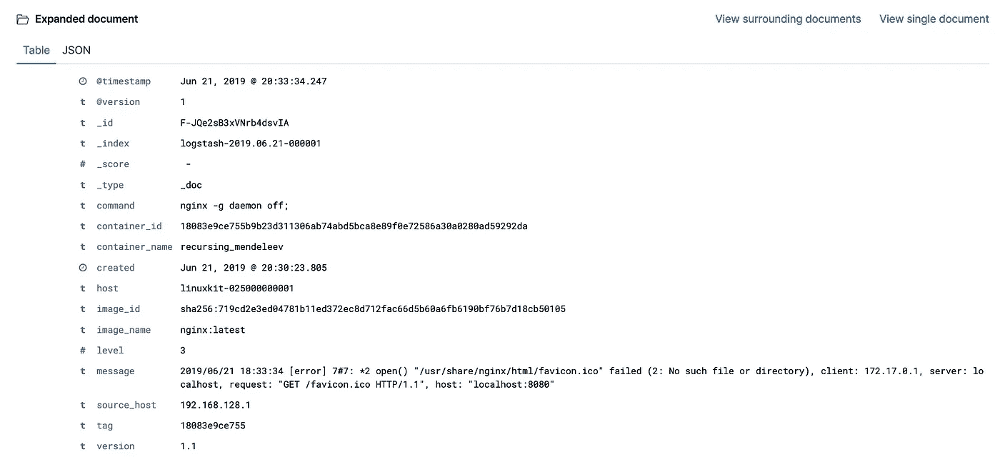
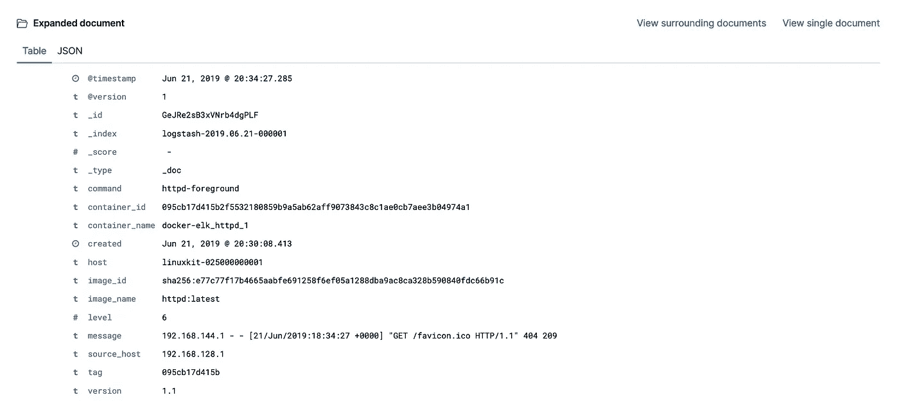

# 在 Docker 中部署 ELK 堆栈来监控容器

> 原文：<https://itnext.io/deploy-elk-stack-in-docker-to-monitor-containers-c647d7e2bfcd?source=collection_archive---------1----------------------->

> 在这篇博客中，我将展示如何创建一个集中的日志解决方案，从不同的容器中收集所有的 Docker 日志。这里我们将使用众所周知的[麋鹿栈](https://www.elastic.co/elk-stack) (Elasticsearch，Logstash，Kibana)。

我们将使用 docker-compose 来部署我们的 ELK 堆栈。Docker-compose 为我们提供了同时部署多个容器的解决方案。

先决条件:

*   [码头工人](https://docs.docker.com/install/)
*   [Docker-Compose](https://docs.docker.com/compose/install/)

我的 GitHub 上有完整的模板[。使用 Docker-compose 克隆存储库并启动容器。](https://github.com/lvthillo/docker-elk)

```
$ git clone [https://github.com/lvthillo/docker-elk.git](https://github.com/lvthillo/docker-elk.git)
$ cd docker-elk
$ docker-compose up -d
```

部署的第一个资源是 Elasticsearch。Elasticsearch 是一个快速分析和剖析不同类型数据的系统。我们可以使用单个实例，并通过使用环境变量来禁用 [xpack](https://www.elastic.co/products/stack) (付费功能)。它部署在`logging-network`中，这是一个 [Docker 桥接网络](https://docs.docker.com/network/bridge/)。

现在我们将部署 Logstash。Logstash 是一个开源的服务器端数据处理管道，它同时从多个来源获取数据，对其进行转换，然后将其发送到 Elasticsearch 等工具。

Logstash 依赖于需要首先部署的 Elasticsearch。端口`12201`在服务器上公开并映射。其他 Docker 容器会通过连接到这个 UDP 端口将它们的日志发送到 Logstash。作为体积我们将把`logstash.conf`装在集装箱里面。

我们将期待 Gelf 输入。Gelf 是 Graylog 扩展日志格式，是从应用程序内部进行日志记录的绝佳选择。我们会将日志发送到我们的 ElasticSearch 容器中。它们可以使用它们的服务名相互通信，因为它们部署在同一个 Docker 网桥网络中。

文件`/usr/share/logstash/config/pipelines.yml`包含 Logstash 运行的可用管道。在这里，我们可以定义特定的文件(管道)，但我们现在只使用一个管道。默认文件描述了我们的`logstash.conf`可用的目录，因此我们不需要更新我们的管道配置。如果你想运行多个管道，你可以添加额外的 id 并指向特定的`.conf`文件，而不是像现在这样(默认)指向一个目录。欲了解更多信息，请看这里的。

如果配置了多个管道，那么调试 Logstash 容器会很有用。您可以使用`docker exec`来调试您的 Logstash 容器并检查配置文件。这超出了我们当前基本设置的范围。

```
$ docker exec -it docker-elk_logstash_1 bash
bash-4.2$ cat /usr/share/logstash/pipeline/logstash.conf
input {
  gelf {}
}output {
  elasticsearch {
    hosts => "elasticsearch:9200"
  }
}
```

模板中最后一个与 ELK stack 相关的服务是 Kibana 的设置。Kibana 让我们可视化我们的弹性搜索数据。

基巴纳依赖于 Logstash，将暴露和地图港口`5601`。像所有其他 ELK 堆栈相关资源一样，Logstash 部署在日志网络内部。这允许容器通过使用服务名相互通信。

现在我们可以测试我们的设置。已经使用 Docker-compose 启动了一个 Apache (httpd)容器。Docker Desktop for Mac 的用户应编辑`docker-compose.yml`至`udp://host.docker.internal:12201`中的 gelf 地址。查看[此处的](https://github.com/lvthillo/docker-elk/issues/1)了解更多信息。不要忘记通过再次运行`docker-compose up -d`来更新您的环境。

我们将使用 Docker CLI 启动一个额外的 Nginx 容器。

Docker Desktop for Mac 的用户应该将 gelf-address 更新为`udp://host.docker.internal:12201`。查看[此处](https://github.com/lvthillo/docker-elk/issues/1)了解更多信息。

```
$ docker run -d -p 8080:80 --log-driver gelf --log-opt gelf-address=udp://localhost:12201 nginx:latest
```

让我们在浏览器中访问这两个应用程序。



现在在 http://localhost:5601 上访问 Kibana。单击左侧的“发现”和“创建索引模式”。使用“`*`”和“`@timestamp`”创建图案。



现在，单击发现并验证日志。



我们有 Nginx 和 Apache 容器的日志！



Nginx



阿帕奇(httpd)

# 结论

在这篇博客中，我向您展示了在 Docker 中部署一个基本的 ELK 堆栈来监控其他 Docker 容器是多么容易。这里的重点是 ELK 堆栈的设置，而不是管道或附加的 Logstash 和 Elasticsearch 配置。

我希望你喜欢它！如果你有任何问题，请随时提问！

[](https://www.buymeacoffee.com/dZb8fLN)

如果真的对你有帮助…:)