# 在 Minikube 上部署带有动态奴隶的 Jenkins

> 原文：<https://itnext.io/deploy-jenkins-with-dynamic-slaves-in-minikube-8aef5404e9c1?source=collection_archive---------0----------------------->

> *最近更新时间:2019 年 11 月*

Minikube 提供了在本地运行 Kubernetes 的可能性。Minikube 在我们本地机器上的一个 VM 中运行一个单节点 Kubernetes 集群。

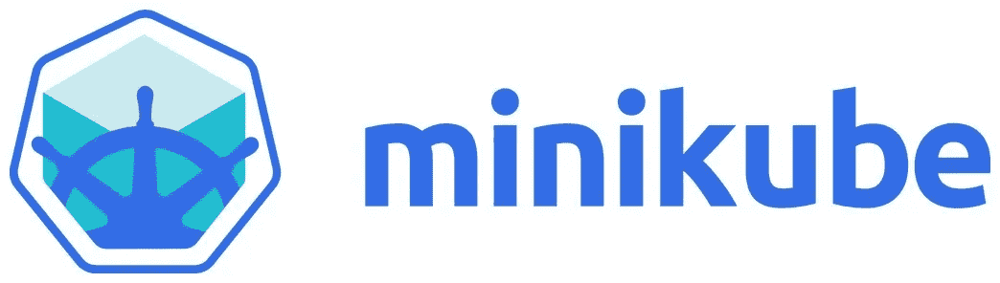

在本教程中，我们将安装 minikube 和集成头盔。Helm 是 Kubernetes (minikube)的一个包经理。我们可以和 Ubuntu 的 apt，Centos 的 yum，macOS 的 Homebrew 进行对比。Helm 将帮助我们部署或安装 Jenkins 环境。我们需要提供一个包含我们想要的值和配置的文件，Helm 会完成剩下的工作。在这个文件中，我们将描述，除了别的以外，我们的主人的持久性和 Docker 套接字的安装，以使 Docker 可用于我们的动态从属。
最后，我们将编写一个基本的 Jenkins 管道来展示我们的动态奴隶将如何处理 Docker。

## **1。minikube 的安装**

首先我们需要安装 VirtualBox。这将为我们提供一个免费的开源管理程序，可用于虚拟化我们的 minikube 环境。

```
$ brew cask install virtualbox
```

安装 minikube:

```
$ brew install minikube
```

启动 minikube 并使用 VirtualBox 作为虚拟机驱动程序。这将在 VirtualBox 中创建一个本地单节点 Kubernetes 集群。这一步可能需要一些时间。

```
$ minikube --memory 4096 --cpus 2 start --vm-driver=virtualbox
```

我们的 minikube 实例是在 VirtualBox 中启动的。为了进行验证，我们可以尝试 SSH 到实例并检查状态。检查 minikube IP。

```
$ minikube status
minikube: Running
cluster: Running
kubectl: Correctly Configured: pointing to minikube-vm at 192.168.99.100
```

通过键入以下内容打开 minikube 控制面板:

```
$ minikube dashboard
```

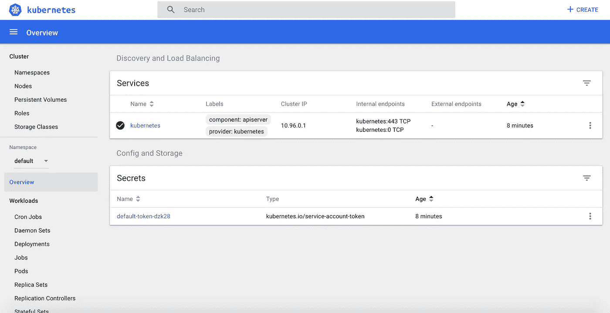

## **2。安装 Kubectl 和 Helm**

要管理我们的 minikube，我们可以使用 kubectl。这是一个针对 Kubernetes 集群运行命令的 CLI。

```
$ brew install kubectl
```

要使用我们的 Helm 软件包管理器，我们需要先安装它:

```
$ brew install kubernetes-helm
```

我们所有的工具都安装好了。我们可以开始创建我们的詹金斯环境。

## **3。部署 Jenkins 环境**

**3A。为 Jenkins 项目创建名称空间** 我们将在一个单独的名称空间中创建我们的 Jenkins 环境。目前有三个默认的名称空间:

```
$ kubectl get nsNAME STATUS AGE
default Active 13m
kube-public Active 13m
kube-system Active 13m
```

我们使用一个`.yaml`模板创建名称空间。使用模板使得维护我们的集群更加容易。如果您克隆包含必要模板的 [GitHub 库](https://github.com/lvthillo/minikube-helm-jenkins)，您可以跳过下面的部分步骤。

```
$ mkdir -p ~/minikube-helm-jenkins/minikube
$ mkdir -p ~/minikube-helm-jenkins/helm
$ cd ~/minikube-helm-jenkins
```

创建我们的名称空间的模板:

```
$ vi minikube/jenkins-namespace.yaml
```

jenkins-namespace.yaml 的内容

执行模板以创建名称空间:

```
$ kubectl create -f minikube/jenkins-namespace.yaml
namespace “jenkins-project” created
```

我们可以使用命令:`kubectl get ns`或通过检查 minikube 仪表板来验证。

**3B。为 Jenkins master
创建持久卷**我们想为我们的 Jenkins master pod 创建一个持久卷。这将防止我们在重新启动 minikube 时丢失 Jenkins master 的整个配置和我们的作业。这个官方 minikube 文档解释了我们可以使用哪些目录来挂载数据。在一个多节点的 Kubernetes 集群中，您需要像 NFS 这样的解决方案来使挂载目录在整个集群中可用。但是因为我们使用 minikube，这是一个单节点集群，所以我们不必为此费心。

我们选择使用`/data`目录。该目录将包含我们的 Jenkins 主配置。

我们将创建一个名为`jenkins-pv`的卷:

```
$ vi minikube/jenkins-volume.yaml
```

创建卷:

```
$ kubectl create -f minikube/jenkins-volume.yaml
persistentvolume “jenkins-pv” created
```

一切准备就绪。是时候使用 Helm 部署我们的 Jenkins 环境了。

**3C。使用 helm 安装 Jenkins** 从使用 Helm 初始化当前目录开始:

```
$ cd ~/minikube-helm-jenkins
$ helm init
```

我们将利用 Jenkins Kubernetes 插件部署一个 Jenkins 主从集群。[这里](https://github.com/kubernetes/charts/tree/master/stable/jenkins)可以找到官方图表。

我们使用`jenkins-values.yaml`作为模板来提供我们自己的设置所需的值。我们将要求我们的音量，并安装 Docker 插座，这样我们就可以在我们的从属吊舱中执行 Docker 命令。

因为我们使用 minikube，所以我们需要使用 NodePort 作为服务类型。只有云提供商提供负载平衡器。我们将端口 32000 定义为端口。

我们也可以定义哪些插件，我们希望安装在我们的詹金斯。我们使用一些默认插件，如 [git](https://wiki.jenkins.io/display/JENKINS/Git+Plugin) 和 [pipeline 插件](https://wiki.jenkins.io/display/JENKINS/Pipeline+Plugin)，但我们也添加了 [greenballs 插件](https://wiki.jenkins.io/display/JENKINS/Green+Balls)，它将在成功构建后显示一个绿色球而不是蓝色球。

使用这些值部署您的 Jenkins 环境:

```
$ helm install --name jenkins -f helm/jenkins-values.yaml stable/jenkins --namespace jenkins-project
```

输出将显示如何获得您的 Jenkins 管理员密码。
运行此命令获取并保存您的密码:

```
$ printf $(kubectl get secret --namespace jenkins-project jenkins -o jsonpath="{.data.jenkins-admin-password}" | base64 --decode);echo2kKCN55MaM
```

我们终于可以验证舵的安装了:

```
$ helm ls
NAME REVISION UPDATED STATUS CHART APP VERSION NAMESPACE
jenkins 1 Tue Nov 12 20:21:31 2019 DEPLOYED jenkins-0.36.2 lts         jenkins-project
```

并检查您的仪表板(选择詹金斯项目)。

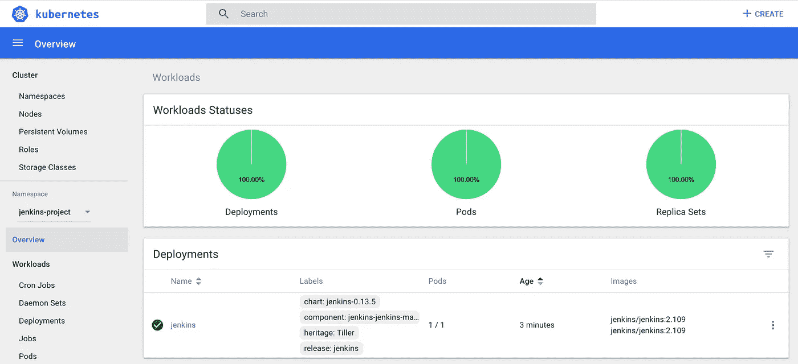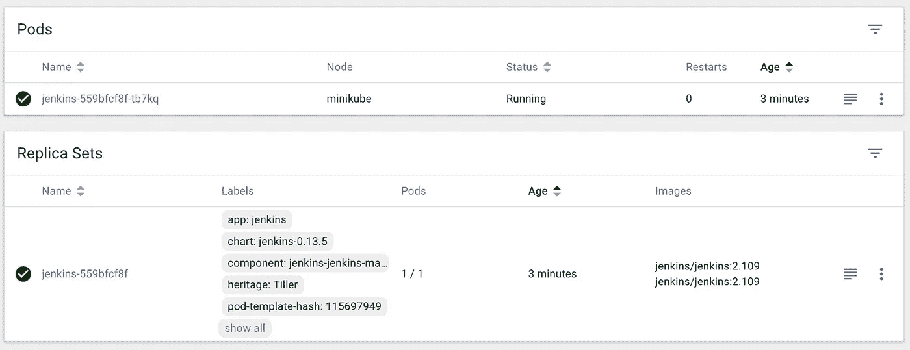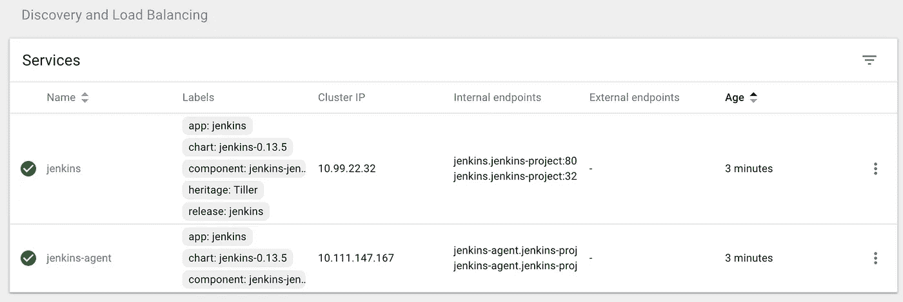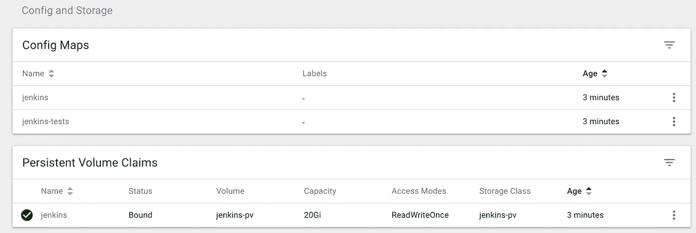

使用 minikube ssh 检查卷装载:

```
$ minikube ssh
$ ls /data
jenkins-volume
```

minikube 的所有工作都完成了。现在我们可以开始利用詹金斯了。

## **4。访问并配置詹金斯大师**

我们可以在[http://192 . 168 . 99 . 100:32000](http://192.168.99.100:32000)上拜访詹金斯大师。(如果您的 minikube 实例具有不同的 IP，则为不同的 IP)。
用户是“admin ”,我的密码是 2kKCN55MaM。

这一章的标题有点不对，因为 Helm 已经为我们配置好了一切。我们可以创建一个作业并运行它。
我们从创造一个非常基本的自由式工作开始。

*   新项目→自由式项目→名称:freestyle-job-1
    添加构建步骤→执行 shell:

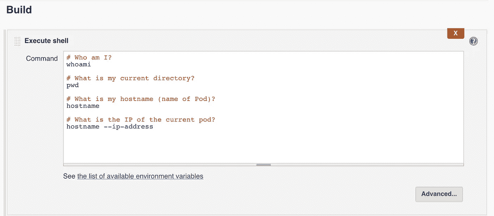

单击“立即构建”。开始构建需要一些时间，因为需要获取从属映像(仅在第一次时)。将启动一个从属 pod，在其中执行作业。

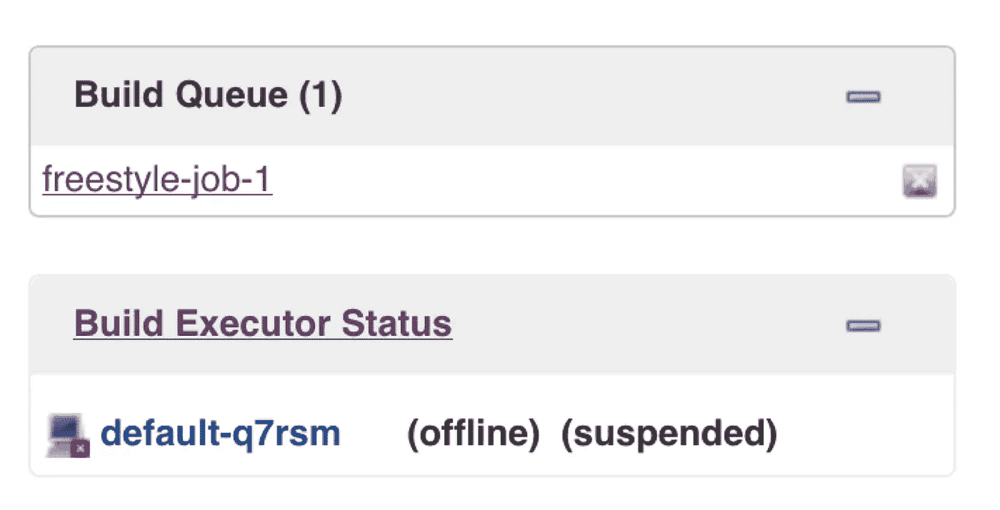

从机启动后，作业在从机上执行。

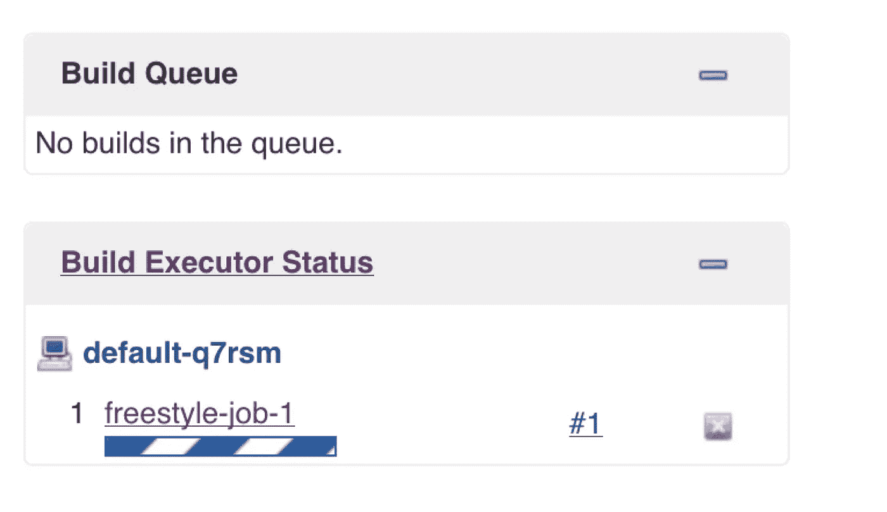

作业成功完成。
我们可以看到该作业是在 slave default-q7rsm 上执行的。从机的 Pod IP 为 172.17.0.6。我们的 greenballs 插件也已安装。

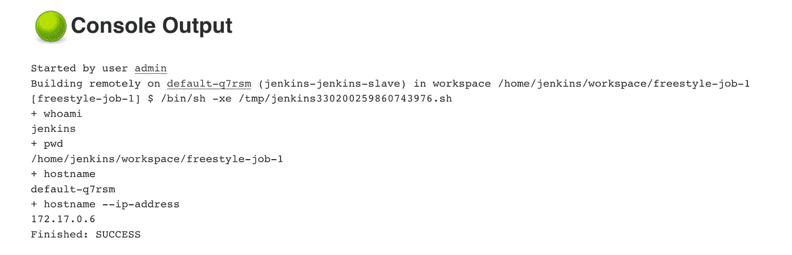

## **5。创建脚本化的 Jenkins 管道**

在这最后一章，我们将创建一个基本的脚本詹金斯管道。
我们描述了 pod 内部的容器模板。我们将使用 docker、git 和 maven 容器。这三个容器将在同一个容器中运行。

我们检查节点上正在运行的 Docker 容器。这只是为了说明当我们安装 Docker 套接字并使用包含 Docker 客户端的 Docker 映像时，我们可以在我们的从机中使用 Docker 命令。在第二阶段，我们使用 git 容器来克隆包含基本 Java 应用程序的存储库。在最后阶段，我们使用 maven 来构建我们的应用程序！

`docker ps`的输出已经显示了我们在 containerTemplate 中描述的容器正在运行:

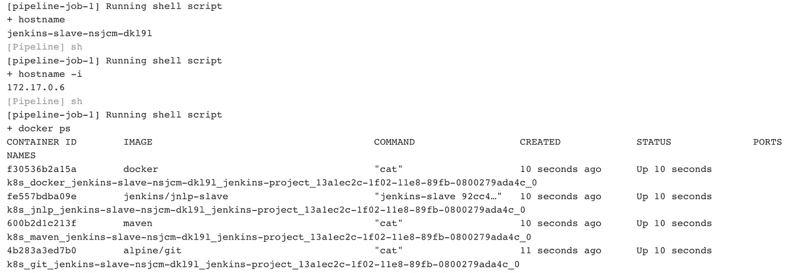

下图描述了发生的情况。一个豆荚是用我们的詹金斯奴隶容器制造的。在这个从属容器上执行的管道将在管道中启动我们在 containerTemplate 中描述的容器。所有的集装箱都在同一个集装箱里。

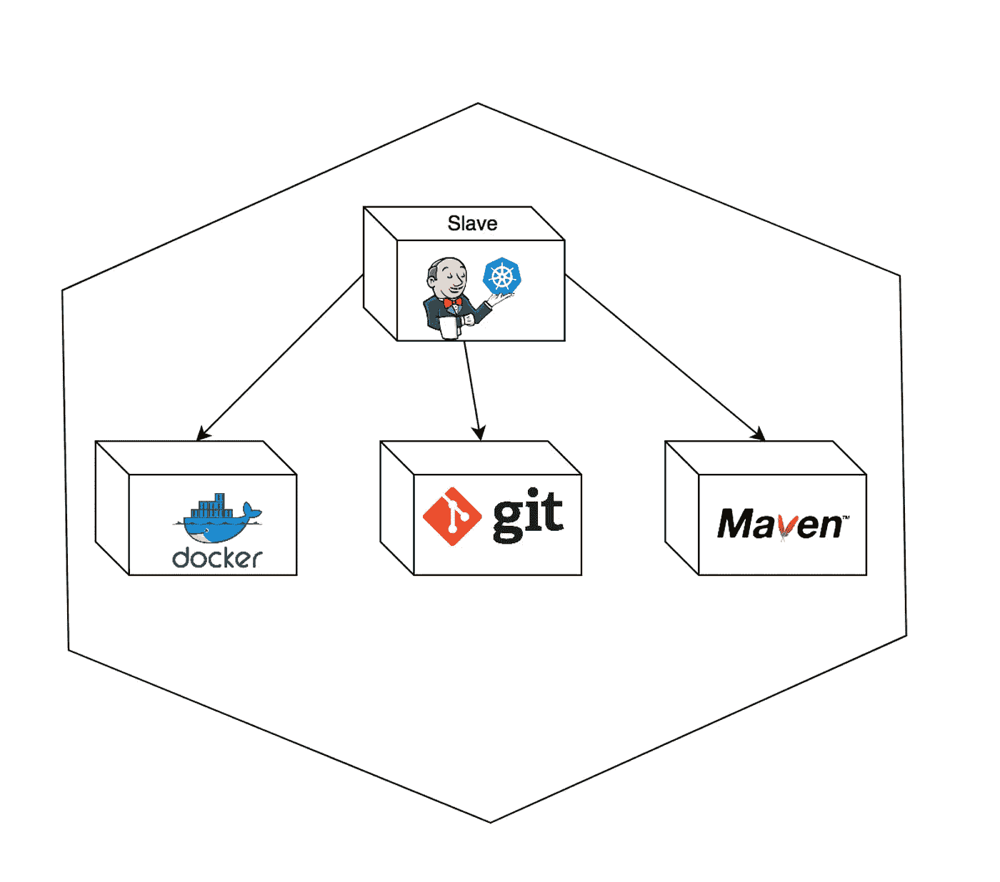

当管道完成后，分离舱和其中的 4 个容器都将被销毁。

## **结论**

这篇内容丰富的教程展示了如何使用 Helm 和 minikube。我们已经部署了一个完整的 Jenkins 环境，其中包含使用 Helm 的动态从属服务器。安装完成后，我们创建了一个使用 Kubernetes 插件的 Jenkins 管道。脚本化管道的例子已经清楚地表明了我们如何从我们的动态从设备内部提升 Docker 容器。

[](https://www.buymeacoffee.com/dZb8fLN)

如果真的对你有帮助…:)