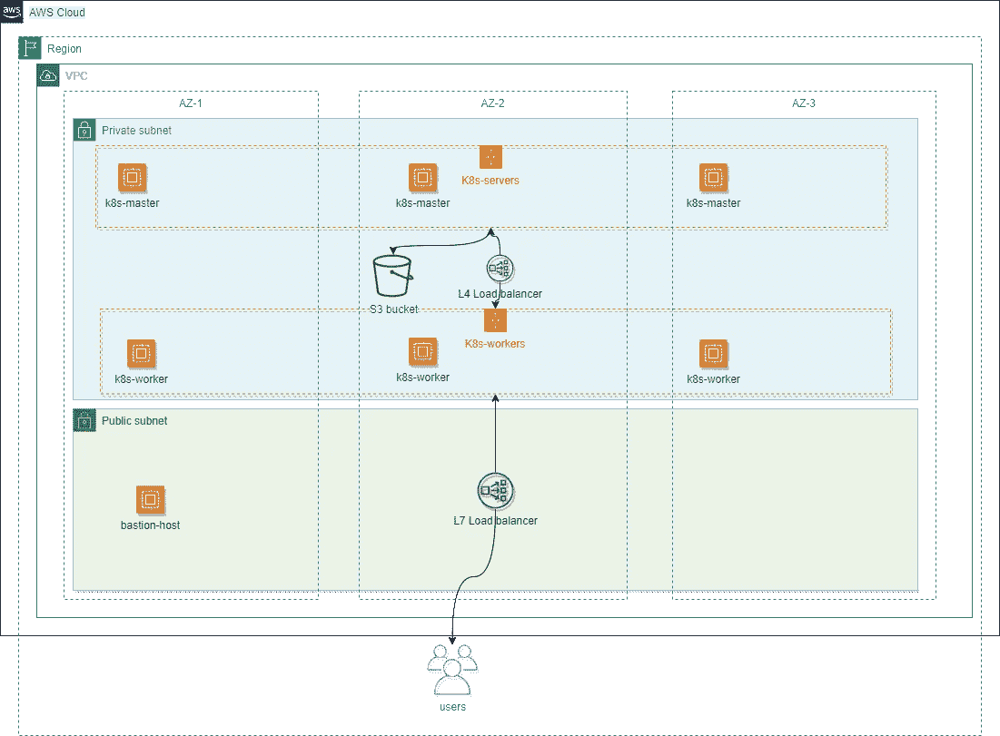
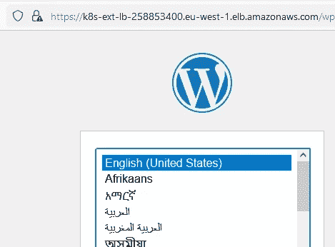

# 在 Amazon AWS 上部署 Kubernetes (K8s ),使用混合的按需实例和现场实例

> 原文：<https://itnext.io/deploy-kubernetes-k8s-on-amazon-aws-using-mixed-on-demand-and-spot-instances-5440e5bece7?source=collection_archive---------3----------------------->


使用混合的按需实例和现场实例，在几分钟内即可在 Amazon AWS 上部署高可用性 Kubernetes 集群。

请**注意**，这只是一个如何部署 Kubernetes 集群的例子。对于生产环境，您应该使用 [EKS](https://aws.amazon.com/eks/) 或 [ECS](https://aws.amazon.com/it/ecs/) 。

此报告的范围是展示部署高可用性 K8s 集群所需的所有 AWS 组件。

# 要求

*   Terraform 是一个开源的基础设施代码软件工具，提供一致的 CLI 工作流来管理数百个云服务。Terraform 将云 API 编码成声明性的配置文件。
*   [亚马逊 AWS 账户](https://aws.amazon.com/it/console/) -启用计费的亚马逊 AWS 账户
*   [kube CTL](https://kubernetes.io/docs/tasks/tools/)——Kubernetes 命令行工具(可选)
*   可选的 aws cli

您还需要:

*   一个带有私有和公有子网的 VPC
*   一个 ssh 密钥已经上传到您的 AWS 帐户
*   一台 bastion 主机连接所有私有 EC2 实例

对于 VPC 和堡垒主机你可以参考[这个](https://github.com/garutilorenzo/aws-terraform-examples)库。

# 基础设施概述

最终的基础设施将由以下人员建造:

*   两个自动伸缩组，一个用于 kubernetes 主节点，一个用于 worker 节点
*   助理秘书长使用的两个启动模板
*   一个内部负载平衡器(L4 ),将流量路由到 Kubernetes 服务器
*   一个外部负载平衡器(L7 ),将流量路由到 Kubernetes 工作人员
*   一个安全组，允许来自 VPC 子网 CIDR 的流量通过所有 k8s 端口(kube api、nginx 入口节点端口等)
*   一个安全组，允许来自所有互联网的流量进入端口 80 和 443 上的公共负载平衡器(L7)
*   一个 S3 存储桶，用于存储集群加入证书
*   一个 IAM 角色，用于允许集群中的所有 EC2 实例写入 S3 桶，用于共享连接证书
*   一个公共 LB 使用的证书，存储在 AWS ACM 上。该证书是自签名证书。



# Kubernetes 设置

K8s 的安装是由 [kubeadm](https://kubernetes.io/docs/setup/production-environment/tools/kubeadm/create-cluster-kubeadm/) 完成的。在这个装置中，[集装箱](https://containerd.io/)用作 CRI，[法兰绒](https://github.com/flannel-io/flannel)用作 CNI。

你可以选择安装 [Nginx 入口控制器](https://kubernetes.github.io/ingress-nginx/)和[长角牛](https://garutilorenzo.github.io/k8s-aws-terraform-cluster/#https://longhorn.io/)。

要安装 Nginx ingress，将变量 *install_nginx_ingress* 设置为 yes(默认为 no)。要安装 longhorn，将变量 *install_longhorn* 设置为 yes(默认为 no)。**注意**如果不安装 nginx ingress，公共负载均衡器和 SSL 证书不会被部署。

在该安装中，使用 S3 桶来存储加入证书/令牌。在实例第一次启动时，如果集群不存在，则使用 S3 桶来获取连接证书/令牌。

# 开始之前

注意，本教程使用了 AWS 免费层之外的 AWS 资源，所以要小心！

# 项目设置

克隆[这个](https://github.com/garutilorenzo/k8s-aws-terraform-cluster) repo 并进入示例/目录:

```
git clone [https://github.com/garutilorenzo/k8s-aws-terraform-cluster](https://github.com/garutilorenzo/k8s-aws-terraform-cluster)
cd k8s-aws-terraform-cluster/example/
```

现在，您必须编辑 main.tf 文件，并创建 terraform.tfvars 文件。更多详情请参见 [AWS 供应商设置](https://garutilorenzo.github.io/k8s-aws-terraform-cluster/#aws-provider-setup)和[飞行前清单](https://garutilorenzo.github.io/k8s-aws-terraform-cluster/#pre-flight-checklist)。

或者，如果您愿意，可以在工作区中创建一个新的空目录，并创建以下三个文件:

*   terraform.tfvars
*   main.tf
*   provider.tf

main.tf 文件将如下所示:

```
variable "AWS_ACCESS_KEY" {}variable "AWS_SECRET_KEY" {}variable "environment" {
  default = "staging"
}variable "AWS_REGION" {
  default = "<YOUR_REGION>"
}module "k8s-cluster" {
  ssk_key_pair_name      = "<SSH_KEY_NAME>"
  uuid                   = "<GENERATE_UUID>"
  environment            = var.environment
  vpc_id                 = "<VPC_ID>"
  vpc_private_subnets    = "<PRIVATE_SUBNET_LIST>"
  vpc_public_subnets     = "<PUBLIC_SUBNET_LIST>"
  vpc_subnet_cidr        = "<SUBNET_CIDR>"
  PATH_TO_PUBLIC_LB_CERT = "<PAHT_TO_PUBLIC_LB_CERT>"
  PATH_TO_PUBLIC_LB_KEY  = "<PAHT_TO_PRIVATE_LB_CERT>"
  install_nginx_ingress  = true
  source                 = "github.com/garutilorenzo/k8s-aws-terraform-cluster"
}output "k8s_dns_name" {
  value = module.k8s-cluster.k8s_dns_name
}output "k8s_server_private_ips" {
  value = module.k8s-cluster.k8s_server_private_ips
}output "k8s_workers_private_ips" {
  value = module.k8s-cluster.k8s_workers_private_ips
}
```

所有可能的变量见[飞行前清单](https://garutilorenzo.github.io/k8s-aws-terraform-cluster/#pre-flight-checklist)

provider.tf 将类似于:

```
provider "aws" {
  region     = var.AWS_REGION
  access_key = var.AWS_ACCESS_KEY
  secret_key = var.AWS_SECRET_KEY
}
```

terraform.tfvars 将如下所示:

```
AWS_ACCESS_KEY = "xxxxxxxxxxxxxxxxx"
AWS_SECRET_KEY = "xxxxxxxxxxxxxxxxx"
```

现在，我们可以用以下命令初始化 terraform:

```
terraform initInitializing modules...
- k8s-cluster in ..Initializing the backend...Initializing provider plugins...
- Finding latest version of hashicorp/template...
- Finding latest version of hashicorp/aws...
- Installing hashicorp/template v2.2.0...
- Installed hashicorp/template v2.2.0 (signed by HashiCorp)
- Installing hashicorp/aws v4.9.0...
- Installed hashicorp/aws v4.9.0 (signed by HashiCorp)Terraform has created a lock file .terraform.lock.hcl to record the provider
selections it made above. Include this file in your version control repository
so that Terraform can guarantee to make the same selections by default when
you run "terraform init" in the future.Terraform has been successfully initialized!You may now begin working with Terraform. Try running "terraform plan" to see
any changes that are required for your infrastructure. All Terraform commands
should now work.If you ever set or change modules or backend configuration for Terraform,
rerun this command to reinitialize your working directory. If you forget, other
commands will detect it and remind you to do so if necessary.
```

# 为公共 LB 生成自签名 SSL 证书(L7)

**注意**如果您已经拥有一个有效的证书，请跳过这一步，为变量 PATH_TO_PUBLIC_LB_CERT 和 PATH_TO_PUBLIC_LB_KEY 设置正确的值

我们需要为我们的公共负载平衡器(第 7 层)生成证书(sel 签名)。为此，我们需要 *openssl* ，打开一个终端并遵循以下步骤:

生成密钥:

```
openssl genrsa 2048 > privatekey.pem
Generating RSA private key, 2048 bit long modulus (2 primes)
.......+++++
...............+++++
e is 65537 (0x010001)
```

生成新的证书请求:

```
openssl req -new -key privatekey.pem -out csr.pem
You are about to be asked to enter information that will be incorporated
into your certificate request.
What you are about to enter is what is called a Distinguished Name or a DN.
There are quite a few fields but you can leave some blank
For some fields there will be a default value,
If you enter '.', the field will be left blank.
-----
Country Name (2 letter code) [AU]:IT
State or Province Name (full name) [Some-State]:Italy
Locality Name (eg, city) []:Brescia
Organization Name (eg, company) [Internet Widgits Pty Ltd]:GL Ltd
Organizational Unit Name (eg, section) []:IT
Common Name (e.g. server FQDN or YOUR name) []:testlb.domainexample.com
Email Address []:[email@you.com](mailto:email@you.com)Please enter the following 'extra' attributes
to be sent with your certificate request
A challenge password []:
An optional company name []:
```

生成公共 CRT:

```
openssl x509 -req -days 365 -in csr.pem -signkey privatekey.pem -out public.crt
Signature ok
subject=C = IT, ST = Italy, L = Brescia, O = GL Ltd, OU = IT, CN = testlb.domainexample.com, emailAddress = email@you.com
Getting Private key
```

这是最后的结果:

```
lscsr.pem  privatekey.pem  public.crt
```

现在设置变量:

*   PATH _ TO _ PUBLIC _ LB _ CERT:~/full _ PATH/PUBLIC . CRT
*   PATH _ TO _ PUBLIC _ LB _ KEY:~/full _ PATH/private KEY . PEM

# AWS 提供程序设置

遵循[这个](https://learn.hashicorp.com/tutorials/terraform/aws-build?in=terraform/aws-get-started)环节上的先决条件步骤。在您的工作区文件夹或此报告的 examples 目录中，创建一个名为 terraform.tfvars 的文件:

```
AWS_ACCESS_KEY = "xxxxxxxxxxxxxxxxx"
AWS_SECRET_KEY = "xxxxxxxxxxxxxxxxx"
```

# 飞行前清单

一旦你创建了 terraform.tfvars 文件，编辑 main.tf 文件(总是在范例/目录中)并设置变量后面的[。](https://github.com/garutilorenzo/k8s-aws-terraform-cluster/blob/master/README.md#pre-flight-checklist)

# 部署

我们现在已经准备好部署我们的基础设施。首先，我们要求 terraform 计划执行:

```
terraform plan...
...
      + name                   = "k8s-sg"
      + name_prefix            = (known after apply)
      + owner_id               = (known after apply)
      + revoke_rules_on_delete = false
      + tags                   = {
          + "Name"        = "sg-k8s-cluster-staging"
          + "environment" = "staging"
          + "provisioner" = "terraform"
          + "scope"       = "k8s-cluster"
          + "uuid"        = "xxxxx-xxxxx-xxxx-xxxxxx-xxxxxx"
        }
      + tags_all               = {
          + "Name"        = "sg-k8s-cluster-staging"
          + "environment" = "staging"
          + "provisioner" = "terraform"
          + "scope"       = "k8s-cluster"
          + "uuid"        = "xxxxx-xxxxx-xxxx-xxxxxx-xxxxxx"
        }
      + vpc_id                 = "vpc-xxxxxx"
    }Plan: 25 to add, 0 to change, 0 to destroy.Changes to Outputs:
  + k8s_dns_name            = (known after apply)
  + k8s_server_private_ips  = [
      + (known after apply),
    ]
  + k8s_workers_private_ips = [
      + (known after apply),
    ]Note: You didn't use the -out option to save this plan, so Terraform can't guarantee to take exactly these actions if you run "terraform apply" now.
```

现在，我们可以通过以下方式部署我们的资源:

```
terraform apply...+ tags_all               = {
          + "Name"        = "sg-k8s-cluster-staging"
          + "environment" = "staging"
          + "provisioner" = "terraform"
          + "scope"       = "k8s-cluster"
          + "uuid"        = "xxxxx-xxxxx-xxxx-xxxxxx-xxxxxx"
        }
      + vpc_id                 = "vpc-xxxxxxxx"
    }Plan: 25 to add, 0 to change, 0 to destroy.Changes to Outputs:
  + k8s_dns_name            = (known after apply)
  + k8s_server_private_ips  = [
      + (known after apply),
    ]
  + k8s_workers_private_ips = [
      + (known after apply),
    ]Do you want to perform these actions?
  Terraform will perform the actions described above.
  Only 'yes' will be accepted to approve.Enter a value: yes...
...Apply complete! Resources: 25 added, 0 changed, 0 destroyed.Outputs:k8s_dns_name = "k8s-ext-<REDACTED>.elb.amazonaws.com"
k8s_server_private_ips = [
  tolist([
    "172.x.x.x",
    "172.x.x.x",
    "172.x.x.x",
  ]),
]
k8s_workers_private_ips = [
  tolist([
    "172.x.x.x",
    "172.x.x.x",
    "172.x.x.x",
  ]),
]
```

现在，在一个主节点上，您可以使用以下命令检查集群的状态:

```
ssh -j bastion@<BASTION_IP> ubuntu@172.x.x.xWelcome to Ubuntu 20.04.4 LTS (GNU/Linux 5.13.0-1021-aws x86_64)* Documentation:  [https://help.ubuntu.com](https://help.ubuntu.com)
 * Management:     [https://landscape.canonical.com](https://landscape.canonical.com)
 * Support:        [https://ubuntu.com/advantage](https://ubuntu.com/advantage)System information as of Wed Apr 13 12:41:52 UTC 2022System load:  0.52               Processes:             157
  Usage of /:   17.8% of 19.32GB   Users logged in:       0
  Memory usage: 11%                IPv4 address for cni0: 10.244.0.1
  Swap usage:   0%                 IPv4 address for ens3: 172.68.4.2370 updates can be applied immediately.Last login: Wed Apr 13 12:40:32 2022 from 172.68.0.6
ubuntu@i-04d089ed896cfafe1:~$ sudo su -root@i-04d089ed896cfafe1:~# kubectl get nodes
NAME                  STATUS   ROLES                  AGE     VERSION
i-0033b408f7a1d55f3   Ready    control-plane,master   3m33s   v1.23.5
i-0121c2149821379cc   Ready    <none>                 4m16s   v1.23.5
i-04d089ed896cfafe1   Ready    control-plane,master   4m53s   v1.23.5
i-072bf7de2e94e6f2d   Ready    <none>                 4m15s   v1.23.5
i-09b23242f40eabcca   Ready    control-plane,master   3m56s   v1.23.5
i-0cb1e2e7784768b22   Ready    <none>                 3m57s   v1.23.5root@i-04d089ed896cfafe1:~# kubectl get ns
NAME              STATUS   AGE
default           Active   5m18s
ingress-nginx     Active   111s # <- ingress controller ns
kube-node-lease   Active   5m19s
kube-public       Active   5m19s
kube-system       Active   5m19s
longhorn-system   Active   109s  # <- longhorn nsroot@i-04d089ed896cfafe1:~# kubectl get pods --all-namespaces
NAMESPACE         NAME                                          READY   STATUS      RESTARTS        AGE
ingress-nginx     ingress-nginx-admission-create-v2fpx          0/1     Completed   0               2m33s
ingress-nginx     ingress-nginx-admission-patch-54d9f           0/1     Completed   0               2m33s
ingress-nginx     ingress-nginx-controller-7fc8d55869-cxv87     1/1     Running     0               2m33s
kube-system       coredns-64897985d-8cg8g                       1/1     Running     0               5m46s
kube-system       coredns-64897985d-9v2r8                       1/1     Running     0               5m46s
kube-system       etcd-i-0033b408f7a1d55f3                      1/1     Running     0               4m33s
kube-system       etcd-i-04d089ed896cfafe1                      1/1     Running     0               5m42s
kube-system       etcd-i-09b23242f40eabcca                      1/1     Running     0               5m
kube-system       kube-apiserver-i-0033b408f7a1d55f3            1/1     Running     1 (4m30s ago)   4m30s
kube-system       kube-apiserver-i-04d089ed896cfafe1            1/1     Running     0               5m46s
kube-system       kube-apiserver-i-09b23242f40eabcca            1/1     Running     0               5m1s
kube-system       kube-controller-manager-i-0033b408f7a1d55f3   1/1     Running     0               4m36s
kube-system       kube-controller-manager-i-04d089ed896cfafe1   1/1     Running     1 (4m50s ago)   5m49s
kube-system       kube-controller-manager-i-09b23242f40eabcca   1/1     Running     0               5m1s
kube-system       kube-flannel-ds-7c65s                         1/1     Running     0               5m2s
kube-system       kube-flannel-ds-bb842                         1/1     Running     0               4m10s
kube-system       kube-flannel-ds-q27gs                         1/1     Running     0               5m21s
kube-system       kube-flannel-ds-sww7p                         1/1     Running     0               5m3s
kube-system       kube-flannel-ds-z8h5p                         1/1     Running     0               5m38s
kube-system       kube-flannel-ds-zrwdq                         1/1     Running     0               5m22s
kube-system       kube-proxy-6rbks                              1/1     Running     0               5m2s
kube-system       kube-proxy-9npgg                              1/1     Running     0               5m21s
kube-system       kube-proxy-px6br                              1/1     Running     0               5m3s
kube-system       kube-proxy-q9889                              1/1     Running     0               4m10s
kube-system       kube-proxy-s5qnv                              1/1     Running     0               5m22s
kube-system       kube-proxy-tng4x                              1/1     Running     0               5m46s
kube-system       kube-scheduler-i-0033b408f7a1d55f3            1/1     Running     0               4m27s
kube-system       kube-scheduler-i-04d089ed896cfafe1            1/1     Running     1 (4m50s ago)   5m58s
kube-system       kube-scheduler-i-09b23242f40eabcca            1/1     Running     0               5m1s
longhorn-system   csi-attacher-6454556647-767p2                 1/1     Running     0               115s
longhorn-system   csi-attacher-6454556647-hz8lj                 1/1     Running     0               115s
longhorn-system   csi-attacher-6454556647-z5ftg                 1/1     Running     0               115s
longhorn-system   csi-provisioner-869bdc4b79-2v4wx              1/1     Running     0               115s
longhorn-system   csi-provisioner-869bdc4b79-4xcv4              1/1     Running     0               114s
longhorn-system   csi-provisioner-869bdc4b79-9q95d              1/1     Running     0               114s
longhorn-system   csi-resizer-6d8cf5f99f-dwdrq                  1/1     Running     0               114s
longhorn-system   csi-resizer-6d8cf5f99f-klvcr                  1/1     Running     0               114s
longhorn-system   csi-resizer-6d8cf5f99f-ptpzb                  1/1     Running     0               114s
longhorn-system   csi-snapshotter-588457fcdf-dlkdq              1/1     Running     0               113s
longhorn-system   csi-snapshotter-588457fcdf-p2c7c              1/1     Running     0               113s
longhorn-system   csi-snapshotter-588457fcdf-p5smn              1/1     Running     0               113s
longhorn-system   engine-image-ei-fa2dfbf0-bkwhx                1/1     Running     0               2m7s
longhorn-system   engine-image-ei-fa2dfbf0-cqq9n                1/1     Running     0               2m8s
longhorn-system   engine-image-ei-fa2dfbf0-lhjjc                1/1     Running     0               2m7s
longhorn-system   instance-manager-e-542b1382                   1/1     Running     0               119s
longhorn-system   instance-manager-e-a5e124bb                   1/1     Running     0               2m4s
longhorn-system   instance-manager-e-acb2a517                   1/1     Running     0               2m7s
longhorn-system   instance-manager-r-11ab6af6                   1/1     Running     0               119s
longhorn-system   instance-manager-r-5b82fba2                   1/1     Running     0               2m4s
longhorn-system   instance-manager-r-c2561fa0                   1/1     Running     0               2m6s
longhorn-system   longhorn-csi-plugin-4br28                     2/2     Running     0               113s
longhorn-system   longhorn-csi-plugin-8gdxf                     2/2     Running     0               113s
longhorn-system   longhorn-csi-plugin-wc6tt                     2/2     Running     0               113s
longhorn-system   longhorn-driver-deployer-7dddcdd5bb-zjh4k     1/1     Running     0               2m31s
longhorn-system   longhorn-manager-cbsh7                        1/1     Running     0               2m31s
longhorn-system   longhorn-manager-d2t75                        1/1     Running     1 (2m9s ago)    2m31s
longhorn-system   longhorn-manager-xqlfv                        1/1     Running     1 (2m9s ago)    2m31s
longhorn-system   longhorn-ui-7648d6cd69-tc6b9                  1/1     Running     0               2m31s
```

## 公共 LB 支票

我们现在可以测试公共负载平衡器、nginx 入口控制器和安全组入口规则。在本地 PC 上运行:

```
curl -k -v [https://k8s-ext-](https://k8s-ext-)<REDACTED>.elb.amazonaws.com/
*   Trying 34.x.x.x:443...
* TCP_NODELAY set
* Connected to k8s-ext-<REDACTED>.elb.amazonaws.com (34.x.x.x) port 443 (#0)
* ALPN, offering h2
* ALPN, offering http/1.1
* successfully set certificate verify locations:
*   CAfile: /etc/ssl/certs/ca-certificates.crt
  CApath: /etc/ssl/certs
* TLSv1.3 (OUT), TLS handshake, Client hello (1):
* TLSv1.3 (IN), TLS handshake, Server hello (2):
* TLSv1.2 (IN), TLS handshake, Certificate (11):
* TLSv1.2 (IN), TLS handshake, Server key exchange (12):
* TLSv1.2 (IN), TLS handshake, Server finished (14):
* TLSv1.2 (OUT), TLS handshake, Client key exchange (16):
* TLSv1.2 (OUT), TLS change cipher, Change cipher spec (1):
* TLSv1.2 (OUT), TLS handshake, Finished (20):
* TLSv1.2 (IN), TLS handshake, Finished (20):
* SSL connection using TLSv1.2 / ECDHE-RSA-AES128-GCM-SHA256
* ALPN, server accepted to use h2
* Server certificate:
*  subject: C=IT; ST=Italy; L=Brescia; O=GL Ltd; OU=IT; CN=testlb.domainexample.com; [emailAddress=email@you.com](mailto:emailAddress=email@you.com)
*  start date: Apr 11 08:20:12 2022 GMT
*  expire date: Apr 11 08:20:12 2023 GMT
*  issuer: C=IT; ST=Italy; L=Brescia; O=GL Ltd; OU=IT; CN=testlb.domainexample.com; [emailAddress=email@you.com](mailto:emailAddress=email@you.com)
*  SSL certificate verify result: self signed certificate (18), continuing anyway.
* Using HTTP2, server supports multi-use
* Connection state changed (HTTP/2 confirmed)
* Copying HTTP/2 data in stream buffer to connection buffer after upgrade: len=0
* Using Stream ID: 1 (easy handle 0x55c6560cde10)
> GET / HTTP/2
> Host: k8s-ext-<REDACTED>.elb.amazonaws.com
> user-agent: curl/7.68.0
> accept: */*
> 
* Connection state changed (MAX_CONCURRENT_STREAMS == 128)!
< HTTP/2 404 
< date: Tue, 12 Apr 2022 10:08:18 GMT
< content-type: text/html
< content-length: 146
< strict-transport-security: max-age=15724800; includeSubDomains
< 
<html>
<head><title>404 Not Found</title></head>
<body>
<center><h1>404 Not Found</h1></center>
<hr><center>nginx</center>
</body>
</html>
* Connection #0 to host k8s-ext-<REDACTED>.elb.amazonaws.com left intact
```

*404* 是正确的响应，因为集群是空的。

# 部署示例堆栈

我们使用在[这个](https://github.com/garutilorenzo/k3s-oci-cluster)仓库中使用的相同堆栈。这个堆栈需要 longhorn 和 nginx 入口。

为了测试集群的所有组件，我们可以部署一个示例堆栈。堆栈由以下组件组成:

*   MariaDB
*   Nginx
*   wordpress 软件

每个组件由以下部分组成:一个部署和一个服务。Wordpress 和 nginx 共享同一个持久卷(具有 longhorn 存储类的 ReadWriteMany)。nginx 配置存储在四个配置图中，nginx 服务由 nginx 入口控制器公开。

通过以下方式部署资源:

```
kubectl apply -f [https://raw.githubusercontent.com/garutilorenzo/k3s-oci-cluster/master/deployments/mariadb/all-resources.yml](https://raw.githubusercontent.com/garutilorenzo/k3s-oci-cluster/master/deployments/mariadb/all-resources.yml)
kubectl apply -f [https://raw.githubusercontent.com/garutilorenzo/k3s-oci-cluster/master/deployments/nginx/all-resources.yml](https://raw.githubusercontent.com/garutilorenzo/k3s-oci-cluster/master/deployments/nginx/all-resources.yml)
kubectl apply -f [https://raw.githubusercontent.com/garutilorenzo/k3s-oci-cluster/master/deployments/wordpress/all-resources.yml](https://raw.githubusercontent.com/garutilorenzo/k3s-oci-cluster/master/deployments/wordpress/all-resources.yml)
```

注意:要安装 WP 并到达 *wp-admin* 路径，您必须编辑 nginx 部署并更改以下代码行:

```
env:
  - name: SECURE_SUBNET
    value: 8.8.8.8/32 # change-me
```

并设置您的公共 ip 地址。

要检查状态:

```
root@i-04d089ed896cfafe1:~# kubectl get pods -o wide
NAME                         READY   STATUS    RESTARTS   AGE     IP            NODE                  NOMINATED NODE   READINESS GATES
mariadb-6cbf998bd6-s98nh     1/1     Running   0          2m21s   10.244.2.13   i-072bf7de2e94e6f2d   <none>           <none>
nginx-68b4dfbcb6-s6zfh       1/1     Running   0          19s     10.244.1.12   i-0121c2149821379cc   <none>           <none>
wordpress-558948b576-jgvm2   1/1     Running   0          71s     10.244.3.14   i-0cb1e2e7784768b22   <none>           <none>root@i-04d089ed896cfafe1:~# kubectl get deployments
NAME        READY   UP-TO-DATE   AVAILABLE   AGE
mariadb     1/1     1            1           2m32s
nginx       1/1     1            1           30s
wordpress   1/1     1            1           82sroot@i-04d089ed896cfafe1:~# kubectl get svc
NAME            TYPE        CLUSTER-IP      EXTERNAL-IP   PORT(S)    AGE
kubernetes      ClusterIP   10.96.0.1       <none>        443/TCP    14m
mariadb-svc     ClusterIP   10.108.78.60    <none>        3306/TCP   2m43s
nginx-svc       ClusterIP   10.103.145.57   <none>        80/TCP     41s
wordpress-svc   ClusterIP   10.103.49.246   <none>        9000/TCP   93s
```

现在你已经准备好设置 WP，打开 LB 公共 ip 并按照向导进行操作。注意 nginx 和 Kubernetes 入口规则是在没有虚拟主机/服务器名称的情况下配置的。



要清理部署的资源:

```
kubectl delete -f [https://raw.githubusercontent.com/garutilorenzo/k3s-oci-cluster/master/deployments/mariadb/all-resources.yml](https://raw.githubusercontent.com/garutilorenzo/k3s-oci-cluster/master/deployments/mariadb/all-resources.yml)
kubectl delete -f [https://raw.githubusercontent.com/garutilorenzo/k3s-oci-cluster/master/deployments/nginx/all-resources.yml](https://raw.githubusercontent.com/garutilorenzo/k3s-oci-cluster/master/deployments/nginx/all-resources.yml)
kubectl delete -f [https://raw.githubusercontent.com/garutilorenzo/k3s-oci-cluster/master/deployments/wordpress/all-resources.yml](https://raw.githubusercontent.com/garutilorenzo/k3s-oci-cluster/master/deployments/wordpress/all-resources.yml)
```

# 打扫

在摧毁所有的基础设施之前，删除 S3 桶中的所有对象。

```
terraform destroy
```