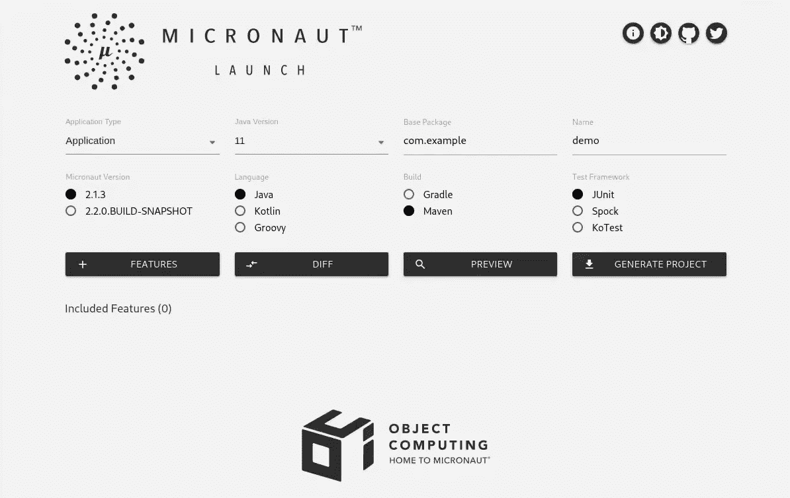
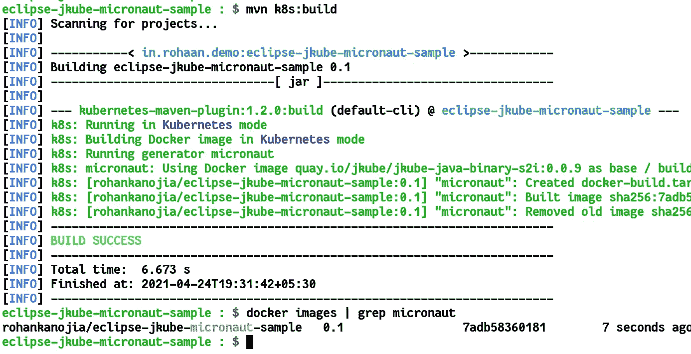
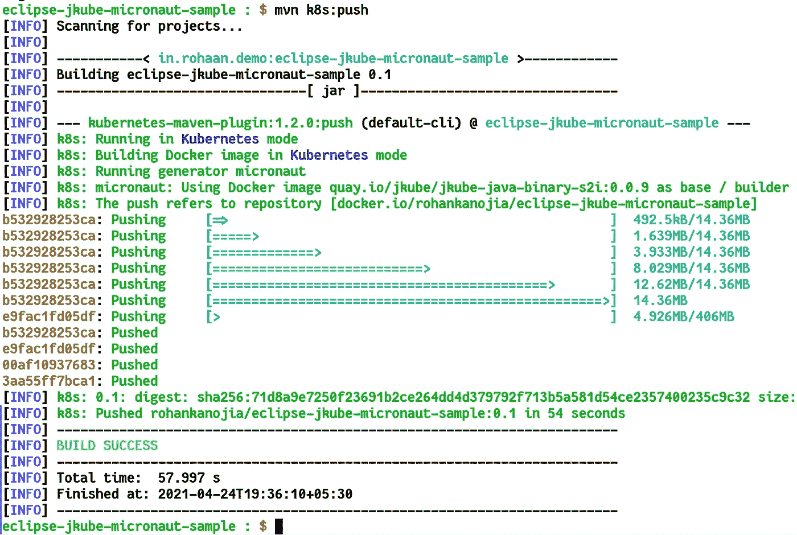
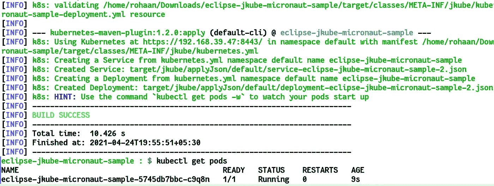
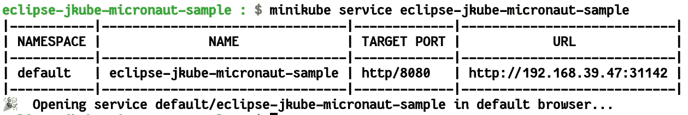
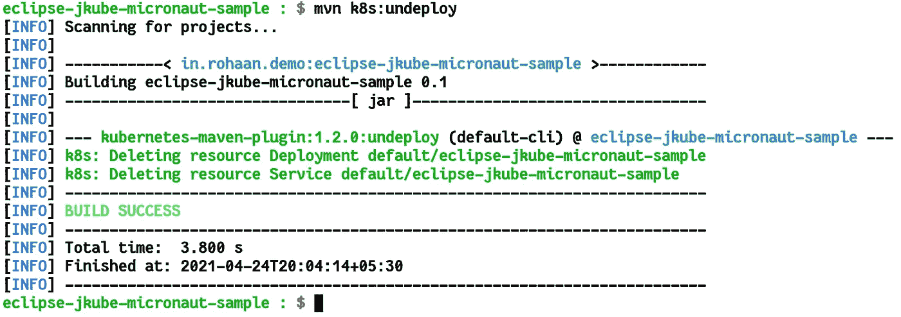

# 使用 Eclipse JKube 将 Micronaut 应用程序部署到 Kubernetes

> 原文：<https://itnext.io/deploy-micronaut-application-to-kubernetes-using-eclipse-jkube-684c5e08b2f2?source=collection_archive---------3----------------------->

注意:这篇博客是博客系列的一部分:[使用 Eclipse JKube 将 Java 应用程序部署到 Kubernetes 上](https://medium.com/@rohaan/deploying-java-applications-onto-kubernetes-using-eclipse-jkube-c2ad83a7d98a)


在之前的博客中，我们已经看到了如何在 Eclipse JKube 的帮助下轻松地将 Spring Boot、Quarkus、Vert.x 或任何基于 Tomcat 的 web 应用程序部署到 Kubernetes。Eclipse JKube 也支持 Micronaut 应用程序。我们将做同样的事情，但这次是为了一个基于 Micronaut 的项目，使用 Eclipse JKube。这里需要注意的一点是，无论 Eclipse JKube 试图在 Kubernetes 上部署什么样的框架，它的工作流都保持不变。

# 创建和配置示例代码:

您可以访问 [Micronaut Launcher](https://micronaut.io/launch) 网站并生成一个示例 maven 项目。它提供了非常好的 UI 来快速生成一个示例项目并添加必要的依赖项。



[Micronaut 发布网站](https://micronaut.io/launch)

下面是生成的`pom.xml`的样子:

pom.xml for project

我们将为简单的模型类`Person`添加一个简单的控制器，就像在[Piotr mik owski](https://github.com/piomin)的示例项目中所做的那样:

[](https://github.com/piomin/sample-micronaut-applications) [## Pio min/sample-micro naut-应用

### 示例应用程序说明 micronaut 框架的使用-Pio min/sample-micronaut-应用程序

github.com](https://github.com/piomin/sample-micronaut-applications) 

我们的应用程序源代码树如下所示:

```
eclipse-jkube-micronaut-sample : $ tree . 
**.** 
├── **mvnw** 
├── **mvnw.bat** 
├── pom.xml 
├── README.md 
└── **src** 
    ├── **main** 
    │   ├── **java** 
    │   │   └── **in** 
    │   │       └── **rohaan** 
    │   │           └── **demo** 
    │   │               ├── Application.java 
    │   │               ├── **model** 
    │   │               │   └── Person.java 
    │   │               └── PersonController.java 
    │   └── **resources** 
    │       ├── application.yml 
    │       └── logback.xml 
```

让我们定义我们的模型类`Person`。这将是一个像 id，名字，姓氏等字段的个人实体的简单类。

我们的控制器模型的人员类别

然后，我们将为这个 Person 实体定义一个 REST 控制器。我们将为 POST 和 GET 操作添加一些基本端点:

PersonController.java

一旦我们将所有这些文件添加到项目中。我们可以继续打包我们的应用程序:

```
$ mvn clean install
```

然后您可以执行存在于`target`目录中的 jar。您还可以使用 micronaut maven 插件运行它，运行目标如下:

```
$ mvn mn:run
```

您应该能够看到`/persons` GET endpoint 返回所有创建的人。您可以向它发送 POST 请求，以便创建一个人。

# 构建容器映像并将其推送到 Docker Hub:

现在我们的应用程序在本地运行良好，让我们试着将它封装成一个 Docker 映像，并将其发布到某个容器注册中心。为了做到这一切，我们将在我们的`pom.xml`中添加 Eclipse JKube Kubernetes Maven 插件。你可以在 [maven central](https://search.maven.org/artifact/org.eclipse.jkube/kubernetes-maven-plugin/1.2.0/maven-plugin) 上找到最新版本。

```
**<plugin>
    <groupId>**org.eclipse.jkube**</groupId>
    <artifactId>**kubernetes-maven-plugin**</artifactId>
    <version>**${jkube.version}**</version>
</plugin**>
```

您可以使用`mvn k8s:build`目标构建映像，默认情况下，Eclipse JKube 以`${project.groupId}/${project.artifactId}:${project.version}`格式生成您的应用程序的映像名称，但是您可以通过指定如下的`jkube.generator.name`属性来覆盖它:

```
**<properties>** **...
  <docker.user>**rohankanojia**</docker.user>**
  **<jkube.generator.name>** ${docker.user}/${project.artifactId}:${project.version}    
  **</jkube.generator.name>
<properties>**
```

然后，您可以使用 Eclipse JKube 的构建目标继续进行映像构建过程:

```
$ mvn k8s:build
```



建立码头形象

现在，为了将本地映像推送到 docker hub，您需要首先配置您的注册表凭证。如 [Kubernetes Maven 插件文档](https://www.eclipse.org/jkube/docs/kubernetes-maven-plugin#registry)所述，你可以通过`docker login`、插件的 XML 配置或`.m2/settings.xml`来配置注册表，就像 Maven 仓库一样。我使用了`docker login`，它将我的凭证存储在`.docker/config.json`中。之后，您可以像这样继续推送图像:

```
$ mvn k8s:push
```



将图像推送到 Docker Hub

您可以通过登录 docker hub 来检查图像是否被成功推送。在我的例子中，图像被推送到 docker hub:


图像被推送到 Docker Hub

# 将应用程序部署到 Kubernetes:

现在我们已经建立了应用程序的容器映像。我们现在可以着手将我们的应用程序部署到 Kubernetes。如果您可以访问某个 Kubernetes 集群，那么您可以登录到该集群以便部署它。我将使用 [minikube](https://minikube.sigs.k8s.io/docs/) 来部署应用程序。为了启动我的集群，我将运行`minikube start`

```
$ minikube start
```

为了部署到 Kubernetes，我们需要为`Deployment`、`Service`等资源生成 Kubernetes YAML 清单。为此，我们将使用 Eclipse JKube 的资源目标。然后，我们将把这些生成的清单应用到 Kubernetes 集群。

为了将默认服务类型覆盖为我的本地测试的节点端口，我将这个属性添加到我的`pom.xml`:

```
**<jkube.enricher.jkube-service.type>** NodePort
**</jkube.enricher.jkube-service.type>**
```

然后，您可以根据以下目标部署到 Kubernetes:

```
$ mvn k8s:resource k8s:apply
```



mvn k8s:资源 k8s:应用目标

然后，您可以像这样用`minikube service`检查应用程序的 URL:



迷你库服务

# 测试部署的应用程序:

您可以通过简单的 CURL 添加一个人并查看现有的人来检查应用程序是否运行正常:

```
**eclipse-jkube-micronaut-sample : $** curl -XPOST \
>  -H 'Content-Type:application/json' \ 
>  -d '{"id":1,"firstName":"John","lastName":"Snow","age":29,"gender":"Male"}' \ 
>  http://192.168.39.47:31142/persons | jq . 

**{** 
 **"id":** 1**,** 
 **"firstName":** "John"**,** 
 **"lastName":** "Snow"**,** 
 **"age":** 29**,** 
 **"gender":** "Male" 
**}****eclipse-jkube-micronaut-sample : $** curl http://192.168.39.47:31142/persons | jq . 
**[** 
 **{** 
 **"id":** 1**,** 
 **"firstName":** "John"**,** 
 **"lastName":** "Snow"**,** 
 **"age":** 29**,** 
 **"gender":** "Male" 
 **}** 
**]**
```

# 删除已部署的应用程序:

一旦您完成了测试，您就可以像这样清理由取消部署目标创建的所有资源:

```
$ mvn k8s:undeploy
```



Kubernetes Maven 插件取消部署目标

# 结论:

今天我们了解了 [Eclipse JKube](https://github.com/eclipse/jkube) 如何在 Kubernetes 的基础上简化另一个框架的开发: [Micronaut](https://micronaut.io/)

您可以在以下资源库中找到本博客中使用的所有代码:

 [## r0haaaan/eclipse-jkube-micro naut-sample

### 在 GitHub 上创建一个帐户，为 r0haaaan/eclipse-jkube-micro naut-sample 开发做贡献。

github.com](https://github.com/r0haaaan/eclipse-jkube-micronaut-sample) 

你有什么想法可以帮助我们改进这个项目吗？我们非常重视您的反馈，所以请报告错误，要求改进…不要害羞，加入我们的欢迎社区:

*   对 [GitHub](https://github.com/eclipse/jkube/issues) 提供反馈；
*   编点代码[推个 PR](https://github.com/eclipse/jkube/pulls)；
*   在 [Gitter](https://gitter.im/eclipse/jkube) 和[邮件列表](https://accounts.eclipse.org/mailing-list/jkube-dev)上与我们讨论；
*   就[堆栈溢出](https://stackoverflow.com/questions/tagged/jkube)提问。