# 部署巢穴。JS on ZEIT Now 与 Github Actions

> 原文：<https://itnext.io/deploy-nest-js-on-zeit-now-with-github-actions-86bc226e7371?source=collection_archive---------1----------------------->


我在去年发现了 [ZEIT Now](https://zeit.co) ，并认为这是一种部署不同类型网站的简单方法，无论是前端还是后端，默认情况下**没有配置**。此外，我了解到我可以使用不同的编程语言，如 Go、Python 和 Ruby！点击查看可用运行时间[。😱那更牛逼！我希望他们继续支持更多的语言。期待它的进化！🔥](https://zeit.co/docs/runtimes#official-runtimes)

现在让我们进入正题吧！

# 什么是 Github Actions？

Github Actions 是 Github 的一项功能，可以自动执行 Github 内部的软件工作流程。它使得在平台中构建、测试和部署您的代码变得容易。如果您仍在使用第三方 CI/CD，您可能想尝试一下。😉

# 让我们把手弄脏吧

首先，创建一个空的 Github 存储库。我假设您已经有了一个 Github 存储库和 Nest。JS 代码，但我想从头开始，这样我们都有一个好的起点。

创建存储库之后，让我们克隆我们的嵌套。JS 来自鸟巢提供的首发。JS 团队。首先键入以下命令:

```
$ git clone [https://github.com/nestjs/typescript-starter](https://github.com/nestjs/typescript-starter)
```

克隆存储库之后，让我们将它推送到我们的 Github 存储库。应该是这样的:

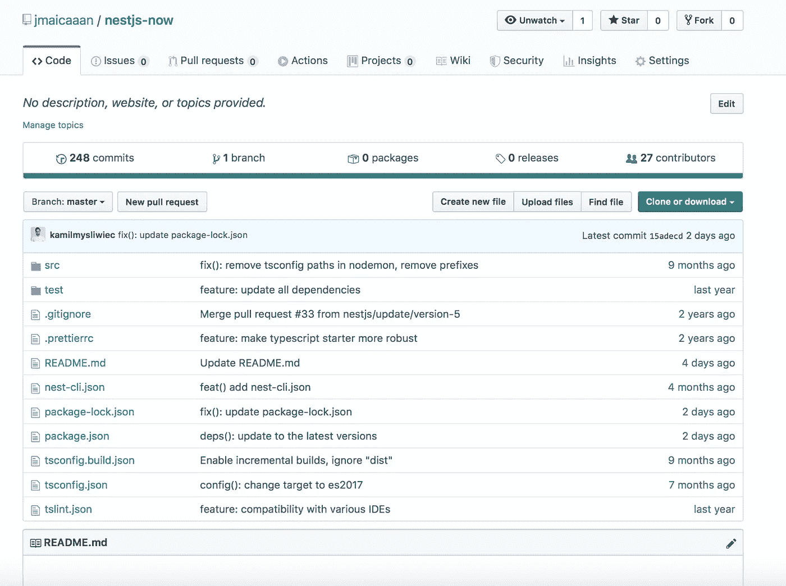

既然我们已经准备好了。现在让我们继续配置 ZEIT Now 来完成我们的项目。等等，我以为我们不需要配置？我们将需要一个小的配置工作在我们的项目结构。ZEIT 现在没有配置工作略有不同。这里可以看到[。](https://zeit.co/docs/runtimes#official-runtimes/node-js)

不过不用担心，只是一点配置😉

# 现在配置 ZEIT

在根目录下创建一个文件`now.json`

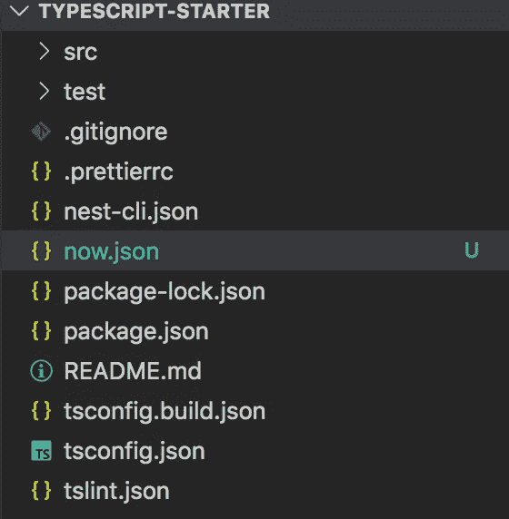

这是 ZEIT 现在在构建和部署我们的项目时要查看的文件。让我们继续添加我们的小配置。

下面是我们的小配置！让我解释一下这里发生了什么。

`version` —该属性指定我们将在部署期间使用的 ZEIT Now 版本。版本 2 是目前最新的版本。

`name` —此属性指定部署的名称。它还用作部署 URL 的前缀值。例如，我们的名字是`nestjs-now`，我们将有一个类似`https://nestjs-now.${username}.now.sh`的部署 URL。

`builds` —此属性指定文件将在何处转换为无服务器功能。这就像告诉 ZEIT 现在，“这是我的根文件，建立一个无服务器的功能”。是的，我们正在改造我们的整个巢穴。JS 应用程序转换成一个无服务器函数。


[https://zeit.co](https://zeit.co)

`routes` —该属性指定所有路由都应该由我们的`main.js`处理。我们只是告诉 ZEIT 现在将所有请求重定向到我们的巢。JS 应用。这是因为我们的路由是由 Nest 处理的。JS 应用程序已经。

有关配置的更多信息，您可以在这里阅读更多信息[。](https://zeit.co/docs/configuration)

我们可以通过手动部署来测试我们的应用程序。让我们将 ZEIT Now 安装为项目依赖项的一部分，这样我们就可以在 CI 模式下调用 ZEIT Now CLI。

```
$ npm install --save now
```

然后在安装之后，让我们在我们的`package.json`上添加一个部署脚本。

```
{
  "deploy": "npm run build && now --prod --token $ZEIT_TOKEN"
} 
```

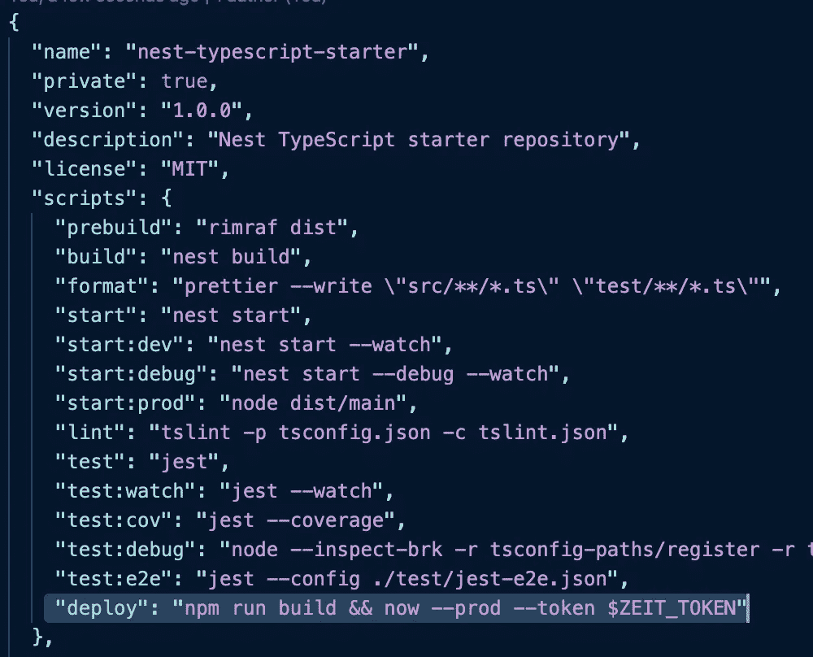

我们现在的下一步是从 ZEIT 获得一个令牌。让我们现在就做吧👍

登录您的 ZEIT Now 帐户，然后转到**设置**，然后导航到**令牌**部分。之后，让我们创建一个新的令牌，并将其命名为“nestjs-now-github-action ”,但是，是的，您可以随意命名。**别忘了复制令牌**！😉

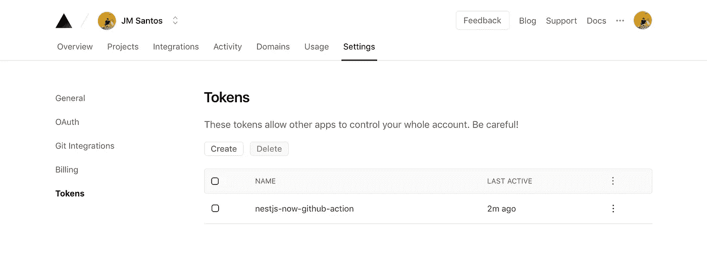

现在我们有了令牌，让我们尝试使用我们的自定义脚本并手动部署它。

转到项目根目录，通过键入以下命令开始。用我们不久前复制的那个替换`ZEIT_TOKEN`:

```
$ ZEIT_TOKEN=xxxxxxx npm run deploy
```

我们现在可以看到我们的应用程序已经成功部署。万岁！🚀

```
$ ZEIT_TOKEN=xxxxxxx npm run deploy$ npm run build && now --prod --token $ZEIT_TOKEN...> Deploying ~/Documents/jm/typescript-starter under jmaicaaan> Using project nestjs-now> NOTE: To deploy to production (nestjs-now-two-eta.now.sh), run `now --prod`> https://nestjs-now-ar99uog9g.now.sh [2s]> Ready! Deployed to https://nestjs-now.jmaicaaan.now.sh [in clipboard] [29s]
```

# 设置 Github 操作

现在我们可以手动部署我们的应用程序了。是时候使用 Github Actions 来自动化这个工作流程了！

让我们转到 Github 上的 Actions 选项卡，开始创建我们的 Github 动作。

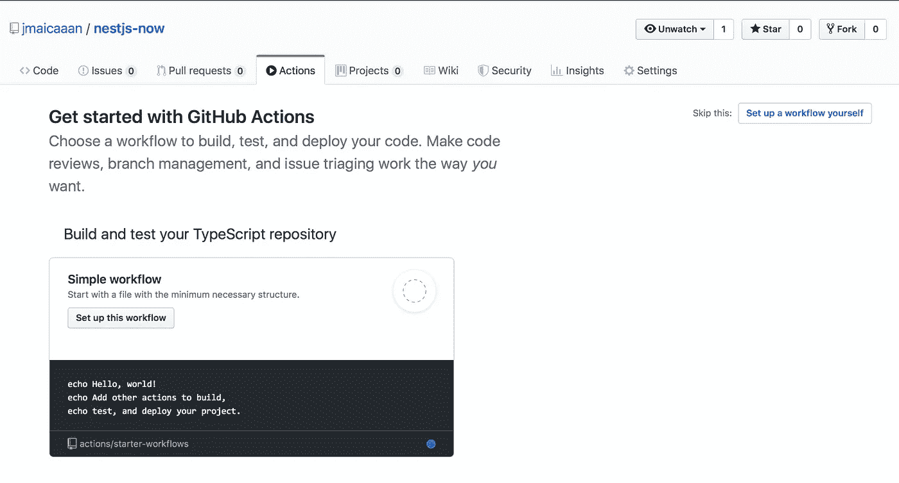

然后，再向下滚动一点，我们可以看到 Node.js 的工作流程

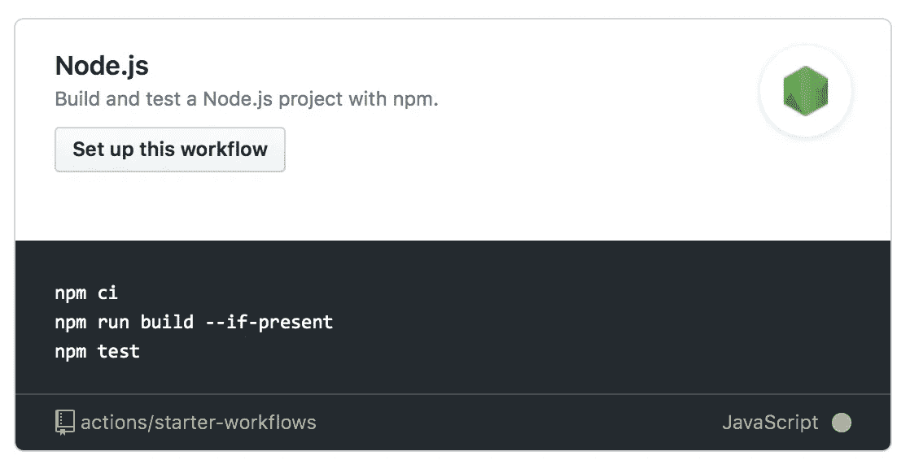

点击“设置此工作流程”按钮，将会引导您进入工作流程文件`nodejs.yaml`。

让我们编辑`nodejs.yaml`文件来适应我们的自动化。让我们执行以下步骤:

*   将`name`重命名为您喜欢的名称。我更喜欢把它命名为“立即部署到 ZEIT”。
*   重命名后，让我们移动到“**运行**部分，并删除`npm test`，因为我们现在没有测试，这只是一个基本的例子。让我们暂时摆脱它。
*   既然我们删除了`npm test`，让我们添加我们的部署脚本`npm run deploy`。
*   因为我们的部署脚本需要`ZEIT_TOKEN`环境变量。在“ **env** 部分下面，我们再加上`ZEIT_TOKEN: ${{ secrets.ZEIT_TOKEN }}`。

我们的工作流程文件准备好了。让我们提交它，然后我们将在`ZEIT_TOKEN`上工作。

既然我们的工作流已经提交到我们的存储库中。你可能想知道`ZEIT_TOKEN`值从何而来，不是吗？啊哈，只需进入**设置**然后进入**秘密**部分并在那里添加秘密。

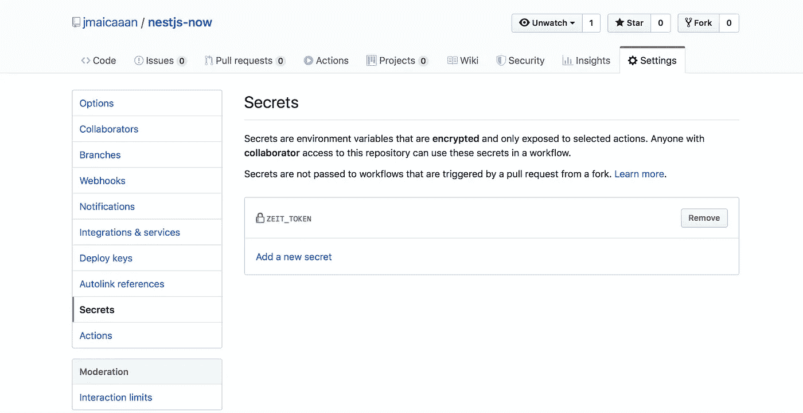

为了访问这个秘密，我们可以使用 Github 提供的“秘密”上下文。这就是为什么在我们的`nodejs.yml`工作流程中，在 **env** 部分，有一个`${{ secrets.ZEIT_TOKEN }}`。你可以在这里阅读更多。

我们的 Github 动作会在每次推送时触发，让我们试一下，看看我们的工作流是否会正常运行。让我们编辑一些代码，并推动它来触发我们的工作流程！

例如，我们可以编辑`app.service.ts`来返回一个修改过的字符串。

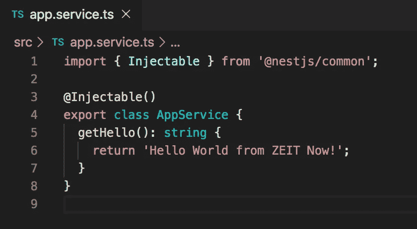

让我们看看我们的工作流程是否运行正常。

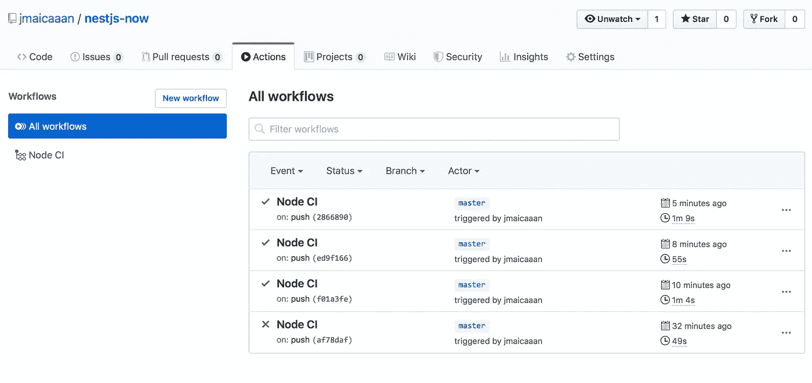

嗯，看起来是这样。让我们通过访问我们部署的应用程序来进一步确认这一点。我们可以通过日志看到。

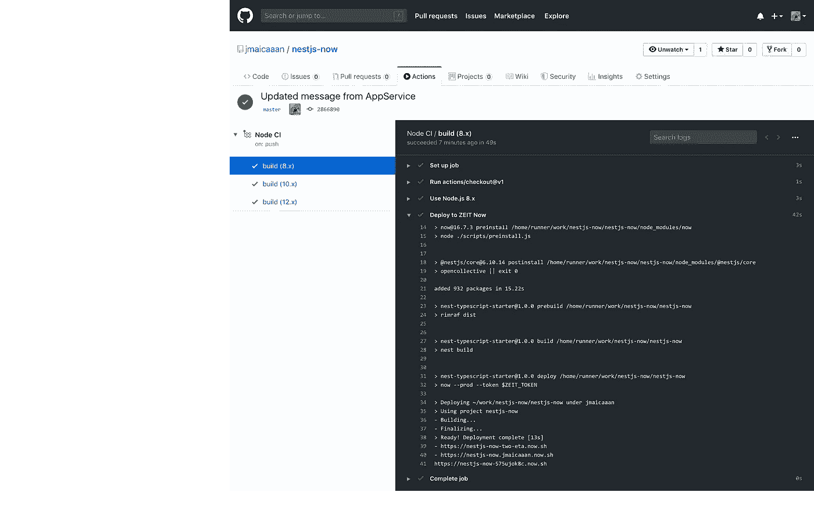

再看[https://nestjs-now . jmaicaan . now . sh](https://nestjs-now.jmaicaaan.now.sh)，看起来是返回了预期的字符串值！😍

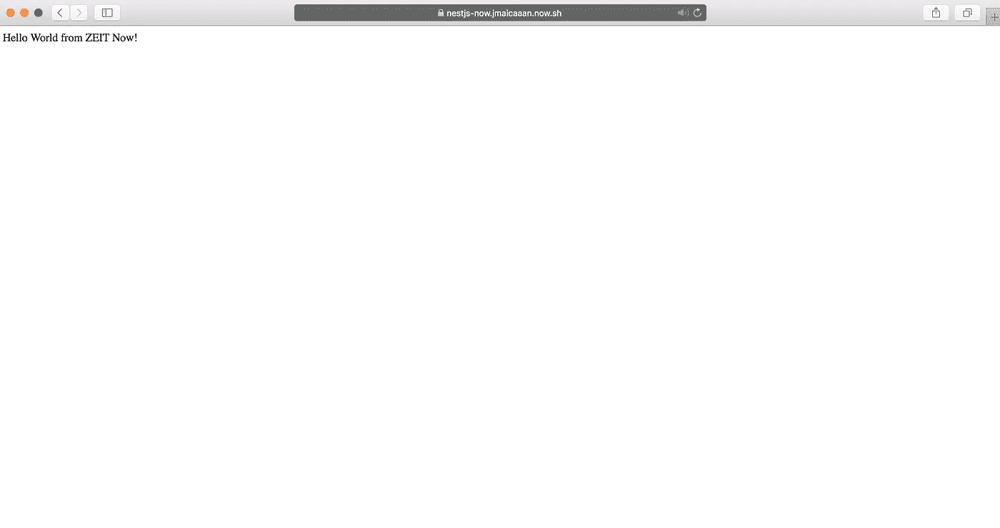

**恭喜你！我们现在已经部署好了我们的巢穴。JS on ZEIT Now 与 Github Actions🎉**