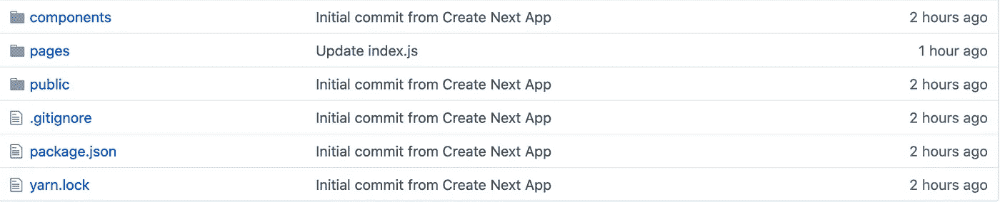
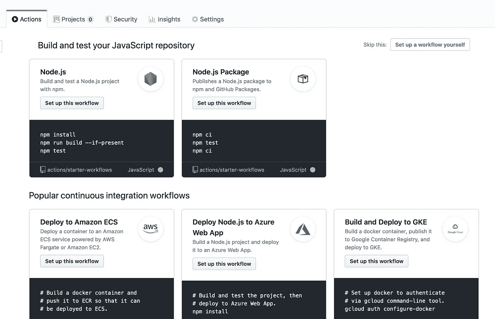
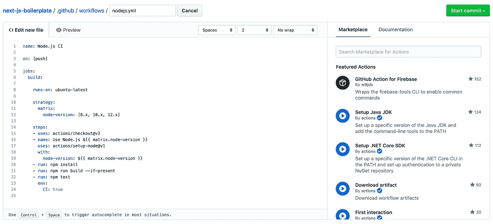
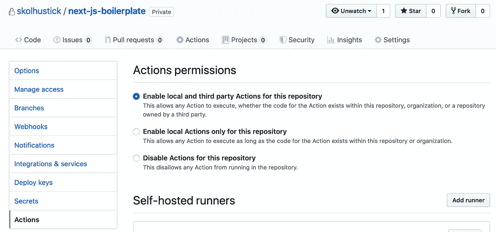
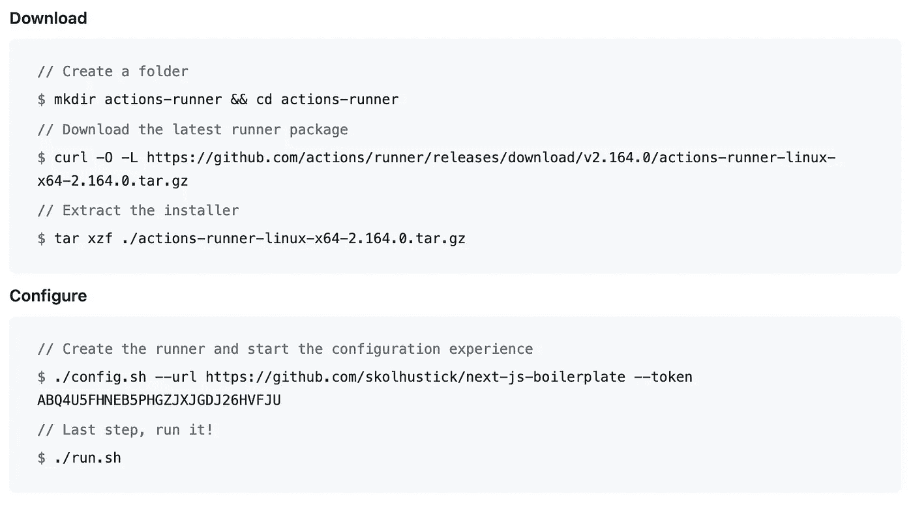

# 使用 Github 操作部署 Next.js 应用程序

> 原文：<https://itnext.io/deploy-next-js-apps-using-github-actions-6322261757bc?source=collection_archive---------0----------------------->

推动部署。简单的方法。


照片由[克里斯蒂娜@ wocintechchat.com](https://unsplash.com/@wocintechchat?utm_source=unsplash&utm_medium=referral&utm_content=creditCopyText)在 [Unsplash](https://unsplash.com/s/photos/server?utm_source=unsplash&utm_medium=referral&utm_content=creditCopyText) 上拍摄

## 1.先决条件—next . js | Github | PM2 | node . js | Nginx | Linux

本指南假设您在 Github 的私有存储库中已经有一个 Next.js 应用程序。这里我有使用`npx create-next-app`创建的基本样板 Next.js 应用程序



我们假设您有一个运行 Ubuntu 的 VPS 实例。你可以从[数字海洋](https://m.do.co/c/f4a5fcc71df6)得到一个。确保在您的实例中，您具有:

1.  已安装的 Node.js
2.  安装并配置 Nginx 作为 Next.js 应用程序运行端口的反向代理。我的是`localhost:3000`，因为这是默认值。
3.  安装了 PM2 来运行我们的 Next.js 应用程序，但是**我们将稍后再做。**

另外，**不要从 Github 克隆**你的应用程序。

## 2.配置 Github 操作工作流

在 Github 上导航到您的存储库，然后点击“Actions”选项卡。Github 会展示一些相关的工作流程。通过单击“设置此工作流”选择 Node.js 工作流。



一个`.yml`文件的编辑器窗口将会出现。



之前:nodejs.yml

让我们编辑这个文件。我想**跳过测试**，并想**为我们的 Next.js 应用程序添加一个构建脚本**。在应用程序构建完成后，我想添加一个`pm2 reload`命令，这样我们的应用程序将使用新构建的版本进行更新。我还删除了`matrix`中的另一个`node-version`。我们还想把`runs-on`改成`self-hosted`。我的最终版本是这样的:

之后:nodejs.yml

保存这个文件并提交到您的存储库中。

## 3.设置动作运行器

转到存储库的设置选项卡，并选择“**操作**”。点击**添加流道**



现在，您将看到在 VPS 实例上运行**所需的命令列表。**



在您的实例上运行所有这些命令，您可以选择所有的默认值。在最后一个命令`./run.sh`中，你会在命令行中看到我们已经开始监听你的 git 推送。让我们通过执行`Ctrl + C`来暂时**退出这个监听器**。

## 4.开始 PM2

下一步是开始你的 PM2。使用 Action Runner 时，应用程序的目录将被放置在特定的文件夹中。注意，我们根据上面的命令创建了一个`actions-runner`目录。在这个目录中，你会看到一个`_work`目录。在里面，您会看到一个以您的存储库命名的目录。`cd`进入其中，再`cd`进入你看到的唯一目录。通常这个目录也像你的仓库一样命名。在这个目录中，您将看到您的应用程序源代码。因此，这就是我们将使用 PM2 启动应用程序的地方。我们使用这个简单的命令启动名为`next-js`的应用程序。

```
pm2 start npm --name "next-js" -- start
```

让我们回顾一下。我们有一个使用 Nginx 的反向代理，为我们来自`localhost:3000`的应用服务，我们已经使用 PM2 启动了我们的应用，并在`localhost:3000`上运行。所以，这意味着我们的网站是活的。

## 5.将 Action Runner 作为后台服务运行

现在，回到我们的`actions-runner`文件夹。这里你会注意到一个`./svc.sh`文件。这个文件允许我们在后台运行 action runner 作为服务。您需要以`sudo`的身份运行这个文件。首先，让我们运行安装命令:

```
sudo ./svc.sh install
```

然后运行:

```
sudo ./svc.sh start
```

现在，您的 action runner 正在后台监听您对 git 存储库的任何推送。要检查该侦听器的状态，可以使用以下命令:

```
sudo ./svc.sh status
```

你会注意到在 **Github Repo >设置>动作标签**中，有一个跑步者在跑:


就是这样！现在，对您的代码进行任何更改，并推送至主分支，在服务器中查看您的代码更改。没有网络挂钩，或手动部署。就是管用！✨

如果你想看关于如何设置先决条件的更详细的教程，请留下评论。🙏

查看我在 Medium 上的其他 Next.js 文章:

[](https://medium.com/javascript-in-plain-english/next-js-where-have-you-been-all-my-life-1dedba2d2431) [## next . js——我这辈子你都去哪了？

### Next.js 如何让我在生产中编写 React。

medium.com](https://medium.com/javascript-in-plain-english/next-js-where-have-you-been-all-my-life-1dedba2d2431) [](/one-domain-multiple-next-js-apps-5e39b0ffa1bf) [## 一个域—多个 Next.js 应用程序

### 关于如何使用 Nginx 在一个域上使用子目录服务多个 Next.js 应用程序的快速教程。

itnext.io](/one-domain-multiple-next-js-apps-5e39b0ffa1bf)