# 只需一次点击即可在云上部署

> 原文：<https://itnext.io/deploy-on-cloud-run-in-just-one-click-57e53d40f58e?source=collection_archive---------1----------------------->

## 使用 Google Cloud Run 按钮部署一个容器化的无服务器应用程序

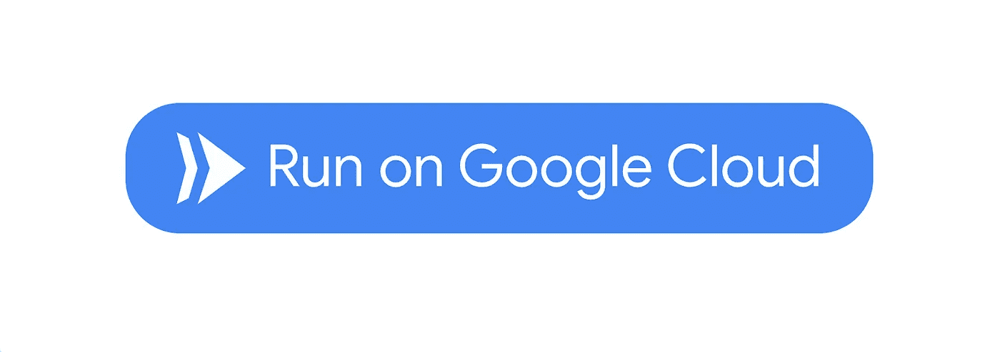

…只需轻轻一点

## TL；速度三角形定位法(dead reckoning)

几天前 [Ahmet Alp Balkan](https://medium.com/u/2cac56571879?source=post_page-----57e53d40f58e--------------------------------) 推出了 Google Cloud Run 按钮，允许直接从 Git 仓库部署无服务器容器。在这篇文章中，我们将在一个示例项目中演示这个按钮的设置和用法。

## 关于云运行

> Cloud Run 是一个托管计算平台，可以自动扩展您的无状态容器。云运行是无服务器的:它抽象了所有的基础设施管理。
> 
> — [谷歌](https://cloud.google.com/run/)

基本上，Cloud Run 基于 [Knative](https://cloud.google.com/knative/) ，这是 Pivotal 和谷歌发起的一个项目，旨在简化 Kubernetes 上的功能部署和运行。从用任何语言开发的代码中，它创建一个 Docker 映像并运行容器。

## 创建一个关于 GCP 的项目

谷歌云平台(GCP)提供云运行。要使用它，我们首先需要转到[谷歌云控制台](https://console.cloud.google.com)并创建一个空项目。

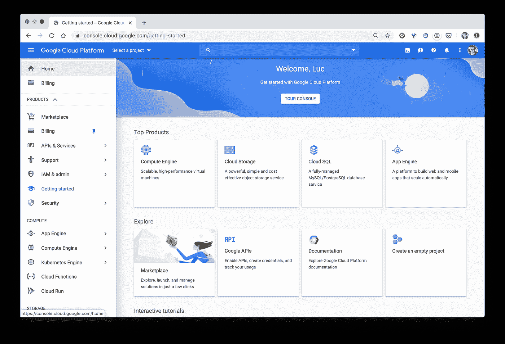

谷歌云控制台

我们将这个项目称为 c *loud-run-demo* ，我们稍后将使用它来部署我们的工作负载。

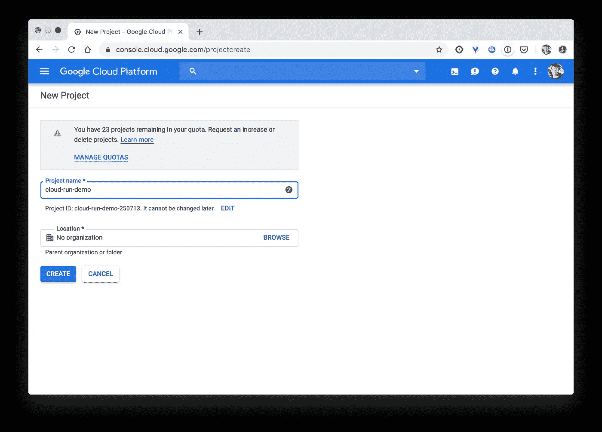

项目的创建

注意:在 GCP 上，一个项目是一组资源(虚拟机实例、网络服务等)的单元

创建完成后，我们可以转到项目页面，查看默认控制面板。里面有很多东西，但我们可以根据自己的需要轻松定制。

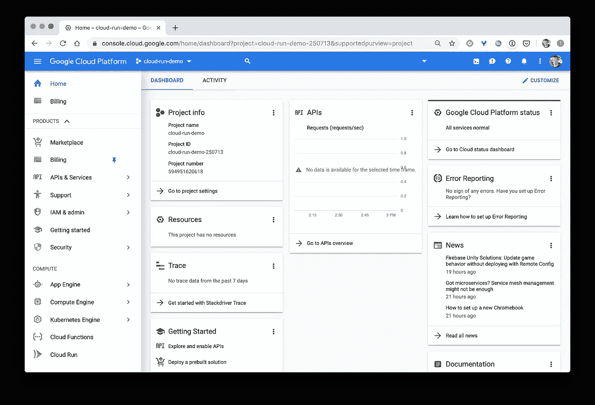

项目页面

## 一个示例项目

为了说明云运行的用法，我们使用 [Node.js](http://nodejs.org) 创建了一个简单的 web 服务器，它返回每个 IP 地址的请求数量。我们只定义了两个文件:

*   *index.js* 公开端点并返回 json 中的统计数据

```
const express = require('express');
const app = express();
const stats = {};
app.get('/', function(req, res) {
    res.setHeader('Content-Type', 'application/json');
    let ip = req.connection.remoteAddress;
    stats[ip] = stats[ip] ? stats[ip] + 1 : 1;
    res.send(stats);
});
app.listen(8080);
```

*   *package.json* 定义依赖关系(本例中只有 [expressjs](https://expressjs.com)

```
{
  "name": "www",
  "version": "0.0.1",
  "main": "index.js",
  "scripts": {
    "start": "node index.js"
  },
  "dependencies": {
    "express": "^4.14.0"
  }
}
```

## 创建 GitHub 存储库

我们现在创建 [GitHub](https://github.com) 库来托管代码，并将其命名为 *demo* (给临时库起一个好听的名字很难:)。

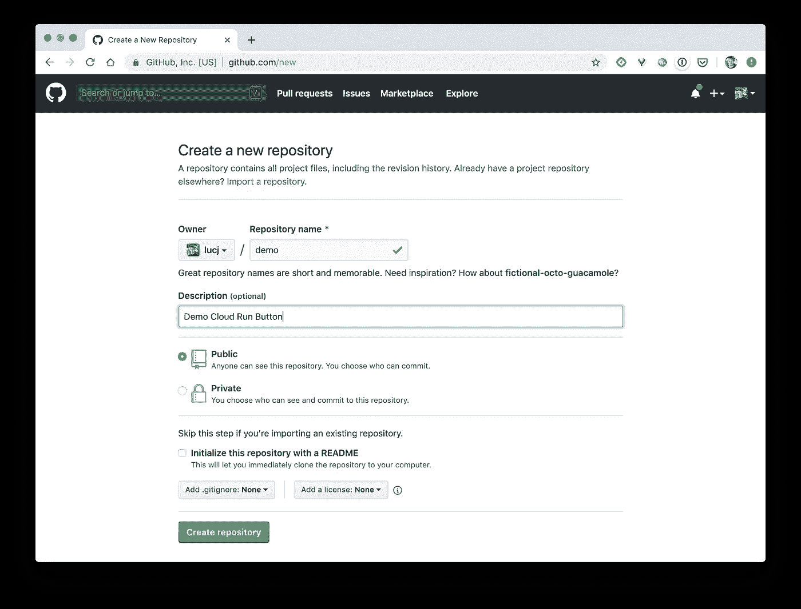

一旦创建了项目，我们初始化一个本地 git repo，将远程配置为指向存储库并提交/推送代码。

```
$ git init$ git remote add origin git@github.com:lucj/demo.git$ git add index.js package.json$ git commit -m 'First commit'$ git push origin master
```

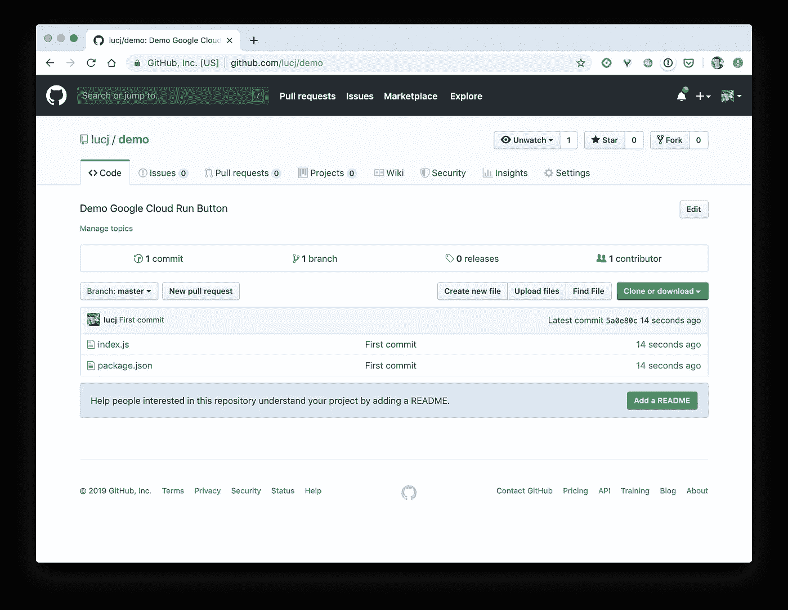

## 添加云运行按钮

在我们的项目中添加花哨的 Cloud Run 按钮唯一需要做的就是在 README 中添加以下内容:

```
[](https://console.cloud.google.com/cloudshell/editor?shellonly=true&cloudshell_image=gcr.io/cloudrun/button&**cloudshell_git_repo=https://github.com/lucj/demo.git**)
```

由于我们的项目还没有这样的文件，我们用上面的内容创建了一个 README.md，确保 *cloudshell_git_repo* 标志引用了我们的 git 存储库(【https://github.com/lucj/demo.git】T2)。然后，我们提交并推送这个新文件。

```
$ git add README.md$ git commit -m 'Add Cloud Run Button'$ git push origin master
```

从 GitHub 项目页面，我们可以看到我们的新按钮呼吁行动。

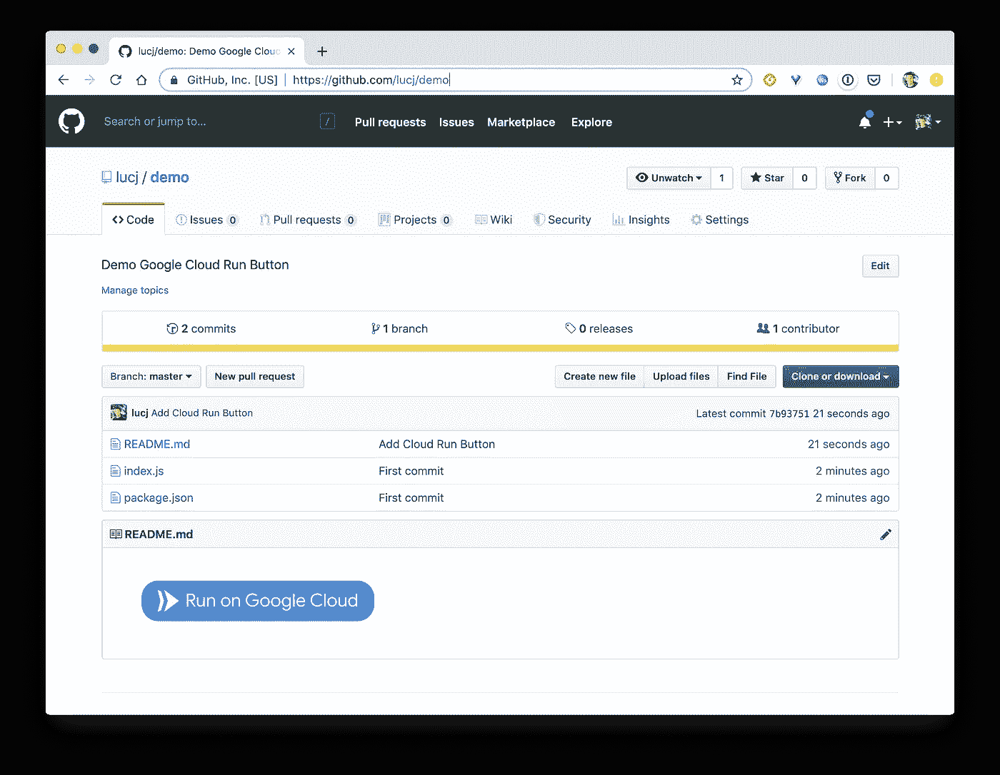

## 测试事物

点击按钮会在新浏览器的窗口中触发云壳控制台。

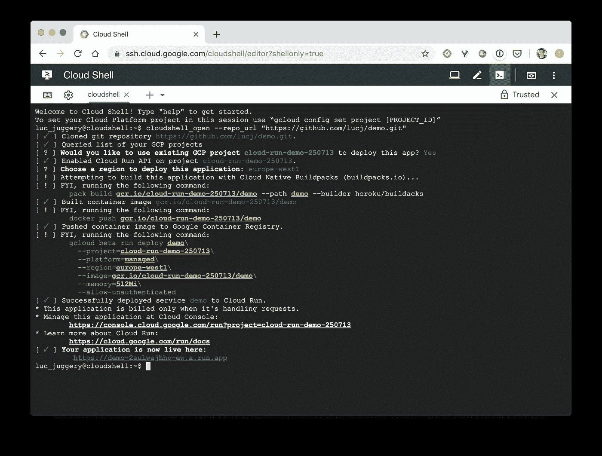

让我们回顾一下所涉及的不同步骤。首先，我们需要执行几个手动步骤:

*   选择我们希望服务器部署到的项目
*   为项目配置一个计费帐户，因为我们还没有一个
*   选择要部署到的区域

然后会触发一些自动化流程:

*   容器映像的构建

这一步非常有趣，因为即使我们没有指定任何 Docker 文件，Docker 映像也会被构建。为了执行这个动作，它使用了[云原生构建包](https://buildpacks.io)，一个 [CNCF](https://cncf.io) 的沙盒项目。Buildpacks 检测应用程序源代码中使用的语言，并知道如何从中创建可运行的映像。例如，它可以从用 Go、Node.js、Python 等语言编写的应用程序中构建图像。如果我们定义了一个 docker 文件，那么这个文件就会被使用。

*   使用项目 id 作为用户名将图像推送到 Google registry gcr.io
*   基于新创建的映像运行容器
*   然后它提供一个 https 端点来访问部署的应用程序

注意:默认情况下，应用程序必须监听端口 8080，但是可以在 Cloud Run 接口的环境变量中进行更改。

云 Shell 控制台提供了以下端点*https://demo-2 aulwejhq-ew . a . run . app*来访问应用程序。如果我们向这个端点发送一个请求，我们可以看到应用程序是可用的:

```
$ curl [https://demo-2aulwejhhq-ew.a.run.app](https://demo-2aulwejhhq-ew.a.run.app)
{"::ffff:104.248.172.251":1}
```

我们还可以使用 [ApacheBench](https://httpd.apache.org/docs/2.4/programs/ab.html) 发送更多负载，并确保所有请求都得到正确处理。

```
$ **ab -c 50 -n 5000** [**https://demo-2aulwejhhq-ew.a.run.app/**](https://demo-2aulwejhhq-ew.a.run.app/)
This is ApacheBench, Version 2.3 <$Revision: 1807734 $>
Copyright 1996 Adam Twiss, Zeus Technology Ltd, [http://www.zeustech.net/](http://www.zeustech.net/)
Licensed to The Apache Software Foundation, [http://www.apache.org/](http://www.apache.org/)Benchmarking demo-2aulwejhhq-ew.a.run.app (be patient)
Completed 500 requests
Completed 1000 requests
Completed 1500 requests
Completed 2000 requests
Completed 2500 requests
Completed 3000 requests
Completed 3500 requests
Completed 4000 requests
Completed 4500 requests
Completed 5000 requests
Finished 5000 requestsServer Software:        Google
Server Hostname:        demo-2aulwejhhq-ew.a.run.app
Server Port:            443
SSL/TLS Protocol:       TLSv1.2,ECDHE-RSA-CHACHA20-POLY1305,2048,256
TLS Server Name:        demo-2aulwejhhq-ew.a.run.appDocument Path:          /
Document Length:        26 bytesConcurrency Level:      50
Time taken for tests:   25.045 seconds
Complete requests:      5000
Failed requests:        3624
   (Connect: 0, Receive: 0, Length: 3624, Exceptions: 0)
Total transferred:      1730257 bytes
HTML transferred:       139373 bytes
Requests per second:    199.64 [#/sec] (mean)
Time per request:       250.451 [ms] (mean)
Time per request:       5.009 [ms] (mean, across all concurrent requests)
Transfer rate:          67.47 [Kbytes/sec] receivedConnection Times (ms)
              min  mean[+/-sd] median   max
Connect:        9   14   3.8     13     119
Processing:    13  224 749.2     34    7484
Waiting:       13  223 749.2     33    7484
Total:         24  237 749.1     48    7500Percentage of the requests served within a certain time (ms)
  50%     48
  66%     55
  75%     60
  80%     64
  90%     84
  95%   1946
  98%   2798
  99%   3563
 100%   7500 (longest request)
```

## 近距离观察云运行 UI

在 GCP，可以从计算部分访问云运行界面。我们可以看到名为 *demo* 的服务已经创建，这是我们单击“云运行”按钮的结果。

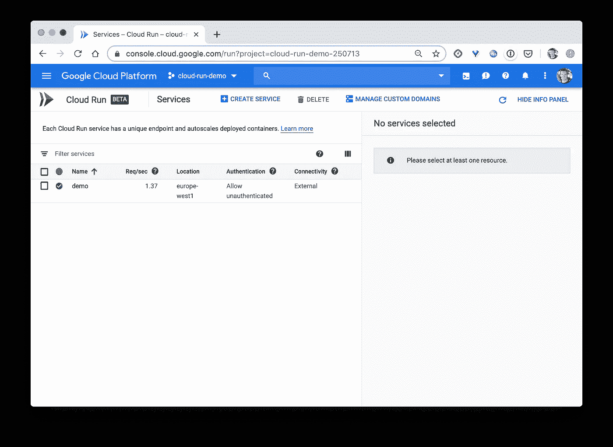

云运行服务列表

我们可以获得服务的一些其他详细信息，例如:

*   指标，我们在下面看到的请求数量的增加是由于 ab 产生的负载

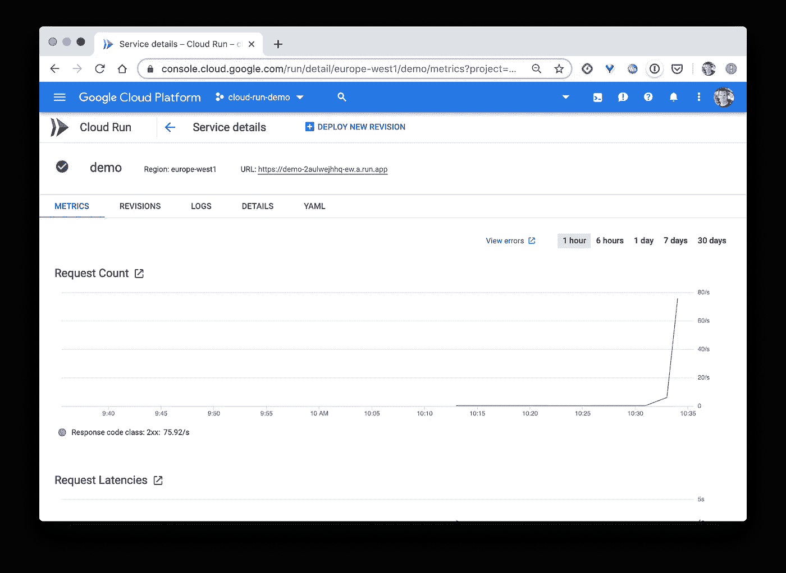

服务的指标

*   应用程序的修订版，我们只部署了一个版本
*   应用程序的日志
*   用于部署应用程序的规范。正如我们在下面看到的，这个定义了一个 [Knative](https://pivotal.io/fr/knative) 服务，我们将在以后的文章中再回到 Knative。

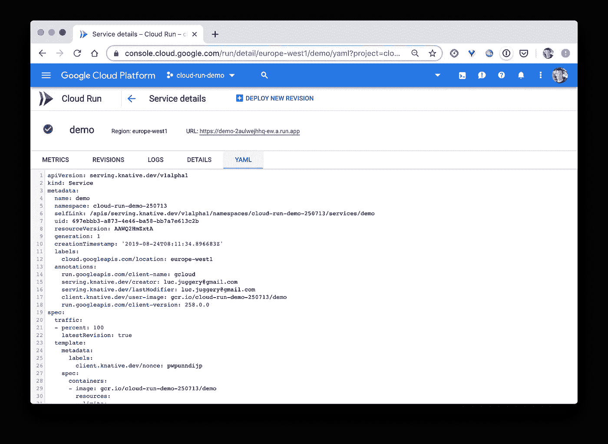

然后，我们可以轻松地从 web 界面中删除服务。

## 摘要

关于云运行还有很多要说的，但我希望这个初学者教程有助于揭开整个事情的神秘面纱。

感谢 [Ahmet Alp Balkan](https://medium.com/u/2cac56571879?source=post_page-----57e53d40f58e--------------------------------) 提供了谷歌云运行按钮，真的很整洁。顺便说一句，也感谢 [kubectx / kubens](https://github.com/ahmetb/kubectx) ，一些在使用 kubectl 时非常重要的工具。