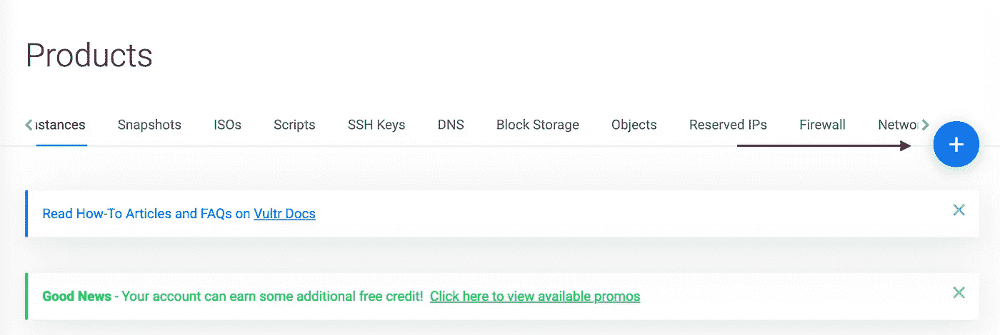
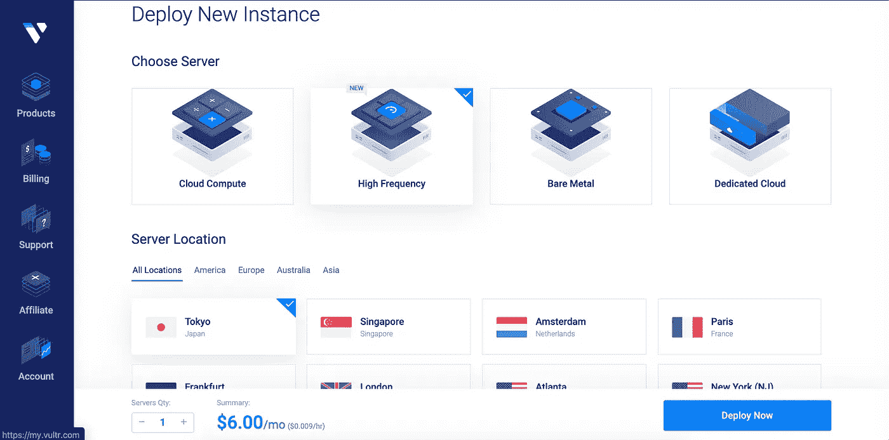
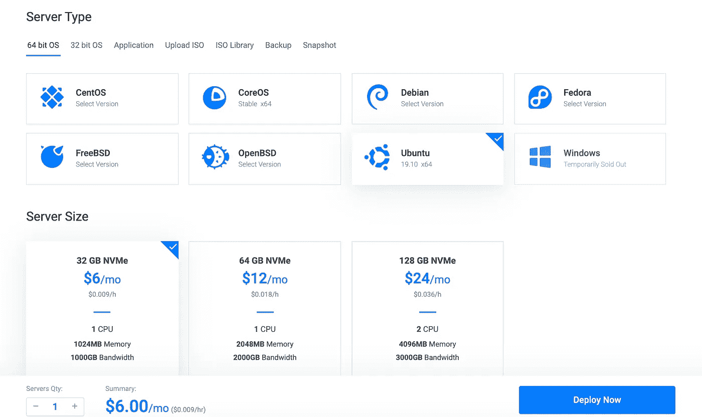
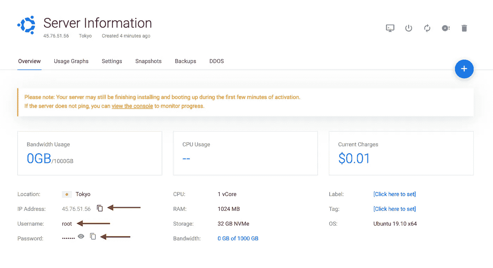
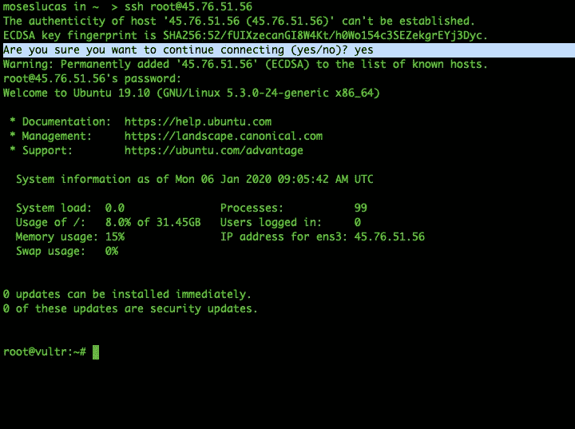

# 生产服务器设置— Vultr 教程[第 1 部分]

> 原文：<https://itnext.io/deploy-rails-with-capistrano-tutorial-2020-part-1-fa732e0db144?source=collection_archive---------1----------------------->

这实际上是我通过 Capistrano 将 Ruby on Rails 应用程序部署到 VPS(虚拟专用服务器)的个人备忘单/指南。这将指导您如何购买和部署服务器，然后在部署之前进行必要的设置。

首先，本教程分为两部分。

1.  部署服务器
2.  服务器设置

## 第 1 部分:部署服务器:

部署服务器只是购买一个 VPS(虚拟专用服务器)并打开它。有许多 VPS 平台可供你使用，但我选择了 [Vultr](https://www.vultr.com/?ref=8364413-4F) ，因为它真的很容易使用，而且**注册后你可以免费获得 50 美元信用点数**。所以这是免费的。你可以用这些积分来测试这个平台，而不需要花费任何钱。

**在这里注册**:https://www.vultr.com/?ref=8364413-4F 获得 50 美元免费积分

**部署新的服务器** r —注册后，让我们首先单击加号按钮选择要部署的服务器。



**选择服务器** —我们将在这里选择最便宜的服务器*(别担心，即使它是最便宜的，它仍然是一个快速执行的服务器)。*

选择 6.00 美元/月的高频。地点是东京*(是我选择高频时得到的默认地点)。*



选择只需 6.00 美元/月的高频。

**选择操作系统** —选择 Ubuntu 作为操作系统。你可以选择最新的 19.10 x 64



确保选择了 32 GB NVMe。这是三个中最便宜的

**部署服务器** —点击按钮立即部署。然后，您会看到一个项目添加到您的服务器列表中，并且正在安装:


完成后，其状态将变为正在运行:


**管理服务器** —点击管理服务器，查看服务器信息。我们需要以下信息:

1.  IP 地址；网络地址
2.  用户名
3.  密码



**SSH 到您的服务器** —现在我们有了所需的信息 *(IP 地址、用户名、密码)*打开您的终端并运行:

```
ssh root@IP-ADDRSS-OF-SERVER
```

至于我，我的服务器 IP 地址是`45.76.51.56`,所以我的命令是:

```
ssh root@45.76.51.56
```

> 同样，不要复制这个 IP 地址，使用您的服务器 IP 地址

当提示您是否希望继续连接时，输入`yes`，然后输入您的服务器的密码。如果登录成功，您会看到类似的结果:



现在你已经访问了服务器，并且以`root`的身份登录。这样，我们已经成功地为我们的应用部署了我们自己的 VPS。

在下一部分的[中，我们将在部署之前为服务器设置一些东西。](https://medium.com/p/87a6e19f9a2f)