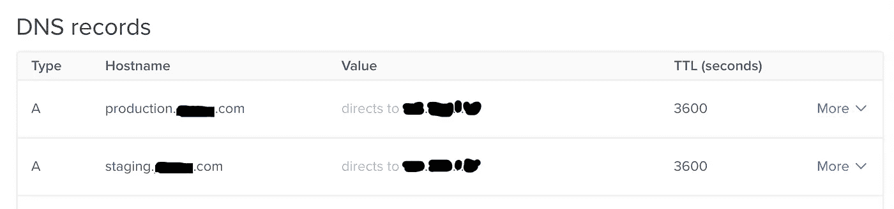

# 使用 Capistrano-Rails 将登台和生产环境部署到单个服务器上

> 原文：<https://itnext.io/deploy-staging-and-production-applications-to-single-server-using-capistrano-rails-1d5ab558d44f?source=collection_archive---------1----------------------->

拥有多个环境是我或我的客户最常见的需求之一。默认情况下，Ruby on Rails 应用程序有三种环境——开发、测试和生产。开发和测试环境安装在本地或开发人员的计算机上。生产环境是一个服务器环境，最终的应用程序代码在这里被部署到世界各地。


使用 Capistrano/Passenger/Nginx 在多个环境中部署 Rails

然而，我在许多项目中工作过，我们需要不止一个类似生产的环境。至少，过去有两种环境—试运行和生产。该团队可以在试运行或预生产环境中测试功能，然后再将其投入生产环境并由真实客户使用。

在项目开发的早期，当资源不是太大的时候，我一般喜欢使用同一台服务器机器来配置多个环境。这样我们可以节省一些钱，同时保持配置服务器的复杂性为 1。一旦应用程序变得很大或者资源需求足够高，那么我们总是可以迁移到更好更大的基础设施。

在这篇文章中，我将解释并提供一些配置选项来在一台服务器上部署不同的环境。对我来说，一开始为多个环境配置一台服务器并不是一件容易的事情。我不得不通过几个谷歌搜索和博客帖子，但它值得我花所有的时间。在这里，我尽量保持所有的配置尽可能简单，所以它应该适用于不同的项目特定的设置。

这不是一篇关于如何设置 Capistrano 或将 Ruby on Rails 应用程序部署到生产服务器的博文。您可以找到几篇将应用程序部署到您自己的服务器的文章和教程。

因此，让我们从假设我们已经可以将一个环境部署到我们的服务器开始。

**先决条件**

到这一步，我假设您已经为单个环境设置了一个有效的 Capistrano 部署环境。但是，您没有为同一个服务器设置另一个环境。例如，你可以执行

```
cap production deploy
```

来部署您的生产应用程序，并且部署成功。但是

```
cap staging deploy
```

不在同一个服务器上部署您的应用程序，并且您想要配置它。

如果你没有任何环境设置或工作，我建议你在这里停下来，看看关于 gorails.com 的[这个很棒的教程。我使用 gorails 教程作为基础，并将修改一些配置来设置多个环境。](https://gorails.com/deploy/ubuntu)

**策划**

1.  我们将创建两个子域— **staging。[您的域名]。com** & **制作。[您的域名]。com** ，在这里我们将指向我们的应用程序。当然，用您的实际域名替换[您的域名]。
2.  我们将针对不同的环境使用两个不同的 GitHub 分支:
    -生产主分支
    -暂存分支
3.  我将使用以下技术栈:
    - Digital Ocean ubuntu 18.04 服务器 droplet
    -rbenv with ruby 2 . 7 . 0
    -rails 6 . 0 . 2 应用程序
    -nginx web server with passenger for rails 应用程序
    - PostgreSQL 数据库服务器
    - Capistrano for deployment

**步骤 1 —创建子域**

进入你的 DNS 区域编辑器，添加两个 A 记录，指向你的服务器的同一个公共 IP。我是这样做的:



DNS 记录

**步骤 2 —为两个应用程序创建 nginx 站点配置文件**

现在 ssh 登录到您的服务器，并前往 nginx 网站-启用文件夹。然后为这两个应用程序创建/更新配置文件。我是这样做的:

```
$> ssh deploy@1.2.3.4
$> cd /etc/nginx/sites-enabled
$> sudo nano production.[your-domain].com
$> sudo nano staging.[your-domain].com
```

这两个文件的实际内容如下:

staging.your-domain.com

production.your-domain.com

更新两个文件后，检查 nginx 配置，并使用以下命令成功重启:

```
$> sudo nginx -t
$> sudo service nginx start
```

**步骤 3 —更改部署脚本**

好了，是时候在 rails 应用程序中修改 Capistrano 部署脚本了。下面是我的 config/deploy.rb 文件的样子:

配置/部署. rb

我还有两个与环境相关的文件— config/deploy/staging.rb 和 config/deploy/production.rb。这两个文件的内容如下:

配置/部署/暂存. rb

配置/部署/生产. rb

**步骤 4 —数据库设置**

要设置数据库，我们需要在 database.yml 文件中包含暂存和生产块。这是我的 config/database.yml 文件。

config/database.yml

请注意，我同时拥有试运行和生产模块。此外，我使用 rails 凭证文件来保存多环境凭证。您可以使用编辑器编辑凭证文件，并更新这些环境变量，如下所示:

```
$> EDITOR="atom --wait" rails credentials:edit
```

下面是我打开凭据文件时的样子:

在编辑器中打开 config/credentials.yml.enc 文件

如果不使用凭据文件来存储变量，则必须在服务器中存储登台和生产环境变量，并确保正确配置了这两个数据库。

**步骤 5 —其他设置**

好了，大部分工作已经完成。剩下的几件事，让我们快速设置它们。

**一、为 Rails 定义 staging environment**—Rails app 默认有 3 个环境——开发、测试和生产，定义在 config/environments 文件夹中。我们这里还有一个环境—暂存。因此，我们需要定义暂存环境配置。为此，我们可以简单地将 production.rb 文件转换成 staging.rb，就像这样:

```
$> cp config/environments/production.rb config/environments/staging.rb
```

**二。为 Webpacker** 定义登台环境— Rails 6 也需要为 Webpacker 设置环境。您需要在 config/webpacker.yml 文件中添加 staging 节。您可以简单地从同一个文件中复制生产数据块，并对其进行编辑以进行转移。您还需要创建 config/webpack/staging.js 文件。您可以将 config/webpack/production.js 中的内容复制到 staging.js 文件中。

## **第六步——部署**

仅此而已。我们都准备好了。让我们使用以下命令部署这两个环境:

```
$> cap staging deploy
$> cap production deploy
```

第一次运行时，您可能会得到一个错误，说链接文件丢失。因为我们在 shared/config 文件夹中共享了 database.yml 和 master.key 文件。如果您收到该错误消息，请使用应用程序中的内容创建或更新这些文件。

再次尝试部署到两个环境中，这次一切都应该工作了。

现在让我们打开浏览器，试着浏览两个应用，网址分别是:【http://production.your-domain.com】http://staging . your-domain . com 和[。](http://production.your-domain.com.)两个应用程序都应该正确加载，当您在两个分支中推送时，您应该会看到不同的内容。您也可以在终端中使用 curl 进行检查，如下所示:

```
$> curl -i [http://staging.your-domain.com](http://staging.your-domain.com)
$> curl -i http://production.your-domain.com
```

**检查日志** —如果出现问题或网站加载不正确，检查日志总是个好主意。您可以检查 nginx 日志或应用程序日志。Nginx 日志一般位于/var/log/nginx，应用日志位于/home/deploy/[environment]/current/log

就是这样。恭喜你！到目前为止，您应该已经有了一个支持多种环境的工作服务器。您可以按照相同的设置将不同的应用程序部署到单个服务器中，只需稍作更改。如果您有任何反馈，请留言。