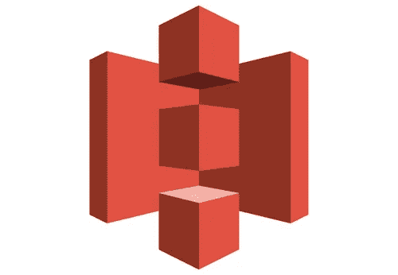
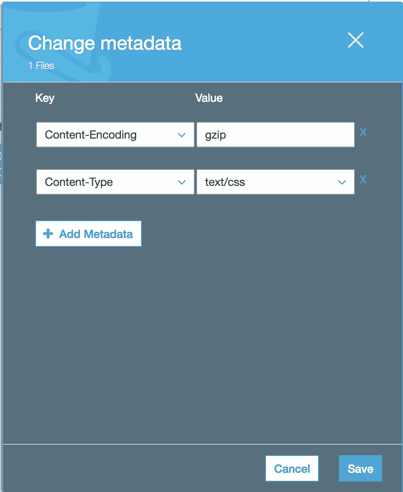
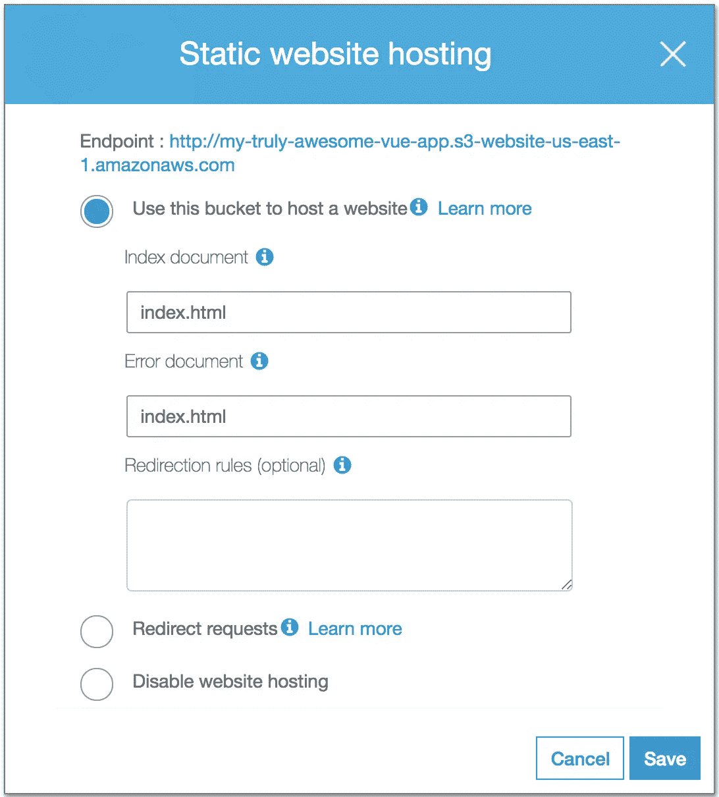

# 将 Vue 应用程序部署到 AWS S3

> 原文：<https://itnext.io/deploy-vue-app-to-aws-s3-1256ce03a7a2?source=collection_archive---------0----------------------->

不久前，我们开始着手一个新的前端项目，是的，我们决定用[***Vue***](https://vuejs.org/)来构建它。起初，我们想像酷孩子一样使用 React，但现在是 React-Gate 的余波时间，所以我们胆怯了，决定尝试一下 T21、Vue 和 T24。

这篇文章不是关于 ***Vue*** 有多酷，而是关于如何将一个静态网站构建与***Vue****部署到一个 AWS S3 桶中。如果您使用[*Vue-CLI*](https://github.com/vuejs/vue-cli)*来搭建基于 ***Vue*** 的应用程序，您可能会看到通过运行`npm run build`来构建静态 web 应用程序的选项。**

**如果你照原样使用它，你将不得不把`dist`文件夹的内容同步到 S3 桶。这可能是达到预期结果的最简单的方法，但是我建议您启用压缩，并使用压缩版本部署到您的 S3 存储桶。**

**为此，您必须:**

*   **安装*压缩包插件*——`npm install --save-dev compression-webpack-plugin`**
*   **启用`<you-app>/config/index.js` — `productionGzip: true`内的压缩选项**

**现在你可以走了！如果您再次运行`npm run build`，您将`gzip`编辑文件版本以及您之前看到的所有文件。让我们看看你需要哪些:**

*   **css 文件夹>`app.<hash>.css.gz`**
*   **js 文件夹>`app.<hash>.js.gz`，`vendor.<hash>.js.gz`，`manifest.<hash>.js`**

**加上你在应用中使用的所有其他文件夹和文件😀**

**你现在唯一要做的就是把 ***需要的*** 文件复制到你的 S3 桶，启用 ***静态网站托管*** 并通知你的 S3 桶你使用压缩文件为你的 app 服务。**

**这可以通过改变压缩文件的元数据来实现——下面是一个 ***的例子。css*** 文件。我想你可以猜到你必须如何改变一个**T5 的元数据。js** 文件。**

****

**为了不手动处理所有的复制，我们将一个简单的 ***bash*** 脚本放在一起，该脚本利用了[***AWS-CLI***](https://aws.amazon.com/cli)**

**你肯定可以让这个脚本变得更好，创建一个 ***随时可以托管静态网站的 S3 桶*** ，我们可能会这么做，但不是现在。**

**是的，如果你是第一次使用 ***SPA*** s 和 ***Vue*** 和***【S3】***别忘了将入口文件作为 ***索引*** 和 ***错误文件*** 如下:**

****

**我的超赞 vue 应用**

**如果你们对更多关于 ***Vue*** 或 ***AWS*** 相关主题的文章感兴趣，请告诉我，我会努力就这两个主题写更多的文章。**