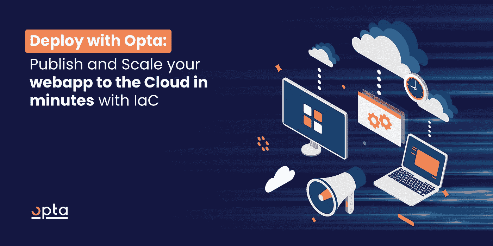
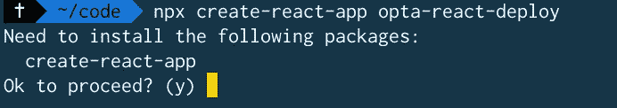
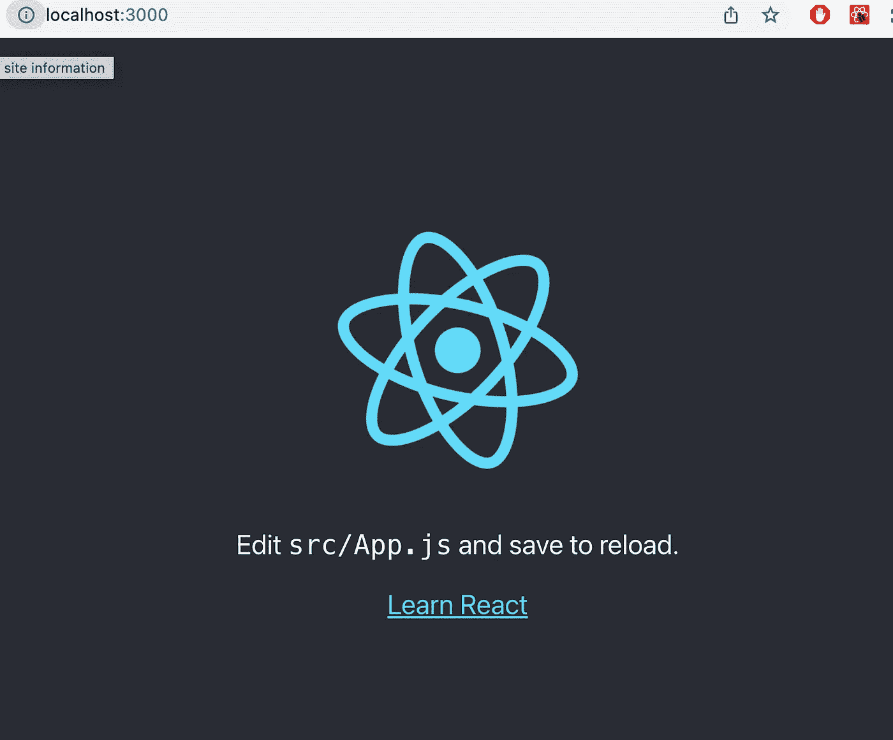
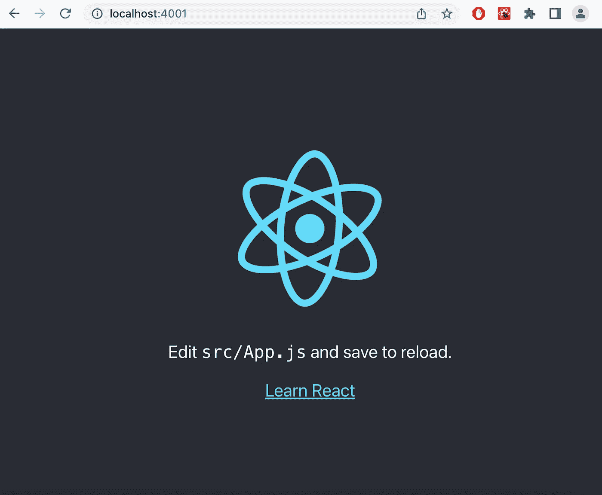
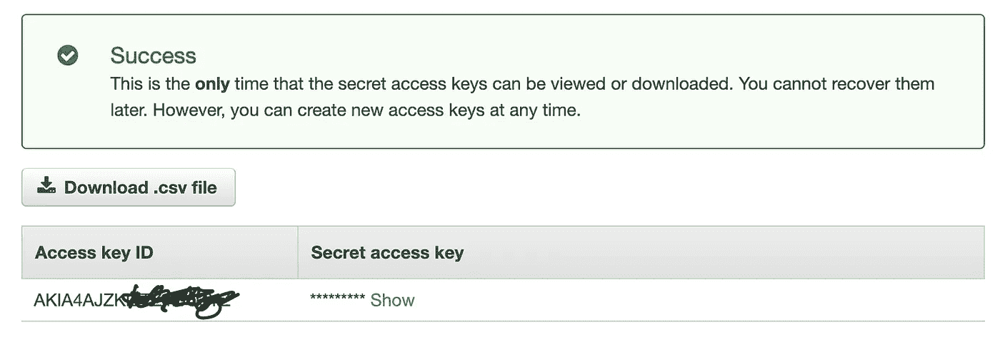

# 使用 Opta IaC 进行部署:使用 IaC 在几分钟内将您的 web 应用程序发布并扩展到云中。

> 原文：<https://itnext.io/deploy-with-opta-iac-publish-and-scale-your-web-app-to-the-cloud-in-minutes-with-iac-5ffb293d2283?source=collection_archive---------6----------------------->



在本教程中，我将向您展示如何使用 [Opta](http://www.opta.dev) IaC 通过 IaC(基础设施即代码)在几分钟内快速将您的应用部署到云的分步指南。

基础设施即代码涉及使用代码来管理将运行您的应用程序的云基础设施。它消除了设置基础架构以支持和扩展项目的手动过程。

# 我们开始吧！

我们将创建一个简单的 React 应用程序，对其进行 dockerize，并使用 [Opta](http://www.opta.dev) IaC 将其部署到 AWS。听起来很酷，对吧？

## 先决条件

*   [节点](https://nodejs.org/)
*   在你的电脑上安装 [Docker](https://www.docker.com/products/docker-desktop/)
*   AWS 账户。你可以在这里免费注册

## 创建 React 应用程序

让我们使用`create-react-app`创建 react 应用程序。打开终端并运行命令。

```
npx create-react-app opta-react-deploy
```



键入 Y 继续。这将提取 react 框架并安装其所有依赖项。

```
npx create-react-app react-opta-deploy
cd react-opta-deploy
npm start
```

这些命令创建默认的 React 应用程序名称，将目录更改为文件夹，并启动应用程序。发生这种情况时，您应该会看到下面的屏幕，或者访问。`localhost:3000`



## 部署到码头

将您的应用程序部署到 Docker 可确保始终有一个稳定的环境来运行您的代码，允许组件重用，并可以在开发人员之间共享 Docker 文件，以提高项目的快速启动和性能。

要部署到 Docker，请确保 Docker 桌面应用程序当前正在您的计算机上运行。

在代码编辑器中打开代码。到根目录下创建一个文件，命名为`Dockerfile`，不带扩展名，与`Dockerfile`同名

在下面输入代码:

```
FROM node: alpineWORKDIR /appCOPY package.json ./COPY package-lock.json ./COPY ./ ./RUN npm iCMD ["npm", "run", "start"]
```

第一行获取节点，我们将在运行应用程序时使用它。然后我们将工作目录设置为`/app`。之后，我们将 package.json 和 package-lock.json 复制到/app 工作目录。

`RUN npm i`将与项目相关的节点模块安装到 Docker 中。

然后最后一行运行`npm run start`，这是将运行应用程序并在浏览器中打开它的命令。

一旦这个`Dockerfile`被创建并且有了这些命令。转到终端，确保您位于项目的根目录，然后运行命令:

```
docker build -f Dockerfile -t opta-react-deploy.
```

这个命令将 react 应用程序构建到 Docker 中，仍然使用名称`opta-react-deploy`。它将创建一个可以运行我们的应用程序的 docker 映像。

然后运行下面的命令来运行 docker 容器中的 Docker 映像:

```
docker run -it -p 4001:3000 client
```

上面的命令公开了 react 端口 3000，并将其映射到 Docker 上的端口 4001。运行该命令后，它将在端口 4001 上启动 react 应用程序。访问 [http://localhost:4001](http://localhost:4001) ，你会在那里找到你的应用。



对 Docker 上运行的应用程序做出反应

## 现在让我们使用 Opta 部署到 AWS。

Opta 是一个为初创公司设计的更简单的 IaC 框架。它拥有所有的云和安全最佳实践，因此您的团队永远不需要担心开发运维。

Terraform 在引擎盖下为 Opta 提供了强大的功能——因此您永远不会被锁定在专有系统中，并且可以在需要时随时进入 Terraform 层。

## 设置先决条件

要使用 Opta 进行部署，您需要以下先决条件:

*   Opta 命令行工具
*   从您的终端安装 Terraform
*   AWS CLI

使用以下命令安装 Opta 命令行工具:

```
/bin/bash -c "$(curl -fsSL https://docs.opta.dev/install.sh)"
```

通过从终端运行以下命令来安装 Terraform:

```
brew tap hashicorp/tapbrew install hashicorp/tap/terraform
```

使用以下命令安装 AWS CLI:

```
curl "[https://awscli.amazonaws.com/AWSCLIV2.pkg](https://awscli.amazonaws.com/AWSCLIV2.pkg)" -o "AWSCLIV2.pkg"
sudo installer -pkg AWSCLIV2.pkg -target /
```

转到 React 应用程序的根文件夹，创建一个名为`application.yaml`的文件，这个文件包含要部署到 AWS 的配置。

键入以下 YAML 脚本

```
# application.yamlname: develop # name of the environment
org_name: XXXXXX
providers:
    aws:
    region: us-east-1
    account_id: XXXXXX #Your 12 digit AWS account id
modules:
    - type: base
    - type: k8s-cluster
    - type: k8s-base
```

对于`org_name`,请访问您的 AWS 控制台，复制组织名称，将其替换为 XXXX

同`account_id`。这是您在 AWS 控制台上的 12 位 ID。

这些配置让 [Opta](http://www.opta.dev) 知道部署到哪里

## 授权 Opta 部署到 AWS

您需要授予 Opta 部署到指定 AWS 的权限。此外，您需要检索 **AWS 访问密钥 ID** 和**秘密访问密钥**。

以 root 用户身份登录 AWS 控制台，并访问以下 URL:

[https://us-east-1.console.aws.amazon.com/iam/home](https://us-east-1.console.aws.amazon.com/iam/home)

如果您已经创建了一个访问密钥，您将需要创建一个新的访问密钥，该密钥在创建时只显示一次。

创建一个访问键，弹出一个窗口，如下所示:



会显示访问密钥 ID，但您必须单击“显示”来显示秘密访问密钥。

转到您的终端，将访问密钥 ID 和秘密访问密钥导出到环境中，这样当您运行 Opta 命令时，它将会获取这些信息。像这样:

```
export AWS_ACCESS_KEY_ID=your_access_key_id
export AWS_SECRET_ACCESS_KEY=your_secret_access_key
```

或者，您也可以在计算机用户的根目录下创建一个`.aws`目录，转到该目录并创建一个`credential`文件(无扩展名)，如下所示:

```
cd ~
mkdir .aws
cd .aws
touch credentials
```

然后将下面的代码粘贴到其中，并用您的访问密钥和秘密密钥分别替换`your_access_key_id`和`your_secret_access_key`。

```
[default]
aws_access_key_id = your_access_key_id
aws_secret_access_key = your_secret_access_key
```

## 你差不多完成了

然后，运行下面的代码，使用 [Opta](http://www.opta.dev) 将 React 应用程序部署到 AWS。

```
opta apply -c application.yaml
```

完成此过程大约需要 12-15 分钟，它将设置:

*   基础
*   k8s-星团
*   k8s-base

完成此过程后，您应该会看到:

```
Opta updates are complete!
```

中提琴🎉！您已经通过简单的步骤成功地将您的应用程序部署到 AWS。

[](https://blog.runx.dev/how-to-generate-terraform-code-with-opta-f255f71c73d3) [## 如何用 Opta 生成 Terraform 代码

### TL；DR:在这篇文章中，我们将回顾如何使用这个 Opta 特性来轻松地生成 Terraform 代码和工作…

博客. runx.dev](https://blog.runx.dev/how-to-generate-terraform-code-with-opta-f255f71c73d3) [](https://blog.runx.dev/how-cloud-consultants-use-opta-to-easily-manage-their-workflows-fb667db28619) [## 云顾问如何使用 Opta 轻松管理他们的工作流

### 了解云顾问如何使用 Opta IaC 工具轻松管理他们跨多个项目的工作流。

博客. runx.dev](https://blog.runx.dev/how-cloud-consultants-use-opta-to-easily-manage-their-workflows-fb667db28619) 

## 清理

值得注意的是，这个过程会在您的 AWS 帐户上产生每天 5 美元的费用。如果您出于测试目的运行此命令，请确保通过运行以下命令删除资源:

```
opta destroy -c application.yaml
```

> *如果您在任何时候遇到任何问题或意外错误，请随时在* [*slack 频道这里*](https://slack.opta.dev/) 联系 Opta 的贡献者

## 资源

[](https://docs.opta.dev/) [## Opta

### 更高级的基础设施即代码 Opta 是一个基础设施即代码框架。而不是与低层次的…

docs.opta.dev](https://docs.opta.dev/)  [## Opta

### 基础设施的标准解决方案

app.runx.dev](https://app.runx.dev/yaml-generator)