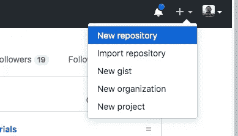
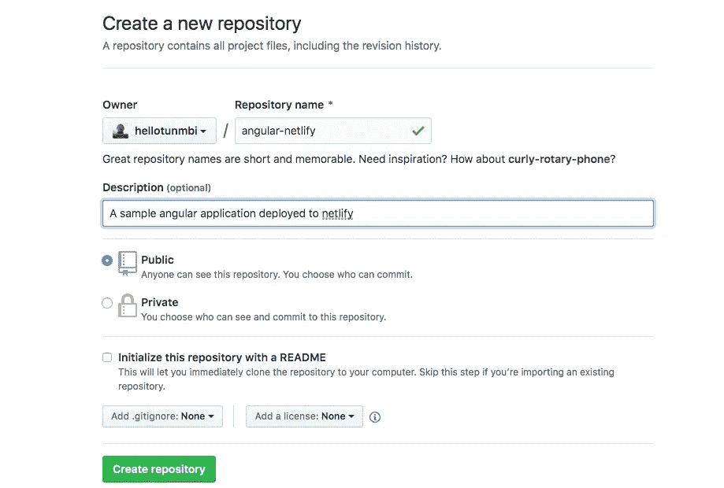
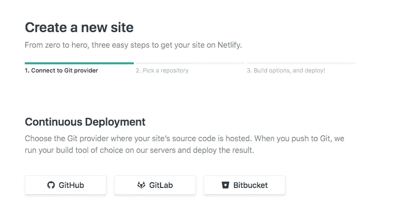
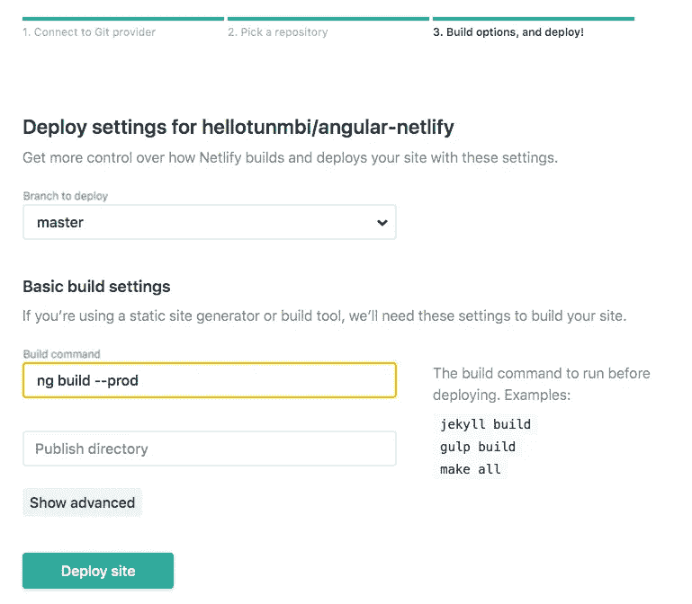

# 在几分钟内将您的 Angular 应用程序部署到 Netlify

> 原文：<https://itnext.io/deploy-your-angular-app-to-netlify-in-minutes-b994868e297f?source=collection_archive---------3----------------------->

有了网络生活，生活变得简单了。现在，您可以将所有 angular 应用程序部署到 Netlify，并拥有一个唯一的链接来随时访问它。

> 不久前，我发表了[如何将你的 Angular 应用程序部署到 Heroku](https://medium.com/@hellotunmbi/how-to-deploy-angular-application-to-heroku-1d56e09c5147) 。这是网络版

本教程是一个循序渐进的指南，引导您从头到尾完成部署过程，其中包含:

*   设置您的 Angular 应用程序—全新应用程序
*   将您的应用程序推送到 Github
*   将您的应用从 Github 持续集成到 Netlify

让我们开始吧！

> 剧透:如果你有一个现有的 angular 应用程序或者你已经知道如何设置 angular 应用程序，[点击这里跳转到 Netlify 部署部分](#b3a4)

## 设置您的角度应用

这一步是为了创建新的角度应用程序。如果您没有安装 angular cli，请在您的终端中运行`npm install -g @angular/cli`。

然后运行`ng new angular-netlify`

这将在当前目录中设置一个新的 angular 应用程序，并将其命名为“angular-netlify”。您可以用您选择的任何名称或您的应用程序名称替换“angular-netlify”。

然后`cd angular-netlify`改变到你的应用目录。

运行`ng serve`服务/运行您的应用程序。这将在您的默认浏览器的 http://localhost:4200 上运行。

新鲜的角度应用

## 将您的应用程序推送到 Github

通过在导航栏的菜单中单击“新建存储库”来创建新的存储库

在 github 上创建新存储库

填写创建新存储库表单并提交表单

按照以下步骤将您的应用程序推送到 Github:

*   在您的终端中，确保您位于 angular-netlify 目录中，并运行以下命令:
*   `git init`初始化 git 的目录
*   `git add .`
*   `git commit -m 'initial commit'`添加并提交文件
*   `git remote add origin <your-github-remote-url>`
*   `git push`最终将你的应用推送到 github。你可能需要运行`git push --set-upstream origin master`

## 设置 Netlify 并部署您的 Angular 应用程序

如果您尚未在 netlify 上注册，请访问[www.netlify.com](http://www.netlify.com)并点击登录

使用您的 Github 帐户登录。

点击 Git 的**新网站**

在持续部署下选择 github，并授权 netlify 访问您的 Github 存储库。这将带您进入下一步:选择一个存储库

在 github 上搜索并选择您想要发布到 Netlify 的存储库

在第三阶段:“构建选项，然后部署！”，选择**主**分支。

在基本构建设置下，输入 **ng build - prod**

在发布目录下，输入**地区/项目名称**

点击**部署站点**

aaaannddd…答对了！！！我们正在直播！

Netlify 将生成一个唯一的 url，您的应用程序可以很容易地到达。

## 或者，为您的应用程序创建唯一的 url

转到你的应用仪表板>设置>常规>站点详细信息

在站点信息下，单击更改站点名称并输入您的应用程序的首选名称(在我的示例中为 angular-netlify)。

于是就变成了[https://angular-netlify . netlify .](https://angular-netlify.netlify.com)app

点击**保存**

这样做的好处是，当你对应用程序进行更新并推送到 github 时，它会自动部署到 Netlify，并在同一个 url 上可用。

如果这篇文章为你提供了一个解决方案，喜欢并分享。

你也可以在[推特](https://www.twitter.com/hellotunmbi)和[领英](https://www.linkedin.com/in/hellotunmbi)上关注我

如果你觉得这篇文章很有帮助，并且想阅读更多，知道我何时发表相关文章，请[订阅我的时事通讯](https://tinyletter.com/hellotunmbi)。我保证不会给你发垃圾邮件。