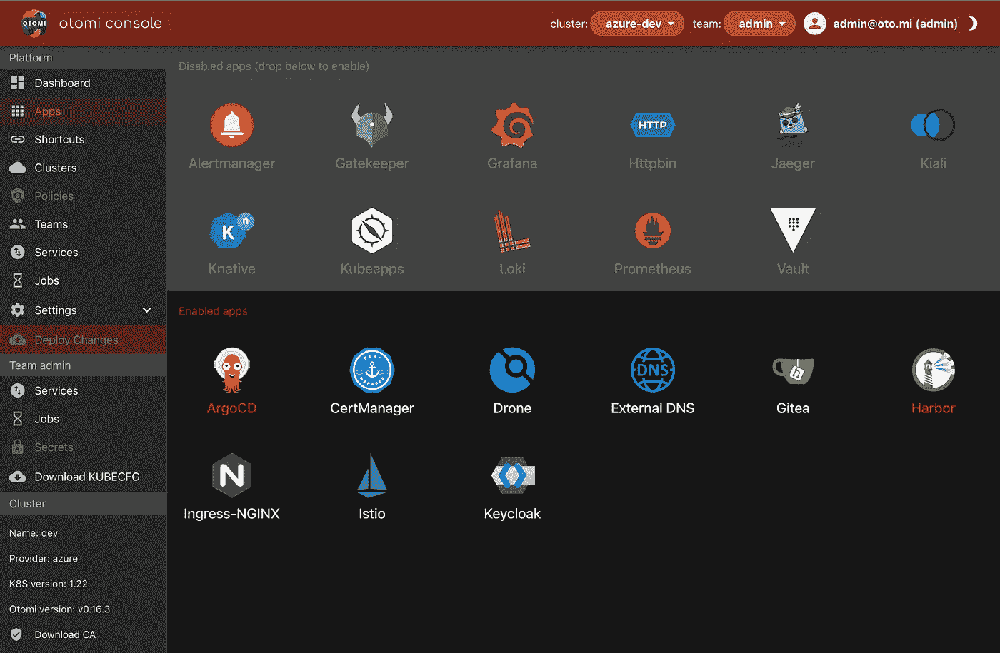
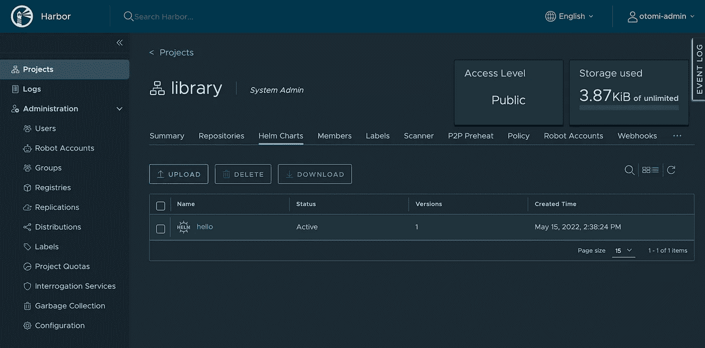
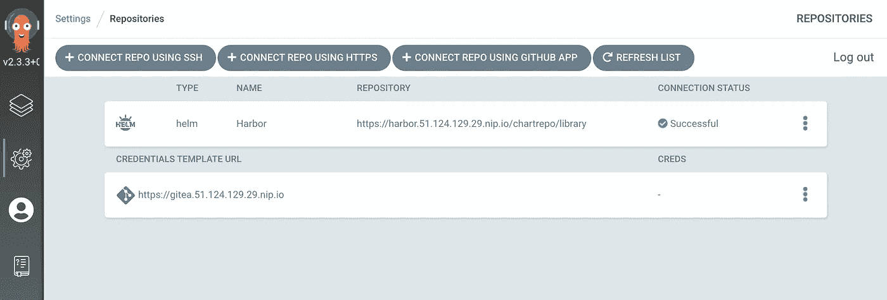
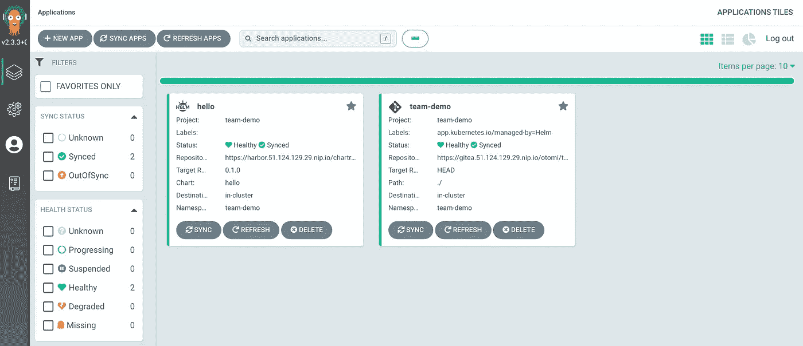
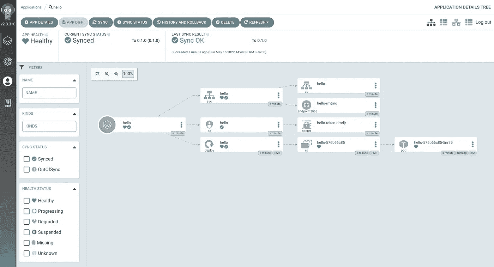

# 使用 Argo CD 和图像更新程序以 GitOps 方式在 K8s 上部署您的应用程序

> 原文：<https://itnext.io/deploy-your-app-on-k8s-the-gitops-way-using-argo-cd-and-the-image-updater-3a7a32bedaa2?source=collection_archive---------1----------------------->

开发人员不想与所有的 Kubernetes 内部争论。他们想要的只是轻松地部署他们的应用程序，看到它运行，并看到代码更改自动更新。有了 Otomi，一个为 Kubernetes 提供的自托管 PaaS，您只需几分钟就可以完成。在本文中，我将演示如何在启用 Argo CD 和 Harbor 的情况下使用 Helm chart 和 Otomi 部署容器映像。

# Otomi 中支持的部署场景

OSS [Otomi](https://github.com/redkubes/otomi-core) 附带了多个 Kubernetes 应用程序来支持您的首选部署场景。您可以创建自己的自定义设置。当你在 Otomi 中激活应用程序时，所有这些应用程序不仅仅是自动安装的，它们还被配置成开箱即用。以 Argo CD 为例。激活 Argo CD 时，Argo CD SSO 将启用基于角色的访问。Otomi 中的每个团队将自动访问 Argo CD UI 和 Otomi 中本地 GIT 存储库中的 GitOps repo。Otomi 还自动为团队创建一个 Argo CD 应用程序，监听团队的 GitOps repo。因此，您唯一需要做的事情就是将您的清单推送到 repo，您的应用程序就会自动部署。但这只是你可以使用/选择的一种场景；-)

Otomi 现在支持以下部署场景:

1.  使用 Otomi 控制台激活 Knative 并创建 Knative 服务(无需编写任何 YAML)
2.  将 Argo CD 与 Knative 一起使用，并将 Knative 服务添加到 GitOps repo
3.  将 Harbor 用作图表和图像注册表，并使用 Argo CD 和图像更新程序部署您的图表
4.  将 Harbor 用作图表注册表，并使用 Kubeapps 部署您的图表(图表注册表在 Kubeapps 中自动作为图表目录提供)

请注意，所有这些场景都是开箱即用的！

让我们动手实践场景 3:向 Harbor 添加一个图表，并使用 Argo CD 来部署图表，并根据图像标记自动更新图像。

# 使用 Argo CD 和图像更新程序部署您的应用程序

## 安装 Otomi

如果你还没有这样做，首先在 Kubernetes 上安装 Otomi。我们已经创建了几个[快速启动](https://github.com/redkubes/quickstart)来帮助你在 AWS、Digital Ocean、Azure、GCP、Linode 或者只是在你的本地机器上用 Otomi 设置 Kubernetes。完成激活步骤后，我们就可以开始了。在下面的说明中，我假设您是以拥有`team-admin`角色的用户身份登录的。

## 1.激活阿尔戈光盘和港口

要激活 Argo CD 和 Harbor，请转到 web UI (Otomi 控制台)右侧菜单中的应用程序部分。在这里，您将看到所有活跃的应用程序以及您可以打开的可选应用程序。只需将 Argo CD 和 Harbor 拖放到活动应用程序窗格，然后单击`Deploy Changes`。



阿尔戈光盘和港口现在是活跃的

## 2.在 Otomi 创建一个团队

如果你还没有这样做，现在首先在 Otomi 中创建一个团队。在右侧菜单的平台部分，点击`Teams`和`Create Team`。只需提供一个名称(我正在创建一个名为`demo`的团队)。点击`Submit`，然后点击`Deploy Changes`。

## 3.在 Harbor 创建一个机器人帐户

*注意:*团队的机器人账户只能由`otomi-admin`角色的用户创建

1.  打开`Harbor`
2.  点击`Login with OIDC Provider`
3.  填写您的用户名，然后单击保存
4.  在`Administration`下，点击`Robot Accounts`
5.  点击`+ New Robot account`
6.  为新的机器人帐户提供一个名称:`team-demo-push`
7.  设置到期时间
8.  选择`team-demo`和`library`
9.  点击`Add`
10.  复制生成的令牌

## 4.向 Harbor 上传图表

您可以在 Harbor UI 中完成此操作，或者直接使用 helm CLI。首次登录 Harbor。如果您没有使用 DNS 区域，让我们加密(而是使用 Otomi 自动生成的 CA)，那么首先下载 CA(在 Otomi 控制台中)并将 CA 添加到您的钥匙串中，然后重新启动 Docker。你可以在这里找到说明。

```
helm registry login -u 'otomi-team-demo-push' -p $token harbor.<your-domain>
```

上传`hello-0.1.0.tgz`图表(此处下载[此处](https://github.com/redkubes/workshops/blob/main/08-argocd/hello-0.1.0.tgz))并使用 Helm CLI 将其推送到图表注册表:

```
helm push hello-0.1.0.tgz oci://harbor.<your-domain>/library/hello
```

或者使用 Harbor UI 直接上传图表:



## 5.在阿尔戈光盘连接一个舵 repo

1.  打开`Settings`
2.  选择`Connect Repo using https`并使用以下输入:
3.  `Type: Helm`
4.  `Name: Local Harbor`
5.  `Project: team-demo`
6.  `Repository URL: harbor.<your-domain>/chartrepo/library`
7.  点击`Connect`



## 6.创建 Argo CD 应用程序

1.  选择`Applications`，点击`Create`并使用以下输入:
2.  `Application Name: Hello`
3.  `Project: <team-name>`
4.  `Sync Policy: Automatic`
5.  `Repository URL: harbor.<your-domain>/chartrepo/library`
6.  `Chart: hello`
7.  `Version: 0.1.0`
8.  `Cluster URL: [https://kubernetes.default.svc](https://kubernetes.default.svc)`
9.  `Namespace: <team-name>`
10.  点击`Create`

您将看到 hello 应用程序现在已经自动部署。



团队演示的 hello 应用程序已同步



所有的资源都部署好了

要查看该应用程序，请在 Otomi 中创建一个新服务(在部署该应用程序的团队中)，并将暴露入口设置为`public`。

1.  在顶部栏中，选择您的团队
2.  点击侧面菜单中的`Services`
3.  点击`Create Service`，
4.  使用以下输入
5.  `Name: hello`
6.  `Service Type: Existing Kubernetes service`
7.  `Exposure: Public`
8.  点击`Submit`然后点击`Deploy Changes`

## 7.配置 Argo CD 映像更新程序

为了自动更新部署的映像，我们可以配置 Argo CD 映像更新程序。注意:这仅在使用舵图部署时受支持。我们很幸运；-)

1.  在 Argo CD 中，转到应用程序并点击`hello`应用程序
2.  点击`App Details`，然后点击`Edit`
3.  在`Annotations`下，添加以下注释并点击保存

```
argocd-image-updater.argoproj.io/image-list:otomi/nodejs-helloworld: "~1.2"
```

使用图表部署的图像版本是`1.2.12`。然而，`otomi/nodejs-helloworld`包含版本为`1.2.13`的图像。现在转到 hello 服务的 URL 并刷新页面。你看到了什么？

# 包扎

恭喜你。现在，您已经以 GitOps 的方式部署了您的应用程序。你现在唯一需要做的事情就是修改你的代码，构建镜像并推送它。

在第 2 部分中，我们将向 party 添加 Knative，并展示如何创建一个导航图来部署 Knative 服务，不仅自动化 CD，还自动化伸缩。

希望你喜欢这篇文章。请亲自试用 Otomi，看看使用 Otomi 以 GitOps 方式部署应用程序有多简单。

要支持 Otomi，请在 GitHub 上启动 [Otomi OSS 项目。谢谢大家！](https://github.com/redkubes/otomi-core)