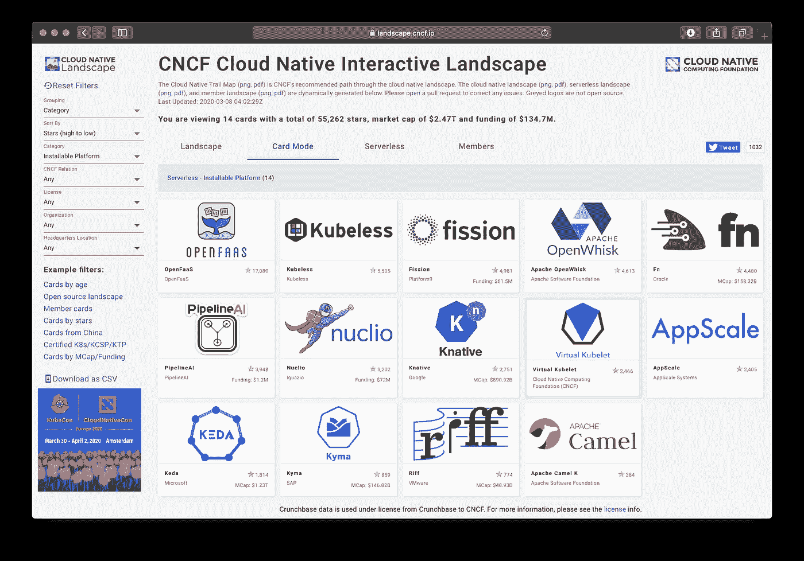
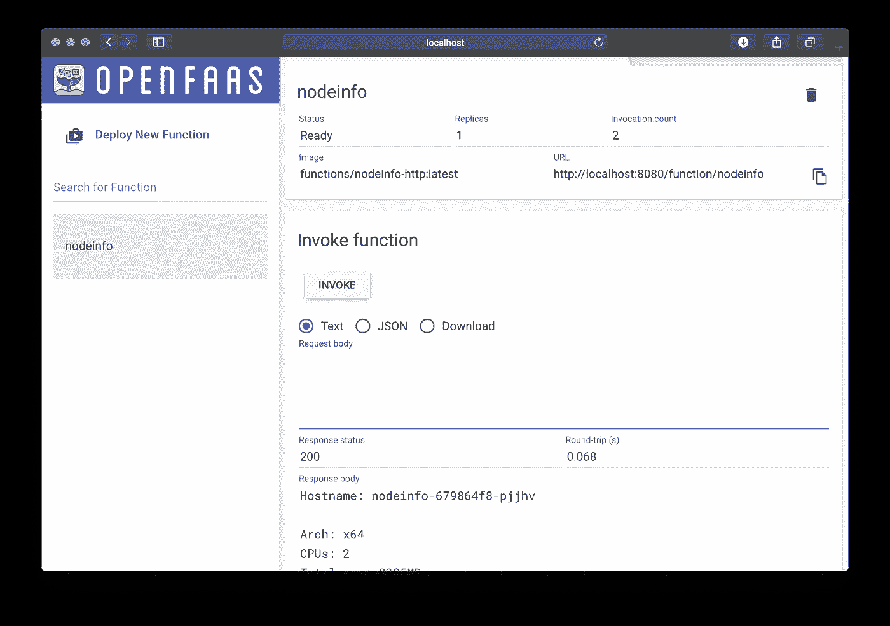

# 将您的第一个无服务器功能部署到 Kubernetes

> 原文：<https://itnext.io/deploy-your-first-serverless-function-to-kubernetes-232307f7b0a9?source=collection_archive---------1----------------------->

在本教程中，我想向你展示如何将你的第一个无服务器功能部署到 Kubernetes。在这里，我将向您展示如何访问 API 密钥等机密信息，以及这与使用环境变量进行配置有何不同。接下来就交给你了，去构建一个可以在任何云上运行的东西。

## 为什么是 Kubernetes？

Kubernetes 提供了一种可移植的方式来运行容器，我们所知道的容器解决了“在我的机器上工作”(tm)的打包和部署问题。

所有主要的云参与者都构建了自己的托管 Kubernetes 服务，这意味着您可以获得“无服务器”体验，在这种体验中，您只需处理您想要部署的内容，其他什么都不用做。您还可以使用 Rancher Labs 的 k3s 将 Kubernetes 部署到裸机、您的笔记本电脑或低功耗的 Raspberry Pi。

## 在您的笔记本电脑上获取 Kubernetes

> 如果您已经设置了 Kubernetes，那么您可以跳过这一部分。

在你的笔记本电脑上安装 Kubernetes 最简单快捷的方法是首先安装 Docker，这给了我们两个主要的选择:


[善良](https://kind.sigs.k8s.io)——来自库伯内特斯社区。KinD 代表 Docker 中的 Kubernetes，大致相当于以香草的方式安装 Kubernetes，但是这也意味着它可能会更慢、更大并且需要更多的 RAM。我应该说这是在 Kubernetes 代码库上测试补丁的一个很好的选择。

[k3d](https://github.com/rancher/k3d) —来自牧场主社区。k3d 安装 k3s，这是一个轻量级版本的 Kubernetes，通过了 CNCF 的一套符合性测试。使用 k3d，您可以在大约 5 秒钟内启动单节点集群。这是我现在选择的工具，我希望我能早点开始使用它。

获取 k3d，并创建一个集群(确保 Docker 首先运行)

```
curl -s https://raw.githubusercontent.com/rancher/k3d/master/install.sh | bashk3d create
```

现在，在创建集群之后，您需要告诉 Kubernetes CLI 指向该集群。这是重要的一步，如果不小心，您可能会指向错误的集群并破坏重要的东西。

```
export KUBECONFIG="$(k3d get-kubeconfig --name='k3s-default')"kubectl get nodeNAME                     STATUS     ROLES    AGE   VERSIONk3d-k3s-default-server   Ready      master   4s    v1.17.2+k3s1
```

## 为 Kubernetes 安装一个无服务器平台

您不能在 Kubernetes 集群上安装云无服务器平台，但是您可以找到一些仿真工具和本地测试器。这些不是一回事。



在 Kubernetes 上安装无服务器平台有几种选择，如 [CNCF 景观](https://landscape.cncf.io/category=installable-platform&format=card-mode&grouping=category&sort=stars)中所列。


OpenFaaS —让无服务器变得简单

今天我们将使用 [OpenFaaS](https://www.openfaas.com/) ，它的目标是对开发者友好、操作简单和以社区为中心。它也是轻量级的(可以在 1GB 的 Raspberry Pi 或 VPS 上运行),并且易于使用。

> OpenFaaS 被使用 Kubernetes 的公司用于生产，并且有一个庞大的、活跃的开源贡献者社区。你可以在它的主页和博客上阅读更多关于这个项目及其用户的[。](https://www.openfaas.com/blog)

OpenFaaS 可以与 helm 2 或 3 一起安装，它有自己的安装程序 arkade，可以自动完成从下载 helm 到添加图表路径到配置系统的所有操作。

首先安装 OpenFaaS CLI:

```
curl -sSLf [https://](https://dl.get-arkade.dev)cli.openfaas.com | sudo sh
```

现在安装 arkade:

```
curl -sSLf [https://dl.get-arkade.dev](https://dl.get-arkade.dev) | sudo sh
```

接下来，使用 [arkade](https://get-arkade.dev) 安装 OpenFaaS:

```
arkade install openfaas
```

您可以通过`--help`查看安装选项，例如添加额外的核心服务副本或使用云负载平衡器。

安装后，你会得到一个帮助信息，你可以在任何时候通过`arkade info openfaas`恢复

## 登录到 API

部署后，您将收到如何开始的说明，请遵循每个步骤:

```
# Forward the gateway to your machine
kubectl rollout status -n openfaas deploy/gateway
kubectl port-forward -n openfaas svc/gateway 8080:8080 &# Now log in using the CLI
PASSWORD=$(kubectl get secret -n openfaas basic-auth -o jsonpath="{.data.basic-auth-password}" | base64 --decode; echo)
echo -n $PASSWORD | faas-cli login --username admin --password-stdin
```

通过从存储中部署示例函数来检查 CLI 是否已通过身份验证:

```
faas-cli store deploy nodeinfo# Check to see "Ready" status
faas-cli describe nodeinfo# Invoke
echo | faas-cli invoke nodeinfo
echo | faas-cli invoke nodeinfo --async# You should see two invocations
faas-cli list
Function                       Invocations     Replicas
nodeinfo                       2               1
```

你也可以在 [http://localhost:8080，](http://localhost:8080,)打开 OpenFaaS UI 仪表盘，用户名是“admin”。

```
# Get the password so you can open the UI
echo $PASSWORD
```



OpenFaaS UI 门户

## 构建新的 Python 函数

您可以使用 python3 模板构建一个新函数，或者使用模板库(`faas-cli template store list`)搜索其他函数。

OpenFaaS 是一个云本机无服务器平台，这意味着它为您的每个功能构建使用一个 Docker 映像。这意味着它可以与 Kubernetes 一起工作。

注册一个 [Docker Hub 账号](https://hub.docker.com/)，这样你就可以免费存储你的功能了。

```
export OPENFAAS_PREFIX="DOCKER_HUB_USERNAME"faas-cli new --lang python3 serverless
```

现在您将看到三个重要文件:

```
├── serverless
│   ├── __init__.py
│   ├── handler.py
│   └── requirements.txt
└── serverless.yml
```

YAML 文件包含了关于你的函数，如何构建和部署它的信息。无服务器文件夹包含您的函数的处理程序和 requirements.txt 文件，该文件可用于设置您需要的 pip 模块。

让我们编辑 handler.py 文件:

```
def handle(req):
    return "serverless"
```

## 部署您的功能

要部署您的功能，只需运行:

```
faas-cli up -f serverless.yml
```

稍后，您将收到您的 URL，然后可以在 OpenFaaS UI / CLI 上调用该功能或检查其状态:

```
faas-cli describe -f serverless.yml serverlessName:                serverless
Status:              Ready
Replicas:            1
Available replicas:  1
Invocations:         10
Image:               alexellis2/serverless:latest
Function process:    python3 index.py
URL:                 [http://127.0.0.1:8080/function/serverless](http://127.0.0.1:8080/function/serverless)
Async URL:           [http://127.0.0.1:8080/async-function/serverless](http://127.0.0.1:8080/async-function/serverless)
```

尝试调用该函数:

```
echo | faas-cli invoke serverlessserverless
```

## 消耗环境变量

环境变量对于非机密配置很有用，并且在 YAML 文件中设置。

```
functions:
  serverless:
    lang: python3
    handler: ./serverless
    image: alexellis2/serverless:latest
    environment:
      MESSAGE: kubernetes
```

让我们编辑 handler.py 文件:

```
import os
def handle(req):
    return "serverless " + os.getenv("MESSAGE")
```

再次部署该函数并调用它，您应该会看到“无服务器 kubernetes”

## 泄露秘密

您应该对 API 令牌和回调 URL 之类的东西使用秘密。

```
export SECRET="secure"faas-cli secret create api-token --from-literal $SECRET
```

现在要使用这个秘密，请将它添加到您的 YAML 文件中:

```
functions:
  serverless:
    lang: python3
    handler: ./serverless
    image: alexellis2/serverless:latest
    environment:
      MESSAGE: kubernetes
    secrets:
    - api-token
```

编辑处理程序并从`/var/openfaas/secrets/`读取秘密

```
import osdef read_secret(name):
    val = ""
    with open("/var/openfaas/secrets/api-token", "r") as f:  
        val = f.read()
    return valdef handle(req):
    if req.strip() == read_secret("api-token").strip():
       return "authenticated"
    return "invalid api-token"
```

我们试试？

```
faas-cli up -f serverless.ymlcurl -d "hi" [http://127.0.0.1:8080/function/serverless](http://127.0.0.1:8080/function/serverless)
invalid api-tokencurl -d "secure" [http://127.0.0.1:8080/function/serverless](http://127.0.0.1:8080/function/serverless)
authenticatedecho -n "secure" | faas-cli invoke serverless
authenticated
```

## 轮到你了

我们已经使用轻量级选项将 Kubernetes 部署到我们的笔记本电脑上，非常适合本地开发。然后，我们继续为 Kubernetes 部署了一个流行的无服务器平台，并在 Python3 中构建了一个函数来使用配置和机密信息。


open FAAS——简化无服务器功能

> 您可以使用任何编程语言、二进制文件甚至自定义 docker 文件将功能和微服务部署到 [OpenFaaS](https://www.openfaas.com/) 。

如果你想了解更多，试试 [OpenFaaS workshop](https://github.com/openfaas/workshop/) ，在那里你将学习如何将所有这些放在一起以扩展和监控你的代码。

*   加入[美国松弛期](https://slack.openfaas.io/)
*   [OpenFaaS 三周年庆典](https://www.openfaas.com/blog/birthday-teamserverless/)
*   在 Twitter 上关注[open FAAS](https://twitter.com/openfaas)