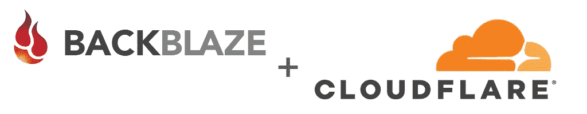
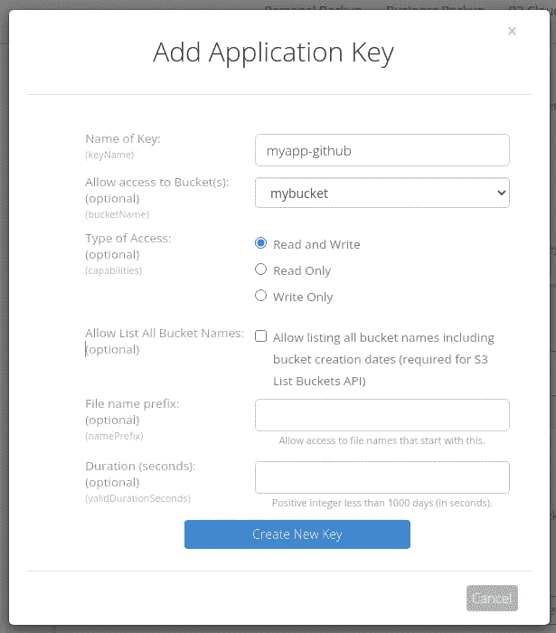
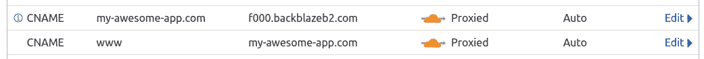
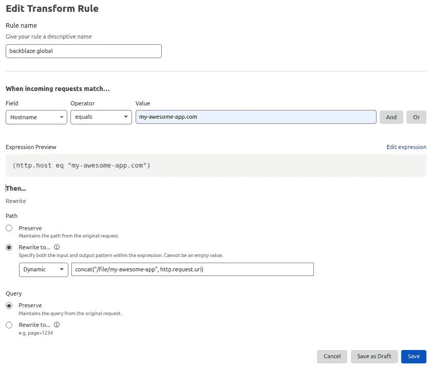
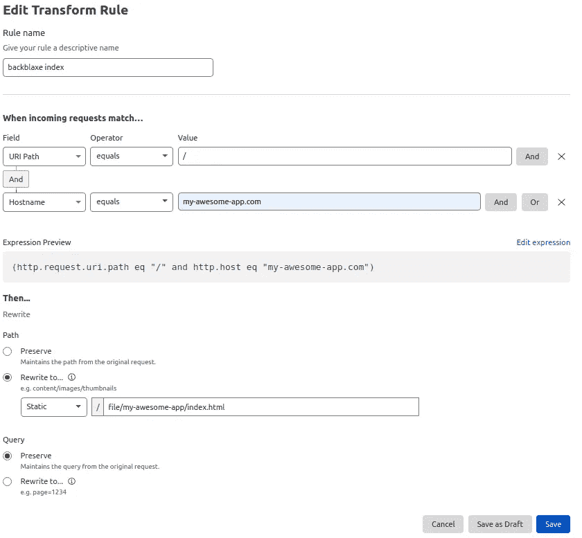
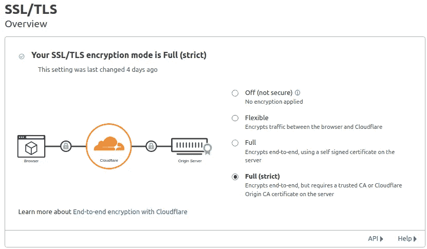

# 使用 Github Actions 在 Backblaze 和 Cloudflare 上部署 react 应用程序

> 原文：<https://itnext.io/deploy-your-react-app-on-backblaze-and-cloudflare-with-github-actions-93f09f2c67d5?source=collection_archive---------4----------------------->

部署静态 webapp 有多种方式。静态的优点是一个简单的对象存储就足以服务于您的页面。您可以使用 S3+Cloudfront 或 Github/Gitlab 页面，今天我们将了解如何利用 Backblaze + Cloudflare 的低价来存储和提供您的内容。

这里有一篇关于 Backblaze 使用他们的 Cloudflare 服务的[好文章](https://help.backblaze.com/hc/en-us/articles/217666928-Using-Backblaze-B2-with-the-Cloudflare-CDN)，我建议您在继续之前阅读。**事实上，我已经看过几次几乎相同的文章，但对于一个个人项目，我发现它遗漏了 2 点。如何从您的 CI/CD 管道轻松部署，最重要的是，内容不是在域的根处提供**。例句:https://photos.sarahandnilay.com/file/nilayp/*

# 先决条件:

*   backblaze 中的公共桶(如 Backblaze 的帖子中所解释的)
*   在 Cloudflare 上配置了 DNS 的域。
*   一个 github repo 和你的静态应用程序(react，hugo，…)

# 1/使用 Github 操作部署 react 应用程序

Github actions 是一个允许你在不同的事件上自动执行一些动作的特性，比如推一个分支，合并一个拉请求等等

我们这里想要的工作流是测试我们的应用程序，然后将其构建为生产就绪，然后将其部署在 Backblaze 上。为此，我们需要安装 b2，这是 backblaze cli，我们将使用它来同步我们的文件。为了简化这个过程，我构建了这个动作，并将其明确命名为[**https://github . com/market place/actions/install-backblaze-B2-CLI**](https://github.com/marketplace/actions/install-backblaze-b2-cli)**。**喜欢就别忘了上星:)

以下是要复制到中的工作流程。github/worflows 目录

这里没有什么特别的，我们安装 nodeJS，然后我们构建应用程序(这里是一个 NextJS)，我们运行我们的测试，我们构建应用程序及其所有优化，并为生产做好准备。这一步的输出是我们需要部署的./out 文件夹。

我们现在安装 b2 cli，通过提供 2 个环境变量，我们将通过身份验证。在 Backblaze 中创建一个应用密钥，并在 github secrets 中报告 key_id 和密钥。

最后，最后一步是同步我们的新应用程序到我们的 b2 桶。此时，您应该能够列出您的存储桶中的文件。点击任何一个和，然后点击“友好的网址”。[https://f000.backblazeb2.com/file/mybucket/index.html](https://f000.backblazeb2.com/file/mybucket/index.html)记下这个 URL 的域名。

# 2/配置 Cloudflare

现在这里是其他帖子缺乏信息的地方。我们不希望我们的应用程序在 https://my-awesome-app.com/file/mybucket/index.html 的[被提供，而是在 https://my-awesome-app.com 的](https://my-awesome-app.com/file/mybucket/index.html)[被提供，对吗？](https://my-awesome-app.com)

根据下面的截图配置您的 DNS。

我们现在需要 2 个转换规则。

## 1/剥离 URL 中的文件/我的存储桶

基本上这个规则说，如果域没有子域，对于所有的 URL，用/file/my-awesome-app 在内部重写 URL。这将把正确的文件作为存储桶的目标。

## 2/除掉 index.html

不要忘记 Backblaze 是一个对象存储器，这意味着你必须指定你想要访问哪个对象。因为我们不想指定 index.html，我们必须创建第二个转换规则。

这一条说，如果路径严格等于“/”，那么得到 index.html 对象。

不要忘记在严格模式下配置您的 SSL

瞧，你现在可以从你的域访问你的应用了。

# 结论

我们已经看到了如何通过 Github Actions 和 Cloudflare 在 Backblaze 上轻松部署静态应用程序。这是一个非常简单的过程，也非常划算。