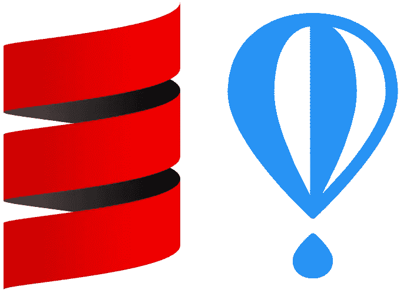

# 在 fly.io 上部署全栈 Scala 应用

> 原文：<https://itnext.io/deploying-a-full-stack-scala-application-on-fly-io-f80ca9de9b13?source=collection_archive---------0----------------------->

不久前，我很高兴地发现 Heroku 允许一个人在他们的 dynos 上免费托管一个小应用程序。然而，最近，我不太高兴地得知他们[正在让他们](https://blog.heroku.com/next-chapter)退役，所以人们被要求更新付费计划。

幸运的是，一个备选方案立即出现了，即 [fly.io](https://fly.io/) 。在这篇博文中，我将展示一个 web 应用程序的可能设置，其中前端和后端都是用 Scala 开发的，并且可以很容易地部署到 fly.io，**上，完全免费**。对于不耐烦的人，你可以在 [GitHub](https://github.com/sherpal/FlyIOScalaJVMDemo) 上找到结果。

对于这个小例子，我做了一些无关紧要的技术选择。重点应该放在项目的架构上。然而，为了完整起见，让我们提一下这些选择。服务器使用[桶](https://github.com/com-lihaoyi/cask)实现，前端 web 框架是[层流](https://laminar.dev/)。我们使用 [vitejs](https://vitejs.dev/) 来管理我们前端的打包，使用 [sbt-assembly](https://github.com/sbt/sbt-assembly) 来创建一个 fat jar。使用 [sbt-revolver](https://github.com/spray/sbt-revolver) 可以热重装后端服务器。最后，我们使用 [circe](https://circe.github.io/circe/) 来序列化前端和后端之间的数据。



# 项目结构

该项目由单个 [sbt](https://www.scala-sbt.org/) 项目组成，包含三个子模块。一个共享的子模块交叉编译到 JVM 字节码和 JavaScript。该子模块包含前端和后端都应该知道的所有核心逻辑。然后有一个子模块“server”包含后端代码(纯 JVM)，还有一个子模块“frontend”包含前端代码(纯 JS)。

因此，总体结构如下所示:

```
build.sbt
server/
├─ src/
shared-logic/
├─ src/
frontend/
├─ vite.config.js
├─ package.json
├─ src/
shared-logic/
├─ shared/src/
Dockerfile
fly.toml
```

后端是一个简单的 JVM 进程，因此所有的依赖关系都由 sbt 来处理——这里没有什么要做的了。然而，前端生活在 npm 生态系统中，因此除了通常的 Scala 依赖性之外，还必须管理 npm 依赖性。这项工作交给了维特。特别是，这意味着**下载 npm 依赖关系**必须通过运行`frontend`目录中的`npm ci`来“手动”完成。

# 开发设置

我们的目标是将我们的应用程序部署到 fly.io。但在我们这样做之前，如果我们能开发它就好了。当开发一个以单页面应用程序为前端的 web 应用程序时，在我们编码时拥有有效的刷新周期是很重要的。

Vite 拥有我们实现这一目标所需的一切。它有一个开发服务器，可以在每次源代码更改时自动刷新我们的浏览器页面。在这种情况下，“源代码变更”实际上是 Scala.js 中编译后的 JavaScript 文件的变更。幸运的是，让这个编译后的文件在源代码变更时自动刷新可以通过 sbt 中的命令`~frontend/fastLinkJS`来完成。来自 vite 的 dev 服务器可以用`frontend`目录中的`npm run dev`运行。

如果服务器后端可以在源代码改变时自动刷新，那就更好了。为此，我们使用 sbt-revolver 插件。有了它，我们可以在 sbt 中运行`~server/reStart`。

如果你不熟悉 web 开发，你可能想知道前端(及其运行在端口 3000 上的 dev 服务器)如何知道何时联系后端(运行在端口 9000 上)。Vite 以这样的方式配置，以`/api`开始的每个请求都被代理到后端。

总而言之，在开发中运行应用程序需要运行这三个命令(在三个不同的终端中):

```
sbt ~frontend/fastLinkJS
sbt ~server/reStart
cd frontend && npm run dev
```

然后就可以访问[http://localhost:3000/static](http://localhost:3000/static)

# 生产设置

在 fly.io 上部署应用需要几个步骤:将前端部分打包成浏览器可以消费的静态文件，将服务器部分打包成一个现成的 fat jar(包含打包的前端)，最后用合适的 JVM 放在 Docker 映像中。注意，你甚至不需要安装 Docker，fly.io 会帮你搞定。

如果你不了解 Docker，你可以想象给你一台全新的电脑，里面什么都没有，你必须描述你的应用程序需要的所有东西。这个描述包括操作系统——通常是瘦 Linux 发行版——你想要安装的程序，你需要的文件，最后是执行你的程序的命令。在我们的例子中，我们真的不需要太多:一个 JVM 和一个 fat jar，我们用`java -jar thejar.jar`运行它。这些指令被收集在一个[文档文件](https://github.com/sherpal/FlyIOScalaJVMDemo/blob/master/Dockerfile)中。

包装前端由 Vite 负责。一旦前端子模块用`sbt frontend/fullLinkJS`编译好，我们就可以运行`npm run build`(在`frontend`目录下)，然后把生成的文件复制粘贴到后端的资源里面。

封装后端使用 sbt-assembly，所以我们需要运行`sbt server/assembly`来获得 fat jar(在项目中，它被配置为叫做`app.jar`)。然后我们可以将这个胖罐子复制粘贴到`dist`文件夹中，Dockerfile 将会在那里找到它。

最后，Dockerfile 将使用带有 Zulu openjdk 的小型 Linux 发行版，添加 fat jar，并在端口 8080 上运行它，将`isProd`设置为 true。服务器使用此设置来使用主机`0.0.0.0`而不是`localhost`。这是必需的，因为即使您在您的计算机上启动 Docker 容器，通过 http 到达它仍然被认为是“外部流量”，并且不会响应`localhost`。

现在，代替手工完成这些步骤，项目有一个 sbt 任务`packageApplication`将为我们完成所有这些。因此，如果您运行`sbt packageApplication`，您将得到一个准备好的文件`dist/app.jar`。

注意，我们将后端配置为服务来自`static`文件夹的所有静态文件，这也反映在 vitejs 配置中。

# Fly.io 设置

完整的 fly.io 配置包含在`fly.toml`文件中，您可以使用`fly launch`为自己的应用程序生成该文件。(为此，您需要安装 [flyctl](https://fly.io/docs/hands-on/install-flyctl/) 。)你会被问一堆问题(特别是我们对 postgres 或 redis 数据库说“不”，我们选择阿姆斯特丹作为地点，因为它离比利时最近)。

因为我们有一个 docker 文件，因为我们用`sbt packageApplication`制作了我们的 fat jar，所以我们可以运行`fly deploy`，魔法就会运行。完成后，我们可以用`fly open`直接打开一个浏览器到它的位置，我们甚至可以在飞行中监控它。io [dashboard](https://fly.io/dashboard) 。

# 蛋糕上的樱桃:GitHub 行动

我们应用程序的代码托管在 Github 上，你可能知道，我们被允许以 [Github 动作](https://github.com/features/actions)的形式添加 ci/cd 管道。Fly.io 甚至有一个[动作我们可以用](https://fly.io/docs/app-guides/continuous-deployment-with-github-actions/)。在我们的例子中，我们需要将它与安装 jdk 和 sbt 的东西以及安装 npm 的东西混合在一起。这里可以看到详细的[。](https://github.com/sherpal/FlyIOScalaJVMDemo/blob/master/.github/workflows/deploy-to-flyio.yml)

每次我们提交到“publish”分支时，我们的应用程序都会自动重新部署到 fly.io！

# 结束语

我们看到了如何从 scrach 开始，建立一个完全用 Scala 构建的 web 应用程序，并在 fly.io 平台上免费部署它们。下一次，我们将做同样的事情，但是使用同样用 Scala 编写的 node.js 后端。

正如我之前的 Heroku 博客帖子是未来给我的一封信(2022 年 11 月 28 日结束的未来)，这篇博客帖子是新未来给我的一封信，我希望它能持续更长时间。说了这么多，希望能对你有用！

想了解更多关于全栈 Scala 和 fly.io 的内容？看看安东·斯维里多夫的杰作！