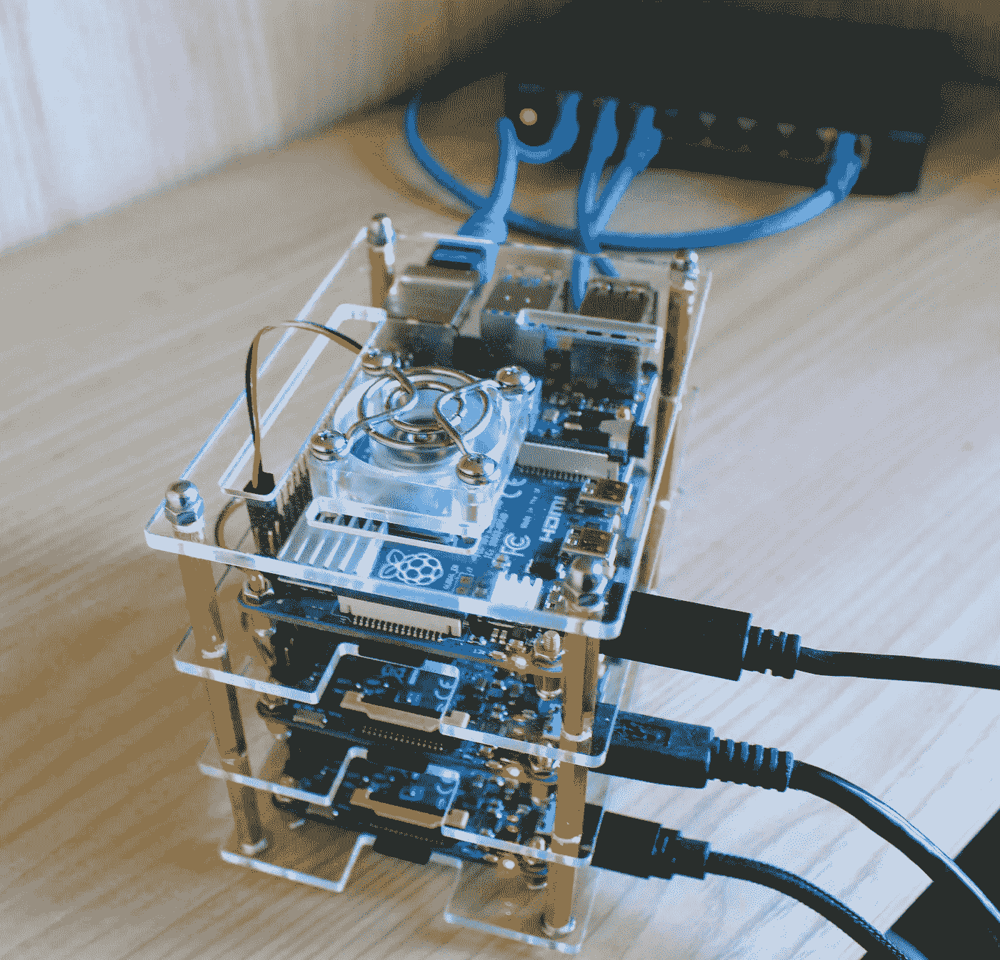
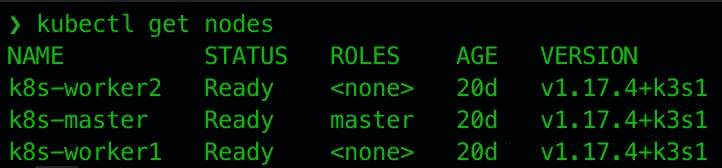
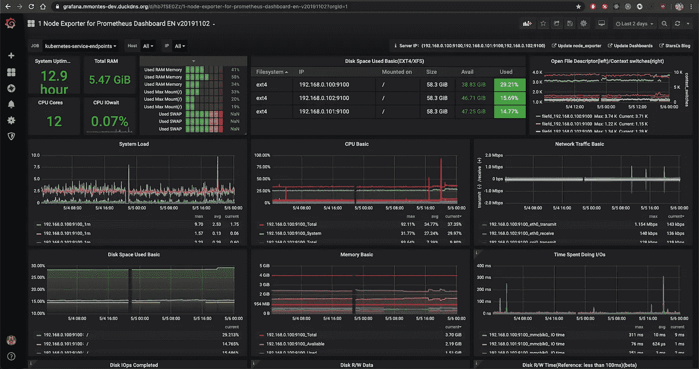

# 将面向微服务的应用部署到 Kubernetes，从零到生产

> 原文：<https://itnext.io/deploying-a-microservice-oriented-application-to-kubernetes-from-zero-to-production-416a173a8505?source=collection_archive---------2----------------------->



在本文中，我们将在由 Raspberry Pis 构成的裸机 Kubernetes 集群中部署一个物联网应用程序。我们还将部署一个监控系统，以获得关于此基础架构的指标。

如果您对要部署的应用程序的实现细节感兴趣，请查看这篇文章:

[](/real-time-sensor-data-visualisation-using-reactjs-nodejs-socket-io-and-raspberry-pi-d109fd5cb19d) [## 使用 ReactJS、NodeJS、Socket.io 和 Raspberry Pi 实现实时传感器数据可视化

### 实际使用案例

itnext.io](/real-time-sensor-data-visualisation-using-reactjs-nodejs-socket-io-and-raspberry-pi-d109fd5cb19d) 

# 设置裸机集群🔧

我们的集群将由以下节点组成:

*   `k8s-master`:树莓派 4
*   `k8s-worker1`和`k8s-worker2`:树莓派 3

Kubernetes 在主节点上需要更多的资源，所以这里有我们最好的金属是很重要的。此外，在实际安装 Kubernetes 之前，我们需要在所有节点中遵循以下步骤:

*   为树莓 Pi 安装[Ubuntu 18.04 LTS](https://ubuntu.com/download/raspberry-pi)
*   配置一个[静态 IP](https://linuxize.com/post/how-to-configure-static-ip-address-on-ubuntu-18-04/)
*   [将其主机名](https://linuxize.com/post/how-to-change-hostname-on-ubuntu-18-04/)更改为`k8s-$(role)`

现在我们准备安装 Kubernetes。我们将使用 [K3s](https://rancher.com/docs/k3s/latest/en/) ，这是一款由 Rancher Labs 提供的轻量级 Kubernetes，非常适合 ARM 和 IoT。安装也很简单，只需遵循本指南。

最后，在`k8s-master`中运行下面的命令，验证您的集群已经启动并正在运行:



# 构建应用程序🏗️

我们的应用程序有许多微服务，每个微服务都有一个 Docker 映像，需要为不同的架构构建:`arm64`和`amd64`。它们将分别用于生产(raspi 集群)和开发(minikube)。

为所有架构手动构建此映像根本不是最佳选择，而且会花费大量时间，我们需要一种更好的方法来完成此任务。幸运的是，Docker 提供了一个名为 [buildx](https://docs.docker.com/buildx/working-with-buildx/) 的实验特性，它允许我们在你的机器上同时为多个架构构建一个映像。这是我们的`build.sh`脚本:

这好多了，但是…如果我们在推送标签时在 CI 中运行这个脚本会怎么样呢？：

# 部署应用程序🚀

如前所述，应用程序有许多微服务，因此我们将重点以`back`微服务为例。

这个服务负责通过公开一个 REST API 来管理我们的平台及其相关数据。在底层，它使用以下基础设施:

*   **MongoDB** :用于存储我们的非规范化模型
*   Redis :作为我们统计的缓存
*   **Mosquitto** : MQTT 经纪人

该基础设施作为独立的服务部署在我们的 Kubernetes 集群中，因此我们需要一个`configmap`来配置连接和其他环境变量:

然后，我们可以定义`deployment`,在这里我们将定义我们的容器所需的资源，还可以定义`service`,它将其端口暴露给外部:

值得一提的是，Kubernetes 将根据`resources.request`和`resources.limits`字段从我们的集群中选择一个节点来适应我们的容器，这样可以方便地对它们进行适当的划分。

此外，值得注意的是，Kubernetes 将通过向`readinessProbe`和`livenessProbe`中定义的端点发出 http 请求来检查容器的健康状况。如果该请求不成功，运行我们的容器的 pod 将被重新启动，甚至在一定次数的重新启动后被终止。

最后，为了开始应用程序部署，我们只需要执行这个脚本:

```
$ ./scripts/deploy.sh
```

# 配置反向代理📡

> **更新**:我已经通过使用他们的[掌舵图](https://github.com/helm/charts/tree/master/stable/traefik):[https://github . com/mmontes 11/mmontes-dev/tree/master/Traefik](https://github.com/mmontes11/mmontes-dev/tree/master/traefik)将反向代理迁移到了 [Traefik 的入口控制器](https://doc.traefik.io/traefik/v1.7/user-guide/kubernetes/)

我们的应用程序已经启动并运行，但还不能在互联网上使用。为了实现这一点，我们正在配置一个 Nginx 反向代理，它有一个关联的**域**到它的公共 IP 和 **https** 来安全地访问它的内容。

但是…我不想花钱买一个**域名**或者 **SSL 证书** …🙄没问题！，我们将使用:

*   [**DuckDNS**](https://www.duckdns.org/) :免费提供以*duckdns.org*结尾的域名，包括所有子域名。
*   [**让我们加密**](https://letsencrypt.org/es/) :免费提供 SSL 证书的非盈利认证机构。

为了让我们的生活更容易，我们也将使用这些来自[**Linux server . io**](https://docs.linuxserver.io/)**:**的 Docker 图片

*   [**Linux server/duck DNS**](https://hub.docker.com/r/linuxserver/duckdns/):使用 crontab 定期更新与域关联的公有 IP。
*   [**Linux server/lets Encrypt**](https://hub.docker.com/r/linuxserver/letsencrypt):基于 Nginx 的镜像，自动更新加密证书。

由于`linuxserver/letsencrypt`是一个 Nginx，我们将在一个`.conf`文件中指定每个子域配置，如下所示:

请注意，我们正在将来自域`iot.*`的所有流量转发到`http://nginx.iot`中可用的服务。这是因为 Kubernetes 有一个内部 DNS，允许通过使用`http://<service>.<namespace>`从其他名称空间访问服务。

一旦所有子域的配置就绪，我们就可以开始部署反向代理了:

在这种情况下，我们将需要使用一个`PersistentVolumeClaim`来请求 Kubernetes 为我们的 Nginx 容器提供一些存储空间。我们将把这个`PersistentVolumeClaim`挂载到`/config`目录中，SSL 证书和 Nginx 配置文件将放在那里。

与 Docker 不同，Kubernetes 不将本地目录映射到卷，而是从集群中有足够空间满足您的请求的节点为您提供存储。这种方法的问题是，第一次需要自己填充这个卷，因为它是空的。我们可以使用`initContainers`通过使用`wget`从 GitHub 下载子域的配置。

# 监视📈

我们的应用程序正在生产中，可以在互联网上获得，并且有望被大量用户使用。我们怎么知道他们的确切人数？。我们有很多微服务，我们如何知道它们都是健康的？

我们需要指标！

为了获得它们，我们将使用以下堆栈:

*   [**普罗米修斯**](https://github.com/prometheus/prometheus) :监控系统，将我们的指标存储在时序数据库中。通过配置导出器，它具有高度的可配置性和可扩展性。
*   [**Grafana**](https://github.com/grafana/grafana)**:**它消耗普罗米修斯度量，显示漂亮的仪表盘。你可以制作自己的仪表盘，也可以从他们的[市场](https://grafana.com/grafana/dashboards?orderBy=name&direction=asc)下载。
*   [**Kubernetes dashboard**](https://kubernetes.io/docs/tasks/access-application-cluster/web-ui-dashboard/):Angular SPA 用于通过 REST API 管理 Kubernetes cluser。
*   [**node _ exporter**](https://github.com/prometheus/node_exporter):Prometheus exporter，用于 CPU 或内存使用等机器指标。
*   [**mongodb _ Exporter**](https://github.com/percona/mongodb_exporter):**用于 MongoDB 指标的导出器。例如:可用连接和查询操作员统计。**
*   **[**Redis _ Exporter**](https://github.com/oliver006/redis_exporter):Redis 指标的导出器。例如:项目总数和过期密钥。**
*   **[**Mosquitto _ Exporter**](https://github.com/sapcc/mosquitto-exporter):Mosquitto broker 指标的出口商。例如:订阅和发布消息的数量。**
*   **[**Nginx _ Exporter**](https://github.com/nginxinc/nginx-prometheus-exporter):Nginx 指标的导出器。例如:请求总数和活动连接数。**
*   **[**express-prom-bundle**](https://github.com/jochen-schweizer/express-prom-bundle):抓取 http 请求度量的 ExpressJS 中间件。**

**为了部署这个堆栈，我们将使用 [**helm**](https://helm.sh/) ，这是 Kubernetes 的一个包管理器，它将大大简化我们的部署。他们提供预先准备好的部署，称为 [**图表**](https://hub.helm.sh/) ，可以用 yaml 文件进行配置。**

**让我们部署所有这些东西:**

**最后但同样重要的是，让我们看看我们的仪表板:**

****

# **综上📝**

**可伸缩性已经成为当今部署的几乎所有应用程序的一个要求。拥有一个监控系统可以为您提供关于基础设施状态的有价值的信息，并使您能够做出关于可扩展性的客观决策。**

**除了它的健壮性和易于部署之外，Kubernetes 是实现可伸缩性决策和满足您的 SLA 的合适工具。**

# **GitHub Repos**

**[](https://github.com/mmontes11/mmontes-dev) [## mmontes11/mmontes-dev

### 我的个人网站和应用程序的 Kubernetes 设置。-mm notes 11/mm notes-dev

github.com](https://github.com/mmontes11/mmontes-dev) [](https://github.com/mmontes11/iot) [## mmontes11/iot

### 通用物联网平台。

github.com](https://github.com/mmontes11/iot) 

# 活生生的例子

*   [https://github-explorer.mmontes-dev.duckdns.org](https://github-explorer.mmontes-dev.duckdns.org/)
*   [https://grafana.mmontes-dev.duckdns.org](https://grafana.mmontes-dev.duckdns.org/?orgId=1)
*   [https://iot.mmontes-dev.duckdns.org](https://iot.mmontes-dev.duckdns.org/)
*   [https://kubernetes.mmontes-dev.duckdns.org](https://kubernetes.mmontes-dev.duckdns.org)

# 资源

[](/real-time-sensor-data-visualisation-using-reactjs-nodejs-socket-io-and-raspberry-pi-d109fd5cb19d) [## 使用 ReactJS、NodeJS、Socket.io 和 Raspberry Pi 实现实时传感器数据可视化

### 实际使用案例

itnext.io](/real-time-sensor-data-visualisation-using-reactjs-nodejs-socket-io-and-raspberry-pi-d109fd5cb19d) 

*   [https://rancher.com/docs/k3s/latest/en/](https://rancher.com/docs/k3s/latest/en/installation/)
*   [https://kubernetes.io/docs/home/](https://kubernetes.io/docs/home/)
*   [https://docs.docker.com/buildx/working-with-buildx/](https://docs.docker.com/buildx/working-with-buildx/)
*   [https://helm.sh/docs/](https://helm.sh/docs/)
*   [https://hub.helm.sh/](https://hub.helm.sh/)
*   [https://hub.docker.com/r/linuxserver/duckdns/](https://hub.docker.com/r/linuxserver/duckdns/)
*   [https://hub.docker.com/r/linuxserver/letsencrypt](https://hub.docker.com/r/linuxserver/letsencrypt)
*   [https://www.duckdns.org/](https://www.duckdns.org/)
*   https://letsencrypt.org/en/**