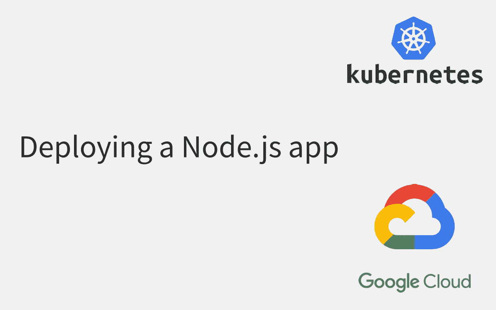
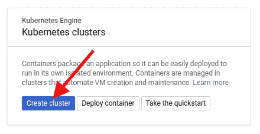
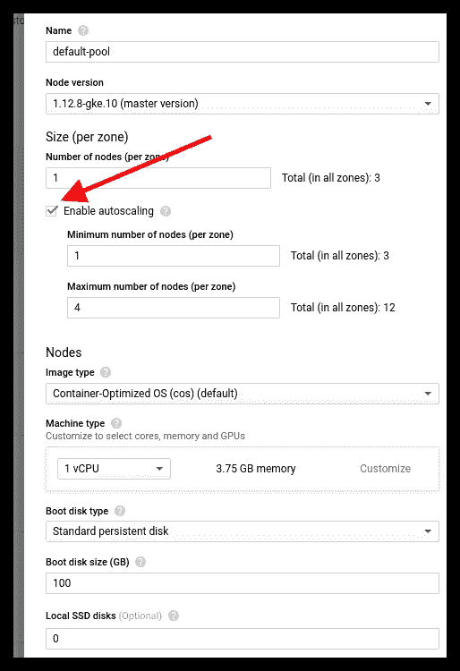
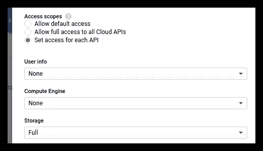
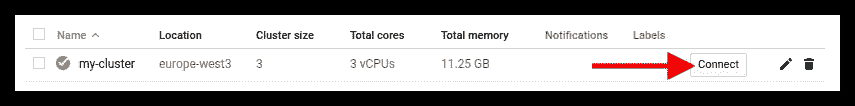
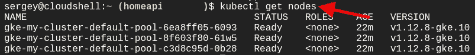
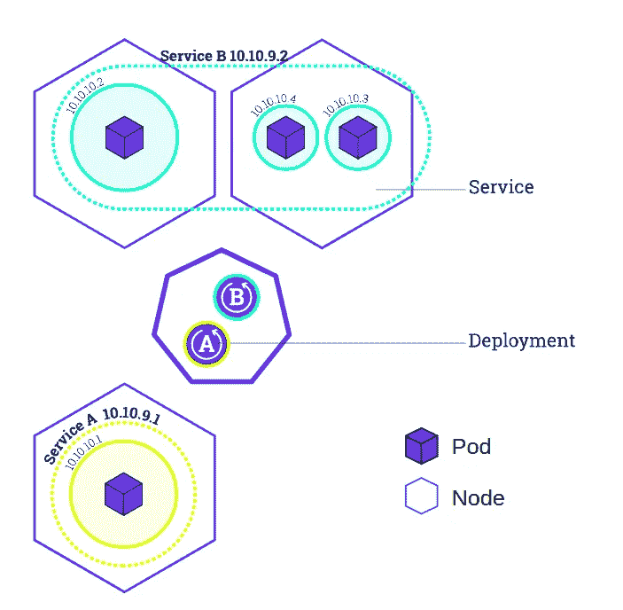
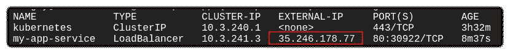

# 将 Node.js 应用程序部署到 Google Kubernetes 引擎(GKE)

> 原文：<https://itnext.io/deploying-a-node-js-app-to-the-google-kubernetes-engine-gke-d6af1f3a954c?source=collection_archive---------1----------------------->



我想向您展示如何快速轻松地将您的应用程序部署到谷歌 Kubernetes 引擎(GKE)上的 Kubernetes。

# 创建新的 Kubernetes 集群



输入群集的名称、位置、节点数量和机器类型。然后点击**更多选项**。


如果需要自动添加新节点到集群中，那么点击**启用自动扩展**。



您可以允许从集群访问一些 API。例如，我允许访问谷歌云存储(GCS)。



创建好集群后，点击**连接**。



现在，您将看到一个带有命令的云 Shell，按 Enter 键执行它并获取 GKE 凭据。之后就可以用 **kubectl** 执行任何命令了。

例如，让我们检查一个集群的节点。



# 将 docker 图像推送到 Google 容器注册表

我将使用我的 GitHub repo，它包括一个简单的 Node.js 应用程序、Dockerfile 和 deployment.yaml。

```
git clone [https://github.com/sonufrienko/gke-simple-app](https://github.com/sonufrienko/gke-simple-app)cd gke-simple-app
```

将 **deployment.yaml** 中的【PROJECT_ID】替换为您的 GCP 项目 ID。

获取 Google 容器注册表的凭据

```
gcloud auth configure-docker
```

构建 docker 映像并将其推送到 Google 容器注册中心

```
docker build -t gcr.io/[PROJECT_ID]/app:v1 .
docker push gcr.io/[PROJECT_ID]/app:v1
```

# 将 docker 映像部署到 Kubernetes

部署 YAML 文件包含两部分:

*   部署-描述要部署的容器
*   服务——将创建一个负载平衡器，将我们的容器暴露给互联网



创建部署和服务。

```
kubectl apply -f deployment.yaml --record
```

检查部署流程

```
kubectl get deployments
```

检查舱(集装箱)

```
kubectl get pods
```

检查服务并复制外部 IP 地址(负载平衡器)

```
kubectl get services
```



现在，您可以在浏览器中打开这个 URL

```
http://<EXTERNAL-IP>/encrypt?secret=abc&message=i-love-you
```

# 如何发布新版本？

将新版本的 docker 映像推送到容器注册表中，在 **deployment.yaml** 中更改 docker 映像版本，然后运行此命令来设置所需的部署状态。

```
kubectl apply -f deployment.yaml --record
```

# 如何回滚新版本？

```
kubectl rollout undo deployment/my-app-deployment
```

# 有用的提示

检查集装箱日志

```
kubectl logs <POD NAME>
```

进入容器内部

```
kubectl exec -it <POD NAME> bash
```

删除整个部署

```
kubectl delete deployment my-app-deployment
```

为部署设置水平窗格自动缩放策略

```
kubectl autoscale deployment <DEPLOYMENT_NAME> --max 6 --min 1 --cpu-percent 60
```

检查水平窗格自动缩放策略(HorizontalPodAutoscaler 对象)

```
kubectl get hpa
```

检查 pod 事件以调查 pod 部署、轮询 docker 映像等问题。

```
kubectl get pods
kubectl describe pods/<POD_NAME>
```

# 下一步是什么？

现在，您已经了解了如何创建 GKE 集群、部署容器、发布新版本和回滚、设置自动伸缩策略以及如何调查问题。

您还可以阅读有关这些主题的更多信息:

1.  管理秘密
2.  标签
3.  命名空间
4.  应用程序运行状况检查
5.  其他服务类型(集群 IP、节点端口、外部名称)
6.  进入