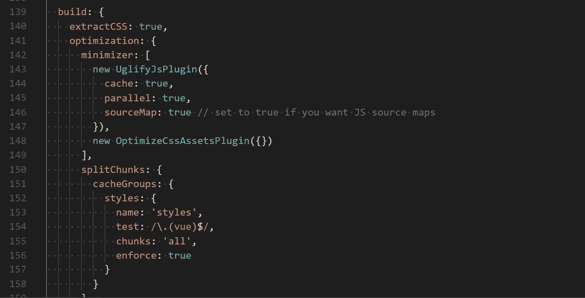

# 将 Nuxt 通用应用部署到 Azure

> 原文：<https://itnext.io/deploying-a-nuxt-universal-app-to-azure-f61e5a85d8a2?source=collection_archive---------1----------------------->



这是一个漫长而艰难的过程，最终我的应用程序被部署在 [Vue](https://vuejs.org/) / [Nuxt](https://nuxtjs.org/) 中。

虽然有一些关于如何将 Nuxt 部署到各种地方的文档，如 Heroku 或 GitHub Pages，但没有指向如何让 Nuxt 在 Microsoft Azure 上运行的 T21 的指针，具体来说是一个通用的应用程序，可以运行服务器端和客户端，而不仅仅是静态生成的应用程序或 SPA 风格的客户端应用程序。

最重要的是，我不太确定哪些文件应该在服务器上，哪些不是。

截至 2018 年 8 月，这里真的是你需要知道的全部。

# 我的服务器上有什么？

这些是*需要*保存在 Azure 上生产服务器实例的`wwwroot`中的唯一文件:

```
.nuxt
static
nuxt.config.js
package.json
server.js
```

所以让我们一次过一遍。

# `.nuxt`目录

`.nuxt`目录拥有 Nuxt 作为服务器端应用程序运行所需的一切，它还包含一个名为`dist`的目录。通过从你的应用程序的根目录运行命令`npm run build`，这个目录中包含了组成你的应用程序的所有文件。

在`dist`内部，您将会看到如下内容:

```
0fdda7689bf96582760e.js
7a8ee1584491e3b3499a.js
5843c32d223ef79c6cac.js
7698b9b9d7a056e0332e.js
5359442cf7d324107315.js
c2dbf45c410d904f8449.js
```

这些都是编译后的 Javascript 文件，它们组成了您的个人`.vue`页面和组件。非常简单。

默认情况下，您还将拥有:

```
index.spa.html
index.ssr.html
server-bundle.json
vue-ssr-client-manifest.json
```

这些文件是应用程序的必需元素。对于通用应用程序，你并不真的需要`index.spa.html`，所以如果你愿意，你可以安全地删除它。这是 1KB，所以，没有什么大不了的。

# 确保。CSS 实际上是作为。CSS 文件

```
153d433a761cf8ccc028.css
5376176449ad137de0b4.css
```

当然还有你的样式表。现在，默认情况下，在没有首先修改配置文件的情况下，当构建应用程序时，您不会将样式视为它们自己的单独文件。所以这些可能不会在为你运行`npm run build`后出现。原因如下:

默认模式是将所有样式都包含在其中。js 文件，然后当你在浏览器中加载应用程序时，它内联所有的 css，而不是指向外部。css 文件。因此，在您的`<head>`中，您最终会有大量的`<style type="text/css">...</style>`声明。

为了保证这些。当你构建你的应用程序时，css 文件实际上是存在的，你需要在你的`nuxt.config.js`配置文件中使用几行。在顶部，您需要安装并导入 [UglifyJS](https://github.com/webpack-contrib/uglifyjs-webpack-plugin) 和[optimize-CSS-assets-web pack-plugin](https://github.com/NMFR/optimize-css-assets-webpack-plugin):

```
const UglifyJsPlugin = require('uglifyjs-webpack-plugin')
const OptimizeCssAssetsPlugin = require('optimize-css-assets-webpack-plugin')
```

接下来，您需要在`**build**` 部分包含以下内容:

```
module.exports = {
...
build: {
 extractCSS: true,
 optimization: {
  minimizer: [
   new UglifyJsPlugin({
    cache: true,
    parallel: true,
    sourceMap: true // set to true if you want JS source maps
   }),
   new OptimizeCssAssetsPlugin({})
  ],
  splitChunks: {
   cacheGroups: {
    styles: {
     name: 'styles',
     test: /\.(vue)$/,
     chunks: 'all',
     enforce: true
    }
   }
  }
 }
}
...
}
```

`extractCSS`是不言自明的——它让 Nuxt 知道您想将 CSS 从。js 文件和 make。改为指向 css 文件。

UglifyJsPlugin 是为了确保所有的。由于我们正在修改 webpack 的`minimizer`设置，js 被压缩和缩小了。

`OptimizeCssAssetsPlugin`所做的正是你所想的:通过缩小 css 资产、删除空白、让它们尽可能精简来优化它们。

`splitChunks`部分确保不是为每一个都创建大量的样式表。vue 单个文件组件和页面，它将你所有的风格整合到几个文件中。

好的。所以现在我们有了。js 文件，我们的。css 文件和其余的`dist`文件夹。

# 部署文件夹中的其他文件和目录

所以我们还剩下一些其他的目录和文件:

```
static
nuxt.config.js
package.json
server.js
```

所以`static`目录只是从你的应用根目录复制/粘贴的。它是你的应用程序使用的所有静态文件。像字体、图片、ads.txt、favicon.ico、robots.txt 这样的东西——本质上，任何应该在你的网站上从`"/"`提供的东西。

`nuxt.config.js`也可以从您的应用程序根目录复制/粘贴。它仍然告诉 Nuxt 你希望你的应用程序如何配置，并且是一个必需的文件。除非您有非常具体的只用于生产的需求，否则您不需要在其中做任何更改。

您的`package.json`可以被复制/粘贴，但是您可能希望对其进行删减，只包含以下内容:

```
{
  "name": "yourappname",
  "engines": {
    "node": ">=6.11",
    "npm": ">=5.6.0"
  },
  "dependencies": {    
    "nuxt-edge": "latest"
  }
}
```

*(旁注:我在这里引用* `*nuxt-edge*` *是因为 Nuxt 2.0 还没有出来，但是当你读到这里的时候，你可能想只是引用* `*"nuxt": "^2.0.0"*` *来代替。)*

本质上，你所需要的就是`name`，这个`engines`模块向 Azure 指示应该运行哪个版本的 Node 和 NPM，然后是你的任何应用依赖。

(注意:你**不需要**包含你的`devDependencies`，因为你的应用已经构建好了，并且存在于`.nuxt/dist`文件夹中，你不需要在服务器上重新构建你的应用——因此，在 Azure 上你的生产服务器上不需要 devDependencies。)

最后，但同样重要的是，我们有`server.js`。这是一个最让我困惑的文件，因为在任何文档中都没有真正提到它与部署到 Azure 的具体关系。以下是我的`server.js`全文:

```
const express = require('express')
const {Nuxt} = require('nuxt-edge')const app = express()const host = process.env.HOST || '127.0.0.1'
const port = process.env.PORT || 3000// Import and set Nuxt.js options
let config = require('./nuxt.config.js')const nuxt = new Nuxt(config)// Give Nuxt middleware to express
app.use(nuxt.render)// Listen the server
app.listen(port, host);
console.log('Server listening on ' + host + ':' + port);
```

本质上，这只是设置主机和端口，实例化 Nuxt，并让 Express 服务于应用程序。

好的。现在我们的配置都设置好了，请确保再次运行`npm run build`，复制我们的目录和文件(。nuxt，static，nuxt.config.js，package.json，server.js)到一个新文件夹中——可能命名为“deployment ”,或者类似的名称——我们就可以开始了。

# 我们拿到了文件。我们如何把它们放到 Azure 上？

由于缺乏清晰的文档，这对我来说是另一个棘手的部分，但我在 Azure Node 上参考了这个指南。JS 部署和它为我工作:[https://code . visual studio . com/tutorials/nodejs-deployment/getting-started](https://code.visualstudio.com/tutorials/nodejs-deployment/getting-started)

这将使您的应用程序在一个节点上启动。免费层 Azure 上的 JS web app。这不需要花费任何成本，但是一旦你部署了应用程序，你就可以随时扩展它，让它表现得更好。这也是从 Windows 机器部署的。

**Tl；dr**——上面关于部署到 Azure 的快速链接是:

*   转到您的“部署”目录，其中包含。nuxt，static，nuxt.config.js，package.json，server.js)
*   确保你的机器上安装了 [**Azure CLI**](https://docs.microsoft.com/en-us/cli/azure/install-azure-cli?view=azure-cli-latest) 和 [**Git**](https://git-scm.com/)
*   **创建资源组** : `az group create --name myResourceGroup --location "Your Location"` *(参考* [*天蓝色位置*](https://azure.microsoft.com/en-us/global-infrastructure/locations/) *为离你最近的位置名称—* `*myResourceGroup*` *可以是你喜欢的任何名称)*
*   **创建 Azure App 服务计划** : `az appservice plan create --name myAppServicePlan --resource-group myResourceGroup --sku F1` *(还是那句话，* `*myAppServicePlan*` *随便你怎么叫)*
*   **创建一个 web 应用:** `az webapp create --resource-group myResourceGroup --plan myAppServicePlan --name <app_name>`
*   **初始化您的 Git 回购:** `git init
    git add -A
    git commit -m "initial commit"`
*   **设置遥控器:** `az webapp deployment user set --user-name <UserName> --password <Password>
    git remote add azure <your git endpoint>`
*   **部署吧！** `git push azure master`

如果部署成功并且您没有遇到任何错误，那么您 ***应该*** 能够浏览到部署的地址`<yourappname>.azurewebsites.net`

如果第一次加载失败，尝试刷新几次浏览器。在免费层上，Azure 有时需要一点时间来运行，但最终它应该会加载成功。

# 咻！我们做到了！

我希望这能帮助那些正在努力把他们的 Nuxt 应用程序放到 Azure 上的人。当然，有一百万种不同的部署要考虑，以确保伟大的[灯塔](https://developers.google.com/web/tools/lighthouse/)分数，或者不同的中间件选项，或者如果你有你喜欢使用的特定预处理，或者任何数量的事情。我鼓励你加入 [**不和谐服务器**](https://t.co/8YvZaR0Q8u) ，那里总是有其他开发者在一起，互相帮助解决棘手的问题。成为社区的一份子，我们一起解决！