# 使用 Nginx Sidecar 容器将 Rails 应用程序部署到 ECS

> 原文：<https://itnext.io/deploying-a-rails-app-with-an-nginx-sidecar-container-to-ecs-cbc3b0a2c690?source=collection_archive---------1----------------------->

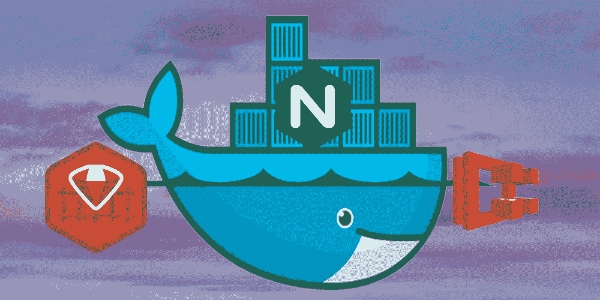

我的任务是为 ECS 部署一个 rails 应用程序，itnext.io 上的这篇文章让我完成了 80%。

我想我会分享我用 nginx sidecar 在 ECS 上运行这个 rails 应用程序的最后步骤。

# (一些)差异

我没有使用 Docker Compose。Docker Compose 不能很好地与 ECS 一起运行，至少不能以我使用它的方式运行。

NGINX 和我的 Rails 应用程序从一个共享目录加载文件需要卷。

## Rails 应用程序设置

首先，向 rails 应用程序添加一个 docker 文件。这里有一个例子:

```
FROM ruby:2.6.1-alpineRUN apk add --update \
    make \
    g++ \
    musl-dev \
    gcc \
    libc-dev \
    file \
    git \
    postgresql-dev \
    tzdata#Install rails_applicationENV APPLICATION_NAME rails_applicationRUN mkdir -p /var/www/rails_applicationWORKDIR /var/www/rails_applicationCOPY Gemfile Gemfile.lock /var/www/rails_application/RUN gem install bundlerRUN bundle installCOPY . .VOLUME /var/www/rails_application/VOLUME /etc/nginx/RUN apk del make \
    g++ \
    musl-dev \
    gcc \
    libc-dev \
    file \
    gitEXPOSE 8080RUN chmod +x app_start.shENTRYPOINT ["sh", "app_start.sh"]
```

我使用了 alpine 并移除了编译器以节省空间。此外，您会注意到我使用了一个 shell 脚本来启动应用程序——稍后会详细介绍。

## NGINX 设置

我在一个单独的 repo 中设置了我的 nginx sidecar 应用程序。nginx repo 的文件结构如下所示:

```
-rails_application-nginx
    -dockerfile
    -nginx.conf
    -nginx (directory)
        -application.conf
```

下面是我的 nginx dockerfile 文件的样子:

```
# Base image
FROM nginxRUN apt-get update -qq && apt-get -y install apache2-utils && apt-get install -y vim# Copy Nginx config template
COPY nginx/application.conf /etc/nginx/conf.d/default.conf
VOLUME /var/www/rails_application/ 
```

下面是 nginx.conf:

```
worker_processes  auto;error_log  /var/log/nginx/error.log warn;
pid        /var/run/nginx.pid;events {
    worker_connections  1024;
}http {
    include       /etc/nginx/mime.types;
    default_type  application/octet-stream;log_format  main  '$remote_addr - $remote_user [$time_local] "$request" '
                      '$status $body_bytes_sent "$http_referer" '
                      '"$http_user_agent" "$http_x_forwarded_for"';access_log /var/log/nginx/access.log  main;sendfile        on;keepalive_timeout  14;proxy_http_version 1.1;include conf.d/*.conf;
}
```

这是我的申请。

```
server {
    listen       80; add_header X-Cache-Status $upstream_cache_status; underscores_in_headers on; error_page  404              /404.html;
    error_page  403              /403.html;
    error_page  500 502 503 504  /500.html; location /health-czech {
         return 200 'ok';
        } include  /etc/nginx/mime.types; root  /var/www/rails_application/public; location / {
          proxy_set_header X-Forwarded-For $proxy_add_x_forwarded_for;
          proxy_set_header Host $http_host; if (-f $request_filename) {
            break;
         } if ( !-f $request_filename ) {
        proxy_pass [http://127.0.0.1:8080](http://127.0.0.1:8080);
        break;
       }
    }
 }
```

# 设置 ECS

第一件事是将应用程序推送到 ECR(弹性容器注册中心)。在您的 AWS 帐户中，导航到 ECR，或者只需点击此链接并仔细检查您是否在正确的地区:【https://us-west-2.console.aws.amazon.com/ecr/repositories 

一旦您创建了新的回购协议，如果您安装了 AWS CLI，通过“**查看推送命令**”按钮上传是一个简单的选项。我有一个用于更新我的回购的小脚本(注意:我通过配置文件命令设置我的地区):

```
#!/bin/bashif (( "$#" != 1 ))
then
    echo "Usage:
./ecr_push [environment]"
exit 1
fiif [[ $@ != acceptance && $@ != staging && $@ != production ]] ;
then
  echo "Environment must be either Acceptance, Staging or Production."
  exit 1
elif [[ $@ = staging || acceptance ]] ;
then
 AWS_ACCOUNT=XXXXXXXXXXXX
elif [[ $@ = production ]] ;
then
  AWS_ACCOUNT=XXXXXXXXXXXX
fiREPO="$AWS_ACCOUNT.dkr.ecr.us-west-2.amazonaws.com/rails_application-$@"
IMAGE=$REPO:latest-$@$(aws ecr get-login --no-include-email --region $AWS_REGION)
docker build -t $IMAGE .
docker push $IMAGE
```

一旦您的 NGINX 和 Rails 应用程序 repos 被添加到 ECR，您就可以设置**任务定义**。您将面临的第一个选择是 FARGATE 或 EC2。我必须满足的一个要求是能够 ssh 到运行我的 rails 和 nginx 应用的容器中，所以我用 EC2，因为你不能 ssh 到 fargate。

如果您以前使用过 ECS，您可能已经有了一个可供选择的任务角色。AWS 自动生成的那个叫做“**ecstaxecutionrole**”。

为了让您的容器在同一实例上相互通信，您必须选择“**主机**”作为**网络模式**。

接下来，在底部，点击“添加音量”按钮。给该卷起一个**名**，但是添加**路径**是不必要的。

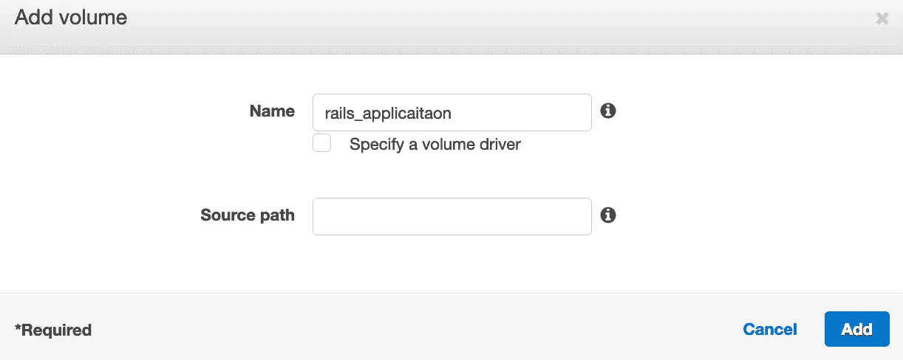

接下来，我们将设置我们的容器。我打算使用“t3.micro”实例来运行容器，因此我相应地指定了 CPU 单元和内存分配。我会让截图做大部分的解释。

## Rails _ 应用程序容器

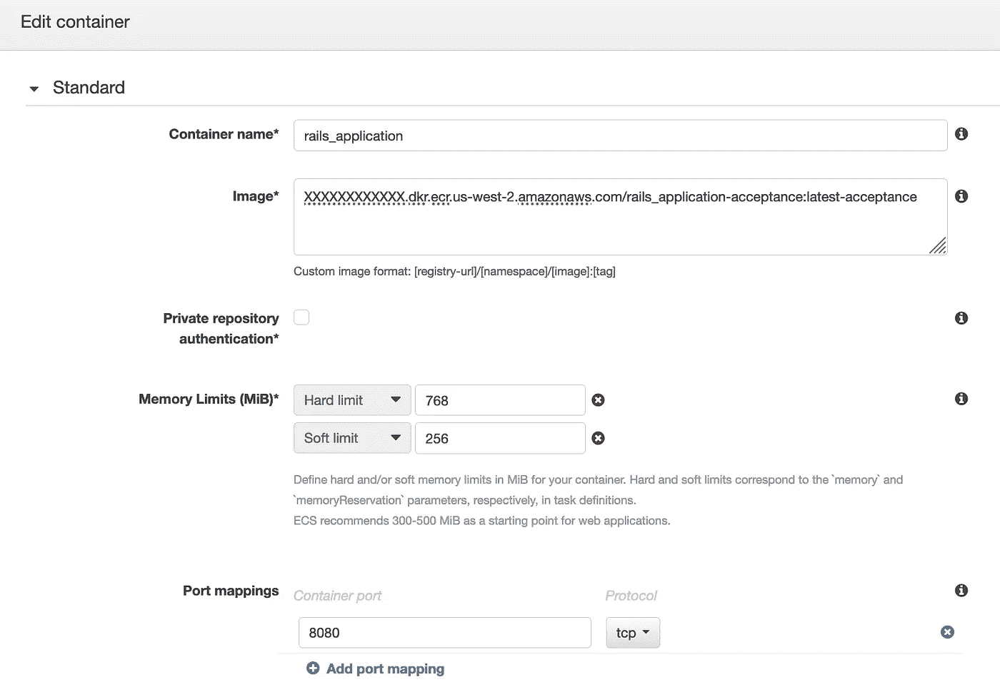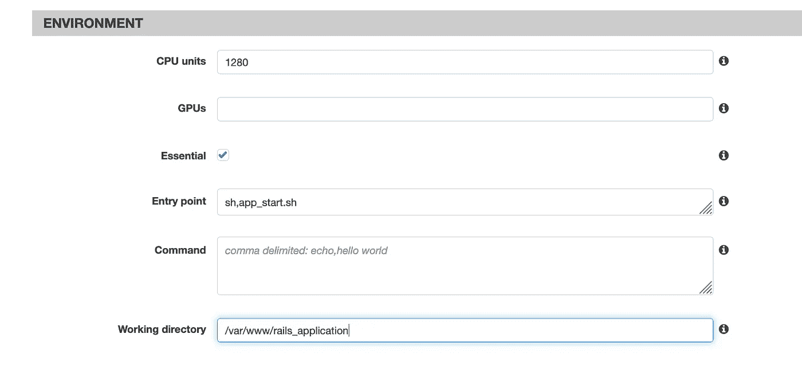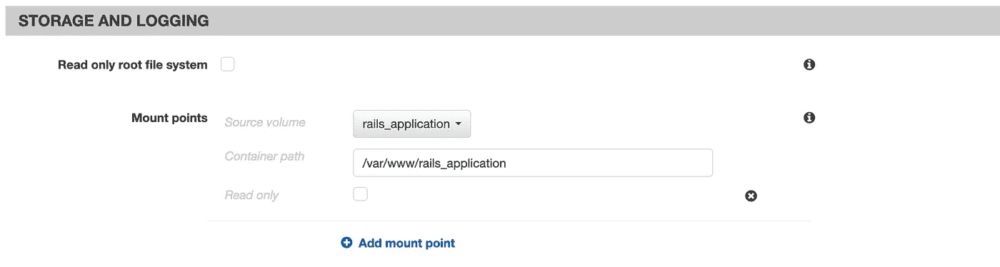

## NGINX 容器

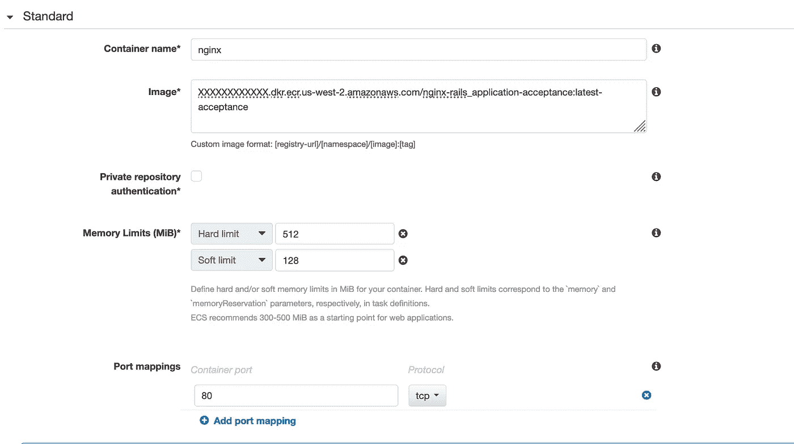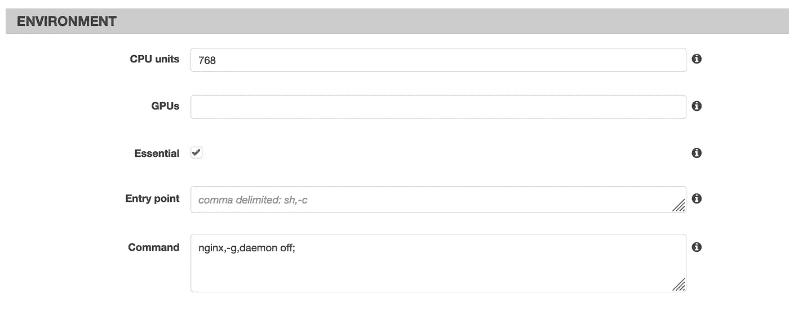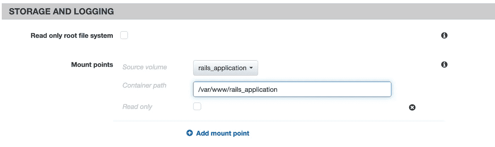

一些大的要点如下:
rails _ application 容器将使用端口 8080，nginx 容器被分配了端口 80。
两个容器都将共享 rails_application 卷，并将/var/www/rails_application 作为挂载路径。

另外，请注意起始压边。Nginx 用途:

```
nginx,-g,daemon off;
```

当 rails 应用程序使用入口点选项并运行这个脚本时:

```
sh,app_start.sh
```

这个脚本是 rails_application repo 的一部分，非常简单:

```
#!/bin/sh
bundle exec rake assets:precompile
bundle exec puma -C config/puma.rb
```

这个特殊的 rails 应用程序需要预编译静态资产，然后通过 puma 启动应用程序。其他不需要资产预编译的 rails 应用程序可以在任务定义的环境部分使用命令字段，而不是入口点，命令如下:

```
bundle,exec,puma,-t,0:5,-w,4,-b,tcp://127.0.0.1:8080
```

如果您不想通过 puma.rb 文件设置线程和工作线程，这是一个不错的选择。

## 集群部署

当设置您的集群时，您将选择 **EC2 Linux +网络**模板选项。

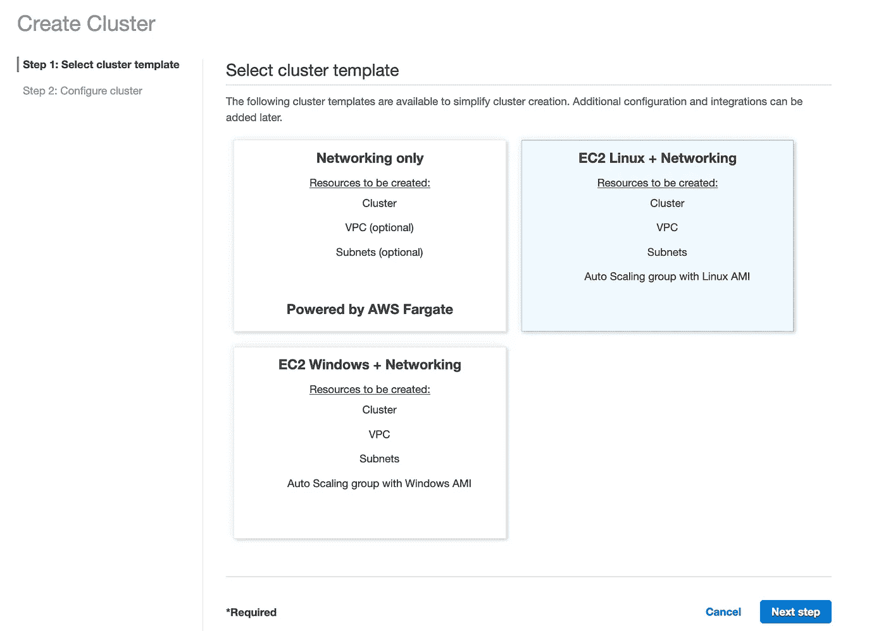

一旦您配置了您的集群，您应该能够启动一个新的任务。(注意:对于本教程，我使用的是**任务**选项，而不是设置**服务**，这非常有用，特别是对于自动缩放，但需要额外的解释)。

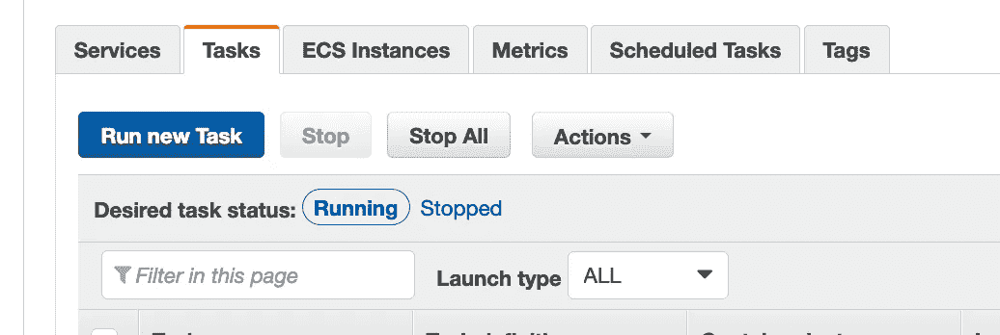

在**运行任务**配置页面，选择 **EC2** 作为启动类型，然后选择您刚刚创建的任务定义。集群应该是预先选择的，并且是正确的，因此您只需点击页面右下角的运行任务按钮。如果您得到一个“Run tasks failed”错误，很可能是您的任务定义的 CPU/RAM 分配和 EC2 实例类型选项之间的问题。

希望您不会遇到任何阻碍，并且您的任务的“最后状态”是**正在运行**！

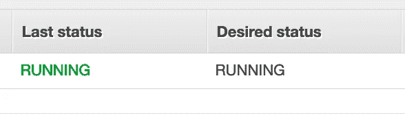

假设您已经设置了负载平衡器和目标组，向该目标组添加了新的 ECS 容器实例，正确设置了该目标组的健康检查路径(在可能的情况下是“/health-czech”)，并正确配置了您的安全组，那么您的应用程序应该已经启动并可访问。

行动愉快😊