# 使用 Heroku 部署 Rails 应用程序

> 原文：<https://itnext.io/deploying-a-rails-app-with-heroku-47e4fbb85965?source=collection_archive---------2----------------------->

[*点击这里在 LinkedIn*](https://www.linkedin.com/cws/share?url=https%3A%2F%2Fitnext.io%2Fdeploying-a-rails-app-with-heroku-47e4fbb85965) 上分享这篇文章

经过数小时的编码、调整和编辑，您终于拥有了一个引以为豪的 rails web 应用程序。干得好！现在，我们如何与世界分享呢？我将快速演示如何使用免费的 Heroku 帐户在线设置 rails 项目，以及在部署时可能会遇到哪些困难。

首先，让我们从你的应用程序开始。我的是 *Stylpfizer* ，最接近明星🌟：

我的本地服务器上的 Stylpfizer

为了部署到 Heroku，您需要拥有他们的帐户。如果你还没有，点击[**这里**](https://signup.heroku.com/) 报名。

现在，Heroku 让他们在这里 **部署一个 rails app [**。我发现说明非常清楚，这可能就是你所需要的。但是，如果您想要更深入的文档版本，以及我所面临的一些问题的解决方案，请继续阅读:**](https://devcenter.heroku.com/articles/getting-started-with-rails5)**

# 1.Heroku 工具带、Git 和 Ruby/Rails 版本

在部署到 Heroku 之前，你需要安装 Heroku tool belt**，并在 Git 中安装你的应用，Git 是一个分布式控制管理工具，以及正确版本的 Ruby 和 Rails。**

**我所做的是将我的项目部署到一个 Github 库，然后允许我共享我的代码并查看我所做的编辑。如果你不知道我在说什么，你可以在这里注册****一个免费的 Github 账号**。**你还需要将你的 rails 应用程序推送到 Github 的一个存储库中，就像 [**文档**](https://help.github.com/articles/create-a-repo/) 中所说的那样。如果一切都连接正确，您将在终端中看到(master)和您的存储库的名称，如下所示。******

****最后，你使用的 Ruby 应该是 2.2.0 或更高版本，Rails 应该是 5 或更高版本。要检查您拥有哪一个，只需在终端中键入`ruby -v`和`rails -v`，就像这样:****

****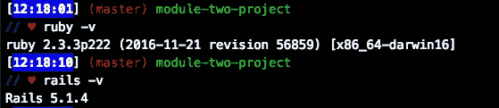****

****这些是我在我的模块二项目库中使用的版本****

# ****1A。用 PostgreSQL 切换 SQLite****

****在创建 rails 应用程序时，默认情况下使用 SQLite 来处理数据库。问题是 Heroku 应用程序与 PostgreSQL 数据库系统配合得更好，所以我们必须在部署到 Heroku 之前解决这个问题。**如果你不这样做，你的 rails 应用数据库将至少每 24 小时清空一次。**这是由于 SQLite 将内存存储在磁盘文件中的方式造成的，Heroku 的 Cedar 堆栈会定期清除这些文件。关于为什么不应该使用 SQLite 的更多信息可以在他们的 [**网站**](https://devcenter.heroku.com/articles/sqlite3) 上找到。****

****为了更改数据库系统，我们必须首先将 gem 文件中的“sqlite3”gem 替换为“pg”gem:****

****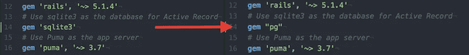****

****用“pg”宝石更改了“sqlite3”宝石****

## ******* * *重要提示*********

****我遇到了 pg gem 的问题。在写这篇博文的时候，似乎最新版本的 PostgreSQL gem (1.0.0)不能很好地与最新版本的 Rails 兼容。这是不断出现的错误:****

****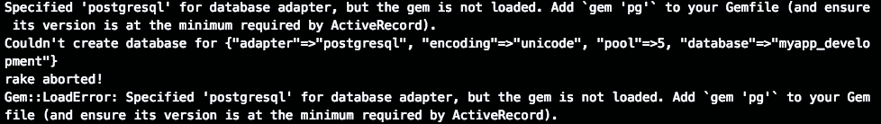****

****pg gem 1.0.0 出错****

****解决这个问题的一个方法是使用早期版本的 gem。您可以在 gem 文件中这样指定:****

****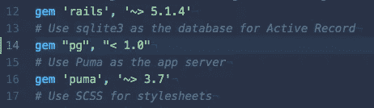****

****将 pg gem 的版本指定为 1.0.0 版之前****

****接下来，我们必须更改 config 文件夹中的 database.yml 文件，以反映数据库系统的更改。我所做的是将 Heroku 的 [**网站**](https://devcenter.heroku.com/articles/getting-started-with-rails5) (数据库下)上的文件复制并粘贴到 database.yml 中。所做的更改应该如下所示:****

****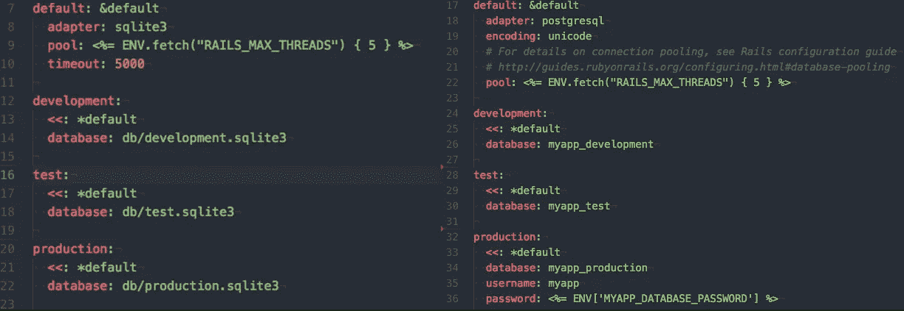****

****database.yml 只使用空格(为了清楚起见，去掉了注释)****

## *******重要说明 2*******

******小心制表符和空格！**扩展名为. yml(YAML)的文件不允许在代码中使用制表符。你应该只使用空格，并且**你必须缩进每个部分的属性**。上图中，default、development、test、production 的所有属性都要有空格缩进适配器、数据库等。如果没有，你会得到一个错误！****

****最后，在终端中运行`bundle install` 来获得 PostgreSQL gem。在一长串宝石信息之后，您应该会看到类似这样的内容:****

****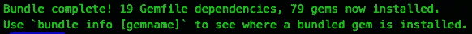****

# ****2.登录并连接到 Heroku****

****假设您完成了步骤 1，我们现在必须在终端中连接到 Heroku，并将您的 rails 应用程序链接到 Heroku 应用程序。要做到这一点，你需要和 Heroku 签约，在这里 可以做 [**。在终端输入`heroku login` 。这将提示您使用用户名登录，然后输入密码:**](https://signup.heroku.com/)****

********

****一旦你输入你的电子邮件，它会要求你输入密码****

****现在你已经连接到你的 Heroku 帐户，让我们把你的 rails 应用程序连接到一个 Heroku 应用程序。如果你想将其连接到一个新的应用程序，只需输入`heroku create`，就会创建一个随机命名的新 Heroku 应用程序。****

****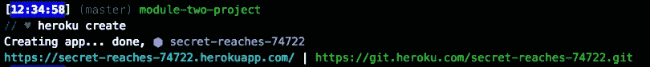****

****使用*“heroku 创建”*创建一个新的 Heroku 应用程序****

****如果你想更改 Heroku 应用程序的名称，你可以输入`heroku apps:rename` ，以及你想使用的新名称。然后，你可以确定它是用`git remote -v`改变的，就像这样:****

****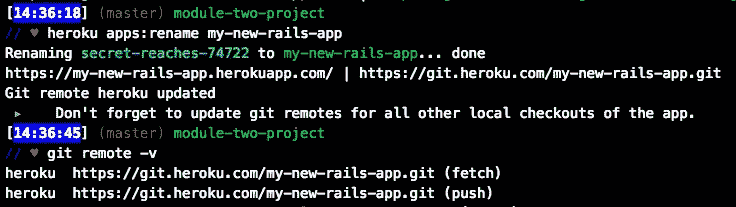****

****git remote -v 告诉你什么 Heroku 应用程序连接到你的 git****

****如果你想使用一个已经存在的 Heroku 应用程序，你可以简单地输入终端`heroku git:remote -a` 和你想使用的应用程序:****

****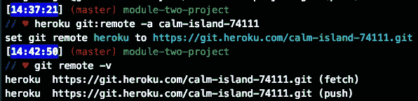****

****我想使用“calm-island-74111”，并使用 git remote -v 来确保它能够工作****

# ****3.将 Rails 应用和数据库推送到 Heroku****

****现在您已经完全连接到 Heroku，最后要做的事情是部署 rails 应用程序。如果您在此过程开始后对您的应用程序进行了任何更改(pg gem、ruby 版本等。)，您需要添加更改并将它们推送到 Git。您从`git add .`开始，这会将所有更改添加到应用程序中。然后输入`git commit -m` ,并显示一条解释这些变化的消息:****

****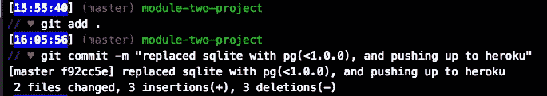****

****在我的例子中，我想澄清数据库 gems 的变化，以及版本和对 heroku 的推动****

****然后你只需输入`git push heroku master`，瞧！这是我在过程结束时看到的:****

****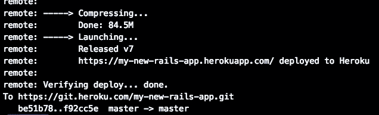****

****我的 rails 应用程序已经部署好了！****

****对 Heroku 的这种推动也反映在您的 Github 存储库中。****

## *******重要说明 3*******

****有时候，Heroku 不会自动识别你正在使用的编程语言。其他时候，应用程序中的其他文件可能会让 Heroku 相信您使用的是 Ruby 以外的语言。****

****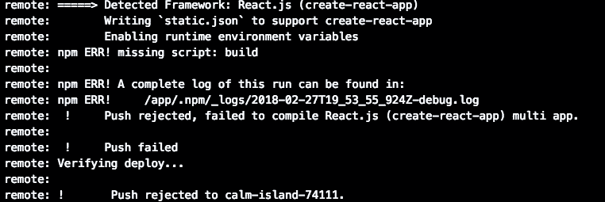****

****在我的例子中，它检测到一个 React.js 框架，因为我在应用程序中误放了一个. js 文件****

****如果发生这种情况，您可以尝试删除包含其他语言的文件，或者更安全的选择是告诉 Heroku 使用什么语言来构建应用程序。Heroku 使用称为 buildpacks 的特定语言组件，您可以使用`heroku buildpacks:set heroku/rub`将它们设置为使用 Ruby。您可以将构建包设置为您需要的任何受支持的语言，也可以为使用多种语言的项目使用多个构建包。文档可以在他们的网站 [**这里**](https://devcenter.heroku.com/articles/buildpacks) 找到。****

****我们要做的最后一件事是将数据库从 rails 应用程序迁移到 Heroku。确保您的数据库系统已经从 SQLite 更改为 PostgreSQL。查看本文中的 1A 部分，了解如何做到这一点的更多信息。还记得运行`rake db:migrate`来考虑数据库中的任何变化。如果你没有数据库，你可以运行`rake db:create`。****

****如果一切正常，您只需要运行`heroku run rake db:migrate`，您的应用程序就可以运行了:****

****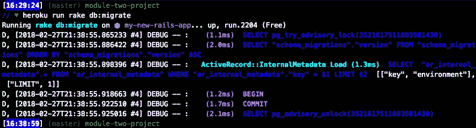****

****我的数据库现在被部署到 Heroku****

****如果你想访问你的应用程序，你可以去 Heroku 网站上的项目仪表板，或者简单地运行`heroku open`。****

****恭喜你！你的 Rails 应用现在已经上线，所有人都可以看到了😎。****

# ****序言:Heroku 部署的样式问题****

****如果你已经用 Heroku 部署了你的应用，但是它看起来不正确，你的样式可能有问题。就我而言，当我加载我的应用程序时，页面变成了空白:****

********

****唯一的工作权利是标志，而它是不可能看到我的形式和按钮****

****无论错误是什么，您都可以通过运行`heroku logs`来查看应用程序的日志。一些开发者发现这些很难在终端中阅读，于是使用 Heroku 网站上的日志。****

****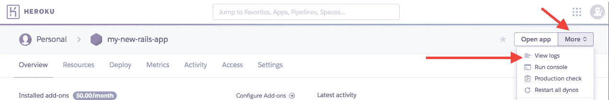****

****日志可以在 Heroku 项目网站的“更多”下找到****

****我的具体问题是我的静态文件在 Heroku 上部署时没有被访问。最好的做法是使用 CDN(内容交付网络)供应商来托管静态资产。****

****然而，由于此时我并不关心速度或性能，所以我继续在 config/environments/production . Rb 中更改了以下内容:****

********

****我将 config.assets.compile 改为 true，而不是 false****

****这两个变化将影响性能，因为它将总是编译和服务静态资产。如果你有同样的问题，并且速度对你来说不重要，像这样编辑 production.rb 文件应该有助于你的网站启动和运行。****