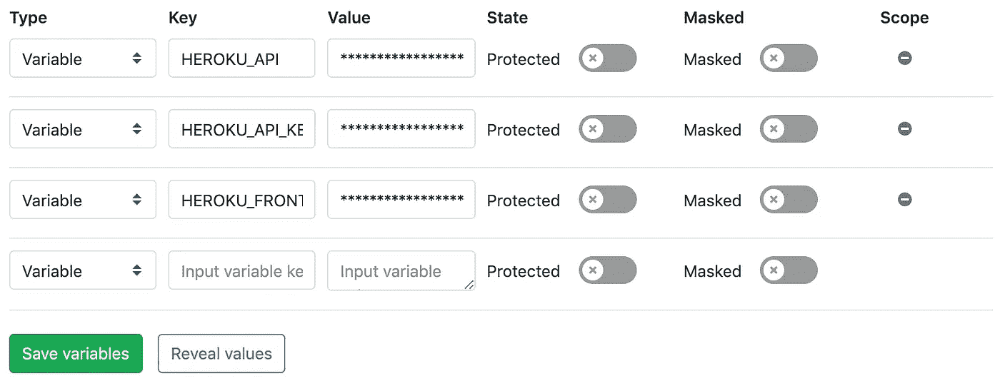
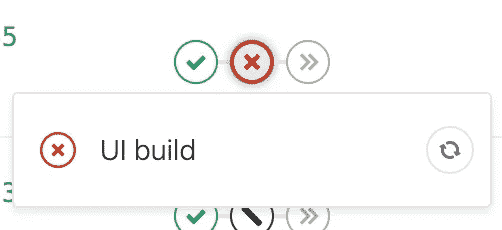

# 通过 Gitlab CI/CD 将 Vue + AdonisJS monorepo 部署到 Heroku

> 原文：<https://itnext.io/deploying-a-vue-adonisjs-monorepo-to-heroku-via-gitlab-ci-cd-a4d87b31c20?source=collection_archive---------3----------------------->

这么长的标题吧？很难用几句话来表达这一切！

# 为什么是 monorepo？

我们在我的工作场所经常使用 monorepos。如果你使用微服务架构，保持所有的项目都是最新的会更容易。它们通常与 docker 捆绑在一起，所以很容易运行，你也不必担心下载和总是收到新的回复。我的个人 monorepo 还没到那一步(我是 Docker noob，或者一般来说是 DevOps noob)，所以我有两个项目在里面。

## 逐步地

我的存储库结构如下所示

```
/my-app
  .gitlab-ci.yml /frontend
    .gitlab-ci.yml /api
    .gitlab-ci.yml
```

其中“my-app”是根文件夹，“frontend”文件夹是用 [Vue CLI](https://cli.vuejs.org/) 生成的 Vue.js app，“api”文件夹是用 [AdonisJS CLI](https://github.com/adonisjs/adonis-cli) 生成的 AdonisJS (Node.js) app。我将向您展示下面所有必需文件中的代码。

这是我第一次尝试 monorepo 方法和编写 CI/CD 文件，所以让我提醒您:**配置的编写方式可能不是最佳实践。我从各种资源中收集信息，一步一步地尝试让一切都工作起来。**

在我向您介绍我的`.gitlab-ci.yml`配置之前，我想提一下让我走到今天这一步的所有来源:

*   [通过 5 个步骤轻松将 Vue + Webpack 应用部署到 Heroku【教程】](https://medium.com/netscape/deploying-a-vue-js-2-x-app-to-heroku-in-5-steps-tutorial-a69845ace489)尼克·曼宁
*   [将 AdonisJS 应用部署到 Heroku](https://scotch.io/tutorials/deploying-adonisjs-apps-to-heroku)Chimezie Enyinnaya
*   [使用 Gitlab 将 Web-App / Vue.js 应用程序自动部署到 Heroku](https://medium.com/@ben_40478/auto-deploy-a-web-app-vue-js-app-with-gitlab-to-heroku-541490f853b0) 由 Ben Denger 开发
*   [使用 Seulkiro Park 的 GitLab CI/CD](https://medium.com/@seulkiro/deploy-node-js-app-with-gitlab-ci-cd-214d12bfeeb5) 部署 Node.js 应用程序

对于那些不知道自己在做什么的人(很像我)来说，阅读这些可能是一个很好的起点😁).我们都得从某个地方开始，对吗？


[https://meme generator . net/instance/45801509/chemistry-dog-2-I-have-no-idea-im-do](https://memegenerator.net/instance/45801509/chemistry-dog-2-i-have-no-idea-what-im-doing)

# 根`.gitlab-ci.yml`

我把我的 app root 叫做`my-app`。这也是我在里面运行`git init`并推送到我的 Gitlab 账户的文件夹。

我的根文件看起来像这样

```
**stages**:
  - dependencies
  - build
  - deploy

**include**:
  - **'/frontend/.gitlab-ci.yml'** - **'/api/.gitlab-ci.yml'**
```

很简单，对吧？

我们在这里说的是:“嘿，我们将这样做:我们将安装**依赖项**，我们将运行**构建**，然后我们将**部署**剩下的部分”。这些是其他链接文件将运行的阶段。

我们也在说:“你还没有完成！看看`/frontend/.gitlab-ci.yml`和`/api/.gitlab-ci.yml`

# /前端`.gitlab-ci.yml`

```
**'UI dependencies'**:
  **image**: node:8.15-alpine
  **stage**: dependencies
  **only**:
    **changes**:
      - frontend/**/*
      - .gitlab-ci.yml
  **artifacts**:
    **paths**:
      - frontend/node_modules/
  **dependencies**: []
  **script**:
    - cd frontend
    - npm install

**'UI build'**:
  **image**: node:8.15-alpine
  **stage**: build
  **only**:
    **changes**:
      - frontend/**/*
      - .gitlab-ci.yml
  **artifacts**:
    **paths**:
      - frontend/dist/
  **dependencies**:
    - **'UI dependencies'
  script**:
    - cd frontend
    - npm run build

**'UI deploy'**:
  **stage**: deploy
  **image**: **"ruby:2.5"
  script**:
    - apt-get update -qy
    - apt-get install rubygems ruby-dev -y
    - gem install dpl
    - cd frontend
    - dpl --provider=heroku --app=$HEROKU_FRONTEND --api-key=$HEROKU_API_KEY --skip_cleanup
  **only**:
    **changes**:
      - frontend/**/*
      - .gitlab-ci.yml
```

这个稍微长一点。我们正在利用我们定义的所有 3 个阶段:依赖、构建和部署。

*   在 ***依赖*** 的部分，我们基本上是运行`npm install`。我们还定义了何时触发所述阶段(“变更”部分)。注意`cd frontend`。因为我们不是在处理一个单独的文件夹，所以我们必须非常小心地正确设置路径。
*   在 ***构建*** 部分，我们几乎在做同样的事情，但是我们运行的是`npm run build`。我们必须再次`cd`让我们的脚本工作。请注意**工件**部分，这对我来说有点神奇——正如我所说，我关注的是在这方面很可能比我更有经验的人的文章。它告诉配置我们(构建的)应用程序的确切位置。
*   最后一部分是 ***部署*** 。如您所见，我们正在进行实际的 heroku 部署，这取决于两个外部变量— `$HEROKU_FRONTEND`和`$HEROKU_API_KEY`。

`$HEROKU_FRONTEND`是我的 Heroku 应用程序的名称，我在其中提供前端应用程序。变量值在我的 **Gitlab - >设置- > CI/CD - >变量**中定义。我的`$HEROKU_API_KEY`也是。



请注意，这些步骤的调用方式也很好，比如“UI 依赖”或“UI 构建”。这样我们就能清楚地看到 Gitlab 中发生了什么:



人们往往看不到 1 次成功背后的 100 次失败

为了给应用程序提供服务，我在我的`/frontend`目录的根目录下还有一个`server.js`文件，看起来像这个*(你可以在描述如何将 Vue 应用程序部署到 Heroku 的文章中了解更多细节)*。据我所知，这个(server.js)就是 Heroku 在使用 Node 时自动寻找的文件。

```
**const express** = *require*(**'express'**)
**const** serveStatic = *require*(**'serve-static'**)
**const** path = *require*(**'path'**)

**const** app = **express**()
app.use(**'/'**, serveStatic(path.*join*(***__dirname***, **'/dist'**)))

**const** port = ***process***.**env**.**PORT** || 5000
app.listen(port)

***console***.log(**'Server started on port '** + port)
```

你需要`server.js`和`.gitlab-ci.yml`两个文件来运行你的 Vue.js 应用。

# /api `.gitlab-ci.yml`

这个没那么可怕:

```
**'API deploy'**:
  **stage**: deploy
  **image**: **"ruby:2.5"
  script**:
    - apt-get update -qy
    - apt-get install rubygems ruby-dev -y
    - gem install dpl
    - cd api
    - dpl --provider=heroku --app=$HEROKU_API --api-key=$HEROKU_API_KEY --skip_cleanup
  **only**:
    **changes**:
      - api/**/*
      - .gitlab-ci.yml
```

这里我们需要运行的唯一阶段是**部署**阶段。我的理解是 Heroku 自己做`npm install`并寻找`server.js`文件(我可能是错的，因为我说过让它工作更多的是实验而不是知识😅)

再次注意`cd api`。我们必须确保我们在正确的文件夹中。

我们还使用了另一个名为`$HEROKU_API`的变量，它也在我的 **Gitlab - >设置- > CI/CD - >变量**中进行了定义。这是独立于前端应用程序的 API 应用程序名称。

My `server.js`是 AdonisJS CLI 生成的传统文件，增加了 WebSockets。这应该会自动位于您的目录中。

```
**'use strict'

const** { Ignitor } = require(**'@adonisjs/ignitor'**)

**new** Ignitor(require(**'@adonisjs/fold'**))
  .appRoot(__dirname)
  .wsServer()
  .fireHttpServer()
  .catch(***console***.error)
```

我的`/api`文件夹里还有一个`Procfile`，内容如下:

```
// Procfile

release: ENV_SILENT=true node ace migration:run --force
web: ENV_SILENT=true npm start
```

您可以在将 AdonisJS 应用程序部署到 Heroku 文章中了解更多信息。

# 收场白

如果不清楚的话，我运行两个 Heroku 应用程序——一个用于 API，一个用于前端。它们的名字是变量`$HEROKU_FRONTEND`和`$HEROKU_API`。你可以在你的 Heroku **账号- >设置- > API key** 中找到`$HEROKU_API_KEY`。由于这是每个帐户唯一的，如果你的应用程序在同一个帐户下，你使用相同的密钥。

您可以在[https://gitlab.com/djanoskova/my-app](https://gitlab.com/djanoskova/my-app)找到捆绑的配置。

设置这样的东西需要做大量的工作，并且需要等待管道成功(或者失败？).如果你有一个 monorepo 和我的堆栈类似，并且你也是一个初学者，我希望我能减轻你的负担。

如果有什么事情对你不起作用，不要犹豫，问我，我会尽力帮助你。通读这些文章也能让你思路清晰。最后，不要忘记对你所阅读的内容进行编码——动手体验是最重要的。