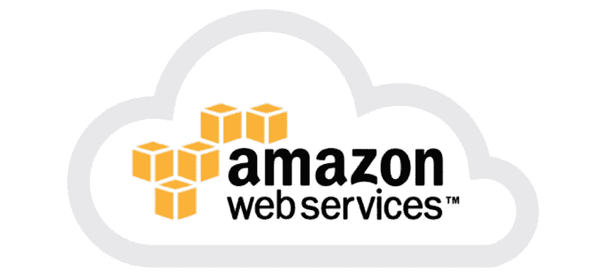

# 如何使用 S3 和 CloudFront 将 web 应用部署到 AWS

> 原文：<https://itnext.io/deploying-a-web-app-on-aws-using-s3-cloudfront-45f77cd652c6?source=collection_archive---------1----------------------->

如果你发现自己迷失在 AWS 文档中，你并不孤单。



在本文中，您可以了解如何使用 AWS S3、CloudFront 和 Route 53 在 AWS 上部署您的网站和前端应用程序。我们将使用 S3 来存储我们的源代码和资产，使用 CloudFront 作为 CDN 来分发我们的网站并提供 HTTPS 支持，使用 Route53 来创建指向 CloudFront 分发的自定义 DNS 记录。让我们直接跳过它。

## 设置我们的 S3 桶

> 亚马逊简单存储服务(亚马逊 S3)是一种对象存储服务，提供行业领先的可扩展性、数据可用性、安全性和性能。这意味着各种规模和行业的客户都可以使用它来存储和保护各种使用情形下的任意数量的数据，例如网站、移动应用程序、备份和恢复、归档、企业应用程序、物联网设备和大数据分析。

首先，我们需要创建我们的 s3 存储桶，我们将在那里存储代码和资产。要为静态网站托管配置我们的 bucket，请遵循以下步骤:

1.  创建一个新的 bucket，将 url 作为 Bucket 名称(例如 test.potato.com)。
2.  从第三步的下拉菜单中选择“授予公共读取权限”。如果选项不存在，创建存储桶后，转到“权限选项卡”->“访问控制列表”，然后在“公共访问”下，单击“每个人”并选中“列出对象”。
3.  转到新创建的存储桶“属性”选项卡，并通过选择“使用此存储桶托管网站”来启用“静态网站托管”。
4.  将“index.html”设置为错误和索引页面，因为前端路由器将处理服务器 404 错误。
5.  转到“权限”下的“存储桶策略”，将 S3:GetObject 权限附加到 S3 存储桶。用您新创建的存储桶的名称替换<your_bucket_name>。</your_bucket_name>

```
{
    "Version": "2012-10-17",
    "Statement": [
        {
            "Sid": "AddPerm",
            "Effect": "Allow",
            "Principal": "*",
            "Action": "s3:GetObject",
            "Resource": "arn:aws:s3:::<YOUR_BUCKET_NAME>/*"
        }
    ]
}
```

6.启用 CORS..在“CORS 配置”选项卡中，添加以下内容

```
<?xml version="1.0" encoding="UTF-8"?>
<CORSConfiguration >
<CORSRule>
    <AllowedOrigin>*</AllowedOrigin>
    <AllowedMethod>GET</AllowedMethod>
    <MaxAgeSeconds>3000</MaxAgeSeconds>
    <AllowedHeader>Authorization</AllowedHeader>
</CORSRule>
</CORSConfiguration>
```

7.(可选)为 package.json 添加一个部署脚本，这样只需从项目中运行`yarn deploy`就可以进行部署。这需要安装`aws-cli`,你可以从这里的[安装](https://docs.aws.amazon.com/cli/latest/userguide/cli-chap-install.html),如果你没有的话，运行`aws configure`进行设置

```
// package.json
"scripts": {
  "deploy:live": "npm run build && aws s3 sync dist/    s3://<YOUR_S3_BUCKET_NAME> --delete && npm run-script invalidate-cache:live", "invalidate-cache:live": "aws configure set preview.cloudfront true && aws cloudfront create-invalidation --distribution-id <CLOUDFRONT_DISTRIBUTION_ID> --paths '/*'"}
```

基本上，这个脚本会运行你的构建脚本，然后将构建步骤生成的`dist/`文件夹的内容复制到 S3 桶，并删除远程存在但由于`--delete`标志而不在本地文件夹中的文件。之后，您可能需要使您的 CloudFront 发行版的缓存无效，这是第二个脚本要做的。我们将在下一步完成 CloudFront 设置，您将能够获得发行版 id。

如果你去“静态网站托管”，你的网站现在应该在提供的链接下。

## 设置 CloudFront

> Amazon CloudFront 是一种快速内容交付网络(CDN)服务，它在一个对开发人员友好的环境中，以低延迟、高传输速度向全球客户安全地交付数据、视频、应用程序和 API。CloudFront 与 AWS 集成，这两个物理位置都直接连接到 AWS 全球基础设施，以及其他 AWS 服务。CloudFront 与包括 AWS Shield for DDoS 缓解、Amazon S3、Elastic Load Balancing 或 Amazon EC2 在内的服务无缝协作，作为应用程序的来源，并与 Lambda@Edge 一起运行更接近客户用户的定制代码，并定制用户体验。

要设置 CloudFront 发行版，请从 AWS 控制台转到“CloudFront ”,并遵循以下步骤:

1.  点击“创建分发”并选择“Web 分发”。
2.  将源域名设置为新创建的 s3 存储桶。
3.  选择“将 HTTP 重定向到 HTTPS”，以启用 https。
4.  要启用 gzip 压缩以加快加载速度，请选中“自动压缩对象”。
5.  将默认根对象设置为 index.html，以便它将/重定向到/index.html
6.  在“备用域名(cnames)”下，输入您想要访问您的网站的 URL。(在这种情况下，s3 存储桶名称或您的 ssl 证书支持的子域，即:test.potato.com)
7.  (可选)如果您有自定义 SSL 证书，请选择一个，或者您可以从 AWS 证书管理器(ACM)请求一个。
8.  单击 Create Distribution，等待分发创建完成。

您的网站现在应该可以通过 CloudFront 发行版的 URL 访问了。接下来，我们将看看如何通过自定义域名使其可用，就像我们在上一步中在 cnames 中提供的那样。

## 配置路由 53

> Amazon Route 53 是一个高度可用和可扩展的云[域名系统(DNS)](https://aws.amazon.com/route53/what-is-dns/) web 服务。它旨在为开发者和企业提供一种极其可靠且经济高效的方式，通过将 www.example.com[等名字翻译成计算机用来相互连接的 192.0.2.1 等数字 IP 地址，将最终用户路由到互联网应用程序。Amazon Route 53 也完全符合 IPv6。](http://www.example.com)

现在，我们需要对 DNS 配置进行更改，添加一个别名域名，指向我们新创建的 CloudFront 发行版。这假设您已经创建了一个 HostedZone，并通过 AWS 购买了一个域。

1.  从 AWS 控制台转到 53 号公路。
2.  点击您的托管区域。
3.  创建一个新的记录集，其名称与您在 CloudFront 发行版的 cname/备用域名中提供的名称相匹配。
4.  单击“Alias ”,在“Alias Target”下，从 autocomplete 下拉列表中选择您新部署的 CloudFront 发行版，然后单击 create。
5.  (可选)对“AAAA (IPv6)”类型的记录集重复这些步骤，而不是“IPv4”类型的记录集，以支持 IPv6。

就这样，您现在拥有了一个完全部署好的功能性网站，您可以通过自定义域访问它。您的网站通过自定义 SSL 证书支持 HTTPs 和 HTTP/2，您可以通过从应用程序运行`yarn deploy`来轻松部署您的网站。

如果你喜欢我的内容，愿意支持我，你可以[请我喝啤酒](https://www.buymeacoffee.com/khaledosman)