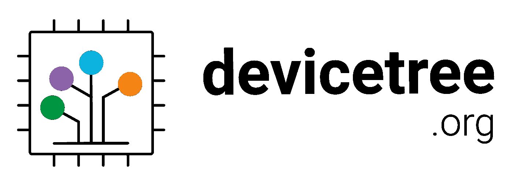
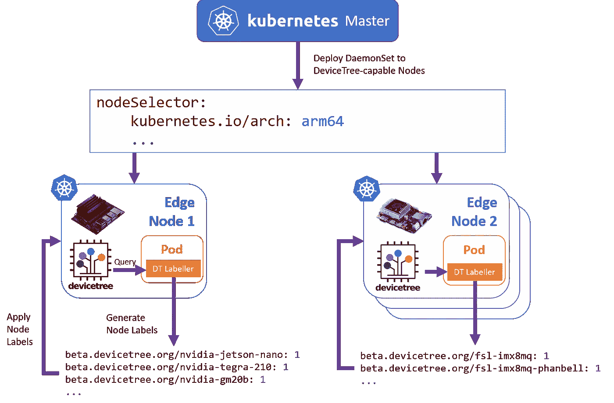

# 在 Kubernetes 中跨异构边缘网关部署

> 原文：<https://itnext.io/deploying-across-heterogeneous-edge-gateways-in-kubernetes-b23571641061?source=collection_archive---------6----------------------->

在[方钠石 H2020 项目](https://www.sodalite.eu/)中，我们关注的一个领域是部署优化的集装箱，采用加速器专用 ML 模型，在互联车队中的异构边缘网关之间进行基于边缘的推理。这样做的主要动机有三点:

*   虽然我们可以从用于基础模型训练的云和 HPC 资源(例如 TensorFlow)中受益，但仍然需要针对特定加速器进行调整(例如，准备在 GPU 或 EdgeTPU 上执行的衍生 TFLite 模型)。
*   车辆的生命周期远远超过特定云服务的生命周期，这意味着我们无法对随着时间的推移我们正在部署的环境做出假设。
*   不同的服务可能更需要特定类型的加速器(例如 GPU、FPGA)，这意味着现有服务可能需要重新调度，并在最佳基础上重新部署到另一个可用资源上。

# Kubernetes 中的节点标记

虽然已经有研究异构 Kubernetes 集群中的节点功能标记的现有工作，其中最突出的是官方的[节点功能发现](https://github.com/kubernetes-sigs/node-feature-discovery)项目，但是已经发现对边缘网关的支持有些缺乏，边缘网关通常是嵌入式 SBC(通常作为独立的黑盒，或者作为预先存在的车载信息娱乐(IVI)系统的一部分)。例如，在官方 [NVIDIA GPU 设备插件](https://github.com/NVIDIA/k8s-device-plugin)的情况下，GPU 的检测需要使用 NVIDIA 管理库(NVML)，而 NVIDIA 管理库又假设了一个可枚举的 PCI 总线。因此，拥有集成 GPU 的 Jetson Nano 用户目前只是运气不佳。其他的，比如 Coral Dev 板，通过 PCI 总线提供 EdgeTPU 的枚举，但是还没有提供特定的设备插件来管理和展示 EdgeTPU 设备。*在这两种情况下，我们可以通过使用特定于平台的属性/设备功能来标记节点，并使用特定于加速器的目标运行时环境来部署容器，从而解决这些限制。*

## 输入设备树



大多数这些边缘网关的一个共同特征是存在一个半标准的*设备树 blob (DTB)* ，它通过一个特殊的树结构公开了硬件及其相应拓扑的静态描述。虽然对 devicetree 的全面解释超出了这篇文章的范围，但是有兴趣的人可以在这里通读规范。设备树及其*节点*结构概述如下:


设备树节点概述。来源:自由电子，ELC 2014。

在 Jetson Nano 的情况下，如下所示，其中`/`表示树的顶部，或*根节点*:

```
/dts-v1/;/ {
        nvidia,fastboot-usb-pid = <0xb442>;
        compatible = "nvidia,jetson-nano", "nvidia,tegra210";
        nvidia,proc-boardid = "3448";
        nvidia,pmu-boardid = "3448";
        serial-number = "xxxxxxxxxxxxxxxxx";
        nvidia,dtbbuildtime = "Jul 16 2019", "17:09:35";
        model = "NVIDIA Jetson Nano Developer Kit";
        ... gpu {
                compatible = "nvidia,tegra210-gm20b", "nvidia,gm20b";
                access-vpr-phys;
                resets = <0x21 0xb8>;
                status = "okay";
                interrupts = <0x0 0x9d 0x4 0x0 0x9e 0x4>;
                reg = <0x0 0x57000000 0x0 0x1000000 0x0 0x58000000 0x0 0x1000000 0x0 0x538f0000 0x0 0x1000>;
                iommus = <0x2b 0x1f>;
                reset-names = "gpu";
                nvidia,host1x = <0x78>;
                interrupt-names = "stall", "nonstall";
        };
        ...
```

虽然一般来说，根节点的`model`属性应该以标准`manufacturer,model`格式为我们提供特定型号系统板的唯一标识符，但不幸的是，规范选择了简单的方式，只有*推荐了标准格式*。规范的这种淡化意味着，不幸的是，我们不能使用`model`属性作为节点标记的一致来源，而必须依赖于`compatible`属性——虽然规范在这里也没有提供明确的要求，但这些至少被迫隐式地采用标准约定，以便与 Linux 内核命名约定相匹配。

## 从设备树属性生成节点标签

为了从 DeviceTree 属性生成节点标签，我们专门为此开发了一个定制的 Kubernetes 控制器:

[](https://github.com/adaptant-labs/k8s-dt-node-labeller) [## adaptent-labs/k8s-dt-node-label er

### 该工具提供了一个定制的 Kubernetes 控制器，用于自动标记带有 devicetree 属性的节点。这是…

github.com](https://github.com/adaptant-labs/k8s-dt-node-labeller) 

鉴于`model` 编码缺乏一致性，如上所述，我们的 DeviceTree 节点标注器采用的方法是迭代根节点中的`compatible`属性，以及我们希望显示标签的任何指定的子节点——例如，在 Jetson Nano 的情况下，`gpu`节点。在定义了感兴趣的子节点的节点上进行的简单模拟演示了将要生成的标记:

```
$ k8s-dt-node-labeller -d -n gpu
Discovered the following devicetree properties:beta.devicetree.org/nvidia-jetson-nano: 1
beta.devicetree.org/nvidia-tegra210: 1
beta.devicetree.org/nvidia-tegra210-gm20b: 1
beta.devicetree.org/nvidia-gm20b: 1
```

## 将节点标记器部署到异构集群中

节点标签本身旨在作为 DaemonSet 部署到异构集群中。下面显示了贴标机的运行概况:



它设计为使用树内示例 DaemonSet 规范直接部署到集群中:

`$ kubectl apply -f k8s-dt-labeller-ds.yaml`

# 目标 Pod 放置

一旦贴标机启动并运行，现在就可以瞄准特定的网关或网关+加速器对。例如，为了以 Jetson Nano 为目标，特定于型号的`beta.devicetree.org/nvidia-jetson-nano`标签可用作节点选择的基础。要针对特定的 GPU，可以使用`beta.devicetree.org/nvidia-gm20b`。为了进一步约束选择，可以一起使用多个标签来定义选择基础。

使用 HTTP echo 服务器作为简单的部署示例，带有 GM20B GPU 的 Jetson Nano 的目标 Pod 描述可以编写如下:

针对 Jetson Nano 的 Pod 规格示例

然后可以通过一个简单的服务定义公开它，如下所示:

HTTP echo 服务规范示例

我们进一步向外公开端口，以便在群集外进行测试:

```
$ kubectl port-forward service/http-echo-service 5678:5678
```

并演示与相应节点的连接:

```
$ curl -X GET localhost:5678
hello from a Jetson Nano with an NVIDIA GM20B GPU
```

# 后续步骤

针对不同加速器类型的特定基本容器运行时环境正在单独准备，并将在方钠石项目的后期阶段提供。

关于针对 Jetson Nano 的 NVIDIA GPU 容器运行时入门示例，请参考 NVIDIA 官方指南[此处](https://github.com/NVIDIA/nvidia-docker/wiki/NVIDIA-Container-Runtime-on-Jetson)。可以使用前述的节点选择标准和 Pod 模板来执行集群内的 Pod 的调度。

# 限制

*   为了遍历设备树，需要访问节点的`/sys/firmware`目录——这目前通过在`privileged`模式下运行 Pod 来实现。或许可以利用`allowedProcMountTypes`来禁用 Pod 内的路径屏蔽，并在无特权模式下运行，但这尚未得到验证。
*   目前，由于在 DaemonSet Pod 规范中 Pod [RestartPolicy](https://kubernetes.io/docs/concepts/workloads/pods/pod-lifecycle/#restart-policy) 被强制为`Always`，因此不存在 DaemonSet 可以在不触发重启的情况下正常终止的机制。这意味着，此时，DaemonSet 的初始节点选择器必须将其自身约束到已知支持 DeviceTree 的节点，以避免虚假的重新启动。这对于主要瞄准`arm64`和`armhf`目标来说还不是问题，但是对于其他架构来说可能是问题。
*   虽然标签器可以证明 devicetree 中节点的存在，但它不提供详细的特定于设备的信息或控制——所有这些都需要通过合适的设备插件来实现(或嵌入到容器运行时中——就像 GPU 的情况一样)。然而，标记器可以用作在具有匹配能力的节点上调度设备插件的基础。